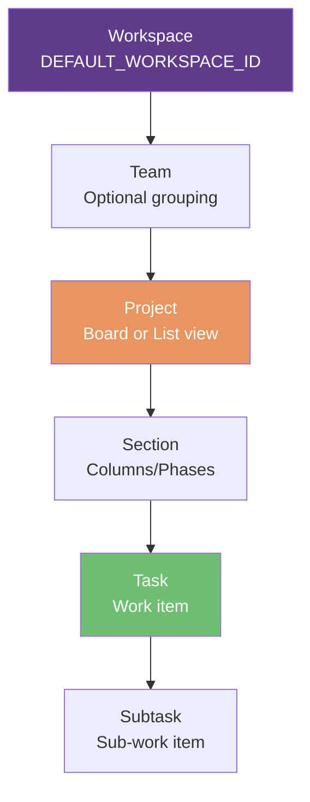
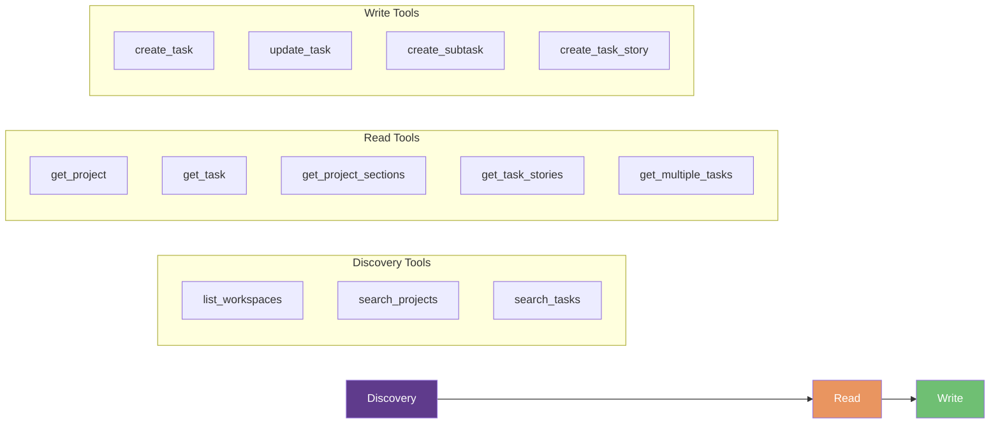
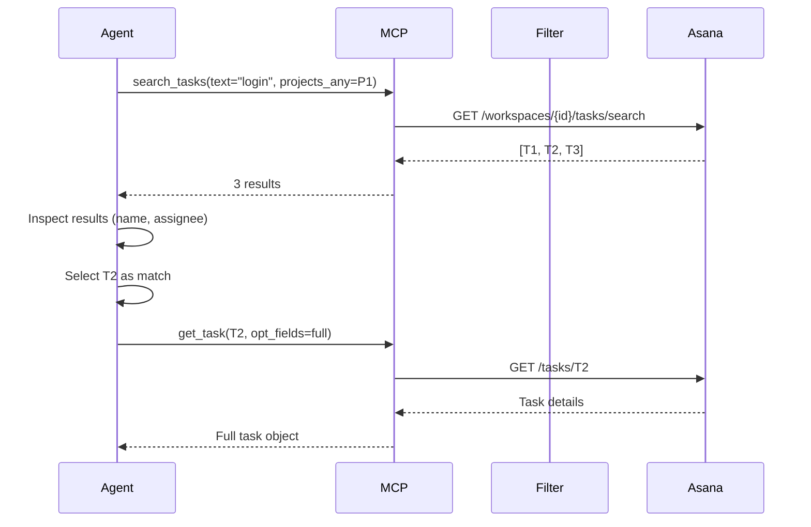
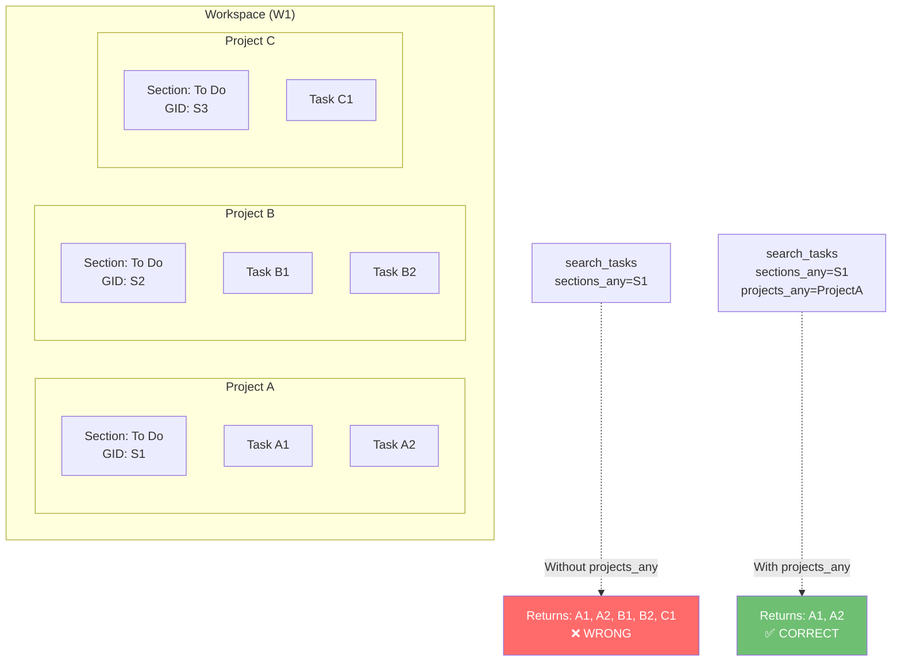
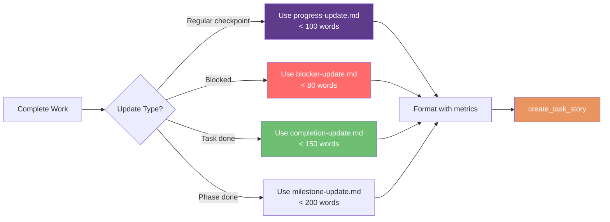
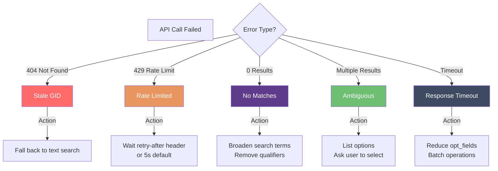
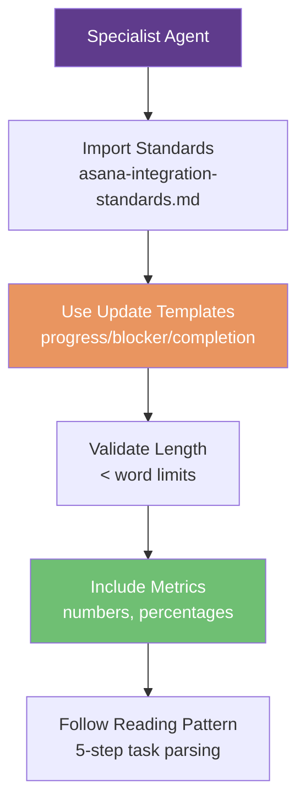
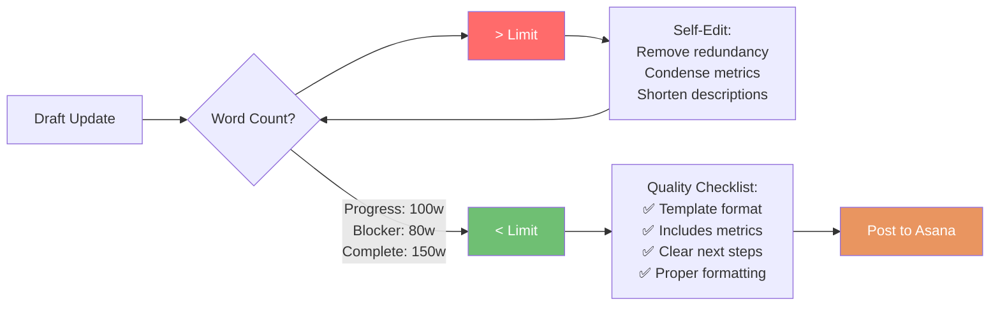

# Asana Integration Architecture Diagram

**Date**: 2026-02-10
**Repository**: opspal-internal-plugins

---

## System Architecture Overview

```mermaid
graph TB
    subgraph "Claude Code Interface"
        CC[Claude Code Agent]
        CMD[Slash Commands]
        HOOKS[Hook System]
    end

    subgraph "MCP Layer"
        MCP[MCP Server<br/>@roychri/mcp-server-asana<br/>40+ tools]

        MCP_WS[Workspace Tools<br/>list_workspaces<br/>search_projects<br/>get_project]
        MCP_TASK[Task Tools<br/>search_tasks<br/>create_task<br/>update_task<br/>get_task]
        MCP_STORY[Story Tools<br/>get_task_stories<br/>create_task_story]
        MCP_DEP[Dependency Tools<br/>add_dependencies<br/>add_dependents]
        MCP_TAG[Tag Tools<br/>get_tags<br/>get_tasks_for_tag]
        MCP_BATCH[Batch Tools<br/>get_multiple_tasks]

        MCP --> MCP_WS
        MCP --> MCP_TASK
        MCP --> MCP_STORY
        MCP --> MCP_DEP
        MCP --> MCP_TAG
        MCP --> MCP_BATCH
    end

    subgraph "Custom Utilities Layer"
        AC[AsanaClient<br/>Retry & Fallback]
        APF[AsanaProjectFilter<br/>Cross-Project Protection]
        ARS[AsanaReflectionSync<br/>Bidirectional Sync]
        AUM[AsanaUserManager<br/>User Mapping]
        AFM[AsanaFollowerManager<br/>Follower Assignment]
        APC[AsanaProjectCreator<br/>Project Creation]
        ACM[AsanaCommentManager<br/>Template Comments]
        ATR[AsanaTaskReader<br/>Task Parsing]
        AUF[AsanaUpdateFormatter<br/>Format Validation]
        AICC[AsanaIntegrationComplianceChecker<br/>Standards Validation]
    end

    subgraph "Automated Workflows"
        REFL[Reflection Processing<br/>process-reflections.js]
        WORK[Work Index Sync<br/>work-index hooks]
        QG[Quality Gates<br/>auto-updates]
    end

    subgraph "Infrastructure"
        CB[Circuit Breaker<br/>Graceful Degradation]
        SAGA[Saga Pattern<br/>Transactional Rollback]
        DLQ[Dead Letter Queue<br/>Failed Operation Retry]
        CACHE[Caching Layer<br/>5-min TTL]
        METRICS[Metrics Collection<br/>Performance Tracking]
    end

    subgraph "External Systems"
        ASANA[Asana REST API<br/>v1.0]
        SUPA[Supabase<br/>Reflection Database]
        SLACK[Slack<br/>Alerts]
    end

    subgraph "Configuration & Storage"
        ENV[Environment Variables<br/>ASANA_ACCESS_TOKEN<br/>ASANA_WORKSPACE_ID<br/>ASANA_PROJECT_GID]
        MCP_CFG[.mcp.json<br/>MCP Configuration]
        LINKS[.asana-links.json<br/>Project Mappings]
        TEMPLATES[templates/asana-updates/<br/>Update Templates]
    end

    %% Connections
    CC --> CMD
    CC --> HOOKS
    CC --> MCP

    CMD --> AC
    CMD --> REFL
    CMD --> WORK

    HOOKS --> QG

    MCP --> ASANA

    AC --> MCP
    AC --> ASANA
    APF --> MCP
    APF --> ASANA
    ARS --> MCP
    ARS --> SUPA

    REFL --> AC
    REFL --> APF
    REFL --> ARS
    REFL --> CB
    REFL --> SAGA
    REFL --> DLQ
    REFL --> CACHE
    REFL --> METRICS
    REFL --> SUPA
    REFL --> ASANA

    WORK --> AC
    WORK --> LINKS

    QG --> AC
    QG --> ACM
    QG --> TEMPLATES

    CB --> ASANA
    SAGA --> ASANA
    DLQ -.-> REFL
    METRICS --> SLACK

    ENV --> MCP_CFG
    MCP_CFG --> MCP

    classDef mcpLayer fill:#E6F3FF,stroke:#0066CC,stroke-width:2px
    classDef utilLayer fill:#E6FFE6,stroke:#00CC00,stroke-width:2px
    classDef workflowLayer fill:#FFF5E6,stroke:#FF9900,stroke-width:2px
    classDef infraLayer fill:#F5E6FF,stroke:#9900CC,stroke-width:2px
    classDef externalLayer fill:#FFE6E6,stroke:#CC0000,stroke-width:2px
    classDef configLayer fill:#F0F0F0,stroke:#666666,stroke-width:2px

    class MCP,MCP_WS,MCP_TASK,MCP_STORY,MCP_DEP,MCP_TAG,MCP_BATCH mcpLayer
    class AC,APF,ARS,AUM,AFM,APC,ACM,ATR,AUF,AICC utilLayer
    class REFL,WORK,QG workflowLayer
    class CB,SAGA,DLQ,CACHE,METRICS infraLayer
    class ASANA,SUPA,SLACK externalLayer
    class ENV,MCP_CFG,LINKS,TEMPLATES configLayer
```



---

## Asana Hierarchy Navigation



## MCP Tool Categories



## Custom Utilities Architecture

```mermaid
graph TB
    subgraph "MCP Gap Coverage"
        UM[AsanaUserManager<br/>User mapping & assignment]
        FM[AsanaFollowerManager<br/>Batch follower ops]
        PC[AsanaProjectCreator<br/>Project creation]
        CM[AsanaCommentManager<br/>Template-based comments]
        TR[AsanaTaskReader<br/>Structured parsing]
        PF[AsanaProjectFilter<br/>Cross-project safety]
    end

    subgraph "Direct API Access"
        API[Asana REST API<br/>Node.js HTTPS]
    end

    UM -->|POST /users| API
    FM -->|POST /tasks/{id}/addFollowers| API
    PC -->|POST /workspaces/{id}/projects| API
    CM -->|POST /tasks/{id}/stories| API
    TR -->|GET /tasks/{id}| API
    PF -->|GET /tasks/{id}| API

    style UM fill:#5F3B8C,color:#fff
    style FM fill:#E99560,color:#fff
    style PC fill:#6FBF73,color:#fff
    style API fill:#3E4A61,color:#fff
```

## Navigation Algorithm: Finding a Task



## GOTCHA-001: sections_any Cross-Project Leakage



## Update Template Flow



## Error Recovery Decision Tree



## Agent Integration Standards



## Brevity Enforcement



---

**Generated**: 2026-02-06
**Version**: 1.0.0
**Maintainer**: OpsPal Core Team
