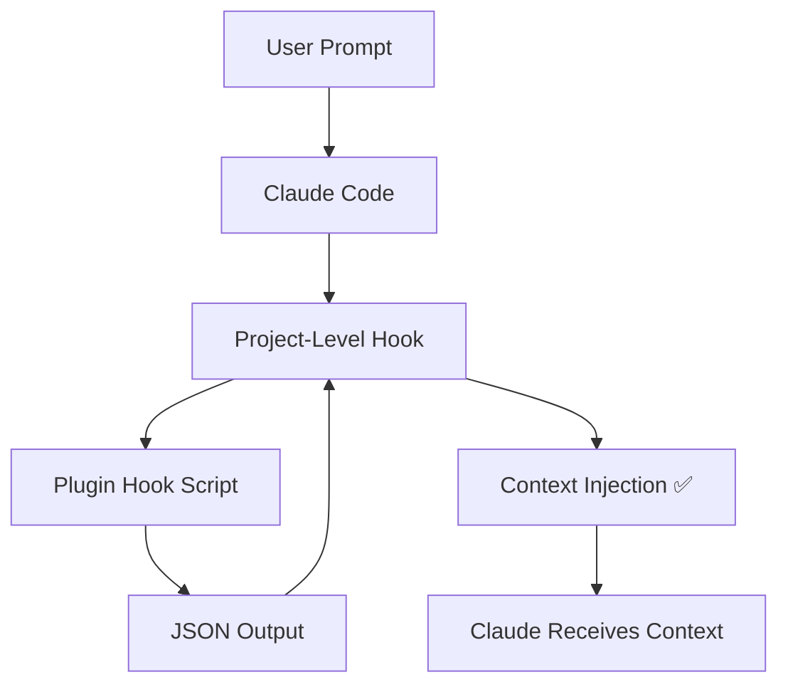

# Hook Output Workaround - User Guide

## What This Is

A workaround for Claude Code bug #12151 where plugin hooks execute successfully but their output is not injected into Claude's context. This prevents routing recommendations and complexity scores from reaching Claude.

## Problem Symptoms

If you're experiencing these issues, you need this workaround:

1. ✅ Hooks execute (you see "Callback hook success: Success" in system reminders)
2. ❌ Routing recommendations don't appear in context
3. ❌ Claude doesn't see agent routing suggestions
4. ❌ Complexity scores are not visible
5. ❌ High-complexity tasks are not blocked automatically

## Solution Overview

We've implemented a **three-layer defense strategy**:

### Layer 1: Project-Level Hooks (Primary Fix)
- Non-plugin hooks in `.claude/hooks/hooks.json` delegate to plugin scripts
- Fixes output injection immediately
- Keeps plugin logic unchanged and distributable

### Layer 2: Enhanced CLAUDE.md (Backup)
- Explicit routing instructions with BLOCKED operations list
- Task complexity self-assessment guide
- Pre-response self-check protocol

### Layer 3: Multiple Validation Points
- Hooks provide dynamic recommendations
- CLAUDE.md provides static instructions
- Both reinforce agent routing behavior

---

## How to Use

### For New Sessions

1. **Start a new Claude Code session**
   - The workaround hooks are automatically active
   - No configuration needed

2. **Verify hooks are working**
   - Send any user prompt
   - Check system reminders for hook output
   - Look for routing recommendations in context

3. **Look for routing messages**
   - You should see: `[ROUTING ANALYSIS] Agent: ... | Confidence: ... | Complexity: ...`
   - High-complexity tasks (≥70%) should trigger blocking messages

### For Existing Sessions

1. **Restart Claude Code**
   - SessionStart hooks only run at session initialization
   - Restart to activate the workaround

2. **Or use /clear command**
   - Type `/clear` to trigger hooks manually
   - This reinitializes the session

---

## What You'll See

### Successful Hook Output

When hooks are working correctly, you'll see messages like:

```
[ROUTING ANALYSIS]
Agent: domain-specialist | Confidence: 95% | Complexity: 85%
[ACTION] BLOCKING - You MUST use Task tool with subagent_type='domain-specialist'
```

### BLOCKED Operations

For high-complexity operations, Claude will:
1. Stop and assess complexity
2. Recognize the operation is BLOCKED
3. Automatically use the Task tool with the appropriate agent
4. Not attempt direct execution

### Task Complexity Indicators

- 🔴 **HIGH** (≥70%): Mandatory agent routing with blocking
- 🟡 **MEDIUM** (30-70%): Recommended agent routing
- 🟢 **LOW** (<30%): Direct execution allowed

---

## Supported Operations

### Automatically Routed (BLOCKED)

These operations will automatically trigger agent routing:

- CPQ/Q2C Assessments
- RevOps Audits
- Automation Audits
- Permission Set Creation
- Report/Dashboard Creation
- Data Import/Export (>100 records)
- Production Deployments
- Multi-platform Operations
- Diagram/Flowchart Creation
- Cross-Repo Operations

### Manual Execution Allowed

These operations can be executed directly:

- Single field creation
- Simple queries
- Documentation updates
- Configuration reads
- Single-file edits

---

## Troubleshooting

### Hook Output Not Appearing

**Problem**: No routing recommendations in context

**Solutions:**
1. Restart Claude Code session
2. Verify `.claude/hooks/hooks.json` exists
3. Check hook scripts are executable: `chmod +x .claude/hooks/*.sh`
4. Review `.claude/hooks/TEST_RESULTS.md` for test status

### Claude Ignoring Routing Recommendations

**Problem**: Claude responds directly instead of using Task tool

**Solutions:**
1. Verify CLAUDE.md has been updated with new sections
2. Check that BLOCKED operations list includes your task
3. Use explicit keywords from routing table
4. Add `[SEQUENTIAL]` flag to force agent routing

### Hooks Executing But Output Silent

**Problem**: "Callback hook success" appears but no content

**Solutions:**
1. This is the bug we're working around
2. Verify you're using project-level hooks, not plugin hooks
3. Check `.claude/hooks/hooks.json` is correctly formatted
4. Review `.claude/hooks/KNOWN_ISSUES.md` for updates

---

## When to Remove This Workaround

This workaround should be removed when:

1. ✅ Anthropic fixes plugin hook output capture bug (GitHub #12151)
2. ✅ You verify plugin hooks inject output correctly
3. ✅ Routing recommendations appear without project-level delegation

### Removal Steps

1. Remove `.claude/hooks/hooks.json`
2. Test plugin hooks work directly
3. Keep `.claude/hooks/README.md` for historical reference
4. Update this document with "FIXED" status

---

## Technical Details

### How It Works



**Key Insight**: Project-level hooks can capture output, plugin hooks cannot (bug)

### Files Modified

- `.claude/hooks/hooks.json` - Hook registration
- `.claude/hooks/README.md` - Technical documentation
- `CLAUDE.md` (both repos) - Enhanced routing instructions
- `.claude/hooks/TEST_RESULTS.md` - Validation tracking
- `.claude/hooks/KNOWN_ISSUES.md` - Bug tracking

### Plugin Logic Unchanged

✅ Plugin hook scripts remain unchanged
✅ Plugin distribution unaffected
✅ Future plugin users will benefit when bug is fixed

---

## FAQ

### Q: Will this affect plugin distribution?
**A**: No. Plugin hooks remain unchanged. This is a project-level workaround.

### Q: Do I need to update hooks when plugins update?
**A**: No. Project-level hooks delegate to plugin scripts, so plugin updates work automatically.

### Q: Can I customize the routing logic?
**A**: Yes. Modify plugin hook scripts, not the project-level delegation.

### Q: What if the workaround doesn't work?
**A**: Check `.claude/hooks/KNOWN_ISSUES.md` for alternative approaches and report issues.

### Q: How do I know if Anthropic fixed the bug?
**A**: Monitor [GitHub Issue #12151](https://github.com/anthropics/claude-code/issues/12151) for updates.

---

## Support

### Documentation
- Technical details: `.claude/hooks/README.md`
- Test results: `.claude/hooks/TEST_RESULTS.md`
- Known issues: `.claude/hooks/KNOWN_ISSUES.md`

### Bug Tracking
- [GitHub Issue #12151](https://github.com/anthropics/claude-code/issues/12151)

### Additional Resources
- [Official Hooks Documentation](https://docs.claude.com/en/docs/claude-code/hooks)
- [Claude Code GitHub](https://github.com/anthropics/claude-code)

---

**Status**: ✅ Workaround Active
**Last Updated**: 2025-12-10
**Next Review**: After Claude Code update
