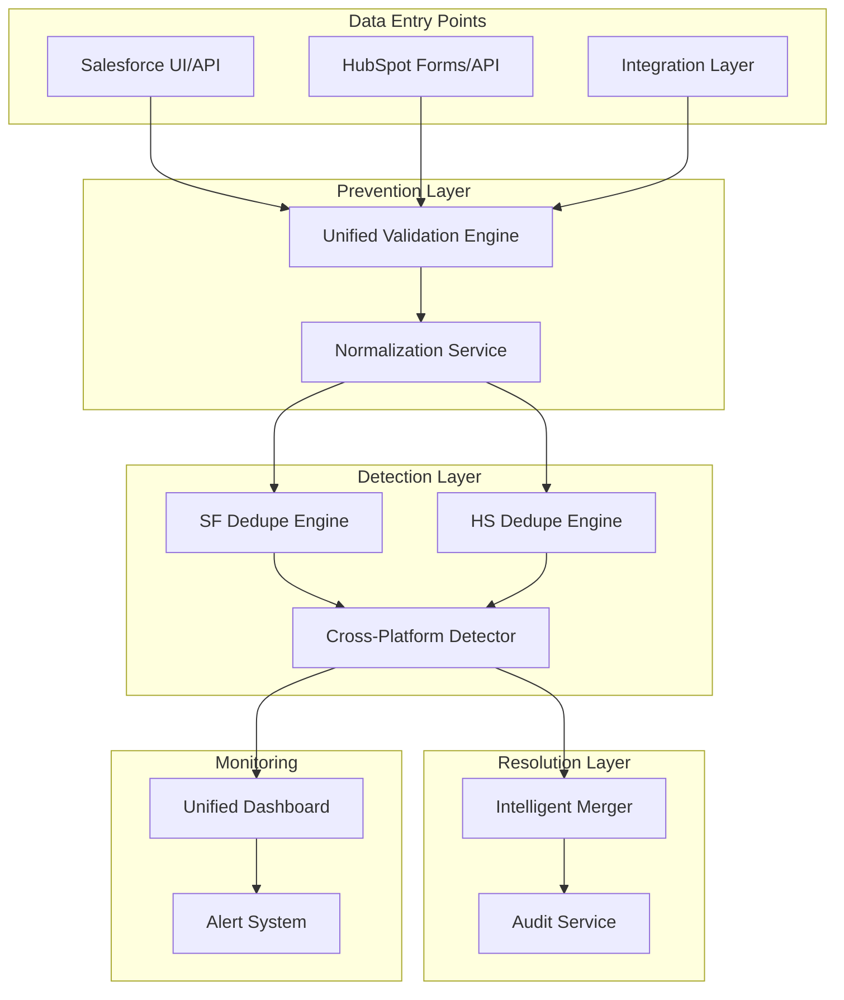

# RevPal Unified Duplicate Management Framework

## Executive Summary

This framework unifies duplicate management across Salesforce and HubSpot platforms, building upon existing sophisticated detection engines to create a comprehensive three-pillar architecture: Prevention, Detection & Monitoring, and Resolution.

## Current State Analysis

### Platform Capabilities
- **ClaudeHubSpot**: DedupeEngine with multi-algorithm fuzzy matching, DataQualityFramework, automated scanning
- **ClaudeSFDC**: Advanced Data Hygiene Framework, multi-algorithm detection, enrichment capabilities
- **Gap**: Limited cross-platform integration and prevention mechanisms

## Three-Pillar Architecture

### Pillar 1: Prevention Layer

#### 1.1 Unified Validation Engine
**Objective**: Prevent duplicates at point of entry across both platforms

**Implementation Components**:
```javascript
// Shared validation rules across platforms
const UnifiedValidationRules = {
  account: {
    required: ['name', 'website|phone'],
    unique: ['website', 'tax_id'],
    fuzzyMatch: { field: 'name', threshold: 85 }
  },
  contact: {
    required: ['email|phone', 'first_name', 'last_name'],
    unique: ['email'],
    fuzzyMatch: { fields: ['first_name', 'last_name'], threshold: 90 }
  }
}
```

**Platform-Specific Implementation**:

##### Salesforce Prevention
1. **Matching Rules Configuration**:
   - Account: Name (fuzzy 85%) + (Website OR Phone exact)
   - Contact: Email (exact) OR (Name + Account fuzzy)
   - Lead: Email OR (Company + Name fuzzy)

2. **Duplicate Rules Phased Rollout**:
   - Phase 1 (Weeks 1-2): Alert only mode
   - Phase 2 (Weeks 3-4): Block with bypass option
   - Phase 3 (Week 5+): Full enforcement

3. **Entry Point Controls**:
   - Screen flows for guided data entry
   - Validation rules enforcing data quality
   - Before-save flows for normalization

##### HubSpot Prevention
1. **Custom Property Validation**:
   - Leverage existing DataQualityFramework
   - Implement real-time validation webhooks
   - Add form-level duplicate checking

2. **Workflow Automation**:
   - Pre-submission duplicate detection
   - Automated data normalization
   - Quality score thresholds

3. **API-Level Prevention**:
   - Rate-limited duplicate checking
   - Batch validation for imports
   - Real-time sync validation

#### 1.2 Cross-Platform Sync Validation
**New Component**: Integration validation layer

```javascript
// Integration validation specification
const SyncValidation = {
  bidirectional: true,
  checkpoints: ['pre-sync', 'post-sync'],
  conflictResolution: 'source-of-truth',
  duplicateHandling: 'prevent-and-alert'
}
```

### Pillar 2: Detection & Monitoring

#### 2.1 Leveraging Existing Engines

##### Enhanced Detection Framework
```javascript
// Unified detection configuration
const DetectionConfig = {
  algorithms: {
    exact: ['email', 'phone', 'tax_id'],
    fuzzy: {
      levenshtein: { fields: ['name'], threshold: 0.85 },
      jaroWinkler: { fields: ['address'], threshold: 0.90 },
      soundex: { fields: ['last_name'], threshold: 0.95 }
    }
  },
  scoring: {
    critical: 150,  // Immediate action required
    high: 100,      // 48-hour SLA
    medium: 50,     // 5-day SLA
    low: 0          // Monthly batch
  }
}
```

##### Unified Monitoring Dashboard
1. **Cross-Platform Metrics**:
   - Total records across systems
   - Duplicate rate by platform
   - Cross-platform duplicate correlation
   - Data quality trends

2. **Key Performance Indicators**:
   - Prevention effectiveness rate
   - Detection accuracy score
   - Resolution time metrics
   - User compliance rates

3. **Alerting Framework**:
   ```javascript
   const AlertingRules = {
     duplicateRate: { threshold: 2, action: 'notify-admin' },
     qualityScore: { threshold: 80, action: 'trigger-cleanup' },
     syncConflicts: { threshold: 5, action: 'pause-sync' }
   }
   ```

#### 2.2 Automated Detection Workflows

##### Salesforce Detection
- Scheduled flows running daily
- Severity scoring (0-200 points)
- Chatter/Task creation for owners
- Integration with existing ClaudeSFDC framework

##### HubSpot Detection
- Leverage existing DedupeEngine
- Automated quality scanning
- Workflow-triggered detection
- API-based bulk detection

### Pillar 3: Resolution Process

#### 3.1 SLA-Driven Resolution

**Unified SLA Framework**:
| Severity | Score Range | Resolution SLA | Auto-Merge | Manual Review |
|----------|------------|----------------|------------|---------------|
| Critical | 150-200 | 24 hours | Yes (95%+ confidence) | Required for <95% |
| High | 100-149 | 48 hours | No | Required |
| Medium | 50-99 | 5 days | No | Optional |
| Low | 0-49 | Monthly | Yes (100% match) | Batch review |

#### 3.2 Intelligent Merge Protocol

##### Master Record Selection
```javascript
const MasterRecordCriteria = {
  priority: [
    'most_complete',      // Highest data completeness
    'most_recent',        // Latest modification
    'most_active',        // Most activities/interactions
    'source_of_truth'     // Designated system of record
  ],
  preservation: {
    always: ['record_id', 'created_date', 'created_by'],
    intelligent: ['latest_value', 'non_null', 'longest_text'],
    custom: ['opportunity_amount', 'contract_value']
  }
}
```

##### Cross-Platform Resolution
1. **Conflict Resolution Matrix**:
   - Salesforce wins: Account data, opportunity info
   - HubSpot wins: Marketing data, engagement metrics
   - Manual review: Conflicting customer data

2. **Verification Protocol**:
   - Post-merge validation checks
   - Related record integrity
   - Sync status verification
   - Audit trail generation

## Implementation Roadmap

### Phase 1: Foundation & Prevention (Weeks 1-4)

#### Week 1-2: Infrastructure Setup
- [ ] Deploy unified validation engine
- [ ] Configure Salesforce matching/duplicate rules (alert mode)
- [ ] Implement HubSpot validation webhooks
- [ ] Create severity scoring fields in both platforms

#### Week 3-4: Process Implementation
- [ ] Deploy normalization workflows
- [ ] Implement cross-platform sync validation
- [ ] Create unified monitoring dashboard
- [ ] Train data steward team

### Phase 2: Enhanced Detection (Weeks 5-8)

#### Week 5-6: Detection Optimization
- [ ] Upgrade detection algorithms
- [ ] Implement cross-platform correlation
- [ ] Deploy automated alerting
- [ ] Switch to blocking mode (phased)

#### Week 7-8: Monitoring Excellence
- [ ] Launch unified dashboard
- [ ] Implement predictive analytics
- [ ] Create quality trend reports
- [ ] Establish governance committee

### Phase 3: Advanced Resolution (Weeks 9-12)

#### Week 9-10: Resolution Automation
- [ ] Deploy intelligent merge protocol
- [ ] Implement auto-merge for high confidence
- [ ] Create conflict resolution workflows
- [ ] Build comprehensive audit system

#### Week 11-12: Optimization
- [ ] Refine matching thresholds
- [ ] Expand to additional objects
- [ ] Implement ML-powered suggestions
- [ ] Launch continuous improvement program

## Technical Architecture

### Component Inventory

#### Existing Components (Leverage)
- **ClaudeHubSpot**:
  - `/lib/dedupe-engine.js` - Core detection engine
  - `/framework-library/data-quality.js` - Quality scoring
  - `/scripts/data-quality-scan.js` - Automated scanning

- **ClaudeSFDC**:
  - `/frameworks/data-hygiene/DeduplicationEngine.js` - Detection
  - `/frameworks/data-hygiene/FieldStandardizer.js` - Normalization
  - `/frameworks/data-hygiene/DataEnrichmentEngine.js` - Enrichment

#### New Components (Build)
```
/shared-infrastructure/
  /duplicate-management/
    /validation-engine/
      - unified-rules.js
      - cross-platform-validator.js
    /sync-validation/
      - bidirectional-checker.js
      - conflict-resolver.js
    /monitoring/
      - unified-dashboard.js
      - cross-platform-metrics.js
    /resolution/
      - intelligent-merger.js
      - audit-trail.js
```

### Integration Architecture



## Success Metrics

### Primary KPIs
| Metric | Current | 30-Day Target | 90-Day Target |
|--------|---------|---------------|---------------|
| Duplicate Rate | 14.97% | <5% | <2% |
| Prevention Effectiveness | 0% | 75% | 95% |
| Detection Accuracy | Unknown | 90% | 98% |
| Resolution SLA Compliance | N/A | 80% | 95% |
| Cross-Platform Sync Accuracy | Unknown | 95% | 99% |

### Secondary Metrics
- Data completeness: >90%
- User compliance score: >85%
- Auto-merge success rate: >80%
- Quality score improvement: +20%

## Governance Model

### RACI Matrix

| Activity | Data Steward | Admin | User | System |
|----------|--------------|-------|------|--------|
| Define rules | R | A | C | I |
| Monitor quality | A | R | I | C |
| Resolve duplicates | R | C | I | A |
| Audit compliance | A | R | I | C |

### Review Cadence
- **Daily**: Automated detection runs, critical duplicate alerts
- **Weekly**: Resolution queue review, SLA compliance check
- **Monthly**: Quality metrics review, threshold adjustments
- **Quarterly**: Framework optimization, strategic planning

## Risk Mitigation

### Identified Risks
1. **Data Loss Risk**: Mitigated through comprehensive audit trails and rollback capabilities
2. **User Adoption**: Addressed through phased rollout and comprehensive training
3. **Performance Impact**: Managed through batch processing and rate limiting
4. **Integration Complexity**: Simplified through modular architecture

### Contingency Plans
- **Rollback Strategy**: All changes reversible within 48 hours
- **Manual Override**: Admin bypass available for critical operations
- **Escalation Path**: Clear chain for exception handling
- **Backup Protocol**: Daily backups of merge operations

## Training & Documentation

### User Training Program
1. **Week 1**: Prevention best practices
2. **Week 2**: Detection and monitoring tools
3. **Week 3**: Resolution workflows
4. **Week 4**: Advanced features and reporting

### Documentation Requirements
- User guides for each platform
- API documentation for integrations
- Troubleshooting playbooks
- Video tutorials for common tasks

## Budget & Resources

### Cost Analysis
- **Implementation**: Native features (no additional licensing)
- **Resources**: 1 admin, 2 data stewards (part-time)
- **Training**: 40 hours total across organization
- **Maintenance**: 10 hours/week ongoing

### ROI Projection
- **Time Savings**: 200 hours/month from automation
- **Data Quality**: 30% improvement in conversion rates
- **Compliance**: Reduced risk of data breaches
- **Customer Experience**: 25% reduction in duplicate communications

## Appendices

### A. Algorithm Specifications
Detailed specifications for each fuzzy matching algorithm

### B. Field Mapping
Cross-platform field correlation matrix

### C. API Endpoints
Integration points and webhook configurations

### D. Compliance Requirements
GDPR, CCPA, and other regulatory considerations

---

**Document Version**: 1.0
**Last Updated**: 2025-09-05
**Next Review**: 2025-10-05
**Owner**: RevPal Data Governance Team