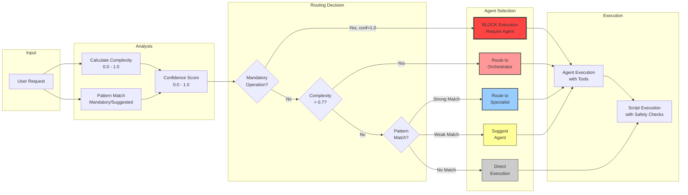
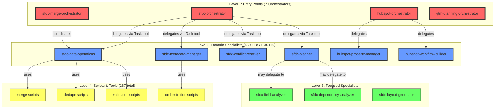
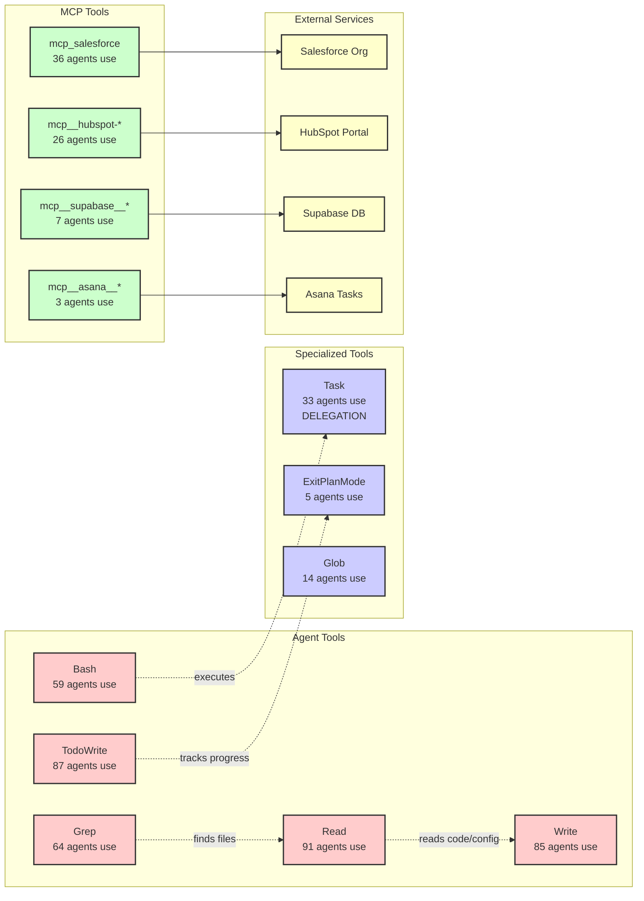
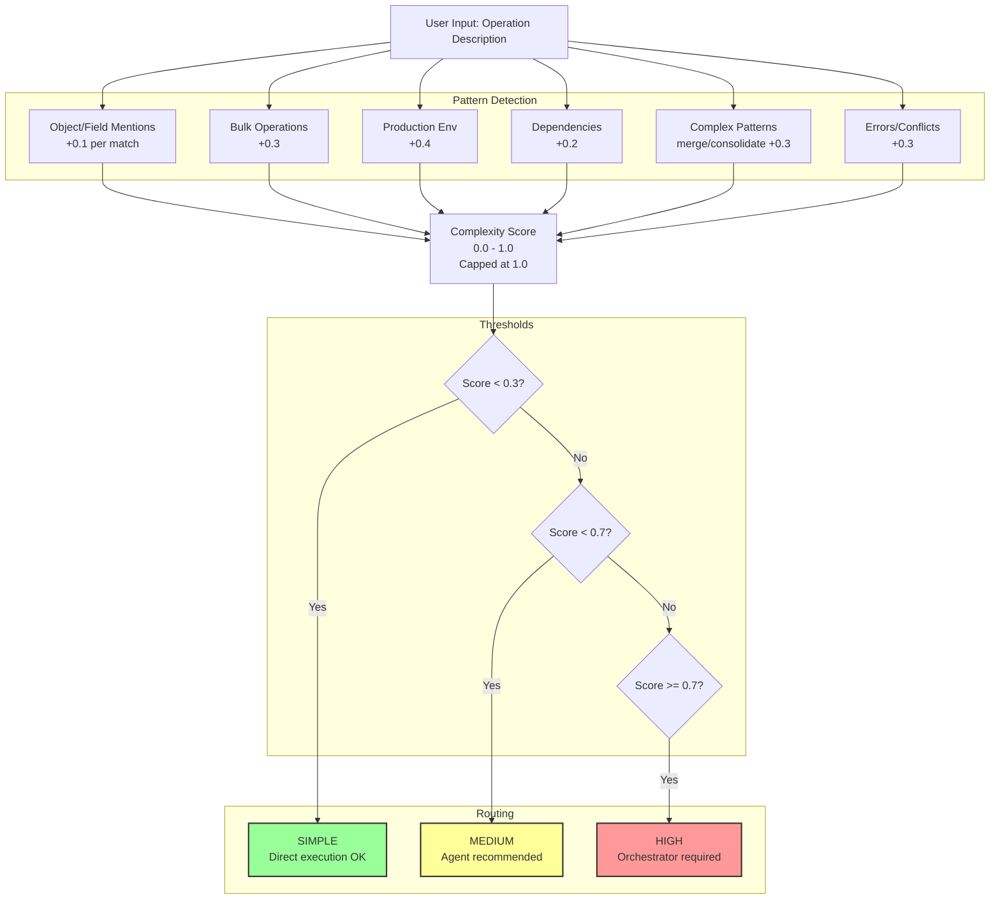
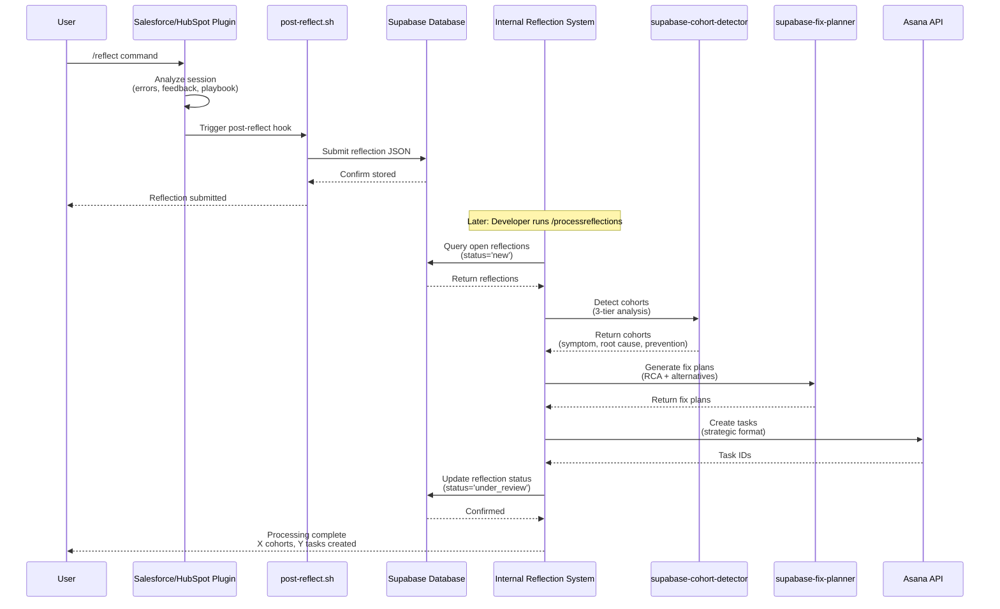

# OpsPal Agent System Architecture Map

**Generated**: 2025-10-18
**Total Agents**: 161
**Total Scripts**: 287
**Total Plugins**: 8

---

## System Map (Mermaid Diagram)

### Top-Level Architecture

```mermaid
graph TB
    subgraph "User Interface"
        USER[User Request]
    end

    subgraph "Routing Layer (3-Layer Hybrid)"
        HOOK[UserPromptSubmit Hook]
        HYBRID[user-prompt-hybrid.sh]
        ENHANCED[user-prompt-submit-enhanced.sh]
        ROUTER[auto-agent-router.js]
    end

    subgraph "Orchestrator Agents (7 total)"
        SFDC_ORCH[sfdc-orchestrator<br/>Tools: Task, mcp_salesforce, TodoWrite]
        SFDC_MERGE_ORCH[sfdc-merge-orchestrator]
        SFDC_COORD[sfdc-revops-coordinator]
        GTM_ORCH[gtm-planning-orchestrator]
        HS_ORCH[hubspot-orchestrator]
        SFDC_HUB_DEDUP[sfdc-hubspot-dedup-orchestrator<br/>(Internal)]
    end

    subgraph "SFDC Specialist Agents (55 total)"
        SFDC_META[sfdc-metadata-manager]
        SFDC_SECURITY[sfdc-security-admin]
        SFDC_DATA[sfdc-data-operations]
        SFDC_CONFLICT[sfdc-conflict-resolver]
        SFDC_DEPLOY[sfdc-deployment-manager]
        SFDC_PLANNER[sfdc-planner]
        SFDC_REPORTS[sfdc-reports-dashboards]
        SFDC_LAYOUT_GEN[sfdc-layout-generator]
        SFDC_APEX[sfdc-apex-developer]
        SFDC_AUTO[sfdc-automation-builder]
    end

    subgraph "HubSpot Specialist Agents (35 total)"
        HS_PROP[hubspot-property-manager]
        HS_WORK[hubspot-workflow-builder]
        HS_DATA[hubspot-data-operations-manager]
        HS_CONTACT[hubspot-contact-manager]
        HS_PIPELINE[hubspot-pipeline-manager]
    end

    subgraph "Cross-Platform Agents (6 total)"
        CROSS_INST[platform-instance-manager]
        CROSS_DEPLOY[instance-deployer]
    end

    subgraph "Developer Tools Agents (15 total)"
        PLUGIN_DOC[plugin-documenter]
        PLUGIN_PUB[plugin-publisher]
        PLUGIN_CAT[plugin-catalog-manager]
    end

    subgraph "Internal Reflection Agents (7 total)"
        SUP_ANALYST[supabase-reflection-analyst]
        SUP_COHORT[supabase-cohort-detector]
        SUP_FIX[supabase-fix-planner]
        SUP_ASANA[supabase-asana-bridge]
        SUP_WORKFLOW[supabase-workflow-manager]
        SUP_RECURRENCE[supabase-recurrence-detector]
    end

    subgraph "Data Operations Scripts (Salesforce)"
        MERGE_PAR[bulk-merge-executor-parallel.js<br/>5x faster, worker pool]
        MERGE_NATIVE[salesforce-native-merger.js<br/>4 strategies, rollback]
        MERGE_VAL[sfdc-pre-merge-validator.js<br/>Pre-flight checks]
        DEDUP_ORCH_S[dedup-workflow-orchestrator.js<br/>Unified entry point]
        DEDUP_SAFETY[dedup-safety-engine.js<br/>Type 1/2 error prevention]
        DEDUP_HELPER[agent-dedup-helper.js<br/>Agent integration]
    end

    subgraph "Routing Scripts"
        AUTO_ROUTER_S[auto-agent-router.js<br/>Complexity scoring 0-1.0]
        TASK_PATTERN[task-pattern-detector.js<br/>Operation type detection]
        TASK_DOMAIN[task-domain-detector.js<br/>Domain detection]
    end

    subgraph "Orchestration Scripts"
        AUTO_AUDIT_ORCH[automation-audit-v2-orchestrator.js<br/>7 dependencies]
        AUTO_INV_ORCH[automation-inventory-orchestrator.js<br/>8 dependencies]
    end

    %% User Flow
    USER --> HOOK
    HOOK --> HYBRID

    %% Routing Layer
    HYBRID --> ENHANCED
    HYBRID --> ROUTER
    ENHANCED --> AUTO_ROUTER_S
    ROUTER --> |Complexity 0.7-1.0| SFDC_ORCH
    ROUTER --> |Pattern Match| SFDC_META
    ROUTER --> |Pattern Match| SFDC_SECURITY

    %% Orchestrator Delegation
    SFDC_ORCH --> |Task tool| SFDC_META
    SFDC_ORCH --> |Task tool| SFDC_DATA
    SFDC_ORCH --> |Task tool| SFDC_CONFLICT
    SFDC_ORCH --> |Task tool| SFDC_PLANNER

    SFDC_MERGE_ORCH --> |Delegates| SFDC_DATA
    SFDC_REVOPS_COORD --> |Coordinates| SFDC_REPORTS

    GTM_ORCH --> |Cross-platform| CROSS_INST

    HS_ORCH --> |Delegates| HS_PROP
    HS_ORCH --> |Delegates| HS_WORK
    HS_ORCH --> |Delegates| HS_DATA

    %% Specialist to Script Dependencies
    SFDC_DATA --> MERGE_PAR
    SFDC_DATA --> MERGE_NATIVE
    SFDC_DATA --> MERGE_VAL
    SFDC_DATA --> DEDUP_ORCH_S

    SFDC_META --> AUTO_AUDIT_ORCH
    SFDC_META --> AUTO_INV_ORCH

    %% Script Interdependencies
    DEDUP_ORCH_S --> MERGE_VAL
    DEDUP_ORCH_S --> DEDUP_SAFETY
    DEDUP_ORCH_S --> MERGE_PAR

    MERGE_PAR --> MERGE_NATIVE

    DEDUP_HELPER --> DEDUP_SAFETY
    DEDUP_HELPER --> MERGE_PAR

    %% Routing script usage
    AUTO_ROUTER_S --> TASK_PATTERN
    AUTO_ROUTER_S --> TASK_DOMAIN

    %% Reflection workflow
    SUP_ANALYST --> SUP_COHORT
    SUP_COHORT --> SUP_FIX
    SUP_FIX --> SUP_ASANA
    SUP_WORKFLOW --> SUP_COHORT

    %% Styling
    classDef orchestrator fill:#ff9999,stroke:#333,stroke-width:3px
    classDef specialist fill:#99ccff,stroke:#333,stroke-width:2px
    classDef script fill:#99ff99,stroke:#333,stroke-width:1px
    classDef routing fill:#ffcc99,stroke:#333,stroke-width:2px

    class SFDC_ORCH,SFDC_MERGE_ORCH,SFDC_COORD,GTM_ORCH,HS_ORCH,SFDC_HUB_DEDUP orchestrator
    class SFDC_META,SFDC_SECURITY,SFDC_DATA,SFDC_CONFLICT,SFDC_DEPLOY,SFDC_PLANNER,SFDC_REPORTS specialist
    class MERGE_PAR,MERGE_NATIVE,MERGE_VAL,DEDUP_ORCH_S,DEDUP_SAFETY,DEDUP_HELPER script
    class HOOK,HYBRID,ENHANCED,ROUTER,AUTO_ROUTER_S routing
```

---

## Data Flow Diagram



---

## Agent Delegation Network



---

## Tool Dependency Graph



---

## Complexity Scoring Model



---

## Reflection Processing Workflow



---

## Plugin Architecture

```mermaid
graph TB
    subgraph "User-Facing Plugins (8 total, tracked in git)"
        P1[salesforce-plugin<br/>v3.14.0<br/>49 agents, 313 scripts]
        P2[hubspot-core-plugin<br/>v1.0.0<br/>13 agents]
        P3[hubspot-marketing-sales-plugin<br/>v1.0.0<br/>10 agents]
        P4[hubspot-analytics-governance-plugin<br/>v1.0.0<br/>8 agents]
        P5[hubspot-integrations-plugin<br/>v1.0.0<br/>5 agents]
        P6[gtm-planning-plugin<br/>v1.5.0<br/>7 agents]
        P7[opspal-core<br/>v1.1.0<br/>6 agents]
        P8[developer-tools-plugin<br/>v1.0.0<br/>15 agents]
    end

    subgraph "Internal Infrastructure (NOT in git)"
        I1[.claude/agents/<br/>7 Supabase agents]
        I2[.mcp.json<br/>Supabase + Asana MCP]
        I3[/processreflections<br/>Internal command]
    end

    subgraph "Marketplace"
        MARKET[GitHub Repository<br/>RevPalSFDC/opspal-plugin-internal-marketplace]
    end

    P1 --> MARKET
    P2 --> MARKET
    P3 --> MARKET
    P4 --> MARKET
    P5 --> MARKET
    P6 --> MARKET
    P7 --> MARKET
    P8 --> MARKET

    I1 -.->|uses| I2
    I3 -.->|orchestrates| I1

    classDef plugin fill:#99ccff,stroke:#333,stroke-width:2px
    classDef internal fill:#ffcc99,stroke:#333,stroke-width:2px
    classDef market fill:#99ff99,stroke:#333,stroke-width:3px

    class P1,P2,P3,P4,P5,P6,P7,P8 plugin
    class I1,I2,I3 internal
    class MARKET market
```

---

## Key Insights from System Map

### 1. Hub-and-Spoke Architecture
- **7 orchestrators** coordinate work (4.3% of agents)
- **154 specialists** perform specific tasks (95.7% of agents)
- Clear separation of concerns: orchestration vs execution

### 2. Tool Usage Patterns
- **Read/Write/Grep/Bash** are foundational (used by 50%+ of agents)
- **MCP tools** provide external integrations (Salesforce, HubSpot, Supabase, Asana)
- **Task tool** enables delegation (33 agents = 20.5% can delegate)

### 3. Routing Sophistication
- **3-layer routing** combines pattern matching + complexity analysis
- **Complexity scoring** uses 6 factors with weighted sum (0.0-1.0)
- **Confidence thresholds** determine mandatory vs suggested routing

### 4. Data Operations Consolidation Opportunities
- **9 active modules** could be reduced to **7 modules** (22% reduction)
- **Single entry point** (`DataOperationsAPI`) would improve developer experience
- **Parallel executor** provides 5x performance improvement

### 5. Reflection Processing Lifecycle
- **User-facing**: /reflect command in plugins
- **Internal**: /processreflections with 7 specialized agents
- **Bidirectional**: Supabase stores reflections, Asana tracks implementation

---

**Legend**:
- 🔴 **Red (Orchestrators)**: High-level coordination, delegates to multiple agents
- 🔵 **Blue (Specialists)**: Focused domain expertise, specific operations
- 🟢 **Green (Scripts)**: Reusable utilities and tools
- 🟡 **Yellow (Routing)**: Pattern matching, complexity scoring, agent selection

---

**End of System Map**

**Usage**: Copy Mermaid diagrams into any Mermaid-compatible viewer (Mermaid Live Editor, GitHub markdown, etc.)
