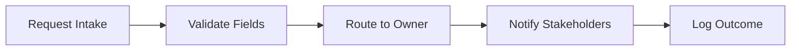

# Runbook Sample Deck v3

# Overview

## Executive Summary
- Revenue momentum is strong, but pipeline quality is uneven
- Automate lead routing to reduce response time and drop-off
- Focus Q2 on activation, retention, and expansion levers
- Align cross-team metrics to remove reporting friction

## Narrative Insight
Pipeline growth outpaced conversion, creating volume without enough yield.
Response times rose as routing rules expanded across tools.
Teams need a single source of truth for stage definitions and SLAs.

## Strategy Statement
Consolidate routing logic into one workflow to improve speed and data trust.

## KPI Snapshot
| Metric | Value |
| --- | --- |
| QoQ Revenue Growth | +18% |
| Net Revenue Retention | 112% |
| CAC Payback | 8 months |
| Pipeline Coverage | 3.2x |

# Chart Style Demos

## Conversion Trend Chart
| Quarter | Conversion Rate |
| --- | --- |
| Q1 | 18% |
| Q2 | 21% |
| Q3 | 24% |
| Q4 | 27% |

## Revenue by Segment Horizontal Chart
| Segment | ARR ($M) |
| --- | --- |
| Enterprise | 6.2 |
| Mid-Market | 3.8 |
| SMB | 1.4 |
| Expansion | 2.1 |

## Conversion Trend Chart With Insights
| Quarter | Conversion Rate |
| --- | --- |
| Q1 | 18% |
| Q2 | 21% |
| Q3 | 24% |
| Q4 | 27% |

- Conversion improved each quarter as routing rules were simplified
- Q4 gain was driven by faster SLA adherence
- Enablement lifted mid-market response rates

# Diagram & Timeline

## Routing Workflow Diagram

## Implementation Timeline
1. Pilot rollout
2. Full deployment
3. Optimize playbooks
4. Scale and iterate

# Evidence & Quotes

## Evidence Signal
- Pipeline response time improved 32% after routing cleanup [Gartner 2023]
- Data-driven teams are 19x more likely to be profitable [McKinsey 2021]

## Stakeholder Voice
> "Clean routing rules cut our response time in half and restored trust in the data." [Customer Study 2024] - RevOps Director

# Appendix

## Glossary
- SLA: Response time commitment for inbound requests
- NRR: Net Revenue Retention for existing customers
- CAC: Customer Acquisition Cost
