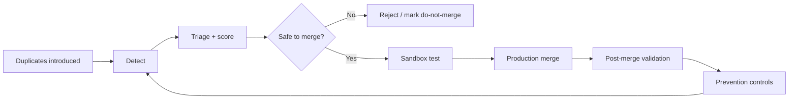
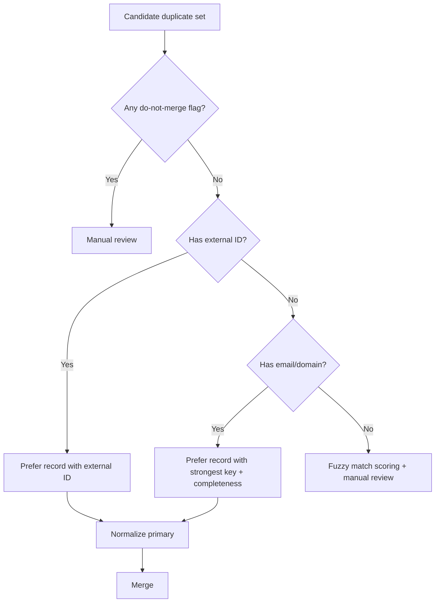
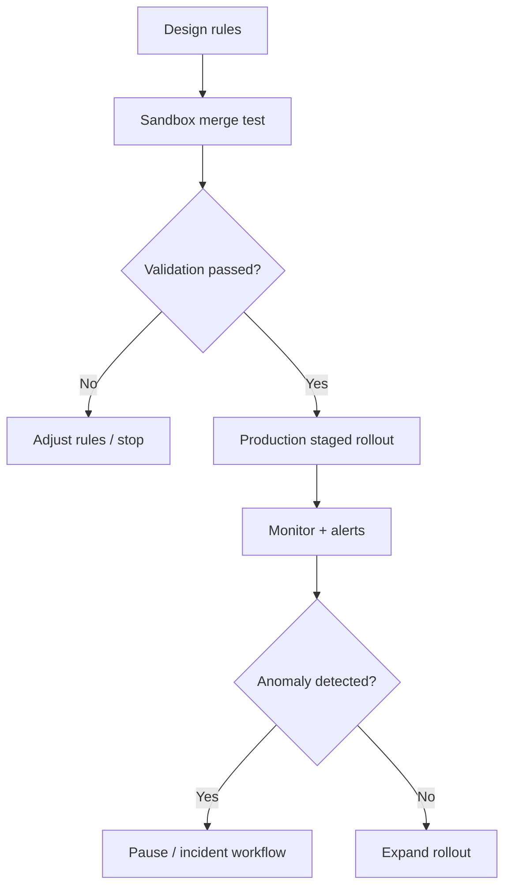
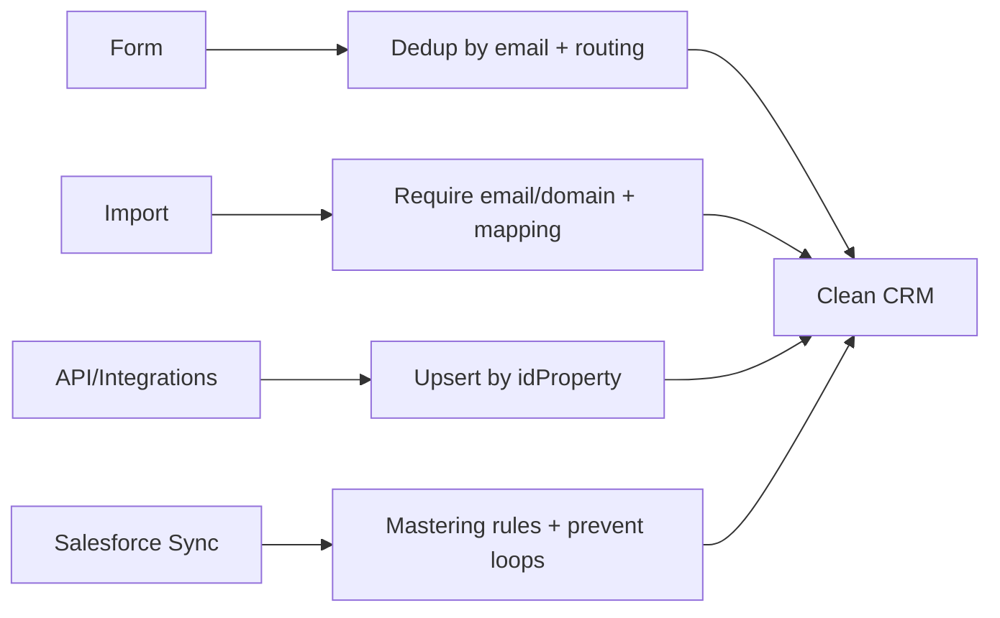
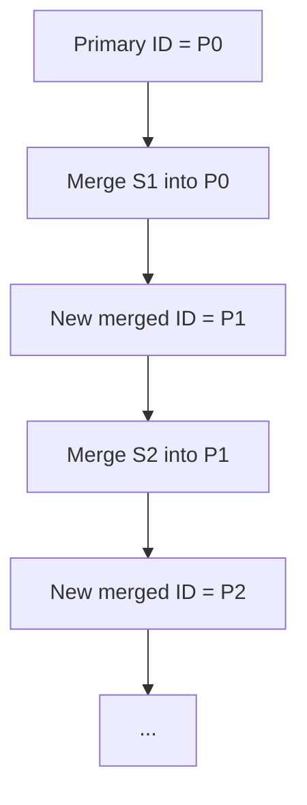

# 05 — Duplicate Detection, Deduplication, and Merge Operations (HubSpot) — Research Runbook

**File:** `05_duplicate_detection_deduplication_research.md`  
**Baseline tier:** HubSpot Professional (works across Starter → Enterprise; advanced add-ons and tier gates called out)  
**Primary audience:** RevPal HubSpot agents + RevOps consultants  
**Last verified:** 2026-01-07  
**Scope:** Sandbox + Production (environment-first: Design → Sandbox Test → Validate → Production Deploy → Monitor)  
**API priority:** CRM v3 (legacy only where needed)

---

## 0. RevPal Context & Cross-Platform Parity Notes (Read First)

### Where this runbook sits in the RevPal ecosystem
This runbook defines RevPal’s **standard deduplication operating model** for HubSpot portals: how to **detect duplicates**, **prevent duplicate creation**, and **merge safely** while protecting reporting integrity, lifecycle stage logic, and compliance controls.

**Typical agent consumers (examples; adapt to your 44-agent routing map):**
- **hubspot-data-hygiene-specialist**: duplicate detection, cleanup strategy, prevention controls, audit trail hygiene
- **hubspot-admin-architect**: property design (unique IDs), permissions, portal governance
- **hubspot-workflow-builder**: remediation workflows, duplicate queues, rep prompts, custom-code orchestrations
- **hubspot-custom-code-developer**: bulk dedupe jobs, fuzzy matching pipelines, upsert patterns, retry/backoff
- **hubspot-integration-guardian**: integration duplication controls (Salesforce sync, Data Sync apps, Stripe app, etc.)
- **hubspot-security-governance-auditor**: GDPR/legal basis handling, consent safety, PII minimization

### Cross-platform parity mapping (Salesforce → HubSpot)
| Salesforce pattern | HubSpot equivalent | Key difference |
|---|---|---|
| Duplicate Rules + Matching Rules | **Duplicate management tool** + **duplicate alerts** + (optional) **custom duplicate rules (Data Hub)** | HubSpot has fewer native “matching rule” knobs; custom rules are limited (e.g., 2 per object in beta), and not all flows respect uniqueness |
| Record Merge (retains winning record ID) | Record merge creates a **new record ID** for the merged record (as of 2025) | Major integration implication: downstream systems relying on stable HubSpot object IDs must handle ID remapping |
| Field-level merge rules | UI merge lets you pick which property values to keep | API merge uses default logic (primary prioritized) — no per-field selection |
| Field History Tracking + Audit Trail | Property history + “Merged [record] IDs” + internal merge notifications | HubSpot property history is excellent at record-level; portfolio-level analytics needs exports/snapshots |

### Validation framework alignment (recommended)
Map RevPal’s cross-platform **5-stage error prevention** to HubSpot dedupe:

1. **Discover:** quantify duplicates, understand creation sources (forms/imports/API/integrations), define keys  
2. **Validate:** confirm merge rules/exception behavior, ensure permissions + compliance, define primary selection logic  
3. **Simulate (Sandbox):** run on small controlled segments, verify merge outcomes and downstream impacts  
4. **Execute (Production):** staged rollout with circuit breakers (pause, rate limits, rollback plan)  
5. **Verify:** confirm reporting/automation/integrations are stable; document and instrument prevention controls

> Repo note: RevPal referenced internal patterns in `schema-registry.js`, `data-quality-checkpoint.js`, and `docs/LIVING_RUNBOOK_SYSTEM.md`. This research could not directly fetch that repository from public sources during compilation, so the runbook mirrors those patterns conceptually (schema → checkpoint → audit event) and flags any implementation details for SME alignment.

---

## 1. Executive Summary (300–500 words)

Duplicate CRM records are one of the fastest ways to degrade HubSpot performance and trust: they split activity history, corrupt attribution/analytics properties, confuse routing, and inflate reporting counts. In HubSpot, duplicates most commonly appear via **imports**, **integrations (API/Data Sync)**, and **company auto-creation settings**, and they tend to compound over time unless a preventative keying strategy is enforced.

HubSpot provides several native mechanisms to manage duplicates:

- **Duplicate management tool**: surfaces duplicate pairs for contacts and companies, plus supports bulk review. Contacts are identified by combinations of name/email/phone, while companies use company name + company domain name, and you can reject/undo rejected pairs. There are portal-level limits on how many duplicate pairs can be displayed at once.  
- **Duplicate alerts / unique value properties**: HubSpot can enforce *unique values* for selected properties (up to 10 unique-value properties per object). These rules can prevent duplicates during manual record creation and imports, but **are not enforced in workflows, chatflows, or legacy forms**, and unique-value rules are **not supported by forms** (meaning you must still implement “front door” hygiene patterns).  
- **Record merge**: HubSpot merges two records of the same object into one. Importantly, HubSpot’s updated merge behavior (effective 2025) creates a **new record ID** for the merged record while preserving the original IDs as pointers. In general, the merged record prioritizes the primary record’s property values, uses the secondary record’s values for empty fields, and combines activities and associations. There are object-specific exceptions (e.g., contact email becomes primary + secondary; company domain becomes primary + secondary domain; lifecycle stage keeps the furthest-down-funnel; legal basis keeps the most recent). Merges unenroll records from workflows by default, and can take up to 30 minutes to fully sync activities.

Major limitations and gotchas:
- **No true “unmerge”**: once merged, HubSpot cannot revert it. Recovery is procedural (create a new record using additional email/domain, rebuild associations).  
- **API merge has no per-field selection**: if you want to choose specific property values, use the UI merge compare screen or “normalize” your primary record before merging via API.  
- **Company merges with Salesforce integration**: if the HubSpot–Salesforce integration is enabled, HubSpot will not allow company merges; the recommended approach is to delete duplicates while keeping the company that syncs to the primary Salesforce Account.  
- **API-created companies are not auto-deduplicated by domain**: you must implement your own dedupe/upsert strategy when creating companies programmatically or via sync apps.

This runbook provides a complete operational model: **detection → triage → safe merge → verification → prevention**, with sandbox-first workflows, code samples, and governance controls appropriate for enterprise-grade RevOps.

---

## 2. Platform Capabilities Reference (Comprehensive)

### 2A. Native HubSpot Features

| Feature | Location (UI) | Capabilities | Limitations / Notes | API Access |
|---|---|---|---|---|
| Duplicate management tool (contacts/companies) | CRM > Contacts or CRM > Companies > **Actions** > Manage duplicates (also surfaced via Data quality tooling depending on portal) | Identify duplicate pairs; merge or reject; undo rejected duplicates; bulk review (tier dependent) | Duplicate pairs display limits (e.g., 5k Pro / 10k Ent). “Matches” are suggestions and need review. | No public “get duplicate pairs” API (treat as UI output; build your own detector if needed) |
| Duplicate alerts on record creation | When manually creating a record in CRM | Alerts when record resembles an existing record (based on object rules / custom duplicate rules) | Behavior depends on object and rule config; doesn’t prevent duplicates in all creation channels | No direct API |
| Custom duplicate rules (Beta / Data Hub) | Data management / Data quality area (portal dependent) | Create up to **2 rules per object**; each rule can include up to **3 properties**; triggers duplicate alerts + detection | Feature gate: Data Hub Professional/Enterprise; beta behavior may change | No public config API (UI-only) |
| Unique value property validation | Settings > Properties > create/edit property > **Validation rules** | Enforce unique values for up to **10 properties per object**; blocks duplicate values during manual edit and imports | Not supported for forms; not enforced for workflows/chatflows/legacy forms; unique values cannot be turned on after property creation | CRUD via Properties API, but validation rule settings are primarily UI-managed |
| Merge records (UI) | Record > left panel > **Actions** > Merge | Merge two records; select which properties to keep; compare panel; merge notification | Cannot unmerge; merge can disconnect calls; activities sync can take up to 30 min; 250-merge participation limit | Merge endpoints exist (v3) |
| Merge records (API) | N/A | Merge two records by ID | Default merge logic only; no property-by-property selection | `POST /crm/v3/objects/{objectType}/merge` |
| Merged [record] IDs property | Record > Actions > View all properties > search “Merged” | Shows record IDs previously merged into the record; can filter views by “Merged [record] IDs is known” | Property internal name varies by object; don’t hardcode without confirming via Properties API | Readable like any property |
| Import dedupe (Contacts) | Data management > Data integration > Imports | Dedup contacts by **email** during import | If email is missing, each row becomes a new contact; if multiple existing contacts share an email, import errors; edge cases w/ secondary email + record ID mapping | Import APIs exist; behavior depends on import config |
| Import dedupe (Companies) | Data management > Data integration > Imports | Dedup companies by **primary company domain name** | Secondary domains not used for dedupe; company name alone can create duplicates | Import APIs exist; behavior depends on import config |
| “Automatically create and associate companies with contacts” | Settings > Objects > Companies (setting name varies) | Auto-creates companies from contact email domain and associates them | Can create duplicates; should often be disabled in complex enterprise + SFDC sync environments | UI-only |
| Property history | On record: click property > View history | Audit of property value changes (source, timestamps) | Portfolio-level analytics needs exports/snapshots | `propertiesWithHistory` on CRM object endpoints (read) |

---

### 2B. API Endpoints (Dedup + Merge + Prevention)

> **Rate limits** (private apps / privately distributed apps): typically **190 requests per 10 seconds per app** for Professional, with a shared daily limit; Search API has its own limit of **5 requests per second** and up to **200 records per page**. Always read and respect rate limit headers and retry on 429.

#### Endpoint 1: POST /crm/v3/objects/contacts/merge
```
Endpoint: POST /crm/v3/objects/contacts/merge
Purpose: Merge two contacts (primary + secondary) into a single merged contact record
Required Scopes: crm.objects.contacts.write (also ensure crm.objects.contacts.read for verification)
Rate Limit: Subject to portal/app limits; implement 429 retry/backoff; merges may be asynchronous
Request Schema:
{
  "primaryObjectId": "string",
  "objectIdToMerge": "string"
}
Response Schema (200):
{
  "id": "string",          // merged record ID (new record created)
  "createdAt": "ISO-8601",
  "updatedAt": "ISO-8601",
  "archived": false,
  "properties": { ... }
}
Pagination: N/A
Error Codes:
- 400 BAD_REQUEST (invalid IDs, bad JSON)
- 401 UNAUTHORIZED / 403 FORBIDDEN (missing scopes/token)
- 429 RATE_LIMIT (retry with backoff)
Notes:
- API response indicates acceptance; full activity/association sync may take time.
Code Example: See Section 6 (Example 2)
```

#### Endpoint 2: POST /crm/v3/objects/companies/merge
```
Endpoint: POST /crm/v3/objects/companies/merge
Purpose: Merge two companies into one merged company record
Required Scopes: crm.objects.companies.write (read scope recommended for verification)
Rate Limit: Subject to portal/app limits; implement 429 retry/backoff
Request Schema:
{
  "primaryObjectId": "string",
  "objectIdToMerge": "string"
}
Response Schema: Simple public object (similar to contacts merge)
Notes:
- UI has additional restrictions (e.g., Salesforce integration enabled can block company merges).
```

#### Endpoint 3: POST /crm/v3/objects/deals/merge
```
Endpoint: POST /crm/v3/objects/deals/merge
Purpose: Merge two deals (useful when integrations create duplicate opportunities)
Required Scopes: crm.objects.deals.write
Request/Response: Same shape as merge endpoints above
Notes:
- No built-in “deal duplicate detector” — you’ll typically detect via search on external IDs / names / close date + amount patterns.
```

#### Endpoint 4: POST /crm/v3/objects/tickets/merge
```
Endpoint: POST /crm/v3/objects/tickets/merge
Purpose: Merge two tickets into one ticket record
Required Scopes: crm.objects.tickets.write
Request/Response: Same shape as merge endpoints above
Notes:
- Useful when email ingestion or support tools create duplicates.
```

#### Endpoint 5: POST /crm/v3/objects/{objectType}/merge
```
Endpoint: POST /crm/v3/objects/{objectType}/merge
Purpose: Merge two objects of the same type (incl. custom objects; {objectType} can be an objectTypeId like 0-410)
Required Scopes: Depends on object type (e.g., crm.objects.custom.write for many custom objects)
Notes:
- Often gated by Enterprise for custom objects; check portal feature access.
```

#### Endpoint 6: POST /crm/v3/objects/contacts/search
```
Endpoint: POST /crm/v3/objects/contacts/search
Purpose: Find potential duplicates (exact-match or rule-based filtering)
Rate Limit: Search API limited to 5 req/sec per token; 200 records per page
Request Schema (typical):
{
  "filterGroups": [{ "filters": [{ "propertyName": "email", "operator": "EQ", "value": "a@b.com" }] }],
  "properties": ["email","firstname","lastname","phone"],
  "limit": 200,
  "after": 0
}
Pagination: cursor-based using `after`
Notes:
- Search API is not a duplicate detector; you implement grouping/scoring client-side.
```

#### Endpoint 7: PATCH /crm/v3/objects/contacts/{identifier}?idProperty=email
```
Endpoint: PATCH /crm/v3/objects/contacts/{identifier}?idProperty=email
Purpose: Update by unique property to prevent creating duplicates (integration “upsert-lite” pattern)
Required Scopes: crm.objects.contacts.write
Notes:
- Use an external ID or email as idProperty to always target the same record.
```

#### Endpoint 8: POST /crm/v3/objects/contacts/batch/upsert
```
Endpoint: POST /crm/v3/objects/contacts/batch/upsert
Purpose: True batch upsert using an idProperty (e.g., email or external_id)
Required Scopes: crm.objects.contacts.write
Request Schema:
{
  "inputs": [{ "id": "string", "properties": { ... } }],
  "idProperty": "email"
}
Notes:
- Best practice for integrations importing large volumes while preventing duplicates.
```

---

### 2C. Workflow Actions (Dedup/Prevention-oriented)

> HubSpot workflows are the primary “operational glue” for dedupe, but note: **uniqueness validation is not enforced by workflows**, so workflows cannot “block” duplicate writes — you must detect and route.

Relevant workflow actions (common):
- **Edit record** (set/clear properties): mark records as suspected duplicate; set `revpal_dedupe_status`, `revpal_dedupe_batch_id`
- **Copy property value**: normalize canonical values before merge (primary record)
- **Create task**: route suspected duplicates to a human queue
- **Send internal email / Slack notification** (if enabled): alert owners/admins
- **If/then branch**: eligibility gating (e.g., “has email”, “domain not personal”, “has external ID”)
- **Delay**: allow async merges to settle before validation checks
- **Custom code action** (Operations Hub): call merge API, implement fuzzy matching, push audit events
- **Webhook action**: send suspected duplicates to external dedupe service / queue
- **Enroll in another workflow**: stage-based or object-based pipelines (triage → merge → verify)
- **Create record** (e.g., create a “Dedupe Review” custom object/task): optional enterprise pattern for auditability

---

## 3. Technical Requirements Analysis

### 3A. Data structures & dependencies

**Primary objects:**
- Contacts
- Companies
- Deals
- Tickets
- Custom Objects (Enterprise) — often used for Products/Subscriptions/Accounts, etc.

**High-value properties used for duplicate detection (typical):**
- Contacts: `email` (primary unique identifier), first/last name, phone/mobile, company association, lifecycle stage  
- Companies: `domain` (company domain name), company name, parent/child relationships  
- Deals: external opportunity ID, deal name, close date, amount, pipeline + stage, associated company/contact  
- Tickets: external ticket ID, subject, source channel, created date, associated contact/company

**Relationships that matter:**
- Contact ↔ Company primary association label (merge prioritization matters)
- Contact/Company ↔ Deals/Tickets (associations preserved during merge)
- Parent/Child companies (can block merges or cause merge failures if loops exist)

**Provenance + governance properties (RevPal recommended):**
- `revpal_dedupe_suspected` (boolean)
- `revpal_dedupe_reason` (enum: same_email, same_domain, fuzzy_name, external_id_collision, etc.)
- `revpal_dedupe_score` (number 0–100)
- `revpal_dedupe_batch_id` (string)
- `revpal_canonical_source` (string: salesforce, product, manual, import, etc.)
- `revpal_merge_executed_at` (datetime)
- `revpal_merge_operator` (string: UI/user/email or integration name)
- `revpal_merge_notes` (text, include correlationId/requestId)

### 3B. Validation rules & constraints (native vs custom)

**Native (HubSpot-managed):**
- Duplicate detection surfaces in the duplicate management tool (contacts/companies) and via duplicate alerts.
- Merge behavior includes strict rules and object-specific exceptions:
  - New merged record ID is created.
  - Primary record values generally prioritized; empty values fall back to secondary.
  - Lifecycle stage keeps furthest down funnel for contacts and companies.
  - Companies keep primary domain + add secondary company domain as a secondary domain.
  - Contacts keep primary email + add secondary email as additional email.
  - Legal basis keeps most recent values from both contacts.
  - Merge unenrolls from workflows by default; optional setting allows enrollment at merge time.

**Custom / RevPal-implemented:**
- Deterministic dedupe using **unique value properties** and upsert patterns (API).
- Fuzzy duplicate detection for contacts without email, companies without domain, and cross-source duplicates.
- Canonical selection scoring model.
- Audit trail + checkpointing (RevPal validation framework).

**Key constraints:**
- Unique-value rules are **not supported for forms** and are **not enforced** by workflows/chatflows/legacy forms.
- Company merges are blocked when Salesforce integration is enabled (UI restriction) — you must handle duplicates via deletion + Salesforce-side account merges.
- Merge participation limit: records involved in **250+ merges** cannot be merged further; you must create a new record instead.
- No unmerge capability.

### 3C. Error scenarios & edge cases (high-frequency)

- **API-created company duplicates**: domain-based dedupe doesn’t run; integrations create parallel companies.
- **Contacts without email**: cannot reliably dedupe deterministically; requires fuzzy matching.
- **Shared inbox or alias patterns**: two distinct humans using the same email (or shared role email) — merging is unsafe.
- **Parent/child company loops**: merges fail when parent-child loops exist.
- **Salesforce sync**: merging can break sync for the secondary record; keep the record synced to Salesforce primary account.
- **Marketing contacts**: merge chooses the “most marketable” status, which can impact billing and segmentation.
- **Consent/legal basis**: contact legal basis values merge using most recent values from both records; ensure this aligns with governance policy.

### 3D. Performance considerations

- **Duplicate detection at scale**: Search API is limited (5 req/sec) and returns 200 records/page; plan for batching and external grouping.
- **Merge operations are stateful and can be slow**: activities can take up to 30 minutes to sync; treat merge as async and validate later.
- **Batching strategy**:
  - Use batch upsert to prevent duplicates (lower API volume and safer).
  - Use search queries in time windows (createdate/updatedate chunking) when scanning large datasets.

---

## 4. Technical Implementation Patterns (10 patterns)

### Pattern 1: “UI-first” guided merge for high-risk duplicates (recommended default)
Use Case: High-value accounts/contacts, complex property conflicts, or regulated environments.  
Prerequisites:
- CRM permissions to merge
- Stakeholder rulebook: which properties should win
Steps:
1. Open primary record (the one you want to keep).
2. Actions → Merge → select secondary.
3. In compare view, click property values to keep (override defaults).
4. Merge; capture merge notification and note it may take up to 30 minutes for full activity sync.
Validation:
- Confirm new merged record exists and has combined activities and associations.
- Check Merged [record] IDs property includes prior record IDs.
Edge Cases:
- If records were in workflows, they are unenrolled; ensure any required enrollments are restored (manually or via workflow settings).

---

### Pattern 2: Duplicate management tool triage queue (contacts/companies)
Use Case: Ongoing operational hygiene (weekly/monthly queue).  
Prerequisites:
- Access to duplicate management tool (tier-dependent)
Steps:
1. Navigate to the duplicates tool for Contacts/Companies.
2. Filter/segment by “high impact” criteria:
   - lifecycle stage = customer/opportunity
   - has active deals or open tickets
3. For each pair:
   - Reject if clearly different entities.
   - Merge if safe; select primary using risk-aware selection logic.
4. Track outcomes in a RevPal checkpoint log (batch ID, counts merged, rejected).
Validation:
- Reduction in duplicate pair count over time.
- No spike in sync errors or assignment anomalies.
Edge Cases:
- Duplicate pair suggestions can include false positives; do not automate merges purely from suggestions without safety checks.

---

### Pattern 3: Canonical record selection algorithm (score-based)
Use Case: Standardize “which record is primary” across agents/consultants.  
Inputs (example weights; tune per customer):
- Record completeness score (Runbook 2 methodology)
- Lifecycle stage depth (furthest down funnel preferred)
- Most recent engagement timestamp
- Has external system ID (e.g., Salesforce ID / product user ID)
- Owner assignment (assigned vs unassigned)
Steps:
1. Compute a score per record:
   - completeness (0–40)
   - lifecycle stage (0–20)
   - engagement recency (0–20)
   - external ID presence (0–15)
   - “do not merge” flags (hard block)
2. Choose higher score as primary.
3. If scores are within a small band (e.g., ±5), require human review.
Validation:
- Sample 25 merged sets; confirm “winner” aligns with business expectation.
Edge Cases:
- Shared emails and role accounts should be hard-blocked (do not merge automatically).

---

### Pattern 4: Pre-merge “normalize primary” (required for API merges)
Use Case: API merges don’t allow per-field selection; you must ensure the primary record contains the values you want to keep.  
Steps:
1. Compare primary vs secondary properties:
   - identity fields, ownership, lifecycle stage, legal basis, external IDs
2. Update primary record first (PATCH):
   - copy winning values into primary
   - set `revpal_premerge_normalized=true`
3. Perform merge via API.
Validation:
- Merged record reflects intended values (since primary values are prioritized).
Edge Cases:
- Some properties have merge exceptions (e.g., lifecycle stage, legal basis, analytics properties) that override your expectations.

---

### Pattern 5: Deterministic dedupe via unique IDs (enterprise-grade prevention)
Use Case: Eliminate duplicates from integrations and imports by enforcing a stable external identifier.  
Prerequisites:
- Create a custom property like `external_id` and turn on unique values at creation time.
- Ensure all pipelines write this ID on create/update.
Steps:
1. Create unique-value property on each object that has a system-of-record key.
2. Update integrations to:
   - use batch upsert with `idProperty=external_id`, or
   - PATCH with `idProperty=external_id`
3. For net-new imports, include `external_id` and configure import to update existing records.
Validation:
- Duplicate rate (by external_id collisions) approaches zero.
Edge Cases:
- Unique-value rules are not supported in forms; inbound forms must still dedupe by email or custom logic.

---

### Pattern 6: Fuzzy matching pipeline for “no email / no domain” populations
Use Case: Event lists, legacy data, or partner data where email/domain is missing or untrustworthy.  
Approach:
- Export relevant records in chunks (createdate ranges).
- Compute similarity score using:
  - normalized name (lowercase, remove punctuation)
  - phone normalization (E.164 if possible)
  - address similarity
  - associated company name similarity
- Create “suspected duplicate” queues (do not auto-merge without safeguards).
Steps:
1. Pull records via Search API (limit 200/page).
2. Normalize fields (name, phone, domain).
3. Compute candidate pairs using blocking keys (e.g., same last name + same company, same phone).
4. Rank by similarity; generate review list.
Validation:
- Precision sampling (manual review): target ≥ 90% “true duplicate” for top-ranked candidates.
Edge Cases:
- Common names and shared phones (front desk) create false positives; require extra criteria.

---

### Pattern 7: “Chain merge” for N duplicates into one (API)
Use Case: Multiple duplicates for one entity (3+ records).  
Important: each merge creates a new record ID; you must merge into the *current latest merged ID*.  
Steps:
1. Choose a canonical primary candidate (Pattern 3).
2. Sort remaining duplicates by risk (lowest risk merges first).
3. Loop:
   - normalize current primary
   - merge one secondary into current primary
   - set primaryId = response.id (new merged ID)
4. Record an ID mapping table: old → new.
Validation:
- Merged [record] IDs includes all contributing records.
Edge Cases:
- Merge participation limit (250 merges) can block large chains; at that point create a new record and migrate.

---

### Pattern 8: Import front-door hygiene (contacts + companies)
Use Case: Imports are a top source of duplicates; treat import as a controlled pipeline.  
Steps:
1. Contacts imports:
   - Require email whenever possible.
   - If missing email, mark record as “unverified” and route to enrichment workflow.
2. Companies imports:
   - Require primary domain whenever possible.
   - Normalize domain (lowercase, strip protocol/path) before import.
3. If multiple existing contacts share the same email, fix those duplicates before importing new rows.
Validation:
- Import error logs reviewed; duplicates reduced.
Edge Cases:
- If you import using both record ID + secondary email, imported secondary email can overwrite the primary email under certain configurations — test in sandbox.

---

### Pattern 9: Integration-safe upsert (API/Data Sync apps)
Use Case: Prevent duplicates created by custom integrations and third-party sync apps.  
Steps:
1. Never “blind create” objects. Always upsert:
   - Contacts: upsert by email or external_id
   - Companies: upsert by domain or external_id
2. If creating companies via API, implement your own “find-or-create”:
   - search by domain first
   - if found, update; else create
3. Log correlation IDs and maintain dedupe checkpoint logs.
Validation:
- New duplicates created by integrations trend toward zero.
Edge Cases:
- API created companies are not automatically deduped; without this pattern, duplicates will recur.

---

### Pattern 10: GDPR-safe dedupe and merge
Use Case: Enterprise governance; reduce risk of mixing identities or violating consent models.  
Steps:
1. Classify which properties are safe for matching (avoid sensitive data).
2. For contacts, verify consent/legal basis before merging:
   - legal basis values are retained using most recent values from both contacts
3. Never merge two contacts where one is clearly a different data subject (e.g., same email reused, shared mailbox).
4. Document merge rationale and retain audit trail (who merged, why, when).
Validation:
- Audit readiness: you can explain “why these two records represent the same individual”.
Edge Cases:
- Merging can change marketing contact status and analytics; ensure stakeholders understand impacts.

---

## 5. Operational Workflows (5 workflows)

### Workflow 1: Duplicate discovery + source attribution (Sandbox → Production)
Pre-Operation Checklist:
- [ ] Confirm portal tier and access to duplicates tool / custom duplicate rules
- [ ] Identify main duplicate sources: imports, API integrations, auto-company creation, Salesforce sync, etc.
- [ ] Create a backup/export of the impacted object segment (at minimum IDs + key properties)

Steps:
1. In sandbox/test portal:
   - Run duplicates tool review on a small segment (e.g., last 30 days created).
   - Export a sample of duplicates and label likely sources.
2. Create a “duplicate source” taxonomy:
   - form_submission
   - import_csv
   - api_integration_[name]
   - salesforce_sync
   - auto_company_creation
3. In production:
   - Enable monitoring: a weekly job that counts duplicates by key (email/domain/external_id).
Expected outcome:
- A ranked backlog and root-cause map of duplicate creation sources.
Post-Operation Validation:
- [ ] You can name the top 3 duplicate sources with evidence
Rollback:
- N/A (discovery only)

---

### Workflow 2: Contact dedupe cleanup (Guided merge + API merge)
Pre-Operation Checklist:
- [ ] Define “do not merge” rules (role emails, shared inboxes, disputed identities)
- [ ] Confirm workflow enrollment impacts and whether “allow merged contacts to enroll” is enabled
- [ ] Confirm marketing contact billing implications

Steps:
1. Select a small production batch (e.g., 50 pairs) and run UI merges.
   - Expected: merged record created; old IDs listed in Merged Contact IDs.
2. For low-risk, high-volume duplicates (same email):
   - Use API to merge, after normalizing primary record.
3. After merges:
   - Re-enroll records into required workflows (if needed).
   - Verify lifecycle stage, marketing status, legal basis.
Post-Operation Validation:
- [ ] Spot-check 10 merged records: combined activities, associations, correct email handling
- [ ] No routing/assignment regressions
Rollback Procedure:
- HubSpot cannot unmerge. If accidental merge:
  - Use the additional email in the merged record to create a new contact after removing it from the merged contact (see “Unmerge mitigation” in Workflow 5).

---

### Workflow 3: Company dedupe cleanup with Salesforce integration constraints
Pre-Operation Checklist:
- [ ] Confirm whether Salesforce integration is installed/enabled
- [ ] Identify which HubSpot company syncs to the primary Salesforce Account
- [ ] Confirm parent/child relationships and remove loops

Steps:
1. If Salesforce integration is enabled:
   - Do not attempt to merge companies in HubSpot (merge is blocked).
   - Instead, delete extra duplicate companies in HubSpot using duplicates tool, keeping the one that syncs to the primary Salesforce Account.
   - Resolve true duplicates in Salesforce (merge/delete Accounts) to prevent re-creation.
2. Turn off “automatically create and associate companies with contacts” if it’s producing duplicates.
Post-Operation Validation:
- [ ] No new duplicate companies created from sync
- [ ] Company counts align between systems
Rollback Procedure:
- Restore deleted company only if you have exports and IDs; otherwise recreate manually with domain and key fields.

---

### Workflow 4: Bulk dedupe job (custom code + checkpointing)
Pre-Operation Checklist:
- [ ] Sandbox tested on a small segment
- [ ] Rate-limit safe (search 5 rps; app limits respected)
- [ ] Circuit breakers defined (stop on error rate >2%, or 429 frequency spikes)
- [ ] ID mapping log storage ready (old → new merged ID)

Steps:
1. Scan in pages (Search API) using deterministic keys (email, domain, external_id).
2. Group duplicates in memory; score and pick canonical primary.
3. Normalize primary, then merge secondaries one-by-one (chain merge).
4. After each merge:
   - write checkpoint event (batch ID, primary old/new IDs, secondaries)
5. After batch completion:
   - verify counts and sample outcomes.
Post-Operation Validation:
- [ ] Checkpoint log reconciles: scanned = processed + skipped + failed
- [ ] Merged [record] IDs present and correct
Rollback:
- Stop job; you cannot unmerge. Use Workflow 5 mitigation if needed.

---

### Workflow 5: Incident response — accidental merge / “cannot unmerge”
Pre-Operation Checklist:
- [ ] Identify which records were merged and when (use Merged [record] IDs + property history)
- [ ] Identify what needs to be separated (emails/domains, associations)

Steps:
1. Navigate to merged record.
2. View Merged [record] IDs to find original record IDs.
3. If contact:
   - Remove the “additional email” that should be separated.
   - Create a new contact using that email.
4. If company:
   - Remove the additional domain (secondary domain) that should be separated.
   - Create a new company using that domain.
5. Rebuild associations manually or via import/API (deals, tickets).
Post-Operation Validation:
- [ ] Separated record exists with correct key identifiers
- [ ] Associations restored as needed
Prevention:
- Require sandbox dry-run and human approval for high-risk merges
- Add “do-not-merge” flags and gating workflows

---

## 6. API Code Examples (Node.js)

> These examples use **Private App tokens** (server-to-server) for simplicity. For Marketplace apps or multi-portal installs, use OAuth and refresh tokens.  
> Implement robust logging, secret storage, and PII redaction.

### Example 1: HubSpot API client helper with rate-limit handling (429)
```js
// node >= 18 (global fetch)
// env: HUBSPOT_PRIVATE_APP_TOKEN
const BASE = "https://api.hubapi.com";

function sleep(ms) { return new Promise(r => setTimeout(r, ms)); }

async function hsRequest(method, path, body, { maxRetries = 5 } = {}) {
  const url = `${BASE}${path}`;
  const headers = {
    "Authorization": `Bearer ${process.env.HUBSPOT_PRIVATE_APP_TOKEN}`,
    "Content-Type": "application/json",
  };

  for (let attempt = 0; attempt <= maxRetries; attempt++) {
    const res = await fetch(url, {
      method,
      headers,
      body: body ? JSON.stringify(body) : undefined,
    });

    if (res.status === 429) {
      const retryAfter = Number(res.headers.get("retry-after")) || 1;
      const backoffMs = Math.min(60, retryAfter * Math.pow(2, attempt)) * 1000;
      await sleep(backoffMs + Math.floor(Math.random() * 250));
      continue;
    }

    const text = await res.text();
    const data = text ? JSON.parse(text) : null;

    if (!res.ok) {
      const err = new Error(`HubSpot API ${res.status}: ${data?.message || text}`);
      err.status = res.status;
      err.body = data;
      throw err;
    }

    return data;
  }

  throw new Error(`HubSpot API: exhausted retries for ${method} ${path}`);
}
```

### Example 2: Merge two contacts (API) + poll for “Merged IDs” evidence
```js
/**
 * Merge contact B into contact A (primary), then poll until the merged record exposes merged-IDs evidence.
 * NOTE: Merge produces a NEW record ID. Capture it and update downstream references.
 */
async function mergeContacts(primaryId, secondaryId) {
  const merged = await hsRequest("POST", "/crm/v3/objects/contacts/merge", {
    primaryObjectId: String(primaryId),
    objectIdToMerge: String(secondaryId),
  });

  const mergedId = merged.id;
  console.log({ mergedId, primaryId, secondaryId });

  // Poll a few times (merge can be async; activities can take much longer).
  for (let i = 0; i < 10; i++) {
    await sleep(1500);

    // Pull minimal properties; in practice you’d request the specific “Merged Contact IDs”
    // internal property name from your portal's Properties API and include it here.
    const rec = await hsRequest(
      "GET",
      `/crm/v3/objects/contacts/${mergedId}?properties=email,hs_object_id`,
      null
    );

    // Basic sanity: record exists and has an email
    if (rec?.id) return { mergedId, rec };
  }

  // If we can't confirm quickly, return mergedId anyway and validate later.
  return { mergedId, rec: null };
}
```

### Example 3: Merge two companies (API)
```js
async function mergeCompanies(primaryId, secondaryId) {
  return hsRequest("POST", "/crm/v3/objects/companies/merge", {
    primaryObjectId: String(primaryId),
    objectIdToMerge: String(secondaryId),
  });
}
```

### Example 4: Batch upsert contacts by email (prevent duplicates)
```js
/**
 * Upsert contacts using email as the idProperty.
 * If email isn't present, do NOT upsert — route to a remediation queue instead.
 */
async function batchUpsertContactsByEmail(rows) {
  const inputs = rows
    .filter(r => r.email)
    .map(r => ({
      id: r.email,
      properties: {
        email: r.email,
        firstname: r.firstname,
        lastname: r.lastname,
        phone: r.phone,
        // provenance
        revpal_last_sync_source: r.source || "integration",
      }
    }));

  if (!inputs.length) return { status: "skipped", reason: "no emails" };

  return hsRequest("POST", "/crm/v3/objects/contacts/batch/upsert", {
    idProperty: "email",
    inputs
  });
}
```

### Example 5: Deterministic duplicate scan (exact-match) using Search API
```js
/**
 * Pull contacts updated in a time window and group by email to find duplicates.
 * This is a simplistic example; in practice chunk by updatedAt/createdAt to stay under search limits.
 */
async function searchContactsUpdatedAfter(isoDate, after = 0) {
  return hsRequest("POST", "/crm/v3/objects/contacts/search", {
    filterGroups: [{
      filters: [
        { propertyName: "lastmodifieddate", operator: "GTE", value: isoDate }
      ]
    }],
    properties: ["email","firstname","lastname","phone","lastmodifieddate"],
    limit: 200,
    after
  });
}

async function findDuplicateEmails(sinceIsoDate, maxPages = 50) {
  let after = 0;
  const byEmail = new Map();

  for (let page = 0; page < maxPages; page++) {
    const res = await searchContactsUpdatedAfter(sinceIsoDate, after);
    for (const c of (res.results || [])) {
      const email = (c.properties?.email || "").trim().toLowerCase();
      if (!email) continue;
      const arr = byEmail.get(email) || [];
      arr.push(c.id);
      byEmail.set(email, arr);
    }
    if (!res.paging?.next?.after) break;
    after = res.paging.next.after;
  }

  // return only duplicates
  return [...byEmail.entries()].filter(([_, ids]) => ids.length > 1);
}
```

---

## 7. Best Practices & Recommendations (12 practices)

1. **Define a deterministic identity key per object** (email/domain/external_id): your #1 lever for preventing duplicates in integrations and imports.
2. **Use batch upsert, not blind create**: batch upsert reduces duplicates and API volume.
3. **Treat merge as irreversible**: require checklists, approvals for high-risk merges, and sandbox dry-runs.
4. **Prefer UI merge for high-stakes records** (customers, opportunities): UI allows per-field selection; API does not.
5. **Normalize primary record before API merge**: copy the “winning” values into primary first.
6. **Instrument merge operations** with a RevPal checkpoint log: batch ID, old/new IDs, operator, correlation IDs.
7. **Create “do not merge” guardrails**: role emails, shared mailboxes, regulated segments; enforce with properties + workflow gating.
8. **Disable auto-company creation when it causes duplicates**: especially in SFDC-synced portals where mastering rules matter.
9. **Chunk search scans by date range**: stay under search API constraints; store cursor checkpoints.
10. **Monitor duplicate creation rate as a KPI**: duplicates/week by channel; alert when it spikes.
11. **Use property permissions** on critical keys (email, domain, external_id): prevent accidental edits that create duplicates.
12. **Document merge exception behavior** (lifecycle stage, legal basis, marketing status, analytics): align expectations across Sales/Marketing/CS.

---

## 8. Comparison with Salesforce (Dedup & Merge)

| Capability | Salesforce | HubSpot | Winner | Notes |
|---|---|---|---|---|
| Matching rules | Configurable fuzzy matching, cross-object, rules engine | Duplicate tool + limited custom rules (beta) | Salesforce | HubSpot is simpler; custom rules are limited and tier-gated |
| Duplicate blocking | Can block create/update with duplicate rules | Unique-value properties for selected fields; forms don’t enforce | Salesforce | HubSpot requires more “front door” hygiene patterns |
| Merge behavior | “Winning record” retains ID; merges mostly synchronous | Merge creates new record ID (post-2025); async sync of activities | Tie | HubSpot’s new-ID behavior is a major integration design consideration |
| Merge field selection | UI supports per-field selection | UI supports per-field selection; API does not | Tie | Similar UX; API limitation is notable in HubSpot |
| Unmerge | Limited (depends on recycle bin / backups; not true unmerge) | Not possible; procedural recovery via additional email/domain | Tie | Both need safeguards; HubSpot is explicit “no unmerge” |
| Audit trail | Field History Tracking + Event Monitoring + Audit Trail | Property history + merged IDs property | Salesforce | HubSpot is strong at record-level history but weaker for centralized audit without add-ons |
| Bulk dedupe tooling | Apps + native tools + reports | Duplicates tool + manual/bulk review (tiered) + API automation | Tie | HubSpot workable, but enterprise-scale often needs external job logic |

---

## 9. Common Pitfalls & Gotchas (12 gotchas)

### Gotcha 1: “We merged and the record ID changed — our integration broke”
What Happens: Downstream systems keyed on HubSpot object IDs can’t find the record.  
Why It Happens: HubSpot merges create a new record with a new ID; old IDs point to the new record, but some systems store IDs and don’t re-resolve.  
How to Avoid: Use stable external IDs; maintain an ID remap table; avoid treating HubSpot object ID as immutable.  
How to Fix: Resolve via “Merged [record] IDs” and update downstream mappings.

### Gotcha 2: API merge keeps wrong values
What Happens: After API merge, important fields reflect the “wrong” record.  
Why: API merge uses default rules; no per-field selection.  
Avoid: Normalize primary first; use UI merge for high-stakes records.  
Fix: Update merged record post-merge (if not overridden by merge exceptions).

### Gotcha 3: Company merges blocked in Salesforce-synced portals
What Happens: Merge option fails or is unavailable.  
Why: HubSpot blocks company merges when Salesforce integration is enabled.  
Avoid: Merge Accounts in Salesforce; delete duplicates in HubSpot keeping the synced company.  
Fix: Follow Workflow 3.

### Gotcha 4: Unique value rules don’t stop duplicates from forms
What Happens: Duplicate entries still created via forms.  
Why: Forms don’t support unique-value validation (and legacy forms/chatflows/workflows may not enforce rules).  
Avoid: Deduplicate by email (forms), use business email gating, use integration-upsert patterns, add workflow “suspected duplicate” routing.  
Fix: Post-process with duplicates tool + merges.

### Gotcha 5: Contacts without email explode duplicates
What Happens: Many near-identical contacts appear for the same person.  
Why: Email is HubSpot’s best unique key; without it, you need fuzzy matching.  
Avoid: Require email for high-value workflows; route no-email contacts to enrichment/verification.  
Fix: Fuzzy matching pipeline + manual review.

### Gotcha 6: Merge unenrolls records from workflows
What Happens: Automations stop triggering after merge.  
Why: Merged records are unenrolled by default; merged record doesn’t auto-enroll unless configured.  
Avoid: Document workflow settings and re-enrollment strategy.  
Fix: Re-enroll or adjust workflow settings to allow enrollment from merges.

### Gotcha 7: Lifecycle stage unexpectedly changes
What Happens: Merged record shows a later lifecycle stage than expected.  
Why: Lifecycle stage keeps the furthest-down-funnel value.  
Avoid: Educate stakeholders; confirm stage logic is desired.  
Fix: Manually adjust if required (with governance).

### Gotcha 8: Marketing contact status changes (billing impact)
What Happens: Contact becomes Marketing after merge.  
Why: Merge retains the “most marketable” status.  
Avoid: Decide policy ahead of time; monitor marketing contacts counts post-merge.  
Fix: Adjust marketing status per policy.

### Gotcha 9: “Legal basis” values merge and can conflict with policy
What Happens: Legal basis reflects most recent values from both contacts.  
Why: Contact merge exception keeps most recent legal basis values from both.  
Avoid: Define governance rule; review legal basis for merged contacts in regulated segments.  
Fix: Correct legal basis value(s) and document.

### Gotcha 10: Parent/child loops block company merges
What Happens: Merge fails.  
Why: Parent/child relationships or loops can prevent merges.  
Avoid: Normalize hierarchy first; remove loops.  
Fix: Resolve hierarchy; retry merge.

### Gotcha 11: Dedupe tool suggestions include false positives
What Happens: Wrong entities merged or time wasted reviewing.  
Why: Matching can be fuzzy; similar names/domains trigger suggestions.  
Avoid: Use “do not merge” flags and strict review for high-value records.  
Fix: Use unmerge mitigation; implement prevention and training.

### Gotcha 12: 250-merge participation limit stops “merge everything into one” plans
What Happens: Merge fails once records have been involved in 250+ merges.  
Why: HubSpot hard limit.  
Avoid: Address root cause early; don’t use merge as a permanent many-to-one ingestion strategy.  
Fix: Create new record and migrate needed data manually.

---

## 10. Research Confidence Assessment

- **Executive summary:** ✅ HIGH (based on official HubSpot Knowledge Base + Developer Changelog)
- **Native features table:** ✅ HIGH for duplicates tool, merge behavior, import dedupe; ⚠️ MEDIUM for “custom duplicate rules” behavior longevity (beta)
- **API endpoints:** ✅ HIGH for merge endpoints and upsert endpoints (official developer docs); ⚠️ MEDIUM for object-specific scope mapping (endpoint pages are JS-rendered; scope list inferred from global scopes + common patterns)
- **Implementation patterns:** ✅ HIGH for UI + merge rules; ⚠️ MEDIUM for fuzzy matching recommendations (implementation-dependent)
- **Operational workflows:** ✅ HIGH (directly derived from HubSpot behavior + RevOps best practice)
- **Troubleshooting/gotchas:** ✅ HIGH for merge/ID changes/workflow impacts; ⚠️ MEDIUM for integration edge cases (varies by portal + app)

---

## 11. Open Questions & Gaps (to validate in customer portals)

- [ ] Confirm internal property names for “Merged [record] IDs” across objects (contacts/companies/deals/tickets) in target portals (do not hardcode).
- [ ] Confirm which CRM objects are currently supported by “custom duplicate rules” in the customer’s portal (beta may vary).
- [ ] Validate whether specific third-party Data Sync apps respect unique-value properties (most will not; test).
- [ ] Confirm merge API behavior inside HubSpot workflow custom-code actions in the customer portal (async completion timing can vary).

---

## Appendix A: Duplicate detection criteria matrix (by object)

| Object | Native duplicate identification (HubSpot) | Recommended deterministic key | Notes / Best practice |
|---|---|---|---|
| Contacts | Duplicates tool uses name/email/phone signals; imports dedupe by email | `email` (and optionally `external_contact_id`) | Always include email for net-new contacts; avoid role emails for person-level records |
| Companies | Duplicates tool uses company name + company domain; imports dedupe by primary domain | `domain` (and optionally `external_account_id`) | API-created companies are not deduped by domain; enforce find-or-create logic |
| Deals | Merge supported; duplicate detection is mostly custom | `external_opportunity_id` | Use pipeline-specific uniqueness rules |
| Tickets | Merge supported; duplicate detection is mostly custom | `external_ticket_id` | Email ingestion can create duplicates; consider thread/subject keys |
| Custom Objects | Merge supported via objectType merge | `external_object_id` | Use unique-value property + batch upsert |

---

## Appendix B: Canonical selection scoring model (template)

Example score (0–100):
- Completeness score: 0–40
- Lifecycle stage depth: 0–20
- Engagement recency: 0–20
- External ID present: 0–15
- Owner assigned: 0–5

Hard blocks (score forced to 0 and requires review):
- `revpal_do_not_merge=true`
- Role/shared inbox email patterns
- Different legal basis/consent categories requiring privacy review
- Conflicting external IDs (two different external IDs)

---

## Appendix C: Property merge logic decision tree (20+ common properties)

> **Reality check:** HubSpot’s merge defaults + exceptions determine the final outcome; UI merge allows per-property selection, API merge does not.
> Use this as RevPal *recommended* logic for selecting a primary record and/or choosing values in the UI compare screen.

1. **Primary email (Contact):** keep primary’s email; secondary becomes additional email.
2. **Company domain (Company):** keep primary domain; secondary becomes secondary domain.
3. **First/Last name:** keep the record that matches latest verified source (often primary).
4. **Phone/Mobile phone:** keep most recently verified; avoid overwriting manually verified.
5. **Lifecycle stage:** HubSpot keeps furthest-down-funnel value.
6. **Lead status:** prefer latest Sales-updated value; avoid regression.
7. **Owner:** keep assigned owner; avoid losing routing.
8. **Create date:** HubSpot keeps oldest.
9. **Last modified date:** will update as merge occurs.
10. **Marketing contact status:** HubSpot keeps “most marketable”.
11. **Legal basis:** HubSpot keeps most recent values from both contacts.
12. **Original traffic source:** HubSpot keeps oldest unless manually updated.
13. **Analytics properties:** re-synced/combined; treat as system-calculated.
14. **Number of conversions / forms submitted:** summed for contacts.
15. **Company hierarchy (parent/child):** resolve loops first; avoid merging parent/child active relationships.
16. **External IDs:** never merge two records with different external IDs unless you have authoritative evidence they’re the same entity.
17. **Subscription preferences:** treat conservatively; prefer honoring opt-outs; validate post-merge.
18. **Address:** keep more complete + more recent; normalize formatting.
19. **Industry / employee count / revenue:** choose source-of-truth (enrichment vs finance vs Salesforce).
20. **Custom “lock” fields:** if `revpal_lock_*` is true, preserve that value.
21. **Lifecycle timestamps (e.g., became customer date):** keep earliest meaningful value; avoid shifting revenue reporting.
22. **Associated records (deals/tickets):** merge preserves associations; validate primary label priorities.
23. **Notes/activities:** merge combines; duplicates remain in timeline — acceptable.
24. **Lists/segments:** secondary removed from static segments; re-check segment logic.
25. **Workflows:** records unenrolled; re-enrollment must be explicit.

---

## Appendix D: Visual diagrams (Mermaid)

### Diagram 1: End-to-end dedupe lifecycle


### Diagram 2: Canonical record selection (decision tree)


### Diagram 3: Safe merge gating (RevPal validation framework)


### Diagram 4: “Front door” duplicate prevention by channel


### Diagram 5: Chain merge mechanics (new ID each time)


---

## Sources (URLs)

```text
Deduplication of records (duplicate tool behavior, import dedupe rules, API-created company dedupe note, custom duplicate rules beta):
https://knowledge.hubspot.com/records/deduplication-of-records

Merge records (merge UI steps, merge limit 250, cannot unmerge, new record ID behavior, exceptions: email/domain/lifecycle/marketing status/legal basis, Salesforce restriction):
https://knowledge.hubspot.com/records/merge-records

Developer changelog — updated merge functionality (new record ID generation, association prioritization, effective Jan 14, 2025):
https://developers.hubspot.com/changelog/updated-merge-functionality-for-crm-objects-including-contacts-and-companies

Merge contacts endpoint:
https://developers.hubspot.com/docs/api-reference/crm-contacts-v3/basic/post-crm-v3-objects-contacts-merge

Merge companies endpoint:
https://developers.hubspot.com/docs/api-reference/crm-companies-v3/basic/post-crm-v3-objects-companies-merge

Merge tickets endpoint:
https://hubspot.mintlify-auth-docs.com/docs/api-reference/crm-tickets-v3/basic/post-crm-v3-objects-tickets-merge

Merge custom objects endpoint (generic objectType merge):
https://developers.hubspot.com/docs/api-reference/crm-custom-objects-v3/basic/post-crm-v3-objects-objectType-merge

API usage guidelines and limits (rate limits, Search API 5 rps and 200/page, 429 behavior):
https://developers.hubspot.com/docs/developer-tooling/platform/usage-guidelines

Update contact endpoint (idProperty query param):
https://developers.hubspot.com/docs/api-reference/crm-contacts-v3/basic/patch-crm-v3-objects-contacts-contactId

Batch upsert contacts endpoint:
https://developers.hubspot.com/docs/api-reference/crm-contacts-v3/batch/post-crm-v3-objects-contacts-batch-upsert

Upsert records by unique property values (overview):
https://developers.hubspot.com/docs/api-guide/upsert-records-by-unique-property-values

Property validation rules incl unique values and enforcement contexts:
https://knowledge.hubspot.com/properties/set-validation-rules-for-a-property

Automatically create and associate companies with contacts (setting path and cautions):
https://knowledge.hubspot.com/records/automatically-create-and-associate-companies-with-contacts
```
