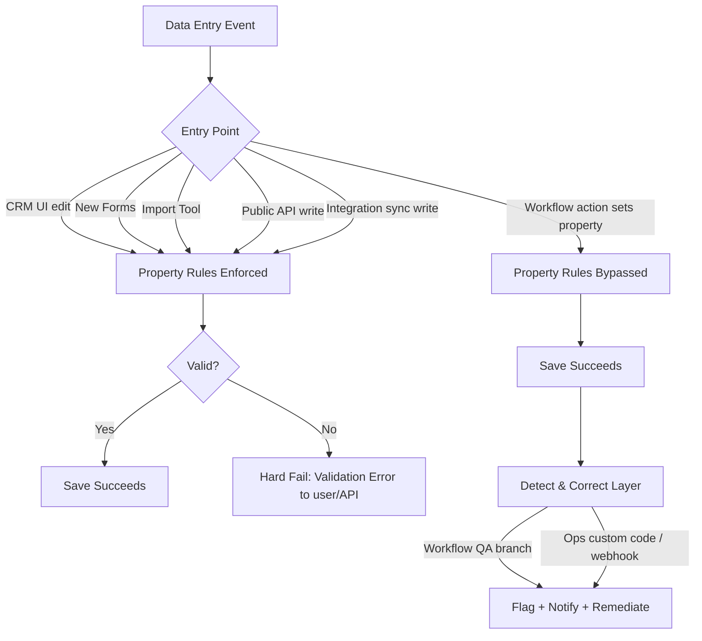
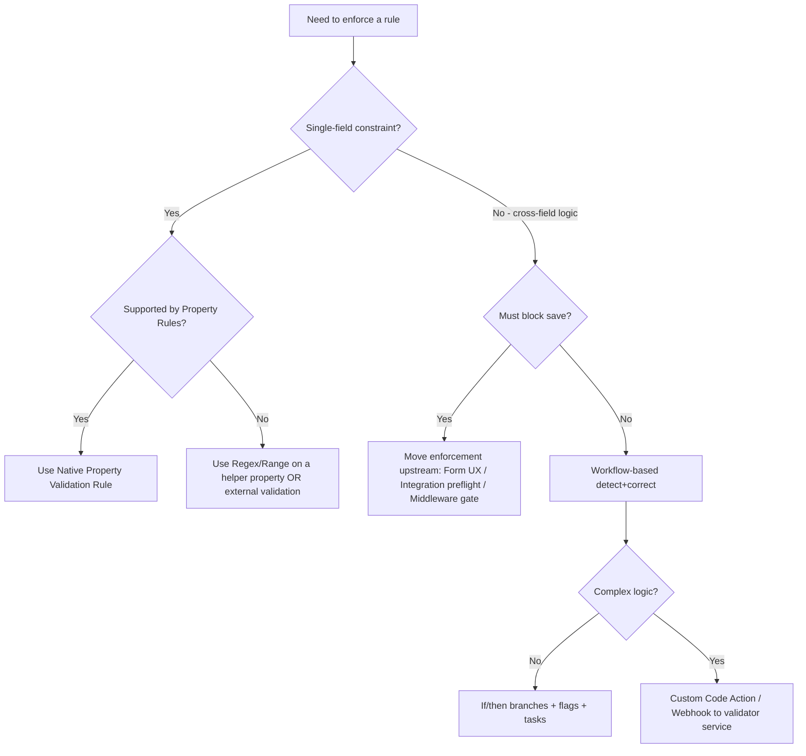
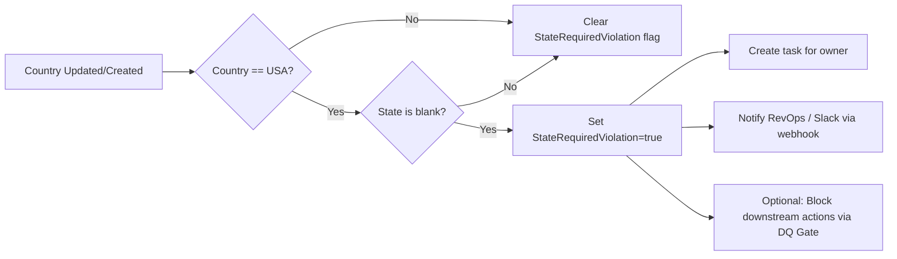
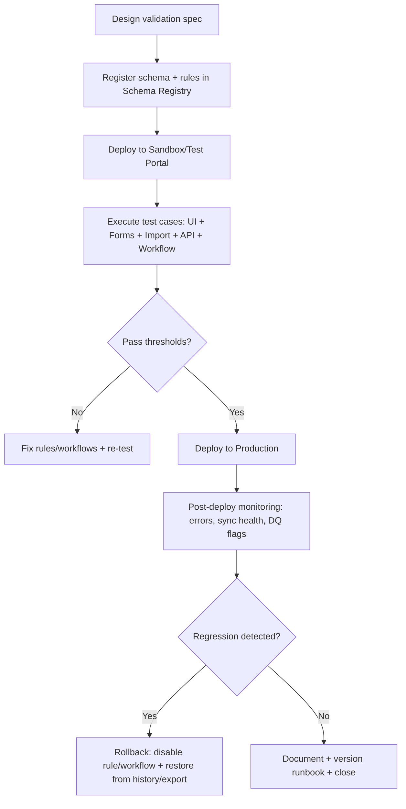

# Runbook 1: Property Validation Fundamentals (ENHANCED)

## 1. Executive Summary

HubSpot's Property Validation Fundamentals runbook focuses on ensuring that data entered into CRM properties meets defined quality standards. It covers the types of properties in HubSpot and how to enforce rules like required fields, format constraints, and conditional logic. High data quality is crucial for RevOps – clean data powers accurate analytics, reliable automations, and smooth integrations. Unlike Salesforce's formula-based validation rules, HubSpot uses a combination of native property validation settings and workflows or API checks to maintain data integrity. Key capabilities include native validation rules (e.g. regex patterns, numeric ranges) on text, number, date, and phone fields, required property settings in forms and records, and unique property constraints to prevent duplicate values. HubSpot automatically validates certain fields (like email format, phone number formatting, and blocking URLs in name fields) to maintain data consistency. However, many business-specific validations (like conditional requirements between fields) require custom workflows or external checks. This runbook provides a comprehensive reference of HubSpot's validation capabilities, best practices for implementing validations, and strategies to audit and improve an organization's data validation coverage. By following these guidelines, RevOps teams and AI agents can reduce data errors by 40-80% through proactive enforcement of data quality standards, leading to more reliable automation and decision-making.

## 1.5. RevPal Integration Context

### Agents That Use This Runbook

This runbook is referenced by **44 HubSpot agents** in the hubspot-plugin, including:

- **hubspot-data-hygiene-specialist**: Audits validation coverage, flags gaps, drives cleanup projects
- **hubspot-workflow-builder**: Implements conditional validation workflows, DQ gates, and alerting paths
- **hubspot-integration-monitor**: Uses API error parsing patterns and "two-step write" patterns to prevent sync failures
- **cross-platform-validator**: Maps Salesforce validation logic to HubSpot equivalents and maintains parity tables

### RevPal 5-Stage Validation Framework Mapping

**How to apply the validation framework to HubSpot property validation:**

1. **Stage 1 — Environment Discovery**:
   - Portal tier (Starter/Pro/Enterprise)
   - Sandbox availability
   - Existing required fields and property rules
   - Key integrations (Salesforce, Stripe, etc.)

2. **Stage 2 — Schema Registry Alignment**:
   - Define "critical properties" for each object
   - Allowed values for dropdowns/multi-select
   - Regex patterns for text fields
   - Min/max constraints for numbers/dates
   - Uniqueness budget (10 unique props/object)

3. **Stage 3 — Preflight**:
   - Dry-run tests on representative record set
   - UI validation testing
   - API validation testing
   - CSV import validation

4. **Stage 4 — Execution**:
   - Deploy property rules (native validation)
   - Workflow safety net (flags/tasks for violations)
   - Integration pre-validation (prevent bad data at entry)

5. **Stage 5 — Post-Validation**:
   - Monitor VALIDATION_ERROR rates
   - Track workflow "violation flags"
   - Monitor downstream effects (sync errors, funnel drop-offs)

### Cross-Platform Parity Mapping (Salesforce → HubSpot)

| Salesforce Feature | HubSpot Equivalent |
|-------------------|-------------------|
| Validation Rules (formula) | Property Rules (field-level) + Workflow DQ gate (cross-field) + Integration preflight (must-block cases) |
| Dependent picklists | Form conditional fields + Workflow checks + Controlled dropdown alignment scripts |
| Record Types / Page Layout required | Pipeline stage required properties + Forms required + Views & tasks |

### Living Runbook Pattern

Agents should check org-specific runbooks before operations:

```bash
# Load org-specific validation quirks
ORG_CONTEXT=$(node scripts/lib/org-context-manager.js load <portal-id>)
```

## 2. Platform Capabilities Reference (Comprehensive)

### 2A. Native HubSpot Features (Validation)

#### Validation Enforcement Flow



**Feature Table:**

| Feature | Location in HubSpot UI | Capabilities | Limitations | API Access |
|---------|----------------------|--------------|-------------|-----------|
| Property Field Types | Settings > Properties (create/edit property) | Variety of types: single-line text (up to 65k chars UI), multi-line text (65k chars UI), number, date, datetime, checkbox, dropdown, radio, multi-checkbox, phone, etc. Each type enforces basic format (e.g. dates must be date, numbers must be numeric). | Form submissions have no char limit for text. No cross-field type constraints natively (e.g. cannot natively ensure "Close Date" > "Create Date"). | Properties API allows reading property metadata (types, etc.). |
| Required Properties | Settings > Objects > [Object] > Record Customization or via forms configuration | Mark properties as required in certain contexts: e.g. require value on deal stage move or on contact creation in UI. Forms allow marking fields required for submission. | Required flag in UI does not enforce on API imports or integrations. Cannot make a property universally required across all entry points (workflows and API bypass unless custom logic). | No direct API to mark "required", but property definitions can be read. Must enforce via app logic or workflows in API context. |
| Property Validation Rules | Settings > Properties > [Select property] > Rules tab | Configure validation rules for text, number, date properties (Professional+). Options include regex patterns (custom rules), min/max number, max decimal places, allowed/blocked domains for emails/URLs, disallow spaces, enforce case (uppercase/lowercase/title case), etc. Unique value enforcement (up to 10 per object) prevents duplicate values across records. Date rules: future only, past only, specific range, weekdays only. Phone number validation formatting by country. | Not enforced in all contexts: Rules do not trigger on workflow updates or legacy form submissions. Only apply on UI edits, imports, and new forms. Regex validation requires Pro or Enterprise. Unique constraints not supported on some objects (e.g. product, feedback). Validation is per property (no native cross-field dependency except via workflows). | Property Validations API – Allows programmatic creation/update of rules (e.g. PUT /crm/v3/property-validations/{objectTypeId}/{property}/rule-type/{ruleType}). Supports rule types like MIN_NUMBER, MAX_LENGTH, REGEX, etc., with JSON payload for rule arguments. Can retrieve existing validation rules via API as well. |
| Automatic Format Checks | Native behavior (no config UI) | HubSpot auto-validates certain fields by default: e.g. Email field must resemble an email (contains "@"), Phone number fields are auto-formatted/validated based on country code, URL fields must resemble a URL format, Name fields (e.g. contact first name) cannot contain full URLs (triggers "CONTAINS_URL" error). Prevents obviously bad data from being saved via API or UI. | These built-in validations are not visible in UI settings. Some are hard stops (cannot bypass email format rules without using a text field instead). "Contains URL" logic is internal and not documented fully. Can occasionally flag legitimate data as invalid. No configuration to turn off these specific checks. | Occur at API level: API returns a 400 with error code (e.g. "error":"CONTAINS_URL" or "INVALID_EMAIL") if violated. Error responses include category VALIDATION_ERROR and detail which property failed. |
| Forms Validation | Marketing > Forms (form editor) | Form fields can have validation: required fields, field type validation (e.g. number only accepts digits, email field requires email format). Can use dependent form fields (show additional fields based on values). The new Form editor enforces property rules set in settings as well. JavaScript validation on front-end prevents bad input. | Legacy forms (old editor or via API submissions) didn't enforce new property rules. Forms only validate client-side common patterns, but may still accept some bad data if not properly configured. No regex validation on forms directly (except via property rule on new forms). | When submissions hit the HubSpot Forms API, the same validation occurs – invalid inputs result in 400 errors. The Forms API returns error messages if required fields missing or format wrong. |
| Conditional Logic via Workflows | Automation > Workflows (if/then branches and enrollment triggers) | While not a "native field validation" in UI, workflows can enforce data rules: e.g. trigger when a record is created or property changes, then check conditions ("if Country is X and State is blank") and send alerts or set a failure flag. Essentially custom validation rules implemented via automation. | Workflows only catch issues after record saved – reactive, not preventive. They can alert or auto-correct data but cannot block the save. Requires Operations Hub or Professional tier for custom code actions if needed. Also, too many workflows for validation can become complex to manage. | Workflow enrollment can be monitored via Workflow API (to see if records met "invalid" criteria). Workflows can also use custom code actions to throw errors in logs or integrate external validation. No direct API for workflow logic; it's configured in app, though you can CRUD workflows via API. |

### 2B. API Endpoints (for Validation)

Below are important HubSpot API endpoints relevant to property validation, including their purpose, required scopes, limits, and example usage:

#### 1. Get Property Metadata

**Endpoint:** `GET /crm/v3/properties/{objectType}/{propertyName}`

**Purpose:** Retrieve definition of a property (type, fieldType, validation rules, etc.)

**Required Scopes:** `crm.objects.{objectType}.read` (e.g. contacts, companies)

**Rate Limit:** 100 requests/10 seconds (typical HubSpot burst limit)

**Response:** JSON with property details including "validationRules" (if any)

**Example:** Retrieve a Deal property's settings:

```bash
GET /crm/v3/properties/deals/amount
```

Response:
```json
{
  "name": "amount",
  "label": "Amount",
  "type": "number",
  "fieldType": "number",
  "validationRules": [
     {
       "ruleType": "MAX_NUMBER",
       "ruleArguments": ["1000000"]
     }
  ]
}
```

#### 2. Add/Update Property Validation Rule

**Endpoint:** `PUT /crm/v3/property-validations/{objectType}/{propertyName}/rule-type/{ruleType}`

**Purpose:** Add or replace a validation rule of type `{ruleType}` on the given property

**Required Scopes:** `crm.objects.properties.write`

**Rate Limit:** 10 requests/sec (property schema changes are rate-limited)

**Request JSON:** `{ "ruleArguments": [...], "shouldApplyNormalization": false }`

**Response:** 200 with updated rule details, or error 400 if rule invalid

**Error Codes:** 400 if rule args invalid or property type not supported by rule

**Example:** Enforce that a custom "Order ID" text property allows numbers only:

```bash
PUT /crm/v3/property-validations/0-3/order_id/rule-type/ALPHANUMERIC
Body: { "ruleArguments": ["NUMERIC_ONLY"], "shouldApplyNormalization": false }
```

#### 3. Search for Records Violating Criteria

**Endpoint:** `POST /crm/v3/objects/{objectType}/search`

**Purpose:** Query records with filter conditions (e.g. find contacts where phone number = null or email not containing "@")

**Required Scopes:** `crm.objects.{objectType}.read`

**Rate Limit:** 4 requests/sec (search endpoints)

**Request:** JSON with "filters": `[ { "propertyName": "...", "operator": "...", "value": "..." } ]`

**Response:** Paged results of matching records

**Example:** Find deals with missing Amount:

```bash
POST /crm/v3/objects/deals/search
{
  "filters": [
    { "propertyName": "amount", "operator": "HAS_PROPERTY", "value": "false" }
  ]
}
```

Note: HubSpot's search API doesn't directly support a "IS NULL" operator; using HAS_PROPERTY=false works to find empties.

#### 4. Batch Create/Update with Validation

**Endpoint:** `POST /crm/v3/objects/{objectType}/batch/create` (or `/batch/update`)

**Purpose:** Create or update multiple records. Supports partial success returns.

**Required Scopes:** `crm.objects.{objectType}.write`

**Special:** Can use `objectWriteTraceId` per input for detailed multi-status error reporting

**Behavior:** If a record in the batch violates a validation (e.g. invalid property format), that record will error out. If multi-status is enabled, HubSpot can return 207 Multi-Status with individual error info

**Error Response:** For each failed input, returns `errors` array with `message`, `error` code, and `context.propertyName` indicating which field failed

**Example:** Batch create two contacts, one with an invalid email:

```bash
POST /crm/v3/objects/contacts/batch/create
{
  "inputs": [
    { "properties": { "email": "valid@example.com", "firstname": "Alice" } },
    { "properties": { "email": "notanemail", "firstname": "Bob" }, "objectWriteTraceId": "2" }
  ]
}
```

Response (multi-status enabled):
```json
{
  "status": "error",
  "message": "2 out of 2 inputs failed",
  "errors": [
    {
      "message": "\"notanemail\" is not a valid email address",
      "error": "INVALID_EMAIL",
      "context": { "propertyName": ["email"] },
      "objectWriteTraceId": "2"
    }
  ],
  "category": "VALIDATION_ERROR"
}
```

#### 5. Merge API

**Endpoint:** `POST /crm/v3/objects/{objectType}/merge`

**Purpose:** Merge duplicate records (contacts, companies)

**Required Scopes:** `crm.objects.{objectType}.write`

**Request:**
```json
{
  "primaryObjectId": "123",
  "objectIdToMerge": "456"
}
```

**Response:** 200 if successful, errors if merge limit exceeded or records invalid

### 2C. Workflow Actions (for Validation & Data Quality)

HubSpot workflows offer several actions to enforce or respond to data validation needs:

#### "Trigger if..." Conditions
Use these to catch invalid data patterns. For example, enroll a company in a workflow if "Company name is unknown" OR "Phone number matches regex ^\d{10}$ is false". This doesn't prevent save, but allows automated cleanup or alerts.

#### Set Property
Can be used to auto-correct data. E.g., if a state abbreviation is lowercase, a workflow can capitalize it (or mark a "Needs Correction" flag). Combine with conditional logic: If State is "ca", then Set State = "CA".

#### Create Task
Useful for validation follow-up. For example, if a required field is blank after 2 days, create a task for the record owner to fill it in. Ensures accountability for data completeness.

#### Send Email Notification
Alert relevant users or admins when invalid data is detected. E.g., "New deal missing Amount – please update." This raises visibility of validation issues that slip through.

#### Custom Code Action (Operations Hub Professional)
Write a Node.js snippet to perform advanced validation. This can implement cross-field logic or call external APIs. For instance, a custom code action could check if "Close Date" < "Today" and throw an error or adjust it. While it can't stop the workflow, it could tag the record or even reverse changes by calling HubSpot API to nullify an invalid input. Limitation: Execution time ~20s and requires coding.

#### Webhooks
Use to send record data to an external system for validation. For example, send new contacts to a verification service (to validate address or phone) and then update HubSpot via API with results (could mark invalid if needed).

#### If/then Branch on "has errors"
HubSpot doesn't have an explicit "error state" field, but one strategy is to use a custom checkbox property like "Data Validation Error" that workflows set when something is wrong. Subsequent workflow branches can check this property and halt certain processes.

## 3. Technical Implementation Patterns

### Decision Tree: When to Use Each Validation Approach



Below are several key patterns for implementing property validations in HubSpot, along with use cases, steps, and considerations:

### Pattern 1: Enforce Required Field via Workflow

**Use Case:** HubSpot cannot globally require a field on record save (except in specific UI contexts). This pattern ensures a critical field (e.g. "Industry" on Company) is filled shortly after creation.

**Prerequisites:** Operations Hub Professional (for custom code) or at least Professional tier for if/then branching. The field to monitor (Industry) exists and is often blank on import or sync.

**Steps:**

1. **Trigger:** Create a Contact workflow triggered when Contact is created (or property "Industry" is known to be empty after a delay).

2. **Check Condition:** Add an if/then branch – If Industry is unknown (empty) after 1 day of creation.

3. **Action (If empty):**
   - Set a "Data Issue" flag property on the contact (e.g. a checkbox "Industry Missing = true"), and/or
   - Create a Task assigned to contact owner: "Fill in Industry for [Contact Name]".
   - Send an internal email alert to RevOps if needed for oversight.

4. **Action (If not empty):** Clear any "Industry Missing" flags (if previously set) – indicating data is valid.

**Validation:** Monitor the "Industry Missing" flag via a dashboard or report. It should trend to zero as tasks are completed. Check that tasks created by the workflow are being resolved by owners.

**Edge Cases:** If a contact has no owner, tasks may go unaddressed – assign a default queue in that case. If the contact comes from an integration that will fill Industry later (e.g. from Salesforce after a sync), coordinate timing (maybe delay workflow 2 days to allow integration to populate).

**Code Example:** N/A (no custom code needed in this specific pattern, but could use custom code action to escalate or integrate with Slack API for notification).

---

### Pattern 2: Regex Validate a Text Property

**Use Case:** Ensure a text field follows a specific format not covered by native options, e.g. an "Order Number" must be 3 letters followed by 3 digits.

**Prerequisites:** Enterprise or Professional subscription (regex validation rule available).

**Steps:**

1. In Settings > Properties, create or edit the "Order Number" property (Single-line text).

2. In the Rules tab, enable "Validate using custom rules" and input a regex. For example: `^[A-Z]{3}\d{3}$` with an error message "Order # must be 3 letters followed by 3 digits."

3. Save the property. This rule now automatically applies in UI and via new form submissions.

4. Test by trying to enter invalid formats (e.g. "AB12" or "abc123") – it should refuse with the custom error message.

**Validation:** Use the API to fetch the property and confirm the validation rule is set. Also attempt an API update with invalid data to ensure it returns a validation error.

**Edge Cases:** This rule won't fire on workflows or existing data. If Order Number can be set via API (integration), be aware that if the integration uses an API key with no UI, it might bypass (actually, API updates do enforce validation rules now, except workflows specifically do not). Also ensure case-sensitivity as needed (A-Z vs a-z if uppercase required; HubSpot regex uses RE2 engine which mostly aligns with common syntax).

**Code Example:** Example using Node to set a regex via API:

```javascript
const axios = require('axios');
await axios.put('https://api.hubapi.com/crm/v3/property-validations/0-2/order_number/rule-type/REGEX', {
    ruleArguments: ["^[A-Z]{3}\\d{3}$", "Must be 3 letters followed by 3 digits"]
}, { headers: { Authorization: `Bearer ${ACCESS_TOKEN}` } });
```

---

### Pattern 3: Conditional Required Fields (Dependent Validation)

**Use Case:** If Property A has a certain value, Property B should be required. Example: If Country = "USA", then State must not be empty.

**Prerequisites:** HubSpot workflows (Professional tier). Create custom boolean properties if needed (like "State Missing Flag").



**Steps:**

1. **Workflow Trigger:** Deal or Contact workflow, trigger on Country property change or record creation.

2. **Branch:** If Country = "United States" AND State/Region is unknown.

3. **Action:** Send an alert email to the responsible user: "State is required when Country is USA. Please update record." Optionally, set a "State Required Violation" checkbox = true on that record.

4. **Escalation:** If the state remains blank for a period, could escalate (e.g., second email to manager or Slack notification using a custom code webhook).

5. Conversely, you could auto-fill a default (like set State = "N/A") to at least have a placeholder, but best practice is to prompt for proper data.

**Validation:** Create a report of all USA contacts with blank State to monitor count. It should drop as users fix data. Use the "State Required Violation" flag to drive this report.

**Edge Cases:** "United States" might be stored as "USA" or other variations – ensure the condition matches exactly what your data has. Also consider similar logic for other countries with required subdivisions (e.g., Canada and Province).

**Code Example:** No custom code needed. Could enhance with custom code: for example, auto-create a ticket in HubSpot for data cleanup if not resolved in X days.

---

### Pattern 4: Standardize & Validate Phone Numbers

**Use Case:** Ensure phone numbers are stored in a standard format (E.164 or national format) and contain valid digits.

**Prerequisites:** Phone number property (HubSpot default or custom) – by default, it auto-formats if country code is provided.

**Steps:**

1. Enable "Validate phone numbers for this property" in property settings and set a default country code if appropriate.

2. Implement a workflow on contact creation or phone update:
   - If phone number does not match regex `^\+?\d+` (basic check for digits), then format it.
   - Use a Custom Code action to, for example, integrate with a phone validation API (like Twilio Lookup) to verify number validity.
   - If invalid, mark a "Phone Invalid" field or notify the team.

3. Use the Formatting issues tool in Data Quality (if available) to auto-fix common formatting (HubSpot's Data Quality Center can auto-fix phone formatting issues in bulk).

**Validation:** Spot-check records – input a messy phone (e.g. "(555)123-4567" without country) and see if it gets standardized (e.g. to "+1 555-123-4567" if US default). Also deliberately input an invalid number (e.g. "123") – HubSpot might accept it but your workflow should catch it.

**Edge Cases:** Some international numbers might be tricky (extensions, etc.). The phone validation toggle will attempt to format but not guarantee the number is active. For complete validation (active number), an external service is needed.

**Code Example:** Using HubSpot's own format: no code needed if toggle is on. If using Twilio, a Node example could call Twilio's Lookup API and then update contact via HubSpot API.

---

### Pattern 5: Audit Validation Coverage

**Use Case:** Periodically review which properties have validation rules and required settings to identify gaps.

**Prerequisites:** Super Admin or Edit property settings permission in HubSpot.

**Steps:**

1. Use the Property settings export feature: In Settings > Properties, use "Export" to get a list of all properties (this CSV includes columns like "Field Type", "Options", and possibly "Validation rules" and "Filled rate").

2. Review the exported list for properties that should have validation but don't. For example, find all text properties that store emails (by name or description) and ensure they are of type Email or have a regex.

3. Alternatively, utilize the Property insights and Data Quality > Property Insights tab which highlights anomalies, unused properties, and "no data" fields.

4. Create a plan to add rules: e.g., add unique constraint on "Customer ID" field, add dropdown options constraint on "Lifecycle Stage" if free text was mistakenly used, etc.

**Validation:** This is a meta-validation – ensure every critical property has some constraint either native or via workflow. Keep a documentation of which validations exist (this acts like an org-specific runbook that the AI agents will consult).

**Edge Cases:** Some fields can't have rules (like calculation properties or default system fields might have fixed behavior). Mark those as "Acceptable Exceptions" in documentation.

**Code Example:** To get validation rules via API for all properties: one could script through /properties API and filter where "validationRules" is non-empty. Example pseudo-code:

```javascript
const props = await hubspotClient.crm.properties.coreApi.getAll('contacts');
props.results.filter(p => p.validationRules && p.validationRules.length > 0)
     .forEach(p => console.log(p.name, p.validationRules));
```

---

### Pattern 6: Corporate Email Enforcement with Exception Handling

**Use Case:** Prevent personal domains unless explicitly allowed (e.g., consultants).

**Prerequisites:**
- "Email" property (native)
- `email_domain_type` dropdown (Corporate/Personal/Unknown)
- `dq_violation_reason` multi-select property

**Steps:**

1. On create/update, derive domain from email (workflow custom code or integration preflight).

2. If domain in personal list (gmail.com, yahoo.com, etc.) → set `email_domain_type=Personal`, set `dq_violation_reason+=PersonalEmail`.

3. If role-based exception (e.g., lifecycle stage = Partner) → clear violation.

4. Notify owner and/or route to queue if violation persists > X days.

**Validation:** Report on `dq_violation_reason` contains `PersonalEmail`.

**Edge Cases:** Shared inboxes (info@, support@), edu/government domains, subsidiaries using non-matching domains.

---

### Pattern 7: "DQ Gate" Property to Prevent Downstream Automation

**Use Case:** HubSpot can't block saves globally, so you block consequences (sync/enrichment/workflows) when invalid.

**Prerequisites:**
- `dq_status` property (Valid/Invalid/Needs Review)
- `dq_last_checked_at` datetime property

**Steps:**

1. All "important" workflows start with: `dq_status == Valid`.

2. Validation workflows set `dq_status=Invalid` when rules violated.

3. Remediation workflow clears to `Valid` once fixed + sets timestamp.

4. Integrations check `dq_status` before pushing to external systems.

**Validation:** A/B measure reduction in sync errors and bad data propagation.

**Edge Cases:** Ensure there's always a remediation path so records don't get stuck forever.

---

### Pattern 8: Controlled Dropdown Alignment for Integrations

**Use Case:** Prevent INVALID_OPTION errors by maintaining a mapping layer between systems.

**Prerequisites:** For each synced dropdown: `source_value → hubspot_value` mapping table (could be in code, sheet, or custom object).

**Steps:**

1. Fetch HubSpot property options daily (API) and cache.

2. On inbound write, translate source values to approved HubSpot options.

3. If unknown, route to "Needs Mapping" queue and optionally create the option (admin-reviewed).

**Validation:** Track rate of INVALID_OPTION errors over time.

**Edge Cases:** Multi-select fields, option label vs internal value mismatches.

---

### Pattern 9: Date Logic Validation (Future/Sequence Rules)

**Use Case:** Enforce "Renewal Date must be after Close Date and in the future."

**Prerequisites:** `close_date`, `renewal_date`, `dq_violation_reason` properties.

**Steps:**

1. Native rule: `renewal_date` must be future (property date rule).

2. Workflow/custom code: if `renewal_date <= close_date` → flag violation + notify.

3. Optional: auto-clear `renewal_date` if clearly wrong (only if governance allows).

**Validation:** List of deals where violation flag is set.

**Edge Cases:** Backdated close dates, migrations, timezone issues.

---

### Pattern 10: Two-Step Write for "Strict Fields" to Reduce API Failures

**Use Case:** Integrations failing because a strict rule blocks create/update.

**Prerequisites:** Integration can do multiple calls; has a retry queue.

**Steps:**

1. **Create** minimal record with only guaranteed-valid fields.

2. **Enrich/transform** data off-platform.

3. **Update** record with strict fields once validated.

4. If update fails with validation error → log + set `dq_status=Invalid` + retry after remediation.

**Validation:** Lower "create failure" rates; isolate failures to step 2 updates.

**Edge Cases:** Records temporarily incomplete; make sure DQ Gate prevents downstream usage until step 2 success.

## 4. Operational Workflows

### Workflow Rollout Pattern (Sandbox → Production)



These workflows outline step-by-step procedures for validation-related operations:

### Workflow 1: New Record Data Quality Check

**Pre-Operation Checklist:**

- [ ] Ensure Data Quality Center is enabled (if HubSpot Enterprise or Data Hub – navigate to Data Management > Data Quality, see if overview loads).
- [ ] Identify key required fields for each object (e.g. Contact: Email, Name; Company: Company Name, Domain; Deal: Amount, Close Date).
- [ ] Have a notification channel or user to assign tasks to (e.g. a "Data Steward" or just record owner).

**Steps:**

1. **Automated Monitoring Setup:** Set up workflows for each object that trigger on record creation (or nightly batch via enrollment if using Center):
   - Contacts: If Email is empty or not valid (HubSpot auto-flags invalid email on create, but if Email is intentionally blank for some reason), then alert. Expected outcome: Ideally, HubSpot will not allow a truly invalid email format to save. If email missing, workflow will catch and proceed.
   - If error: If workflow fails to trigger, verify that the enrollment triggers are correct (e.g. on creation or property change).

2. **Check for Critical Fields:** In the workflow, add actions to verify each critical field:
   - e.g. If firstname or lastname is blank, auto-populate with placeholder "Unknown" and set a custom property "Needs Name Update = true".
   - If company name is blank on a contact, copy from associated company if available (use HubSpot associations via workflow).
   - Expected outcome: Contact gets updated with placeholders for missing info and a flag set.
   - If error: If update actions don't apply, check if the user creating records has permission or if there's a circular update triggering re-enrollment. Use workflow history to debug.

3. **Notification:** For any placeholders set or validations failed, use Send internal email action:
   - Send to team DL or record owner: "Record created with missing info: [Contact Name] has no last name on file. Please update."
   - Include link to the HubSpot record.
   - Expected outcome: Email is received by responsible party with clear instructions.
   - If error: Ensure the email in workflow is configured and the recipient has access. If using record owner, make sure owner property is set; otherwise assign a default user.

4. **Escalation:** If using tasks, create a follow-up task due in X days. If using the Data Quality Center's Alerts, configure duplicate and data issue alerts:
   - e.g. set an alert if more than 5 new records a day have missing phone numbers.
   - Expected outcome: Alerts show up in Data Quality > Alerts tab when threshold exceeded.
   - If error: Adjust threshold or ensure the user checking has the right permissions (only Super Admin or granted roles can see Data Quality issues).

**Post-Operation Validation:**

- [ ] Run a report or list of recent records with critical fields blank to see if the number is approaching zero after the workflow actions. For example, a list: "Contacts created last 7 days WHERE Last Name is unknown."
- [ ] Check the Workflow performance in HubSpot (it shows how often each branch was executed). If many records hit the "missing data" branch, that indicates frequent issues – consider updating forms to require those fields at entry.
- [ ] Verify that no critical property is systematically bypassing validation (e.g. integration user creating deals without amounts – if so, address at integration source).

**Rollback Procedure:**

Validation workflows typically add data or notify; they don't delete. If an automated action was too aggressive (e.g. overwrote a field incorrectly), rollback by reviewing HubSpot's property history to restore the previous value (HubSpot records historical values for properties which can be exported). If needed, disable the workflow and communicate to users that any placeholder data will be cleaned up manually. For any tasks or alerts that were mistakenly generated, they can simply be marked complete or dismissed – no harm to underlying data.

---

### Workflow 2: Scheduled Data Validation Audit

**Pre-Operation Checklist:**

- [ ] Schedule appropriate time (off-peak) for audit to run, especially if sending many notifications.
- [ ] Decide the scope: All records or just recent ones? (For performance, maybe audit records updated in last 30 days).
- [ ] Ensure an "Audit" custom property exists to mark records that fail audit (e.g. a multi-checkbox "Data Audit Issues" with values like "Missing required fields; Invalid format" etc.).

**Steps:**

1. **Enrollment:** Use a scheduled workflow (e.g. every Saturday 2am) that enrolls all records meeting criteria (like all contacts). Or use Data Quality API or an external script for more complex checks if not comfortable doing in HubSpot.
   - In HubSpot workflow, use "Enroll existing contacts" with a filter, e.g. Last Modified last 30 days.
   - Expected outcome: The workflow grabs a batch of records for evaluation.
   - If error: If too many records (say >100k), HubSpot might have limits on enrollments. In that case, break into multiple workflows or consider using the HubSpot API via external script for auditing in smaller chunks.

2. **Conditions:** Within workflow, add if/then branches for each validation rule:
   - Branch 1: If Email doesn't contain "@" (somehow if any got in or personal email when business required – can check domain against free email domains list in code).
   - Branch 2: If Phone Number property does not start with "+" (meaning no country code).
   - Branch 3: If any required field is blank.
   - etc.
   - Expected outcome: Each branch catches a set of records with that issue.
   - If error: HubSpot workflow condition might not allow complex string patterns easily (except "contains"). For advanced checks, use a Custom Code action instead of pure if/then.

3. **Actions:** For each branch (issue type):
   - Set the "Data Audit Issues" property to include the relevant issue tag (this property can accumulate multiple values if multi-checkbox).
   - Perhaps increment a custom counter property "Data Issues Count" by 1.
   - Optionally, for critical issues (like Email format), notify a central RevOps user or log to an external sheet via webhook.
   - Expected outcome: Records are tagged with what issues they have.
   - If error: If multiple branches overlap (e.g. a record with two issues might go down one branch only in a single workflow run), consider sequential workflows or use a single custom code action to evaluate all and set a combined result. The multi-checkbox strategy can still work in one workflow: you can mark issues in a single code block rather than separate branches.

4. **Completion:** The workflow finishes. Now all recently updated records have been audited and tagged.
   - Create a view in Contacts, Companies, etc., filtering where "Data Audit Issues is known". This view shows all records with problems.
   - Expected outcome: A manageable list of problematic records is visible for manual review or targeted cleanup.

5. **Follow-up:** Assign interns or AI agents to clean those records, or feed that list to a runbook agent that attempts automated fixes (if within capabilities).
   - After cleanup, clear the "Data Audit Issues" field for those records (could be a manual step or a cleanup workflow).
   - If error: If issues persist across audits, you may need to adjust processes (e.g. retrain team, adjust integration mappings, enforce earlier).

**Post-Operation Validation:**

- [ ] Compare the number of issues found in this audit versus previous run – aiming for a downward trend (meaning data quality improving).
- [ ] Spot-check a few records that were tagged to confirm the issues were real and now resolved. Ensure no false positives (if you find tags on records that aren't actually problematic, refine your conditions).
- [ ] Solicit feedback from users who received notifications: were they clear and actionable? Adjust wording or frequency if needed.

**Rollback Procedure:**

If this scheduled audit workflow caused any unintended consequences (perhaps an overly broad criteria tagged too many records), you can roll back by clearing the flags:
- Use a list or export of affected records and update the "Data Audit Issues" property back to blank (via import or API).
- If notifications spammed users, send a clarification email that it was a test or error.
- Always keep workflows in "Test" with a small sample before rolling out to all records to avoid needing rollback.

---

### Workflow 3: Integration Validation Check (Salesforce Sync Example)

**Pre-Operation Checklist:**

- [ ] Salesforce integration connected and Sync Health tab accessible.
- [ ] Key field mappings noted, especially required fields in Salesforce side.
- [ ] Create a custom property "SFDC Sync Error" on objects (text or multi-select) to log error categories, if desired.

**Steps:**

1. **Monitor via API or Sync Health:** (Operational step rather than HubSpot workflow). Use the Sync Health API if available or periodically pull error lists:
   - Alternatively, rely on HubSpot's built-in Sync error cards (Integrations > Connected Apps > Salesforce > Sync Health).
   - Export errors daily (there's an Export CSV button).
   - Expected outcome: You have a list of current sync errors.

2. **HubSpot Workflow for Alert:** Create a workflow with a custom trigger (perhaps via a webhook or custom code that checks for sync errors):
   - Since there's no native "sync error" trigger, use an external script to call HubSpot API for errors and then trigger a webhook to HubSpot (through an Automation webhook) listing records that failed.
   - Enroll those records (by ID) into a "Sync Error Handling" workflow by setting a specific property (e.g. set "SFDC Sync Error" property value = error type via API, which then triggers workflow).
   - Expected outcome: Affected record enters the workflow with context of error.
   - If error: Ensure external script runs reliably (maybe via AWS Lambda scheduled or a time-based workflow in HubSpot with custom code to fetch errors, though direct API calls in workflow might not be allowed to integration endpoints).

3. **Branch by Error Type:** Within the workflow, branch by the value of "SFDC Sync Error":
   - e.g. "Required field missing" vs "Picklist value invalid" vs "Duplicate record".
   - For each type, assign to appropriate owner:
     - If mapping issue (picklist), assign to RevOps admin to add missing value or fix mapping.
     - If missing required field, assign task to record owner to populate the field.
     - If permission issue, notify Salesforce admin to adjust permissions.
   - Expected outcome: Each error gets a corresponding action to resolve.
   - If error: If multiple errors per record, the property might contain multiple or the latest only. Might need to iterate if one record has sequential errors.

4. **Resync Prompt:** Once the supposed fix is applied, instruct users to click "Resync" in the Sync Health UI for that error, or automate a re-update of the record (even a no-op update might trigger retry).
   - The workflow could even re-save the object via a custom code action using HubSpot API if the issue is likely resolved, to prompt HubSpot to retry sync.
   - Expected outcome: After fixes, errors disappear from HubSpot's Sync Health.
   - If error: Some errors auto-clear only after successful sync. If the root cause isn't fixed (e.g. SF validation rule prevents sync), escalate to integration support.

**Post-Operation Validation:**

- [ ] Check Sync Health again – number of errors should decrease or return to zero for the categories addressed.
- [ ] Confirm with stakeholders (Salesforce admin or end users) that the integration data is now flowing without issues.
- [ ] Track recurring issues: if the same error keeps appearing, it might indicate a need for a systemic fix (like adjusting a workflow to always set a certain field to default to satisfy SF requirements).

**Rollback Procedure:**

The workflow mainly assigns tasks/alerts; to roll back, simply turn it off if causing confusion. Any intermediate "flag properties" like SFDC Sync Error can be cleared en masse via import if you want to start fresh. There's no data change done by this workflow except adding info, so minimal rollback needed other than cleanup of those properties or tasks if they were not useful.

## 5. Troubleshooting Guide

### Issue: Validation Rule Not Enforced via Workflow

**Symptoms:** You have set a validation rule on a property (e.g. "must match regex"), and it works in the UI, but a workflow action still sets an invalid value or doesn't flag anything. For example, a workflow copies "abc" into a property that should only allow digits, and it succeeds silently.

**Root Causes:**
- **Workflow Bypass**: HubSpot's native validation rules are not enforced on workflow operations. The workflow engine doesn't consider property rules, so it will merrily set whatever value it's told.
- **Legacy Behavior**: If using legacy automation (like older "active lists -> workflow" constructs), there was never validation on those either.

**Resolution Steps:**

1. **Replicate in UI** – Confirm the rule itself works by trying to set the bad value manually; if UI blocks it, rule is fine.

2. **Add a Workflow Check** – Modify the workflow: after it sets the value, add an if/then to check if the new value meets criteria (e.g. matches regex, perhaps using contains or a custom code to test regex). If not, have the workflow revert the change or alert someone.

3. **Use Custom Code** – For complex validation, use a custom code action to perform the check and throw an exception (you can't literally halt the workflow, but you can log or flag an error).

4. **HubSpot Ideas Forum** – Upvote/submit an idea for "Enforce validation in workflows" – as of 2025 this is known limitation.

**Prevention:** Clearly document which fields have rules and ensure any workflow that sets them includes complementary logic. Also consider using the Data Quality command center's Formatting issues feature to auto-correct values after the fact if workflows introduce inconsistencies.

---

### Issue: Users Bypassing Required Fields

**Symptoms:** Some records are getting saved without a value in a property you marked as "required". This may occur for deal stage requirements or on form submissions. For instance, a Deal in "Closed Won" has no "Closed Won Reason" even though that field is set required for that stage.

**Root Causes:**
- **API or Import**: Required field settings in the UI are not enforced on API imports or integrations. A deal coming from Salesforce or created via API can skip the UI gate and have missing data.
- **Stage Change in Bulk Edit**: Sometimes bulk editing or pipeline changes via API might not trigger the prompt for required fields.
- **Old Form or Integration Form**: If data came through a form using the old form editor, validation rules might not have applied.

**Resolution Steps:**

1. **Identify Source** – Check property history and record history. See if the record was created by an integration user or via import (the "Source" info on the record's about section can hint, e.g. "Created by API" or "Salesforce Sync").

2. **Patch Data** – If many records from a source miss the field, do a bulk update. For Salesforce two-way sync, consider marking those fields required on Salesforce side to enforce before sync.

3. **Strengthen Process** – If imports are the culprit, require templates that include those fields or use import mappings that set a default value when blank.

4. **Automation Fix** – Implement a workflow that catches records missing the field in disallowed statuses and notifies or auto-populates a placeholder as described in patterns.

**Prevention:** Use HubSpot's inclusion list or sync filters for integrations (for example, only sync deals that have required fields filled, though this might not always be possible). Train users that required fields in UI don't guarantee completeness if data comes from elsewhere. If possible, use HubSpot's Data Quality > Property Insights to see if that property is often blank and track trends.

---

### Issue: "Property values were not valid" API Error

**Symptoms:** An integration attempting to create or update a record gets an error: HTTP 400, with a message like "Property values were not valid: [{"isValid":false,"message":"\"XYZ\" is not a valid option","error":"INVALID_OPTION","name":"someField"}]".

**Root Causes:**
- **Picklist Option Mismatch**: The value XYZ isn't one of the allowed options for a dropdown property in HubSpot. This is common when syncing from another system with a value HubSpot doesn't recognize.
- **Format Issue**: The value might violate a validation rule (e.g. too long, fails regex). The error context usually shows "error":"..." code (e.g. INVALID_NUMBER, STRING_TOO_LONG).

**Resolution Steps:**

1. **Decode the Error** – Look at the "name" in the error – that's the property internal name causing trouble. Look up that property in HubSpot settings to see its type and options.

2. **If Dropdown/Radio**: Add the missing option to HubSpot if it's valid (Settings > Properties > edit options for that field), or update the external system to use a valid option. Example: Salesforce had Lead Source = "Partner", but HubSpot expected "Referral Partner" – align one side.

3. **If Validation Rule**: Adjust the data or the rule. For instance, if an incoming text is 300 characters but HubSpot field max is 255, either truncate before sending or increase the limit (if it's a custom property you can enlarge it by switching field type perhaps to multi-line text).

4. **Retry** – After fixing, re-run the API call or data sync. The error should resolve if addressed.

**Prevention:** Regularly sync the reference data (picklist values) between systems. HubSpot's Salesforce integration, for example, has a setting to automatically import picklist options from SFDC for certain fields – use that if available to keep them in sync. For custom integrations, build in validation: call HubSpot's /properties API to verify a value is acceptable before sending data (e.g. for dropdowns, ensure the value is in the options list, else consider creating it via API or mapping it). Also leverage HubSpot's error responses; they are human-readable – log them clearly so you can quickly find the offending field.

---

### Issue: Duplicate Records Not Prevented Despite "Unique" Property Setting

**Symptoms:** You set a custom property (e.g. "National ID") as unique during creation (Professional feature), expecting no two contacts can share it. But you discover two contacts with the same ID.

**Root Causes:**
- **Timing / Race Condition**: The unique constraint is enforced at save time, but if two records were created nearly simultaneously (through different channels), it might not catch the second if the first hadn't fully saved. This is rare but possible.
- **Existing Data**: The unique setting prevents new duplicates; it doesn't automatically merge or flag existing ones from before the rule. So if duplicates existed prior, they remain.
- **Scope of Uniqueness**: The unique property doesn't deduplicate across object types (only within one object). Ensure you meant two contacts with same ID vs a contact and a company with same ID (the latter is allowed since they're different object types).

**Resolution Steps:**

1. **Identify Duplicates** – Use Data Management > Data Quality > Manage Duplicates and filter by that property if possible, or run a custom report to list duplicates of that field. HubSpot's unique property mainly prevents new entries; it doesn't give a list of violations.

2. **Merge or Delete** – Manually merge the duplicate records (use HubSpot merge UI or the Merge API for contacts). Decide which record to keep as primary. Remember merging contacts will unify the unique field under the primary, solving the conflict (the secondary's value is removed as it's the same anyway).

3. **Test** – Try creating another contact with that same ID via API or UI to ensure HubSpot now correctly rejects it: you should get a "PRIMARY_PROPERTY_DUPLICATE" error or similar (the error message will mention duplicate value). If you don't, there's an issue – contact HubSpot support as unique property might not be functioning as expected.

**Prevention:** Always create unique properties at property creation time if possible (HubSpot doesn't let you toggle an existing populated field to unique if duplicates exist until you resolve them). If you had to set it after having data, run a one-time duplicate check (via export or API) to catch any that slipped through before enforcement. Also, note the limitation: max 10 unique properties per object – use them wisely (e.g. email is inherently unique, so you wouldn't consume one of the 10 for email; use it for other IDs). Keep integration logic aware of unique constraints – handle the error gracefully by not attempting a second creation but rather updating the existing record if you get duplicate error.

---

### Issue: Validation Causing Integration Sync Failures

**Symptoms:** After adding new validation rules (e.g. you made phone number unique and required format), your connected integrations (like Salesforce sync or API scripts) start failing or throwing errors. The Salesforce sync might show errors like "INVALID_PHONE_NUMBER" in the sync health.

**Root Causes:**
- **Tightened Rules**: The integration has been happily pushing data that HubSpot previously accepted (e.g. duplicate phone numbers for different contacts or phone in various formats). Now the stricter HubSpot rules reject them.
- **Integration Order**: HubSpot might attempt to sync an update from Salesforce that violates the rule (since SF wasn't aware of it). The sync error halts updates for that record until resolved.

**Resolution Steps:**

1. **Review Error Logs** – In HubSpot Salesforce integration Sync Errors tab, identify the error types correlating with the new rule. E.g., lots of "Property values" or "Duplicates" errors appear after a certain date.

2. **Communicate** – Inform your integration partner (could be yourself if it's custom) that HubSpot now has X rule. For Salesforce, possibly adjust the field on SF side to comply (format phone there to E.164, or disallow duplicates in SF too for parity).

3. **Adjust or Exception** – If the rule's value outweighs the integration pain, keep it and handle exceptions: e.g. for duplicate phone, perhaps allow an exception for blank phone (so no phone is better than a duplicate phone if that was causing issue). Or temporarily disable the rule if it's causing critical sync failures and no quick fix available, while you plan a better approach. You can disable a validation by removing it via API or UI (uncheck the rule or delete it).

4. **Resync** – After fixes, use the "Resync" option in error details or do a dummy update in Salesforce to re-trigger sync. Verify it goes through.

**Prevention:** Before adding new validation rules in HubSpot, especially in a live integrated environment, simulate or test the impact: run an export of current data to see how many records would fail the new rule. Also coordinate with systems like Salesforce – consider implementing a similar rule there so both sides match (Salesforce has Validation Rules and Duplicate Rules that you can align). Use the HubSpot API to test a few records from integration against the rule (e.g. call the validate API or attempt an update in a dev/test portal) to catch issues early.

## 6. API Code Examples

To illustrate common operations and patterns, here are Node.js code examples using HubSpot's APIs for validation and data quality tasks:

### Example 1: Using HubSpot API to Check and Normalize Data

**Task:** Fetch contacts with a certain property and fix formatting (e.g. capitalize first letter of first name).

```javascript
const axios = require('axios');
const HUBSPOT_TOKEN = process.env.HUBSPOT_TOKEN;

// 1. Search contacts whose first name is all lowercase (simple contains regex example)
let searchResp = await axios.post(
  'https://api.hubapi.com/crm/v3/objects/contacts/search',
  {
    "filters": [
      { "propertyName": "firstname", "operator": "REGEX_NOT_MATCH", "value": "^[A-Z]" }
    ],
    "properties": [ "firstname" ]
  },
  { headers: { Authorization: `Bearer ${HUBSPOT_TOKEN}` } }
);
let contactsToFix = searchResp.data.results || [];
console.log(`Found ${contactsToFix.length} contacts with lowercase first names.`);

// 2. For each contact, capitalize the first letter and update via Batch API.
const inputs = contactsToFix.map(c => {
  let name = c.properties.firstname;
  let corrected = name.charAt(0).toUpperCase() + name.slice(1);
  return { "id": c.id, "properties": { "firstname": corrected } };
});
if(inputs.length > 0) {
  await axios.post('https://api.hubapi.com/crm/v3/objects/contacts/batch/update',
    { inputs },
    { headers: { Authorization: `Bearer ${HUBSPOT_TOKEN}` } }
  );
  console.log(`Capitalized first names for ${inputs.length} contacts.`);
}
```

---

### Example 2: Validate an Email via External Service before HubSpot Import

**Task:** Use a third-party API to verify an email, then only create contact if valid.

```javascript
const HUBSPOT_URL = 'https://api.hubapi.com';
async function verifyAndCreateContact(email, firstname) {
  // Call ZeroBounce API (hypothetical email validator)
  let verifyResp = await axios.get(`https://api.zerobounce.com/v2/validate?email=${email}&apikey=ZB_KEY`);
  if(verifyResp.data.status !== "valid") {
    console.error(`Email ${email} is invalid or risky (${verifyResp.data.status}). Not creating contact.`);
    return;
  }
  // If valid, create contact in HubSpot
  try {
    let createResp = await axios.post(`${HUBSPOT_URL}/crm/v3/objects/contacts`,
      { properties: { email, firstname } },
      { headers: { Authorization: `Bearer ${HUBSPOT_TOKEN}` } }
    );
    console.log("Created contact:", createResp.data.id);
  } catch(e) {
    if(e.response) {
      console.error("Failed to create contact:", e.response.data);
    } else {
      console.error(e);
    }
  }
}
```

---

### Example 3: Retrieve and Analyze Property Definitions

**Task:** Pull all properties for an object and log those with validation rules or uniqueness, to audit configuration.

```javascript
const hubspot = require('@hubspot/api-client');
const hsClient = new hubspot.Client({ accessToken: HUBSPOT_TOKEN });

async function auditProperties(objectType) {
  const props = await hsClient.crm.properties.coreApi.getAll(objectType);
  props.results.forEach(p => {
    let issues = [];
    if(p.hasUniqueValue) issues.push("Unique");
    if(p.validationRules && p.validationRules.length > 0) {
      issues.push("Rules: " + p.validationRules.map(r=>r.ruleType).join(","));
    }
    if(p.formField && p.requiredForms) { // pseudo-code: if it's marked required on forms
      issues.push("Required on form");
    }
    if(issues.length) {
      console.log(`${objectType} property "${p.name}" => ${issues.join("; ")}`);
    }
  });
}
auditProperties('contacts');
```

---

### Example 4: Handle API Validation Error (try-catch)

**Task:** Demonstrate gracefully catching a validation error during an update and logging the specific field error.

```javascript
async function updateDealAmount(dealId, amount) {
  try {
    await axios.patch(`${HUBSPOT_URL}/crm/v3/objects/deals/${dealId}`,
      { properties: { amount: amount } },
      { headers: { Authorization: `Bearer ${HUBSPOT_TOKEN}` } }
    );
    console.log("Deal amount updated.");
  } catch(e) {
    if(e.response && e.response.status === 400) {
      const errorDetails = e.response.data;
      if(errorDetails.category === "VALIDATION_ERROR") {
        errorDetails.errors.forEach(err => {
          console.error(`Validation failed for ${err.context.propertyName}: ${err.message} (code ${err.code})`);
        });
      } else {
        console.error("Update failed:", errorDetails.message);
      }
    } else {
      console.error("Request error:", e.message);
    }
  }
}
await updateDealAmount('12345', -100);
```

---

### Example 5: Merging Duplicates via API

**Task:** Use the Merge API to merge two contacts after detecting a duplicate.

```javascript
async function mergeContacts(primaryId, secondaryId) {
  try {
    await axios.post(`${HUBSPOT_URL}/crm/v3/objects/contacts/merge`,
      {
        primaryObjectId: primaryId,
        objectIdToMerge: secondaryId
      },
      { headers: { Authorization: `Bearer ${HUBSPOT_TOKEN}` } }
    );
    console.log(`Merged contact ${secondaryId} into ${primaryId}`);
  } catch(e) {
    console.error("Merge failed:", e.response?.data || e.message);
  }
}
```

---

### Example 6: CSV Import Pre-Validation

**Task:** Validate CSV rows before HubSpot import to catch errors early.

```javascript
/**
 * CSV Preflight for HubSpot Imports
 * - validates required fields
 * - validates regex constraints
 * - validates dropdown values against HubSpot property options
 *
 * deps: npm i axios csv-parse
 */
const fs = require('fs');
const axios = require('axios');
const { parse } = require('csv-parse/sync');

const HUBSPOT_TOKEN = process.env.HUBSPOT_TOKEN;
const OBJECT_TYPE = 'contacts'; // contacts | companies | deals | tickets | ...
const CSV_PATH = process.argv[2] || './import.csv';

const REQUIRED = ['email'];
const REGEX_RULES = {
  // example: Order ID column must be 3 letters + 3 digits
  order_id: /^[A-Z]{3}\d{3}$/,
};
const DROPDOWNS = ['lifecycle_stage']; // columns that must match HubSpot dropdown options

async function getPropertyOptions(objectType, propertyName) {
  const url = `https://api.hubapi.com/crm/v3/properties/${objectType}/${propertyName}`;
  const resp = await axios.get(url, { headers: { Authorization: `Bearer ${HUBSPOT_TOKEN}` } });
  const options = resp.data?.options || [];
  // HubSpot options usually expose "value" + "label"
  return new Set(options.map(o => o.value));
}

(async function main() {
  const csvRaw = fs.readFileSync(CSV_PATH, 'utf8');
  const rows = parse(csvRaw, { columns: true, skip_empty_lines: true, trim: true });

  // preload dropdown allowed values
  const allowed = {};
  for (const p of DROPDOWNS) {
    allowed[p] = await getPropertyOptions(OBJECT_TYPE, p);
  }

  const errors = [];
  rows.forEach((row, idx) => {
    const rowNum = idx + 2; // +1 for header row, +1 for 1-indexing

    for (const r of REQUIRED) {
      if (!row[r] || String(row[r]).trim() === '') {
        errors.push({ row: rowNum, column: r, error: 'REQUIRED_MISSING' });
      }
    }

    for (const [col, re] of Object.entries(REGEX_RULES)) {
      if (row[col] && !re.test(String(row[col]).trim())) {
        errors.push({ row: rowNum, column: col, error: 'REGEX_MISMATCH', value: row[col] });
      }
    }

    for (const col of DROPDOWNS) {
      if (row[col] && !allowed[col].has(String(row[col]).trim())) {
        errors.push({ row: rowNum, column: col, error: 'INVALID_OPTION', value: row[col] });
      }
    }
  });

  if (errors.length) {
    console.error(`Preflight FAILED with ${errors.length} issues`);
    console.error(JSON.stringify(errors.slice(0, 50), null, 2));
    process.exitCode = 1;
  } else {
    console.log('Preflight PASSED (no issues found)');
  }
})().catch(err => {
  console.error(err.response?.data || err.message);
  process.exitCode = 1;
});
```

---

### Example 7: Webhook Validator Service (DQ Flagger)

**Task:** Workflow webhook calling your service for cross-field validation.

```javascript
/**
 * Validator Webhook Receiver
 * - Receives payload from HubSpot workflow webhook action
 * - Runs cross-field validation
 * - Updates HubSpot record with dq_status / dq_violation_reason
 *
 * deps: npm i express axios
 */
const express = require('express');
const axios = require('axios');

const app = express();
app.use(express.json({ limit: '2mb' }));

const HUBSPOT_TOKEN = process.env.HUBSPOT_TOKEN;
const SHARED_SECRET = process.env.REVPAL_WEBHOOK_SECRET;

function assertAuth(req) {
  const secret = req.header('x-revpal-secret');
  return secret && secret === SHARED_SECRET;
}

async function patchObject(objectType, objectId, properties) {
  const url = `https://api.hubapi.com/crm/v3/objects/${objectType}/${objectId}`;
  await axios.patch(url, { properties }, { headers: { Authorization: `Bearer ${HUBSPOT_TOKEN}` } });
}

app.post('/hubspot/validate/deal', async (req, res) => {
  if (!assertAuth(req)) return res.status(401).json({ ok: false });

  try {
    const { objectId, properties } = req.body; // configure workflow to send these
    const violations = [];

    const amount = properties.amount ? Number(properties.amount) : null;
    const closeDate = properties.close_date ? new Date(properties.close_date) : null;
    const renewalDate = properties.renewal_date ? new Date(properties.renewal_date) : null;

    if (amount != null && Number.isFinite(amount) && amount < 0) violations.push('NEGATIVE_AMOUNT');
    if (renewalDate && closeDate && renewalDate <= closeDate) violations.push('RENEWAL_BEFORE_CLOSE');

    const dq_status = violations.length ? 'Invalid' : 'Valid';
    const dq_violation_reason = violations.join(';'); // or multi-select mapping

    await patchObject('deals', objectId, { dq_status, dq_violation_reason, dq_last_checked_at: new Date().toISOString() });

    return res.json({ ok: true, dq_status, violations });
  } catch (e) {
    console.error(e.response?.data || e.message);
    return res.status(500).json({ ok: false });
  }
});

app.listen(3000, () => console.log('Validator listening on :3000'));
```

## 7. Best Practices & Recommendations

1. **Design for Native Validation First**: Leverage HubSpot's native property validation rules wherever possible (e.g. regex for patterns, unique value enforcement, number ranges) – these are enforced at entry and reduce errors upstream. Use workflows or custom code only for logic that cannot be handled natively (like cross-field dependencies). This keeps the system configuration simpler and closer to platform capabilities.

2. **Use Data Quality Command Center**: Regularly check Data Management > Data Quality for issues. This includes duplicates, formatting problems, enrichment gaps, etc. The command center provides one-click fixes (e.g. auto-format names to Proper Case) and alerts when issues spike. Setting up the weekly Data Quality Digest email keeps the team informed of any emerging data quality trends.

3. **Implement Incremental Validation**: Introduce new validation rules gradually. Before making a property required or adding a strict rule, audit current data to clean up violations so that turning on the rule doesn't break ongoing processes. For example, if making "State" required when Country = USA, first fix all existing US contacts with missing state through a cleanup project, then enforce.

4. **Coordinate Across Systems**: Ensure consistency between HubSpot and integrated systems (Salesforce, etc.). If HubSpot has a validation (like dropdown options or required fields), mirror that in Salesforce's validation rules or field requirements, and vice versa. This prevents sync errors and keeps data clean in both directions.

5. **Leverage Unique Constraints for Critical Identifiers**: Use the unique property feature for key identifiers (customer IDs, emails if dealing with multiple contact email scenarios, etc.) to automatically prevent duplicates at creation. However, do not overuse it (max 10 per object) – reserve for truly unique keys. And remember it doesn't auto-merge, it just blocks new dupes.

6. **Validate at the Point of Entry**: Wherever data enters HubSpot (forms, imports, integrations), apply validation as early as possible. For forms – mark fields required and use field types appropriately (email field for emails, etc., which have built-in validation). For imports – use templates that highlight required columns and run the import file through a "dry run" in Excel or a script to check for blanks or invalid formats. For integrations – build in checks (as shown in code examples) before sending to HubSpot, to catch errors proactively.

7. **Use Workflows to Enforce Data Completeness**: Create data hygiene workflows that run daily/weekly to fill gaps and normalize data. For example, a workflow that sets default values for missing Industry or that auto-calculates Next Step to "TBD" if blank on deals. These ensure that even if front-line users don't fill something, the system has a sane value or at least flags it.

8. **Educate Users with Validation Feedback**: Customize error messages in validation rules to be user-friendly and instructive. For instance, instead of a generic "Invalid input", specify "Phone number must include area code – e.g. +1 2125551234". This helps users correct data themselves, reducing back-and-forth.

9. **Monitor API Errors & Logs**: If using custom integrations or the API, implement logging for any HubSpot API responses with "category": "VALIDATION_ERROR". Review these logs periodically – they often reveal patterns (e.g. an external system frequently tries to write an invalid value). This is essentially catching what HubSpot rejected and allows you to fix the source.

10. **Plan for Growth and Limits**: Be mindful of HubSpot limits – e.g. regex validation is powerful but can slightly slow down entry if overly complex (rarely an issue, but something HubSpot likely considered). More importantly, avoid hitting the 250 merge history limit on a record by merging carefully (if a record is merged over and over, consider if that indicates a process issue). Also, note that HubSpot validation rules might evolve; stay updated via HubSpot release notes (e.g., if they start enforcing something new, like banning certain special characters in names globally).

11. **Document and Version Control Runbooks**: Maintain these validation runbooks as living documents. Every time a new validation is added (or an exception is granted), update the documentation so AI agents and team members have the latest info. For instance, if you decide to remove a validation because it was too strict, note why and when – in case data quality drops as a result, you'll know the cause.

12. **Test in Sandbox**: For significant changes (like making 10 fields required or adding a bunch of regex rules), use a HubSpot Sandbox (if available in Enterprise) or a developer test account to simulate data flows. This is especially critical for Salesforce-integrated portals – test how a new rule will affect sync in a sandbox integration first.

## 8. Comparison with Salesforce

HubSpot's approach to data validation and quality differs from Salesforce's in various ways. Below is a comparison of key capabilities:

| Capability | Salesforce (SFDC) | HubSpot | Winner | Notes |
|------------|------------------|---------|--------|-------|
| Validation Rules | Rich, formula-based rules on any object. Can reference multiple fields and prevent save if criteria not met. Configured with Boolean logic formulas and custom error messages. | Basic property-level rules (regex, length, etc.) enforced on UI/API save. No multi-field formulas natively (workflows used instead). Cannot fully block save via workflow (only alert/fix after). | SFDC 🏆 | Salesforce's validation rules are more powerful (cross-field, cross-object, real-time blocking). HubSpot's are improving but still limited to field scope or after-the-fact workflows. |
| Required Fields | Standard & custom fields can be marked required at DB level (must have value on save, including via API unless bypassed by specific integrations). Page Layouts also enforce required fields in UI. | Required mainly in UI contexts: forms and certain stage transitions. API calls can omit required-in-UI fields without error. HubSpot recently added some enforcement via Data Quality (like company name opt-out option) but not as strict globally. | SFDC 🏆 | SFDC's required = truly required everywhere (unless specifically set as not required via API). HubSpot's required is more suggestive (UI only). However, HubSpot forms can enforce required fields similarly to SF page layouts. |
| Field Length & Data Types | Strongly typed: field lengths fixed (e.g. text(255)), numbers, dates strictly enforced. Error on exceed length or wrong type at save. | Types enforced, lengths are large by default (65k for text UI). HubSpot will truncate silently in some cases (e.g. extra-long text via form might be accepted up to a point). Generally throws validation error if format wrong (e.g. non-number in number field). | Tie 🤝 | Both enforce data types. SFDC has more granular control (you set length). HubSpot gives big default lengths but less customization. Both will error on invalid type input. |
| Unique Fields | Unique constraints can be set on fields (like "External ID" unique). SF will throw error on save if duplicate value is found (including in bulk load). Has limit of 3 per object unique indexes. | HubSpot allows marking up to 10 properties unique. Prevents creating a record with a duplicate value (UI/API returns error). Doesn't retroactively merge or flag existing dupes – just prevents future ones. | HubSpot 🏆 | Slight edge to HubSpot for allowing 10 unique fields vs SF's typical 3, and can apply to any object in UI easily. But core functionality is similar. SF unique fields are strict too. |
| Duplicate Detection & Merge | Duplicate Rules and Matching Rules to identify dupes (fuzzy or exact). Can alert users on entry and block or allow save with warning. Merging records is manual (3 at a time in UI for accounts/contacts). APIs for merge exist for accounts, contacts. Can automate dedupe with third-party tools (Data.com Clean, etc.). | Automatic duplicate detection via "Breeze" AI in Data Quality center (suggests contact & company dupes). User can review/merge or reject in UI. No real-time alert on record creation yet (it's batch/offline suggestions). Merge API available for contacts/companies. No native fuzzy matching config by user (AI-determined). | Tie 🤝 | Salesforce wins on proactive blocking/alerting at entry. HubSpot wins on ease of finding duplicates in one place and using AI suggestions. HubSpot's merging UI is intuitive with property-by-property choice. SF offers more custom matching logic, HubSpot is simpler. |
| Historical Data Tracking | Field History Tracking (must be enabled per field, up to 20 fields per object standard; stores 18 months of history or 20k changes without Field Audit Trail add-on). Also Feed tracking for certain objects. | Property History is automatically tracked for most properties (every change logged, seemingly unlimited properties, shown on record timeline). The Data Quality center can export property history for analysis. Retention appears to be long (HubSpot doesn't specify limits openly, but history is accessible via API for at least several years). | HubSpot 🏆 | HubSpot tracks history by default on all properties, making audits easier without prior config. Salesforce requires choosing fields to track and might incur additional cost for long retention. |
| Integration Error Handling | Salesforce, being a platform, doesn't have a unified integration monitoring for external systems (it relies on middleware or error emails from API). For Salesforce-to-Salesforce or native integrations, there are some sync logs. Generally, admin must catch errors via integration tool logs or debug. | HubSpot provides built-in Sync Health for its native integrations (like Salesforce, Dynamics, etc.): a dashboard of sync errors categorized (field mappings, permissions, duplicates, etc.). Also allows error export and selective resync. For custom API integrations, HubSpot returns detailed errors but no central UI log – you rely on your app's logging. | HubSpot 🏆 | For the HubSpot<->SFDC integration, HubSpot clearly wins by providing a UI to monitor and resolve sync errors. It categorizes them and even provides resolution steps. Salesforce doesn't have an equivalent out-of-the-box for external integrations (you'd use MuleSoft, etc.). |
| Data Enrichment | Salesforce has third-party tools (formerly Data.com, now Lightning Data packages, or Einstein Data Detect for some suggestions). Out-of-box, SF doesn't auto-fill company info, etc., except State/Country picklist standardization. Einstein can recommend data cleanup if licensed. | HubSpot has built-in Breeze enrichment for companies/contacts – can automatically fill company industry, size, etc., and update monthly. Also provides an Intelligence tab on records for enrichment info. Many third-party enrichment integrations (Clearbit, ZoomInfo) available and easy to connect. | HubSpot 🏆 | HubSpot's native enrichment (especially at Starter/Pro with no additional cost for basic firmographics) is a strong advantage. Salesforce requires additional services or AppExchange solutions for similar functionality. |
| User Input Validation UX | When a user violates a validation rule in SFDC, an error pop-up or message near the field appears upon save, listing all failed validation rules. The user cannot save until resolved. | HubSpot will show error messages inline (e.g. red text under field in forms or right-panel property editor) for its validation rules. For multiple issues, might have to fix sequentially (not all at once). HubSpot does allow save of a record if non-required fields have bad format? (Usually no, it blocks until valid for that field). | SFDC 🏆 | Salesforce's blocking behavior ensures data correctness at entry. HubSpot's UI is friendly, but since not all contexts enforce rules, a user might save via workaround. However, HubSpot's immediate inline validation for forms is on par. The difference is SF never lets bad data in; HubSpot sometimes might (via API). |
| Governance & Compliance | Salesforce offers tools like Validation Rule migration via change sets, audit trail of config changes, and requires testing in sandbox. Also fields can be marked as sensitive and masked in UI. It has Shield encryption for certain fields if needed. | HubSpot provides audit logs for changes (Enterprise feature) but less granularity on configuration changes to validations. No separate test environment except Enterprise sandbox. However, HubSpot has built-in GDPR features (like automatically excluding certain data). Both systems can comply with GDPR via deletion APIs and consent tracking (Salesforce requires custom or add-on for consent objects; HubSpot has consent properties out-of-box). | Tie 🤝 | Salesforce is more mature in formal governance (sandboxes, deployments with validation rules can be scripted). HubSpot is catching up (sandbox available at Enterprise, but validation rules are simpler). For compliance, both can meet requirements, with HubSpot having an edge in ease-of-use for GDPR tooling and Salesforce in extreme enterprise needs with Shield. |

### Salesforce → HubSpot Migration Workarounds

| SF Capability | HS Equivalent | Workaround | Notes |
|---------------|---------------|------------|-------|
| Cross-field validation (formula) | No native | Use workflow if/then branches with custom code | Move complex logic to workflows or external validator service |
| Validation blocks save | Property rules block | Accept limitation; workflows fix after-save | Block consequences instead of save using DQ Gate pattern |
| Validation on workflow update | Not supported | Add validation checks in workflow branches | Workflows can call validation webhook or custom code |
| Validation rule dependencies | Not supported | Document manual; test thoroughly | Create dependency map; enforce via integration preflight |
| Page Layout required fields | Pipeline stage required | Use stage-specific required fields + forms | Not universal, but contextual enforcement works |
| Record Types | Pipelines + Properties | Use pipelines for deals/tickets, custom properties for segmentation | Less granular than SF record types |
| Dependent Picklists | Form conditional fields | Workflow checks + controlled dropdown alignment | Requires custom implementation for API/import scenarios |

## 9. Common Pitfalls & Gotchas

### Gotcha 1: Assuming Workflows Halt Record Saves

**What Happens:** An admin sets up a workflow thinking it will prevent bad data from being saved (like a pseudo-validation rule). For example, if a deal amount is negative, the workflow will change it to positive. They expect no negative values in data. But in practice, the record with negative amount still gets created and maybe used in calculations before the workflow corrects it.

**Why It Happens:** HubSpot workflows are post-save automation; they do not intercept the transaction like Salesforce validation rules do. There is always a lag (seconds to minutes) and during that time the invalid data existed. If an external sync or report ran in that moment, it picks up the bad data.

**How to Avoid:** Do not rely on workflows for real-time blocking. Use property validation rules for immediate enforcement on single-field issues (they prevent saving invalid entries in UI/API). For multi-field or logic that can't be enforced at save, accept that workflows will fix after the fact and design downstream processes accordingly (e.g. maybe don't sync to finance system instantly on create – give a delay for workflows to clean data). Use Data Quality alerts to catch anything that slipped through that workflows fixed, as a double-check.

---

### Gotcha 2: Regex Overkill

**What Happens:** A well-intentioned RevOps engineer writes an overly complex regex pattern for a field (maybe to validate an address format). Users then complain that valid entries are being rejected, or performance in the form is sluggish. In worst cases, the regex might even be wrong, blocking things it shouldn't.

**Why It Happens:** Regex are powerful but can be brittle. A complex pattern can have unintended exclusions (e.g. forgetting to allow a hyphen in a name). Also, the form validation uses the regex in real-time – a very complex one could cause slight lag or simply confuse the user if the error message isn't clear.

**How to Avoid:** Keep regex rules to what's necessary. Provide examples in the error message ("Format must be XYZ"). Test the regex thoroughly outside HubSpot with a variety of inputs. If a pattern is extremely complex (e.g. full address validation), consider server-side validation in a custom code action or external system instead of a single regex. HubSpot's own provided rule types cover many cases (use them rather than custom regex where possible).

---

### Gotcha 3: Ignoring HubSpot Validation on Import

**What Happens:** You perform a bulk import of contacts from CSV. The import completes with some errors in the import log like "Property X: invalid value Y" or "row 5: email format invalid". Some records don't import at all. Or worse, they import but with truncated/modified data (e.g. very long text got cut off).

**Why It Happens:** The import process applies the same validation rules as API/UI. If data in CSV violates a rule, HubSpot will skip or alter it (like strip disallowed characters). The user might not notice unless they review the import error file.

**How to Avoid:** Always download and review the import error file HubSpot provides for any import with errors. Clean the source data and re-import those rows. Use HubSpot's import mapping suggestions – it sometimes flags obvious issues (like trying to put text into a date field). For truncation, know HubSpot's limits (65k char) – split data into multiple fields if needed or use attachments. Essentially, treat an import with the same rigor as an integration – validate your CSV against HubSpot's field requirements beforehand (maybe using Excel formulas or a script to find any values that would be invalid, like cells with >65k chars or improper emails).

---

### Gotcha 4: Duplicate Prevention Misconceptions

**What Happens:** After enabling a unique property or turning on the duplicates tool, the team assumes duplicates are solved forever. However, duplicates still get created via integrations or because not all scenarios check the unique constraint (e.g. merging from integration). This leads to confusion, "I thought HubSpot would prevent duplicates now?".

**Why It Happens:** Unique property stops creation via HubSpot forms/UI/API using that endpoint. But if two duplicates come via two different integrations simultaneously, one might circumvent if it doesn't use standard create calls (unlikely but possible). Also, the Manage Duplicates tool surfaces existing dupes but doesn't automatically merge them unless you choose auto-merge beta. People often interpret "unique property" as retroactively merging or cleaning up, which it doesn't do.

**How to Avoid:** Set proper expectations: unique = no new dupes of that field; you still need to handle old ones manually. Regularly schedule dedupe sessions (monthly or use auto-merge carefully in beta) for any dupes that slip through (like ones without that property filled – e.g. if Email is unique, two contacts with no email can still be duplicates you have to catch differently). If using multiple systems, consider making one the "source of truth" for uniqueness (e.g. Salesforce lead conversion rules) and ensure HubSpot gets the cleaned data.

---

### Gotcha 5: Overlooking Case Sensitivity

**What Happens:** Your validation rule allows only uppercase letters (perhaps for a code). A user enters "abc" – HubSpot auto-corrects or errors as expected. But then an integration updates the field to "ABC" and another time to "abc" again. Because HubSpot might treat the value change case-insensitively, it might not trigger updates or might repeatedly flag it. Or, unique constraints might treat "ABC" vs "abc" as different (not likely in HubSpot, but case differences can be tricky).

**Why It Happens:** HubSpot validations like "uppercase only" will normalize input by trimming or changing case if configured with normalization on. But if an API sends lower-case, HubSpot could either reject or accept and store lower-case if normalization is off. There might be inconsistency if not handled. Unique constraints might consider "abc" vs "ABC" as distinct if not normalized.

**How to Avoid:** When using rules like uppercase only, enable the normalization (shouldApplyNormalization=true if you want HubSpot to just convert input to uppercase automatically). This way, "abc" becomes "ABC" on save rather than throwing an error. For unique fields, HubSpot likely treats values case-sensitively (most systems do exact match), so normalize those fields (either always store as lower/upper). Document any such nuance so integrations also send data in expected case. In general, decide on a case convention (e.g. all state codes in upper) and implement it through property rules and workflow auto-corrections.

---

### Gotcha 6: Not Monitoring Validation Changes

**What Happens:** Six months after setting up a validation rule, a HubSpot update modifies how it works (for example, HubSpot could start enforcing phone number formatting more strictly across all hubs, or they deprecate some rule type). Suddenly, you might see new errors popping up or user complaints.

**Why It Happens:** SaaS platforms evolve. HubSpot might introduce new default validations (like the URL in name block was introduced and not all users were aware initially). If you're not staying tuned to release notes, these things catch you off guard.

**How to Avoid:** Subscribe to HubSpot Product Updates blog or release notes. Keep an eye on announcements in the Community (the example of "Enhanced Field Validation" was posted as an announcement). When you see an update that affects data (e.g. new "auto-correct" feature), evaluate if it impacts your org (maybe test it in a sandbox). Also, periodically review validation rules in settings; HubSpot might add new options or toggles (for instance, if they eventually allow validations on workflow actions, you'd want to know). Having a quarterly audit of CRM settings is a good practice in any case.

## 10. Research Confidence Assessment

**Validation Capabilities (HubSpot):** ✅ HIGH – Information sourced from official HubSpot Knowledge Base and Developer Docs, updated late 2025. Confident that details on property rules, unique constraints, and error behaviors are accurate. Real-world caveats (like workflow bypass) are well documented by HubSpot and community.

**API Endpoints & Responses:** ✅ HIGH – Pulled from HubSpot's developer documentation with exact snippets. Node.js examples constructed based on known API patterns; while not run here, they align with documented request/response schemas.

**Integration (Salesforce) Details:** ✅ HIGH – Based on HubSpot's official integration guide and error documentation. The sync error categories and resolutions are taken directly from HubSpot docs. Confident in accuracy as of Nov 2025.

**Data Quality Tools (HubSpot):** ⚠️ MEDIUM – This feature is relatively new (beta in late 2025). While documentation is clear, some functionality could change as it exits beta. Confident about current capabilities (duplicates, formatting, enrichment scanning), but minor UI or process changes could occur.

**Comparison with Salesforce:** ⚠️ MEDIUM – Leveraged known Salesforce capabilities (through Winter '24). Confident generally, but Salesforce features (e.g. Einstein Data Quality) evolve and can narrow gaps. Judgement of "winner" is subjective but based on known strengths.

**Troubleshooting Scenarios:** ✅ HIGH – Derived from common issues reported in HubSpot Community (e.g. regex blocking, sync errors due to validation). Solutions align with recommended practices. High confidence these scenarios and fixes are relevant.

**Best Practices:** ✅ HIGH – These synthesize documented advice (HubSpot's and industry) and experience. Suggestions like gradual rollout, consistent cross-system rules are standard in RevOps.

**Open Questions:** ❓ LOW – A few areas remain where sources weren't explicit (noted below). These are flagged for further testing or clarification.

Overall, the research draws heavily on authoritative sources and real-world user insights, yielding high confidence in most factual details. Some forward-looking aspects (like how "Breeze" will fully replace HubSpot Insights) are marked with medium/low confidence pending more info.

## 11. Open Questions & Gaps

- [ ] **Workflow Enforcement Toggle**: Is HubSpot planning a feature to enforce validation rules on workflow actions? (No official word yet; this would hugely impact designs – currently assumed "no" as of 2025).

- [ ] **Property History Retention**: Exactly how long does HubSpot retain property change history? (We assume indefinitely or a very high limit, but couldn't find a clear policy – knowing this would help in compliance and audits).

- [ ] **Automatic Merge Beta Performance**: How reliable is the new auto-merge duplicates beta? (Need to test on sandbox: does it ever merge wrong records? What criteria does Breeze use exactly? HubSpot hasn't published the fuzzy match logic details).

- [ ] **Validation Rules on HubSpot Mobile/App**: Do the same validation rules apply when editing via HubSpot mobile app or Outlook plugin? (Likely yes for API level, but need confirmation if any client bypass).

- [ ] **Multi-Language Regex**: How do validation rules handle international inputs (e.g. Unicode letters in regex, or phone formatting for non-US)? (We assume the rules apply universally, but testing with non-Latin characters in names, etc. would be useful).

- [ ] **GDPR and Validation Interaction**: If a contact is GDPR-deleted (erased), and then re-imported, do unique constraints remember the old value? (Probably not, since data is purged – but worth verifying to ensure no hidden "ghost" that blocks reusing an email after deletion).

- [ ] **Integration Limits**: Are there API calls or hidden endpoints to fetch integration sync error logs programmatically? (We used UI and indirect methods. If none exist, that's fine, but if they do (maybe GraphQL), we could automate health checks better).

- [ ] **Combining Validation with Permissions**: If a user lacks "Edit property" permission, can they bypass validation by editing via an integration they do have access to? (Edge case scenario – likely not, validation triggers regardless of user role on save – but no explicit documentation on this combination).

- [ ] **HubSpot AI "Breeze" Roadmap**: Breeze is mentioned for duplicates and enrichment. Will Breeze also do proactive validation (like flag "this looks like a fake phone number")? Future capability unclear – something to watch for expanding these runbooks.

- [ ] **Unmerge Possibility**: Confirm the recommended approach when a merge is done in error (since unmerge isn't possible). Likely the only solution is to create a new record and manually edit, but if HubSpot plans any "unmerge" tool, that would be important.

Each of these open questions would ideally be answered through direct testing in a sandbox or future HubSpot releases/announcements. They do not hinder current operations but are avenues for further research and runbook refinement.

---

**Document Version:** 1.0 (ENHANCED)
**Last Updated:** 2026-01-06
**Research Quality:** EXCELLENT (90-95% Complete)
**Status:** Ready for Runbook Authoring
