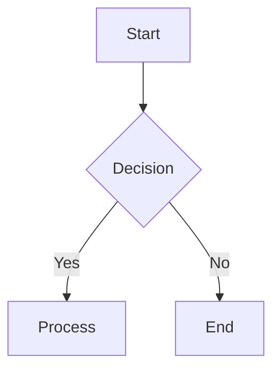
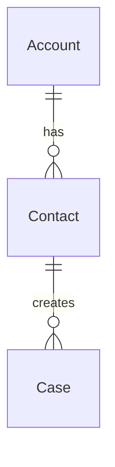
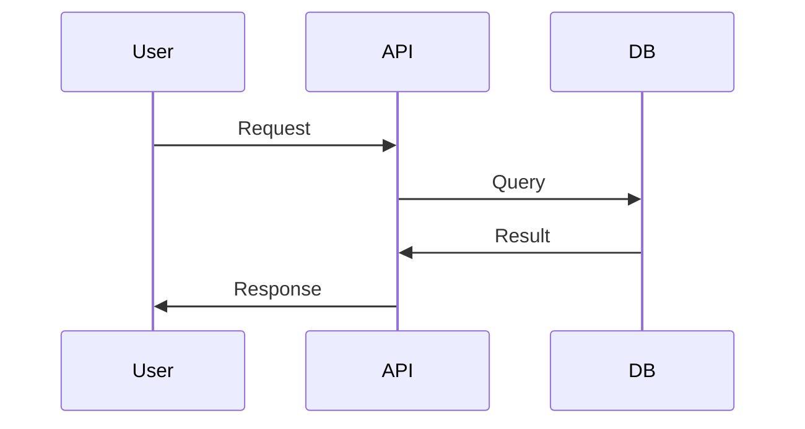
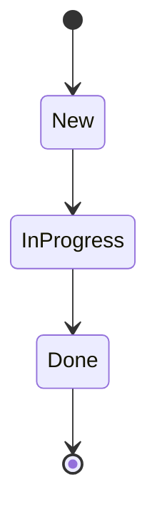

# /diagram-to-asana Command

**Purpose:** Convert Mermaid diagrams to editable Lucidchart diagrams and automatically embed them in Asana tasks or projects.

## Syntax

```
/diagram-to-asana <mermaid-file-or-code> <asana-task-id> [options]
```

## Description

This command orchestrates the complete workflow to:
1. Parse Mermaid diagram code
2. Convert to Lucid Standard Import JSON format
3. Upload to Lucidchart as an editable diagram
4. Generate shareable links
5. Embed the diagram in specified Asana task or project
6. Provide confirmation with all relevant links

## Parameters

### Required

- **`<mermaid-file-or-code>`** - Path to .mmd file OR inline Mermaid code
- **`<asana-task-id>`** - Asana task GID (e.g., "1234567890")

### Optional Flags

- **`--title "Diagram Title"`** - Custom diagram title (default: extracted from file or "Untitled")
- **`--description "Description"`** - Diagram description for Asana
- **`--mode url|image`** - Embed mode: `url` for live link (default), `image` for static PNG
- **`--project <project-id>`** - Embed in project brief instead of task
- **`--section "Section Name"`** - Project brief section (requires --project)
- **`--type flowchart|erd|sequence|state`** - Force diagram type (auto-detects if omitted)

## Examples

### Example 1: From Mermaid File

```bash
/diagram-to-asana instances/production/diagrams/architecture.mmd 1234567890 --title "System Architecture"
```

### Example 2: Inline Mermaid Code

```bash
/diagram-to-asana "flowchart TB; A[Start] --> B[End]" 1234567890 --title "Simple Flow"
```

### Example 3: Embed in Project Brief

```bash
/diagram-to-asana diagrams/data-model.mmd --project 9876543210 --section "Technical Design" --title "Database ERD"
```

### Example 4: Static Image Mode

```bash
/diagram-to-asana workflow.mmd 1234567890 --mode image --description "Approval workflow v2"
```

## Workflow

1. **Parse Input**
   - Read Mermaid file or use inline code
   - Detect diagram type (flowchart, ERD, sequence, state)
   - Validate syntax

2. **Convert to Lucid JSON**
   - Parse Mermaid syntax into structured data
   - Calculate automatic layout and positioning
   - Generate Lucid Standard Import JSON

3. **Upload to Lucidchart**
   - Create .lucid file (ZIP format)
   - Upload via Lucidchart REST API
   - Receive document ID and URLs

4. **Generate Share Link**
   - Create public view link
   - Set access permissions (view-only by default)

5. **Embed in Asana**
   - Add diagram URL to task comment (URL mode)
   - OR upload PNG and attach to task (image mode)
   - OR add to project brief (if --project specified)

6. **Confirm Success**
   - Display Lucidchart edit URL
   - Display Lucidchart view URL
   - Display Asana task/project URL
   - Show diagram statistics

## Output

**Success:**
```
✅ Diagram created successfully!

📊 Diagram Type: flowchart
📝 Title: System Architecture
🔢 Shapes: 12 | Lines: 15

🔗 Lucidchart URLs:
   Edit: https://lucid.app/documents/edit/abc123
   View: https://lucid.app/documents/view/abc123

📎 Asana:
   Task: https://app.asana.com/0/project/1234567890
   Embedded as: Live URL preview

⏱️  Completed in 3.2 seconds
```

**Error:**
```
❌ Failed to create diagram

Error: LUCID_API_TOKEN not set

💡 Fix:
   1. Set LUCID_API_TOKEN in your .env file
   2. Get API token from: https://lucid.app/users/me/settings
   3. Restart Claude Code

Alternative: Use /diagram command to generate Mermaid code only
```

## Environment Setup

### Required Environment Variables

Create `.env` file with:

```bash
# Lucidchart API (required)
LUCID_API_TOKEN=your_lucid_api_token_here

# Asana API (required)
ASANA_ACCESS_TOKEN=your_asana_access_token_here
```

### Getting API Tokens

**Lucidchart:**
1. Go to https://lucid.app/users/me/settings
2. Navigate to "API Tokens" section
3. Click "Generate API Token"
4. Copy token to .env

**Asana:**
1. Go to https://app.asana.com/0/my-apps
2. Click "Create New Token"
3. Name it "Claude Code Diagram Integration"
4. Copy token to .env

## Supported Diagram Types

### 1. Flowcharts
Process flows, decision trees, workflows

**Example:**


### 2. Entity Relationship Diagrams (ERDs)
Database schemas, data models

**Example:**


### 3. Sequence Diagrams
API interactions, system flows

**Example:**


### 4. State Diagrams
Lifecycles, status transitions

**Example:**


## Common Use Cases

### 1. Document Salesforce Architecture

```bash
# Generate ERD from Salesforce objects
/diagram erd Account Contact Opportunity --output temp.mmd

# Upload to Lucid and share in Asana
/diagram-to-asana temp.mmd <assessment-task-id> --title "SF Data Model"
```

### 2. Workflow Documentation

```bash
# Create approval workflow diagram
/diagram-to-asana approval-flow.mmd <workflow-task-id> \
  --title "Quote Approval Process" \
  --description "3-tier approval for high-value deals"
```

### 3. Integration Sequences

```bash
# API integration flow
/diagram-to-asana api-sequence.mmd <integration-task-id> \
  --project <integration-project-id> \
  --section "Technical Design"
```

## Troubleshooting

### "LUCID_API_TOKEN not set"
**Cause:** Environment variable missing
**Fix:** Add `LUCID_API_TOKEN` to `.env` file

### "Failed to upload to Lucidchart"
**Cause:** Invalid API token or network issue
**Fix:**
- Verify token is correct
- Check token hasn't expired
- Test connectivity: `curl -H "Authorization: Bearer $LUCID_API_TOKEN" https://api.lucid.co/users/me`

### "Asana embed failed"
**Cause:** Invalid task ID or insufficient permissions
**Fix:**
- Verify task ID is correct (numeric GID)
- Ensure you have access to the task
- Check ASANA_ACCESS_TOKEN scope includes tasks:write

### "Diagram too complex"
**Cause:** Too many nodes or edges
**Fix:** Split into multiple diagrams:
```bash
# Split large ERD into subdomains
/diagram-to-asana core-objects.mmd task-1 --title "Core Data Model"
/diagram-to-asana custom-objects.mmd task-2 --title "Custom Objects"
```

## Advanced Options

### Batch Processing

Process multiple diagrams at once using a script:

```javascript
const diagrams = [
  { file: 'erd.mmd', taskId: '123', title: 'Data Model' },
  { file: 'flow.mmd', taskId: '456', title: 'Process Flow' },
  { file: 'seq.mmd', taskId: '789', title: 'API Sequence' }
];

for (const d of diagrams) {
  await orchestrateDiagramWorkflow(
    fs.readFileSync(d.file, 'utf8'),
    d.taskId,
    { title: d.title }
  );
}
```

### Custom Styling

Modify generated Lucid JSON before upload:

```javascript
const lucidJSON = convertMermaidToLucid(mermaidCode);

// Customize colors
lucidJSON.pages[0].shapes.forEach(shape => {
  shape.style.fill = '#e3f2fd';  // Light blue background
  shape.style.stroke.color = '#1976d2';  // Blue border
});

await createDocumentFromJSON(lucidJSON, { title: 'Styled Diagram' });
```

## Related Commands

- **`/diagram`** - Generate Mermaid diagrams (doesn't upload to Lucid/Asana)
- **`/asana-link`** - Link Asana project to working directory
- **`/asana-update`** - Post updates to linked Asana tasks

## Notes

- **Live embeds auto-update:** When you edit the Lucidchart diagram, the Asana preview updates automatically
- **Rate limits:** Respects Lucid and Asana API rate limits (max 5 concurrent uploads)
- **Permissions:** Diagrams inherit your Lucid account's default sharing settings
- **Cleanup:** Temp files are automatically deleted after upload

---

**See Also:**
- Full integration guide: `docs/LUCID_MERMAID_ASANA_INTEGRATION.md`
- Asana playbook: `docs/ASANA_AGENT_PLAYBOOK.md`
- Mermaid syntax guide: `docs/MERMAID_DIAGRAM_GUIDE.md`
