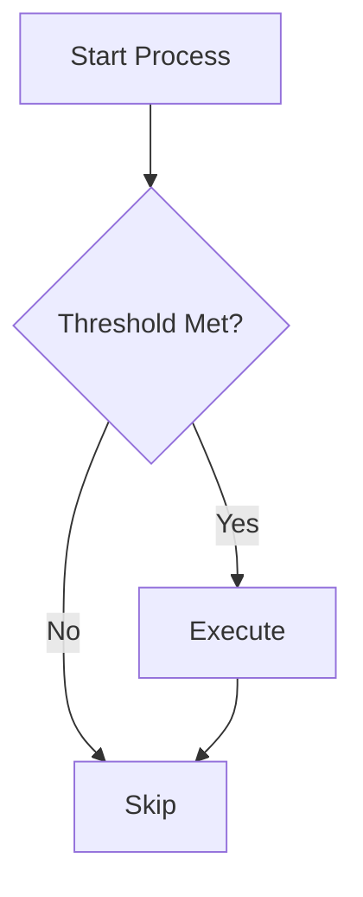
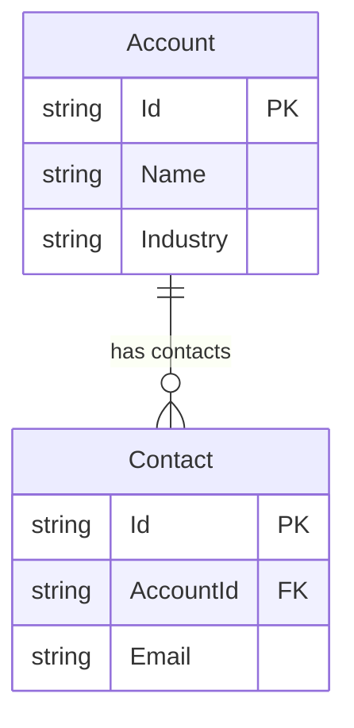
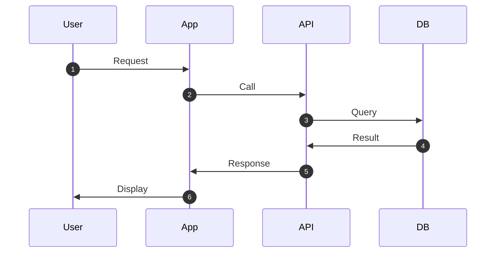
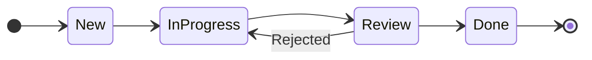

# Lucidchart Mermaid + Asana Integration

**Version:** 1.0.0
**Status:** ✅ Production Ready
**Date:** 2025-10-26

## Overview

Complete integration for converting Mermaid diagram code into editable Lucidchart diagrams and automatically embedding them in Asana tasks and projects. Enables automated diagram generation from Salesforce/HubSpot metadata and seamless sharing with stakeholders.

### Key Features

- **Mermaid to Lucid Conversion** - Convert all Mermaid diagram types to editable Lucidchart diagrams
- **Automatic Layout** - Intelligent positioning algorithm for professional-looking diagrams
- **Lucidchart API Integration** - Upload diagrams programmatically via REST API
- **Asana Embedding** - Share diagrams in tasks, projects, and briefs
- **Assessment Integration** - Auto-generate diagrams from SF/HS assessments
- **Batch Operations** - Process multiple diagrams efficiently

## Architecture

```
User/Agent Request
        ↓
Mermaid Code (.mmd file or string)
        ↓
┌─────────────────────────────────────┐
│ mermaid-parser-utils.js             │
│ - Parse flowchart/ERD/sequence/state│
│ - Extract nodes, edges, entities    │
└─────────────────────────────────────┘
        ↓
┌─────────────────────────────────────┐
│ lucid-layout-engine.js              │
│ - Calculate positions (x, y, w, h)  │
│ - Hierarchical/grid layout          │
└─────────────────────────────────────┘
        ↓
┌─────────────────────────────────────┐
│ mermaid-to-lucid-json-converter.js  │
│ - Build Lucid Standard Import JSON  │
│ - Apply styling and formatting      │
└─────────────────────────────────────┘
        ↓
Lucid JSON (complete document)
        ↓
┌─────────────────────────────────────┐
│ lucid-import-api-client.js          │
│ - Create .lucid file (ZIP)          │
│ - Upload via REST API               │
│ - Generate share links              │
└─────────────────────────────────────┘
        ↓
Lucidchart Document (editable)
        ↓
┌─────────────────────────────────────┐
│ asana-diagram-embedder.js           │
│ - Embed URL in task/project         │
│ - Attach as image (optional)        │
└─────────────────────────────────────┘
        ↓
Asana Task/Project (with diagram preview)
```

## Components

### Core Libraries

Located in `.claude-plugins/cross-platform-plugin/scripts/lib/mermaid-lucid/`:

1. **mermaid-parser-utils.js**
   - Parses Mermaid syntax into structured data
   - Supports: flowcharts, ERDs, sequence diagrams, state diagrams
   - Extracts nodes, edges, relationships, participants

2. **lucid-layout-engine.js**
   - Automatic shape positioning
   - Hierarchical layout for flowcharts/state diagrams
   - Grid layout for ERDs
   - Sequence layout for sequence diagrams

3. **mermaid-to-lucid-json-converter.js**
   - Main converter orchestrating parser + layout
   - Generates Lucid Standard Import JSON
   - Applies professional styling
   - Handles all diagram types

4. **lucid-import-api-client.js**
   - Lucidchart REST API client
   - Creates .lucid files (ZIP format)
   - Uploads documents
   - Generates share links
   - Exports as PNG (optional)

5. **asana-diagram-embedder.js**
   - Asana REST API client for diagrams
   - Embeds live links in tasks/projects
   - Attaches static images
   - Batch operations support

### Orchestrator Agent

**Location:** `.claude-plugins/cross-platform-plugin/agents/diagram-to-lucid-asana-orchestrator.md`

Coordinates the complete workflow from Mermaid code to Asana. Can be invoked by:
- Other agents (assessment agents, etc.)
- Slash commands
- Direct API calls

### Slash Command

**Location:** `.claude-plugins/cross-platform-plugin/commands/diagram-to-asana.md`

User-facing command: `/diagram-to-asana <mermaid-file> <asana-task-id> [options]`

## Installation & Setup

### 1. Environment Variables

Create `.env` file in project root:

```bash
# Lucidchart API (required)
LUCID_API_TOKEN=your_lucid_api_token_here

# Asana API (required - you may already have this)
ASANA_ACCESS_TOKEN=your_asana_access_token_here

# Optional
LUCID_API_BASE_URL=https://api.lucid.co  # Default value
```

### 2. Get API Tokens

**Lucidchart:**
1. Visit https://lucid.app/users/me/settings
2. Navigate to "API Tokens" section
3. Click "Generate API Token"
4. Copy token to `.env`

**Asana:**
- You should already have `ASANA_ACCESS_TOKEN` configured
- If not, go to https://app.asana.com/0/my-apps
- Create token with scopes: `default`, `tasks:write`

### 3. Install Dependencies

```bash
cd .claude-plugins/cross-platform-plugin

# Verify zip command is available (required for .lucid files)
which zip  # Should return path to zip

# If missing, install:
# Ubuntu/Debian: sudo apt-get install zip
# macOS: zip is pre-installed
```

### 4. Test Installation

```bash
# Run conversion tests
node scripts/test-mermaid-lucid-conversion.js

# Should see:
# ✅ Flowchart conversion PASSED
# ✅ ERD conversion PASSED
# ✅ Sequence conversion PASSED
# ✅ State conversion PASSED
```

## Usage

### Basic Usage

```javascript
const { convertMermaidToLucid } = require('./scripts/lib/mermaid-lucid/mermaid-to-lucid-json-converter');
const { createDocumentFromJSON } = require('./scripts/lib/mermaid-lucid/lucid-import-api-client');
const { embedDiagramInTask } = require('./scripts/lib/asana-diagram-embedder');

// 1. Convert Mermaid to Lucid JSON
const mermaidCode = `
flowchart TB
  A[Start] --> B{Decision}
  B -->|Yes| C[Process]
  B -->|No| D[End]
`;

const lucidJSON = convertMermaidToLucid(mermaidCode, {
  title: 'My Flowchart',
  pageTitle: 'Process Flow'
});

// 2. Upload to Lucidchart
const document = await createDocumentFromJSON(lucidJSON, {
  title: 'My Flowchart'
});

console.log('Lucidchart URL:', document.url);

// 3. Embed in Asana
await embedDiagramInTask('asana-task-id', {
  url: document.url,
  title: 'Process Flow Diagram',
  description: 'Generated from Mermaid code'
}, 'url');
```

### Via Slash Command

```bash
# Create diagram from file
/diagram-to-asana diagrams/architecture.mmd 1234567890 --title "System Architecture"

# Inline Mermaid code
/diagram-to-asana "flowchart TB; A-->B" 1234567890 --title "Simple Flow"

# Embed in project brief
/diagram-to-asana data-model.mmd --project 9876543210 --section "Technical Design"
```

### Via Agent Invocation

```javascript
const { Task } = require('claude-code-task');

await Task.invoke('diagram-to-lucid-asana-orchestrator', {
  mermaidCode: mermaidString,
  asanaTaskId: 'task-gid',
  title: 'Diagram Title',
  description: 'Diagram description',
  embedMode: 'url'  // or 'image'
});
```

## Diagram Type Support

### 1. Flowcharts

**Mermaid Syntax:**


**Lucid Output:**
- Shapes: process (rectangles), decision (diamonds), terminator (circles)
- Lines: elbow connectors with labels
- Layout: hierarchical top-to-bottom

### 2. Entity Relationship Diagrams

**Mermaid Syntax:**


**Lucid Output:**
- Shapes: rectangles with table formatting
- Lines: relationships with cardinality markers
- Layout: grid arrangement

### 3. Sequence Diagrams

**Mermaid Syntax:**


**Lucid Output:**
- Shapes: participants as rectangles/actors
- Lines: messages with arrows, lifelines as dashed
- Layout: participants in row, messages flow down

### 4. State Diagrams

**Mermaid Syntax:**


**Lucid Output:**
- Shapes: rounded rectangles for states, circles for start/end
- Lines: transitions with labels
- Layout: horizontal flow (LR) or vertical (TB)

## Advanced Features

### Custom Styling

Modify styles before upload:

```javascript
const lucidJSON = convertMermaidToLucid(mermaidCode);

// Change all shape colors
lucidJSON.pages[0].shapes.forEach(shape => {
  shape.style.fill = '#e3f2fd';
  shape.style.stroke.color = '#1976d2';
  shape.style.stroke.width = 3;
});

await createDocumentFromJSON(lucidJSON);
```

### Batch Processing

Process multiple diagrams efficiently:

```javascript
const diagrams = [
  { code: flowchartCode, taskId: '123', title: 'Flow' },
  { code: erdCode, taskId: '456', title: 'ERD' },
  { code: seqCode, taskId: '789', title: 'Sequence' }
];

const results = [];

for (const diagram of diagrams) {
  const lucidJSON = convertMermaidToLucid(diagram.code, { title: diagram.title });
  const doc = await createDocumentFromJSON(lucidJSON, { title: diagram.title });
  await embedDiagramInTask(diagram.taskId, { url: doc.url, title: diagram.title }, 'url');

  results.push({ title: diagram.title, url: doc.url });
}

console.log('Created', results.length, 'diagrams');
```

### Export as PNG

Generate static images from diagrams:

```javascript
const { exportDocumentAsPNG } = require('./scripts/lib/mermaid-lucid/lucid-import-api-client');

// Upload diagram
const doc = await createDocumentFromJSON(lucidJSON);

// Export as PNG
const pngBuffer = await exportDocumentAsPNG(doc.docId, {
  pageNumber: 1,
  scale: 2  // 2x resolution
});

// Save or attach
await fs.writeFile('diagram.png', pngBuffer);

// Or attach to Asana as image
await embedDiagramInTask(taskId, {
  imageBuffer: pngBuffer,
  title: 'Diagram'
}, 'image');
```

## Integration with Assessment Agents

### Auto-Generate Diagrams from Assessments

**Salesforce CPQ Assessment:**

```javascript
// In sfdc-cpq-assessor agent

// Generate quote approval flowchart
const quoteFlowMermaid = `
flowchart TB
  Quote[New Quote] --> CheckAmount{Amount > $100k?}
  CheckAmount -->|Yes| ManagerApproval[Manager Approval]
  CheckAmount -->|No| AutoApprove[Auto-Approve]
  ManagerApproval --> Approved{Approved?}
  Approved -->|Yes| Generate[Generate Contract]
  Approved -->|No| Rejected[Rejected]
  AutoApprove --> Generate
`;

// Upload to Lucid and embed in assessment task
await Task.invoke('diagram-to-lucid-asana-orchestrator', {
  mermaidCode: quoteFlowMermaid,
  asanaTaskId: assessmentTask.gid,
  title: 'CPQ Quote Approval Workflow',
  description: 'Auto-generated from CPQ assessment'
});

// Generate product catalog ERD
const catalogERD = generateCatalogERD(cpqData);
await Task.invoke('diagram-to-lucid-asana-orchestrator', {
  mermaidCode: catalogERD,
  asanaTaskId: assessmentTask.gid,
  title: 'CPQ Product Catalog Data Model'
});
```

**HubSpot Workflow Audit:**

```javascript
// In hubspot-workflow-auditor agent

workflows.forEach(async (workflow) => {
  const flowchart = convertWorkflowToMermaid(workflow);

  await Task.invoke('diagram-to-lucid-asana-orchestrator', {
    mermaidCode: flowchart,
    asanaTaskId: workflowTask.gid,
    title: `Workflow: ${workflow.name}`,
    description: `${workflow.actions.length} actions, ${workflow.triggers.length} triggers`
  });
});
```

### Recommended Integration Points

**Assessment Agents that should auto-generate diagrams:**
- sfdc-revops-auditor → Lead/Opportunity lifecycle diagrams
- sfdc-cpq-assessor → Quote workflow, product catalog ERD
- sfdc-object-auditor → Object relationship ERD
- sfdc-automation-auditor → Automation flowcharts
- hubspot-workflow-auditor → Workflow flowcharts
- hubspot-assessment-analyzer → Contact lifecycle, deal pipeline

## API Reference

### convertMermaidToLucid(mermaidCode, options)

**Parameters:**
- `mermaidCode` (string) - Mermaid diagram syntax
- `options` (object)
  - `title` (string) - Document title
  - `pageTitle` (string) - Page title
  - `diagramType` (string) - Override auto-detection: 'flowchart', 'erd', 'sequence', 'state'
  - `layoutConfig` (object) - Custom layout settings

**Returns:** Lucid Standard Import JSON object

### createDocumentFromJSON(lucidJSON, options)

**Parameters:**
- `lucidJSON` (object) - Lucid Standard Import JSON
- `options` (object)
  - `title` (string) - Document title
  - `folderId` (string) - Parent folder ID
  - `productId` (string) - 'lucidchart' or 'lucidspark'

**Returns:** Promise<{docId, title, url, viewUrl, productId}>

### embedDiagramInTask(taskId, diagram, mode)

**Parameters:**
- `taskId` (string) - Asana task GID
- `diagram` (object)
  - `url` (string) - Lucidchart document URL
  - `title` (string) - Diagram title
  - `description` (string) - Optional description
  - `imageBuffer` (Buffer) - PNG image (for image mode)
- `mode` (string) - 'url' or 'image'

**Returns:** Promise<{gid, created_at, resource_type}>

## Troubleshooting

### Common Issues

**1. "LUCID_API_TOKEN not set"**
- Add token to `.env` file
- Restart Claude Code to reload environment

**2. "Failed to create .lucid file"**
- Ensure `zip` command is installed
- Check disk space and permissions

**3. "Asana embed failed with 403"**
- Verify task ID is correct
- Check you have access to the task
- Confirm ASANA_ACCESS_TOKEN has tasks:write scope

**4. "Diagram too complex"**
- Split into multiple smaller diagrams
- Reduce number of nodes (< 50 recommended)

**5. "Share link creation failed"**
- Check Lucid API token permissions
- Verify document was created successfully
- Try creating share link manually to test

### Debug Mode

Enable verbose logging:

```bash
DEBUG=mermaid-lucid:* node scripts/test-mermaid-lucid-conversion.js
```

### API Rate Limits

**Lucidchart:**
- 100 requests per minute per token
- 1,000 requests per day per token

**Asana:**
- 150 requests per minute per user
- 1,500 requests per minute per workspace

**Mitigation:**
- Batch operations automatically handle rate limiting
- 1-second delay between batches
- Exponential backoff on 429 errors

## Performance

### Benchmarks

| Operation | Avg Time | Notes |
|-----------|----------|-------|
| Parse Mermaid (10 nodes) | 5ms | In-memory |
| Layout calculation | 10ms | Hierarchical algorithm |
| Convert to Lucid JSON | 15ms | Complete document |
| Create .lucid ZIP | 50ms | File I/O |
| Upload to Lucidchart | 800ms | Network + API |
| Create share link | 200ms | API call |
| Embed in Asana | 300ms | API call |
| **Total (URL mode)** | **~1.4s** | End-to-end |

### Optimization Tips

1. **Batch similar diagrams** - Upload multiple in parallel
2. **Cache Lucid JSON** - Reuse for similar diagrams
3. **Use URL mode** - Faster than image export + attach
4. **Pre-generate Mermaid** - Don't generate in critical path

## Security

### Best Practices

1. **Never commit API tokens** - Use .env and .gitignore
2. **Use read-only tokens when possible** - Lucid supports view-only
3. **Limit share link access** - Set allowAnonymous:false for sensitive diagrams
4. **Rotate tokens regularly** - Monthly rotation recommended
5. **Audit API usage** - Monitor Lucid/Asana dashboards

### Data Privacy

- **Mermaid code** - Processed locally, not sent to third parties
- **Lucid documents** - Stored in your Lucidchart account
- **Asana embeds** - Follow your Asana workspace permissions
- **Temp files** - Automatically cleaned up after upload

## Changelog

### v1.0.0 (2025-10-26)
- Initial release
- Support for flowcharts, ERDs, sequence diagrams, state diagrams
- Lucidchart Standard Import integration
- Asana URL embed and image attachment
- Orchestrator agent and slash command
- Comprehensive documentation

### Future Enhancements

**Planned for v1.1.0:**
- C4 architecture diagram support
- Gantt chart support
- Class diagram support
- Custom shape libraries
- Diagram versioning
- Collaborative editing links

**Planned for v1.2.0:**
- Real-time sync: Update Lucid when Mermaid file changes
- Template library for common diagram patterns
- AI-powered layout optimization
- Diagram comparison/diff tool

## Support

**Documentation:**
- This guide (comprehensive reference)
- `/diagram-to-asana` command help
- `ASANA_AGENT_PLAYBOOK.md` - Asana integration standards
- `MERMAID_DIAGRAM_GUIDE.md` - Mermaid syntax reference

**Examples:**
- `test-mermaid-lucid-conversion.js` - Test all diagram types
- Generated examples in `test-output/mermaid-lucid/`

**Source Code:**
- Libraries: `.claude-plugins/cross-platform-plugin/scripts/lib/mermaid-lucid/`
- Orchestrator: `.claude-plugins/cross-platform-plugin/agents/diagram-to-lucid-asana-orchestrator.md`

---

**Version:** 1.0.0
**Author:** OpsPal Cross-Platform Plugin
**Last Updated:** 2025-10-26
**Status:** ✅ Production Ready
