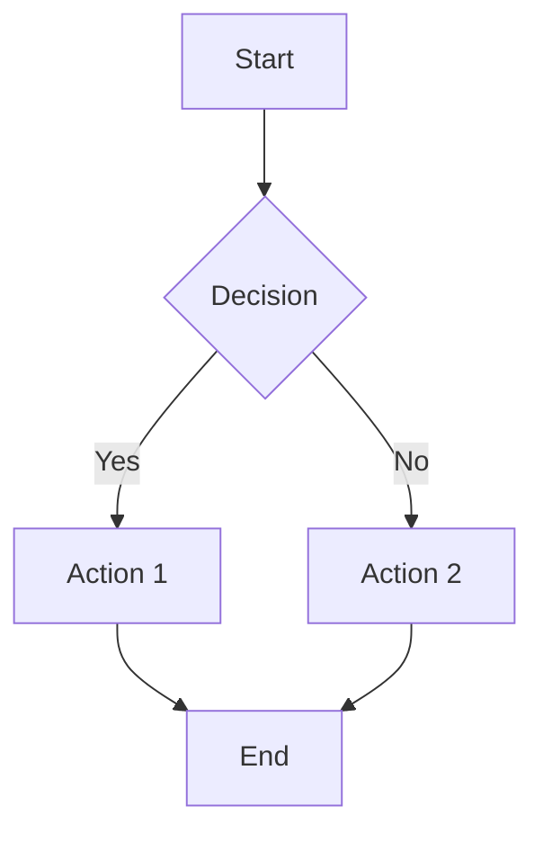
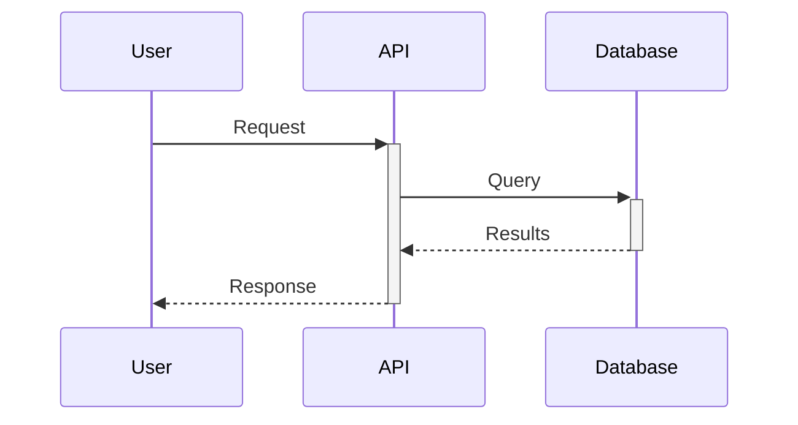
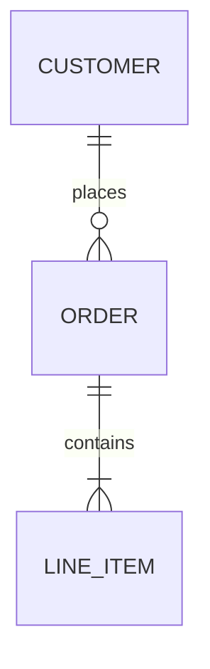

# Cross-Platform Plugin - User Guide

This file provides guidance when using the Cross-Platform Plugin with Claude Code.

## Plugin Overview

The **Cross-Platform Plugin** provides utilities and orchestration across Salesforce, HubSpot, and more. Includes 21 agents for diagrams, PDFs, Asana integration, task scheduling, sub-agent routing, ACE self-learning, project intake, and RevOps data quality governance.

**Repository**: https://github.com/RevPalSFDC/opspal-plugin-internal-marketplace

## Quick Start

```bash
# Installation
/plugin marketplace add RevPalSFDC/opspal-internal-plugins
/plugin install cross-platform-plugin@revpal-internal-plugins

# Verify
/agents  # Should show cross-platform agents
```

## Key Features

### Diagram Generation
- **Mermaid** - Flowcharts, sequence diagrams, ERDs
- **Lucid** - Architecture diagrams with multi-tenant isolation
- **Exports** - PNG, SVG, PDF

**Trigger keywords**: "diagram", "flowchart", "ERD", "sequence diagram", "visualize"

### PDF Generation
- Multi-document PDFs with cover templates
- Markdown to PDF conversion
- Cover templates (`templates/pdf-covers/README.md`): salesforce-audit, security-audit, executive-report, hubspot-assessment, data-quality, gtm-planning, cross-platform-integration, default
- Themes (`templates/pdf-styles/README.md`): revpal, revpal-brand, default

### BLUF+4 Executive Summaries
**Auto-generates** after audits: Bottom Line (25-40 words), Situation (30-50), Next Steps (35-55), Risks (25-40), Support Needed (20-35).

```bash
export ENABLE_AUTO_BLUF=1           # Enable (default)
export BLUF_OUTPUT_FORMAT=terminal  # terminal, markdown, json
```

### Unified Authentication Manager
Centralized auth for Salesforce, HubSpot, Marketo:

```bash
node scripts/lib/unified-auth-manager.js status    # Check all
node scripts/lib/unified-auth-manager.js test salesforce
node scripts/lib/unified-auth-manager.js refresh hubspot
```

### Task Scheduler
Schedule Claude prompts and scripts:

```bash
/schedule-add --name="Daily Check" --type=claude-prompt --schedule="0 6 * * *" --prompt="Check API limits"
/schedule-list          # View tasks
/schedule-run <id>      # Test immediately
/schedule-logs <id>     # View logs
```

**Cron examples**: `0 6 * * *` (daily 6am), `0 8 * * 0` (Sunday 8am), `*/15 * * * *` (every 15 min)

### Asana Integration

```bash
/asana-link            # Link project to directory
/asana-update          # Post work summary
```

**Update templates** in `templates/asana-updates/`: progress-update.md, blocker-update.md, completion-update.md, milestone-update.md

### UAT Testing Framework

```bash
/uat-build --platform salesforce --output ./tests/cpq-tests.csv
/uat-run ./tests/cpq-tests.csv --org my-sandbox --epic "CPQ Workflow"
```

### Project Intake System

Gather project specifications via browser form, validate, and generate runbooks + Asana projects.

```bash
/intake                           # Interactive workflow
/intake --form-data ./data.json   # Process existing form
/intake --validate ./data.json    # Validate only
/intake-generate-form             # Generate HTML form
```

**Trigger keywords**: "intake", "project intake", "new project", "requirements gathering", "kickoff"

**Features:**
- Browser-based HTML intake form with save/export
- Circular dependency detection
- Completeness scoring (80%+ = ready)
- Auto-context from Asana/Salesforce
- PROJECT_RUNBOOK.md generation
- Asana project creation with tasks

**Form sections**: Project Identity, Goals & Objectives, Scope, Data Sources, Timeline & Budget, Dependencies & Risks, Technical Requirements, Approval

**Files:**
- `scripts/lib/intake/intake-form-generator.js` - Form generation
- `scripts/lib/intake/intake-validator.js` - Validation engine
- `scripts/lib/intake/intake-data-gatherer.js` - Context gathering
- `scripts/lib/intake/intake-runbook-builder.js` - Runbook generation
- `agents/project-intake-orchestrator.md` - Orchestration agent

## Sub-Agent Routing System

**Automatic** - Routes tasks to appropriate agents based on complexity analysis. Shows visible routing banner, logs to `~/.claude/logs/routing.jsonl`.

**Complexity tiers**:
- < 0.5: Agent available if needed
- 0.5-0.7: Agent recommended
- >= 0.7: **BLOCKING** - Must use Task tool

**Configuration**:
```bash
export ENABLE_SUBAGENT_BOOST=1       # Enable (default)
export ENABLE_AGENT_BLOCKING=1       # Block high-complexity (default)
export ROUTING_VERBOSE=1             # Debug logging
```

**Requirements**: `jq` (`brew install jq` / `sudo apt-get install jq`)

**Routing commands**:
```bash
/route "task description"    # Manual routing analysis
/routing-health              # System health check
```

**Override controls**:
- `[DIRECT] task` - Skip routing
- `[USE: agent-name] task` - Force specific agent

**Documentation**: `AUTO_ROUTING_SETUP.md`, `docs/ROUTING_TROUBLESHOOTING.md`

## Task Graph Orchestration

**NEW** - Decompose complex requests into directed acyclic graphs (DAGs) with explicit dependencies, parallel execution, and verification gates.

### When to Use

Use Task Graph when complexity score >= 4:
- **Multi-domain** (2 pts): Apex + Flow, SF + HubSpot
- **Multi-artifact** (2 pts): 5+ files affected
- **High-risk** (2 pts): Production, permissions, deletes
- **High-ambiguity** (1 pt): Needs discovery
- **Long-horizon** (1 pt): Multi-step execution

### Commands

```bash
/task-graph "Update lead routing and modify associated trigger"
/complexity "Check complexity score for a task"
```

### User Flags

| Flag | Effect |
|------|--------|
| `[SEQUENTIAL]` | Force Task Graph mode |
| `[PLAN_CAREFULLY]` | Force Task Graph + extra validation |
| `[DIRECT]` | Skip Task Graph |
| `[COMPLEX]` | Hint higher complexity |

### Configuration

```bash
export TASK_GRAPH_ENABLED=1       # Enable (default)
export TASK_GRAPH_THRESHOLD=4     # Complexity threshold
export TASK_GRAPH_BLOCKING=0      # Block if threshold met
export TASK_GRAPH_VERBOSE=1       # Detailed output
```

### Playbooks

Pre-built decomposition patterns:
- `playbooks/salesforce/` - flow-work, apex-work, metadata-deployment, production-change
- `playbooks/hubspot/` - workflow-work, data-operations, integration-setup
- `playbooks/data/` - transform-work, migration, validation

### Files

- **Agent**: `agents/task-graph-orchestrator.md`
- **Schemas**: `schemas/task-spec.schema.json`, `schemas/result-bundle.schema.json`
- **Config**: `config/complexity-rubric.json`, `config/tool-policies.json`, `config/verification-matrix.json`
- **Engine**: `scripts/lib/task-graph/`
- **Hook**: `hooks/pre-task-graph-trigger.sh`

## Capability Gap Infrastructure

Scripts for distributed tracing, audit logging, taxonomy classification, API caching, and rate limiting.

| Script | Purpose |
|--------|---------|
| `trace-context.js` | Correlation IDs across tool calls |
| `audit-log.js` | Track mutations with before/after state |
| `taxonomy-classifier.js` | 12-category reflection classification |
| `api-cache-manager.js` | Per-endpoint TTL caching |
| `api-limit-tracker.js` | Rate limit tracking, 429 learning |

**CLI examples**:
```bash
node scripts/lib/trace-context.js generate
node scripts/lib/audit-log.js summary
node scripts/lib/taxonomy-classifier.js categories
node scripts/lib/api-cache-manager.js stats
node scripts/lib/api-limit-tracker.js check salesforce /query
```

## Available Agents

**Orchestration**: `asana-task-manager`, `diagram-generator`, `project-intake-orchestrator`

**Quality**: `agent-deliverable-validator`, `quality-gate-enforcer`, `user-expectation-validator`

**Documentation**: `documentation-organizer`

## Common Commands

```bash
# Project Intake
/intake                     # Start intake workflow
/intake-generate-form       # Generate HTML form only

# Asana
/asana-link                 # Link project
/asana-update               # Post summary

# Scheduling
/schedule-add               # Add task
/schedule-list              # View tasks
/schedule-run <id>          # Test task
/schedule-logs <id>         # View logs

# Testing
/uat-build                  # Build test cases
/uat-run                    # Execute tests

# Data Quality
/data-quality-audit         # Full data quality audit
/deduplicate                # Find and merge duplicates
/enrich-data                # Fill missing data
/data-health                # Quick health scorecard
/review-queue               # Process pending actions
```

## Mermaid Examples

**Flowchart**:


**Sequence**:


**ERD**:


## PDF Generation

```javascript
const PDFGenerationHelper = require('./scripts/lib/pdf-generation-helper');

await PDFGenerationHelper.generateMultiReportPDF({
  orgAlias: 'production',
  outputDir: './reports',
  documents: [
    { path: 'summary.md', title: 'Summary', order: 0 },
    { path: 'analysis.md', title: 'Analysis', order: 1 }
  ],
  coverTemplate: 'salesforce-audit',
  metadata: { title: 'Audit Report', version: '1.0.0' }
});
```

## User Expectation Tracking

```javascript
const tracker = new UserExpectationTracker();
await tracker.initialize();

// Record correction
await tracker.recordCorrection('cpq-assessment', 'date-format', 'MM/DD/YYYY', 'YYYY-MM-DD');

// Set preference
await tracker.setPreference('cpq-assessment', 'date-format', 'YYYY-MM-DD');

// Validate output
const result = await tracker.validate(output, 'cpq-assessment');
```

## Quality Gate Validation

```javascript
const { QualityGateValidator } = require('./scripts/lib/quality-gate-validator');
const validator = new QualityGateValidator();

validator.fileExists('/path/to/report.json');
validator.hasRequiredFields(data, ['summary', 'findings']);
validator.isInRange(score, 0, 100);
```

## Best Practices

**Asana**: Keep updates < 100 words, use templates, include metrics.

**Diagrams**: Use Mermaid for simple, Lucid for complex. One concept per diagram.

**PDFs**: Use cover templates, include metadata (version, date).

## Troubleshooting

**Asana**: Verify `ASANA_ACCESS_TOKEN` in .env.

**Mermaid errors**: Validate at https://mermaid.live

**PDF timeout**: Reduce document size or split.

## Hook Health Check

```bash
bash scripts/diagnose-hook-health.sh
```

Checks: executability, syntax, dependencies (jq, node, bc).

**Fix permissions**: `chmod +x ~/.claude/plugins/cross-platform-plugin@revpal-internal-plugins/hooks/*.sh`

## Documentation

- **docs/ASANA_AGENT_PLAYBOOK.md** - Asana guide
- **templates/asana-updates/** - Update templates
- **AUTO_ROUTING_SETUP.md** - Routing setup
- **CHANGELOG.md** - Version history

## Support

- GitHub Issues: https://github.com/RevPalSFDC/opspal-plugin-internal-marketplace/issues
- `/reflect` - Submit feedback

---
**Version**: 1.33.0 | **Updated**: 2025-12-21
