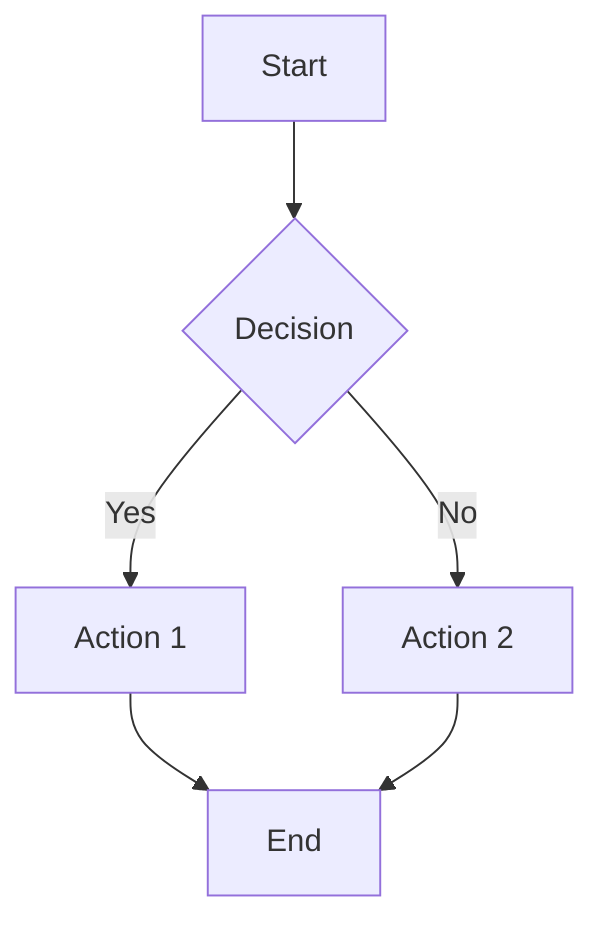
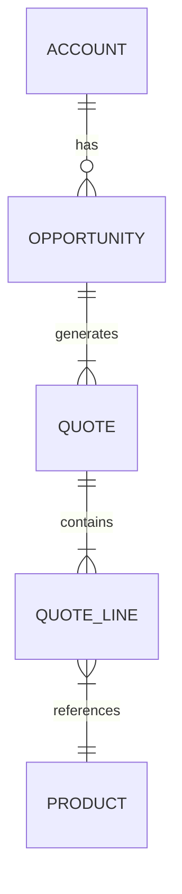

# Cross-Platform Plugin - Usage Guide

**Version**: 1.12.0
**Last Updated**: 2025-11-24

## Quick Start

```bash
# Install
/plugin marketplace add RevPalSFDC/opspal-plugin-internal-marketplace
/plugin install cross-platform-plugin@revpal-internal-plugins

# Verify
/agents | grep -E "diagram|asana|funnel"
```

## Core Capabilities

| Feature | Agent/Tool | Use When |
|---------|------------|----------|
| **Diagrams** | `diagram-generator` | Visualizations, flowcharts, ERDs |
| **Asana** | `/asana-link`, `/asana-update` | Task management integration |
| **Sales Funnel** | `sales-funnel-diagnostic` | Pipeline performance analysis |
| **PDF Generation** | `pdf-generation-helper` | Report deliverables |
| **Quality Gates** | `quality-gate-enforcer` | Deliverable validation |

## Diagram Generation

### Create Diagrams

```
User: "Create ERD for the CPQ data model"
→ Routes to diagram-generator
→ Produces Mermaid diagram with export options
```

### Supported Diagram Types

| Type | Syntax | Use Case |
|------|--------|----------|
| Flowchart | `graph TD` | Process flows |
| Sequence | `sequenceDiagram` | API interactions |
| ERD | `erDiagram` | Data models |
| State | `stateDiagram-v2` | State machines |
| Class | `classDiagram` | Object models |
| Gantt | `gantt` | Project timelines |

### Example: Flowchart



### Example: ERD



## Asana Integration

### Link Project

```bash
# In project directory
/asana-link

# Select from available projects
# Creates .asana-links.json
```

### Post Updates

```bash
# After completing work
/asana-update

# Uses templates for consistent formatting
```

### Update Templates

| Template | Length | Use Case |
|----------|--------|----------|
| `progress-update.md` | 50-75 words | Intermediate checkpoints |
| `blocker-update.md` | 40-60 words | Report blockers |
| `completion-update.md` | 60-100 words | Task completion |
| `milestone-update.md` | 100-150 words | Phase completion |

### Update Format

```markdown
**Progress Update** - [Task Name] - [Date]

**Completed:**
- [Accomplishment with metric]

**In Progress:**
- [Current work]

**Next:**
- [Next steps]

**Status:** On Track
```

## Sales Funnel Diagnostic

### Run Analysis

```
User: "Analyze sales funnel performance"
→ Routes to sales-funnel-diagnostic
→ Produces:
   - Conversion rates by stage
   - Bottleneck identification
   - Benchmark comparisons
   - Recommendations
```

### Metrics Analyzed

- Lead → MQL conversion
- MQL → SQL conversion
- SQL → Opportunity conversion
- Opportunity → Closed Won
- Average cycle time per stage
- Stage-specific drop-off rates

## PDF Generation

### Generate Report PDF

```javascript
const PDFGenerationHelper = require('./scripts/lib/pdf-generation-helper');

await PDFGenerationHelper.generateMultiReportPDF({
  orgAlias: 'production',
  outputDir: './reports',
  documents: [
    { path: 'summary.md', title: 'Summary', order: 0 },
    { path: 'findings.md', title: 'Findings', order: 1 }
  ],
  coverTemplate: 'salesforce-audit',
  metadata: {
    title: 'Assessment Report',
    version: '1.0.0'
  }
});
```

### Cover Templates

1. `salesforce-audit` - Salesforce assessments
2. `hubspot-audit` - HubSpot assessments
3. `cpq-assessment` - CPQ evaluations
4. `revops-audit` - Revenue operations
5. `technical-review` - Architecture reviews
6. `executive-summary` - Executive reports
7. `migration-plan` - Data migration
8. `integration-guide` - Integration docs

## Auto-Routing System

### How It Works

1. Analyzes user prompt
2. Matches keywords to agents (199 keywords, 137 agents)
3. Calculates complexity score
4. Routes to optimal agent

### Configuration

```bash
# Enable/disable
export ENABLE_AUTO_ROUTING=1

# Confidence threshold
export ROUTING_CONFIDENCE_THRESHOLD=0.7

# Complexity threshold
export COMPLEXITY_THRESHOLD=0.7
```

### Override Controls

```bash
# Skip routing
[DIRECT] Add a checkbox field

# Force specific agent
[USE: sfdc-cpq-assessor] Analyze configuration
```

## Quality Gate Validation

### Validate Deliverables

```javascript
const { QualityGateValidator } = require('./scripts/lib/quality-gate-validator');

const validator = new QualityGateValidator();

validator.fileExists('/path/to/report.json');
validator.hasRequiredFields(data, ['summary', 'findings']);
validator.isInRange(score, 0, 100);

if (!validator.isValid()) {
  console.error(validator.getErrors());
}
```

## User Expectation Tracking

### Record Corrections

```javascript
const tracker = new UserExpectationTracker();
await tracker.recordCorrection(
  'cpq-assessment',
  'date-format',
  'Used MM/DD/YYYY',
  'Expected YYYY-MM-DD',
  { severity: 'high' }
);
```

### Set Preferences

```javascript
await tracker.setPreference(
  'cpq-assessment',
  'date-format',
  'YYYY-MM-DD',
  'ISO 8601'
);
```

## Hook Standards

### Error Handler Library

**Location**: `hooks/lib/error-handler.sh`

**Exit Codes**:
| Code | Meaning |
|------|---------|
| 0 | Success |
| 1 | General error |
| 2 | Invalid args |
| 3 | Not found |
| 4 | Permission denied |
| 5 | Timeout |
| 6 | Dependency missing |
| 7 | Validation failed |

**Documentation**: See `hooks/STANDARDS.md`

## Troubleshooting

### Diagram Not Rendering

**Check**: Mermaid syntax at https://mermaid.live

### Asana Link Failed

**Check**:
1. `ASANA_ACCESS_TOKEN` set
2. Project permissions
3. Valid project ID

### PDF Generation Timeout

**Fix**: Split into multiple smaller PDFs

### Auto-Routing Wrong Agent

**Fix**: Use override: `[USE: correct-agent] prompt`

## Environment Variables

```bash
# Asana
export ASANA_ACCESS_TOKEN="2/xxx"
export ASANA_WORKSPACE_ID="123"
export ASANA_PROJECT_GID="456"

# Routing
export ENABLE_AUTO_ROUTING=1
export ROUTING_CONFIDENCE_THRESHOLD=0.7

# Sub-agent boost
export ENABLE_SUBAGENT_BOOST=1
```

## Dependencies

**Required**:
- `jq` - JSON processor (hooks)
- `node` - JavaScript runtime

**Install**:
```bash
# macOS
brew install jq node

# Linux
sudo apt-get install jq nodejs
```

---

**Full Documentation**: See CLAUDE.md for comprehensive feature documentation.
