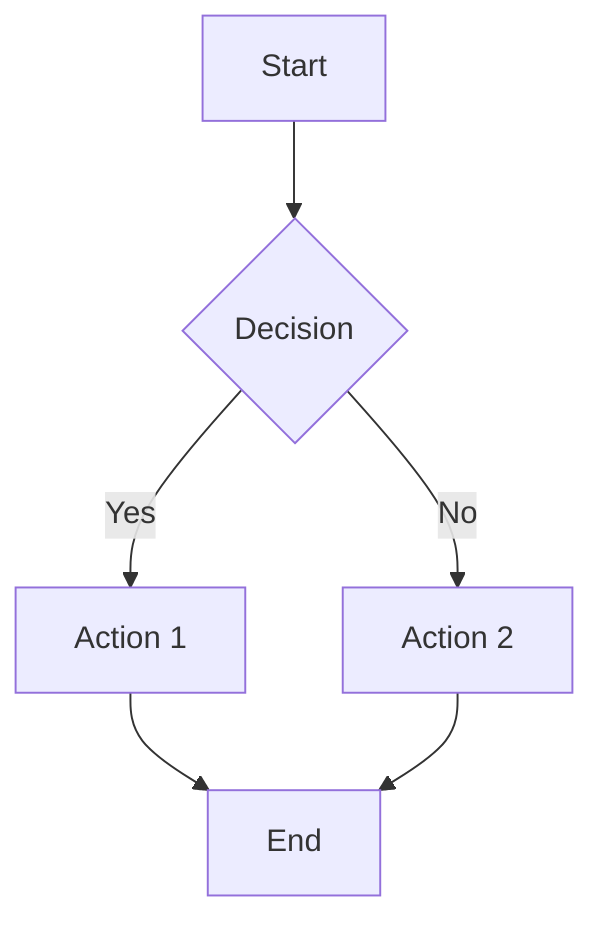
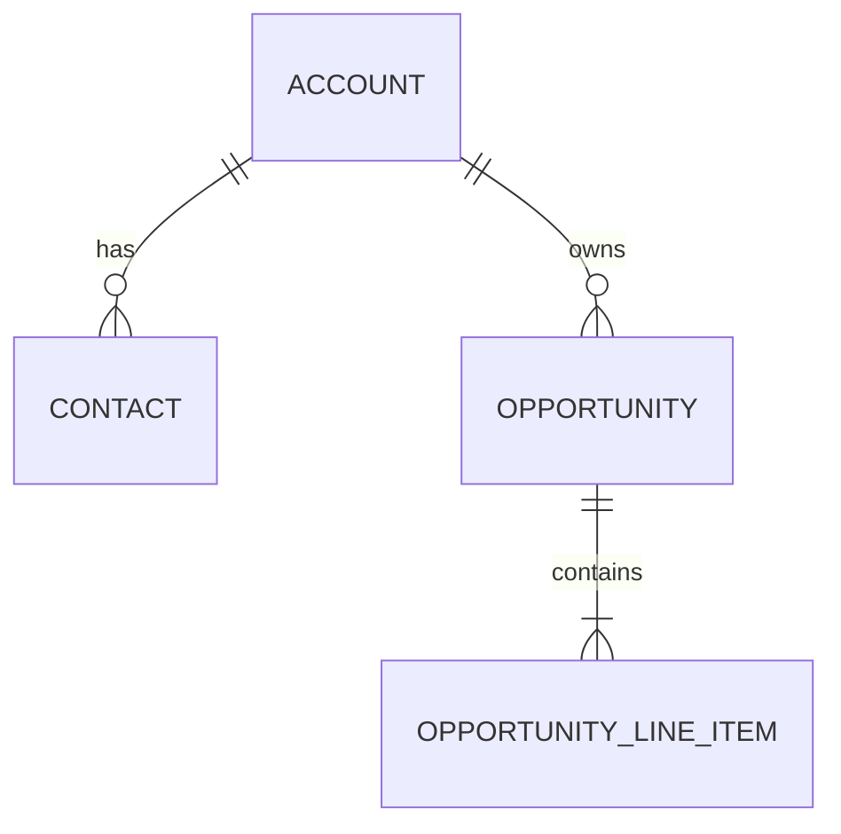

# Mermaid Diagram Reference

## When to Use This Skill

- Creating flowcharts for process documentation
- Building ERD diagrams for data models
- Designing sequence diagrams for integrations
- Documenting state machines
- Visualizing Salesforce/HubSpot architecture
- Creating technical documentation diagrams

## Quick Reference

### Diagram Types

| Type | Syntax Start | Use Case |
|------|--------------|----------|
| Flowchart | `flowchart TD` | Process flows, decision trees |
| ERD | `erDiagram` | Data models, object relationships |
| Sequence | `sequenceDiagram` | API calls, integrations |
| State | `stateDiagram-v2` | Lifecycle stages, status flows |
| Class | `classDiagram` | Object structure |
| Gantt | `gantt` | Timelines, project plans |

### Direction Options (Flowchart)

| Direction | Meaning |
|-----------|---------|
| TB / TD | Top to Bottom |
| BT | Bottom to Top |
| LR | Left to Right |
| RL | Right to Left |

### Quick Templates

**Simple Flowchart:**

**Basic ERD:**

## Detailed Documentation

See supporting files:
- `flowchart-syntax.md` - Flowchart patterns
- `sequence-syntax.md` - Sequence diagrams
- `erd-syntax.md` - Entity relationship diagrams
- `state-syntax.md` - State machine diagrams
