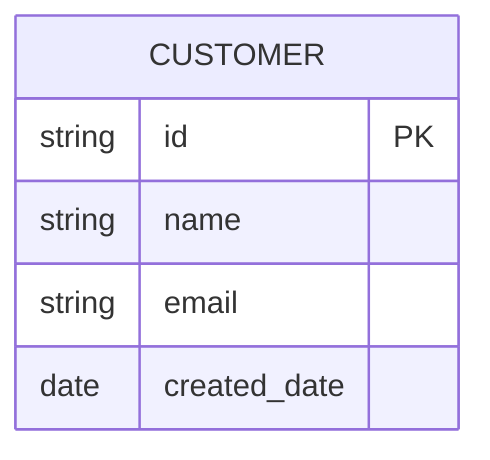
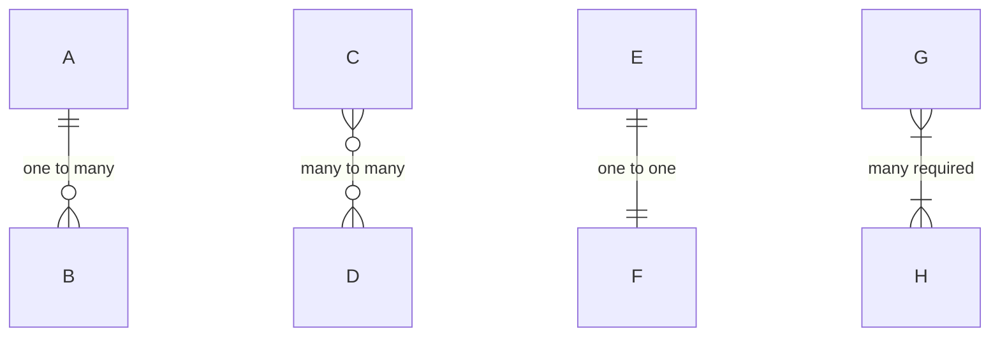
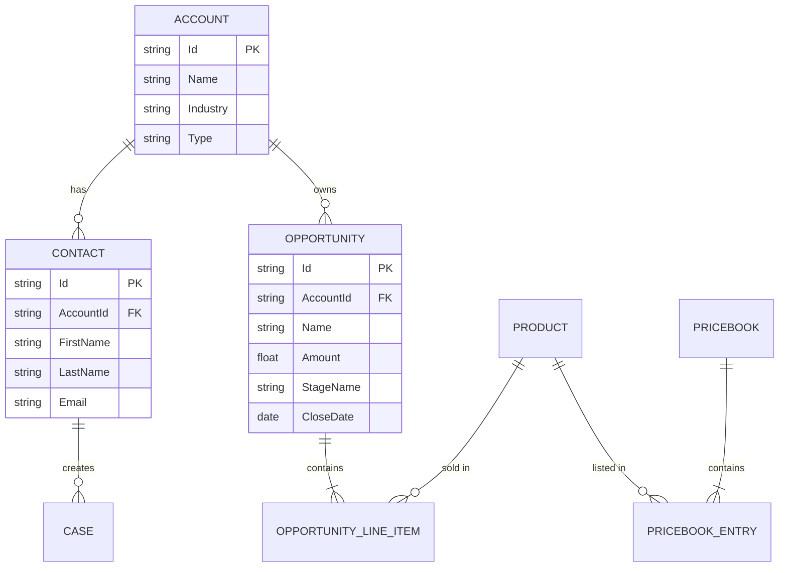
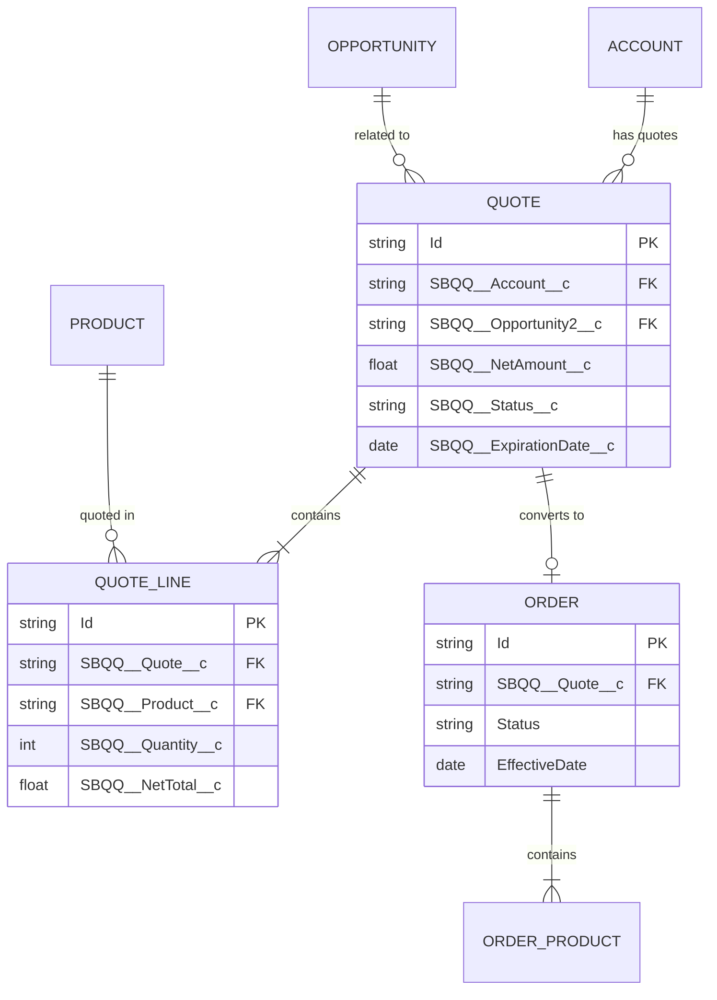
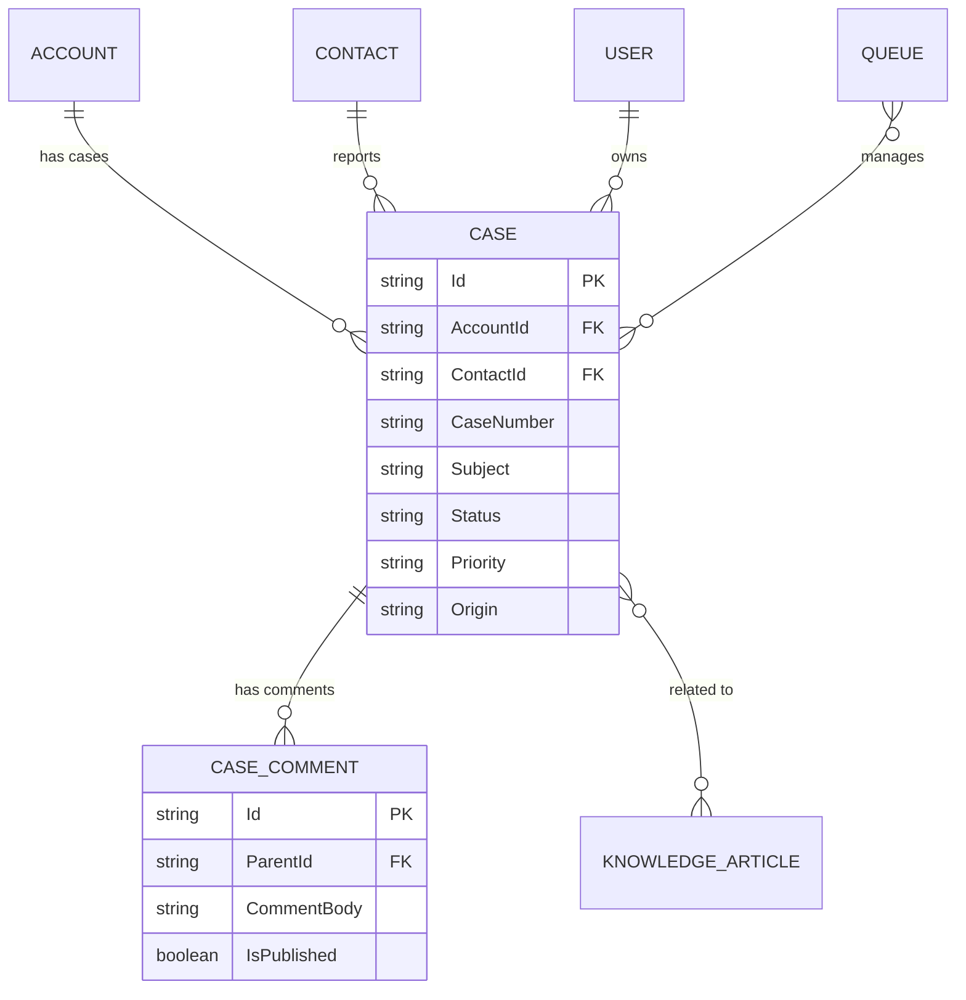
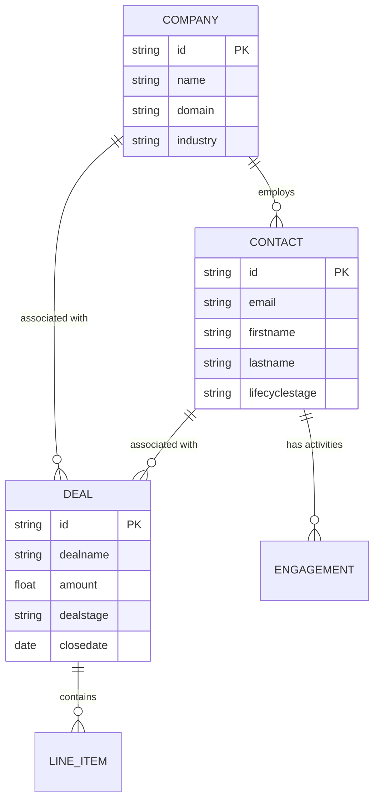
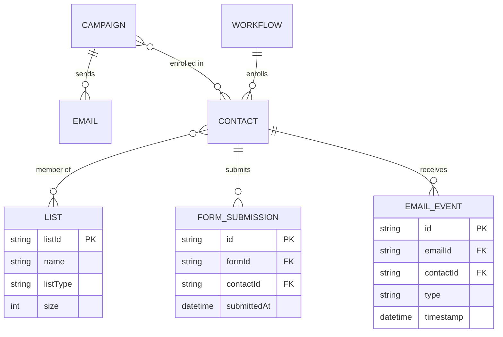
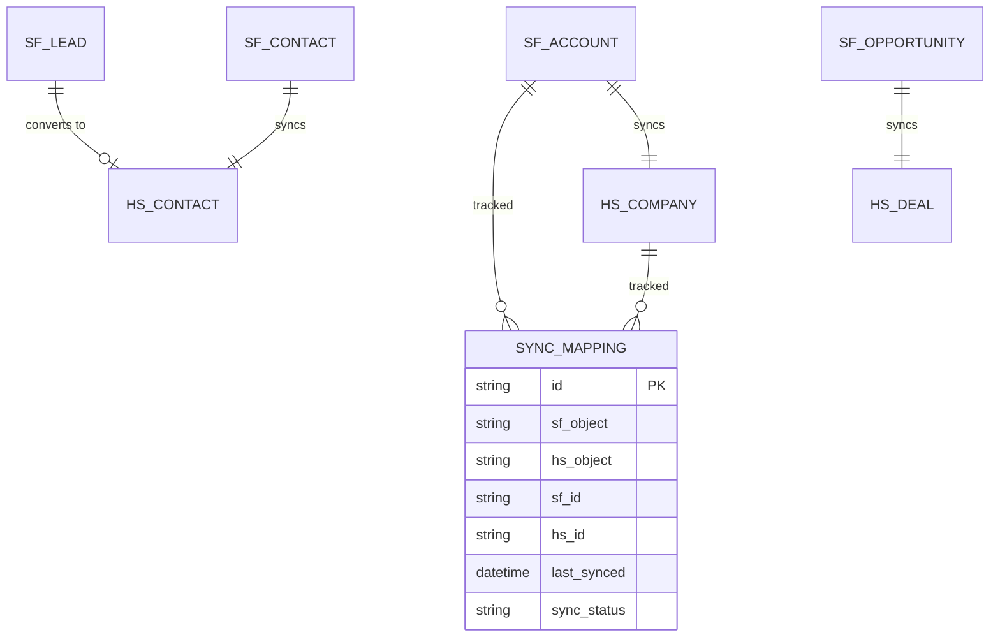

# ERD Syntax

## Basic Syntax

### Entity Definition


### Attribute Types
| Type | Example |
|------|---------|
| `string` | name, email |
| `int` | count, quantity |
| `float` | amount, rate |
| `date` | created_date |
| `datetime` | modified_datetime |
| `boolean` | is_active |

### Key Markers
| Marker | Meaning |
|--------|---------|
| `PK` | Primary Key |
| `FK` | Foreign Key |
| `UK` | Unique Key |

## Relationship Syntax

### Cardinality Notation


### Relationship Reference
| Symbol | Meaning |
|--------|---------|
| `\|\|` | Exactly one |
| `}o` | Zero or more |
| `\|{` | One or more |
| `o\|` | Zero or one |

### Full Syntax
```
<entity1> <relationship> <entity2> : "label"

Relationship format: <left-cardinality>--<right-cardinality>

Left side describes relationship from entity1's perspective
Right side describes relationship from entity2's perspective
```

## Salesforce Data Model Templates

### Standard Objects


### CPQ Data Model


### Service Cloud Model


## HubSpot Data Model Templates

### Core CRM


### Marketing Objects


## Cross-Platform Integration Model

### SF-HubSpot Sync


## Best Practices

### Naming Conventions
```
- Use UPPERCASE for entity names
- Use snake_case for attribute names
- Include PK/FK markers for keys
- Use descriptive relationship labels
```

### Complexity Management
```
For complex diagrams:
1. Group related entities
2. Use subgraphs or separate diagrams
3. Show only key attributes
4. Use consistent relationship directions
```
