# Flowchart Syntax

## Basic Syntax

### Node Shapes
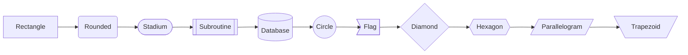

### Shape Reference
| Shape | Syntax | Use Case |
|-------|--------|----------|
| Rectangle | `[text]` | Standard step |
| Rounded | `(text)` | Process |
| Stadium | `([text])` | Start/End |
| Diamond | `{text}` | Decision |
| Circle | `((text))` | Connector |
| Database | `[(text)]` | Data store |
| Hexagon | `{{text}}` | Preparation |
| Parallelogram | `[/text/]` | Input/Output |
| Subroutine | `[[text]]` | Subprocess |

### Link Types
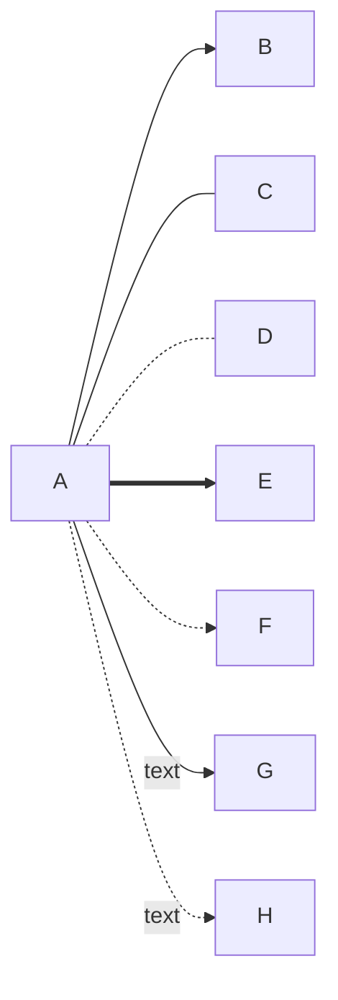

### Link Reference
| Link | Syntax | Description |
|------|--------|-------------|
| Arrow | `-->` | Standard flow |
| Open | `---` | Association |
| Dotted | `-.-` | Optional |
| Thick | `==>` | Emphasis |
| Dotted Arrow | `-.->` | Optional flow |
| Labeled | `--text-->` | Named connection |

## Styling

### Node Styling
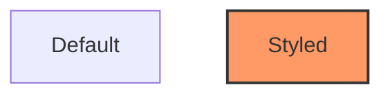

### Common Style Classes
```
classDef default fill:#fff,stroke:#333,stroke-width:1px
classDef highlight fill:#f96,stroke:#333,stroke-width:2px
classDef success fill:#9f6,stroke:#333,stroke-width:1px
classDef error fill:#f66,stroke:#333,stroke-width:1px
classDef warning fill:#ff9,stroke:#333,stroke-width:1px
classDef info fill:#9cf,stroke:#333,stroke-width:1px
classDef disabled fill:#ccc,stroke:#999,stroke-width:1px,stroke-dasharray:5
```

### Subgraphs
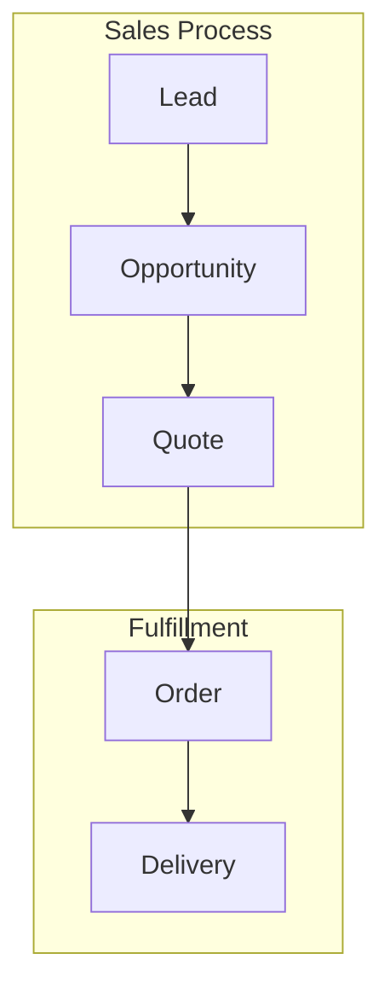

## Common Patterns

### Decision Tree
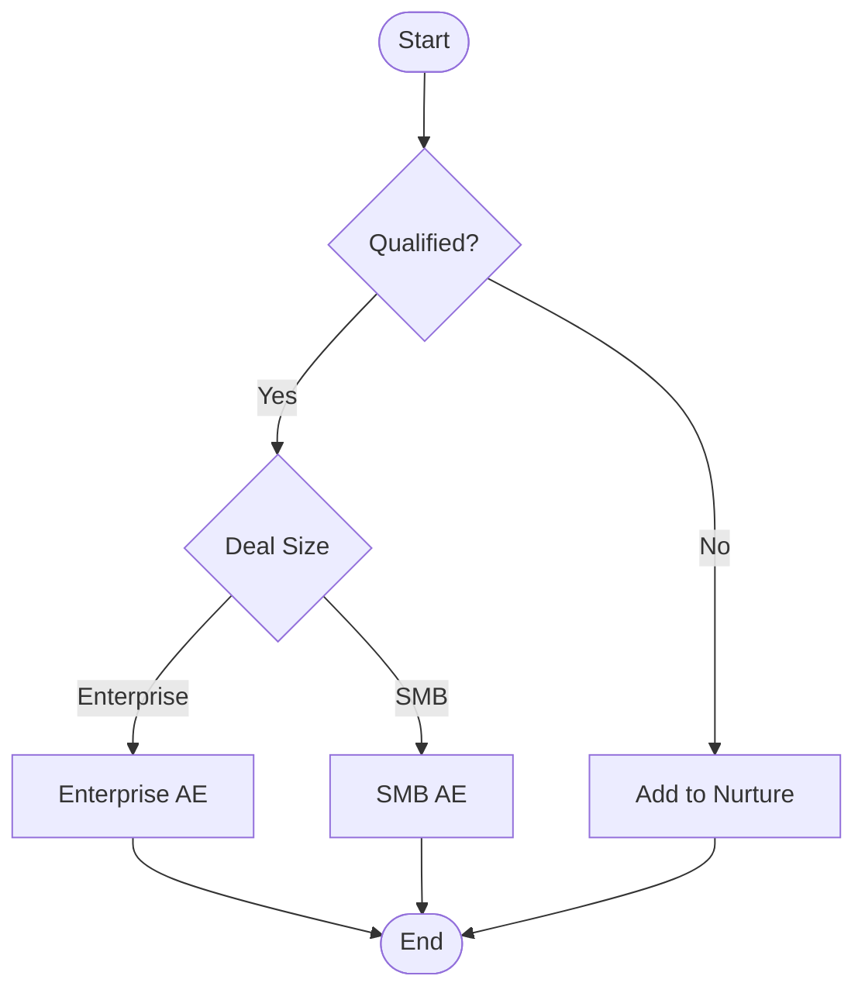

### Process Flow with Error Handling
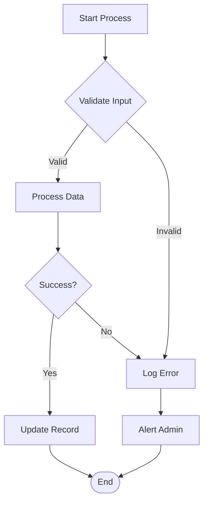

### Parallel Processes
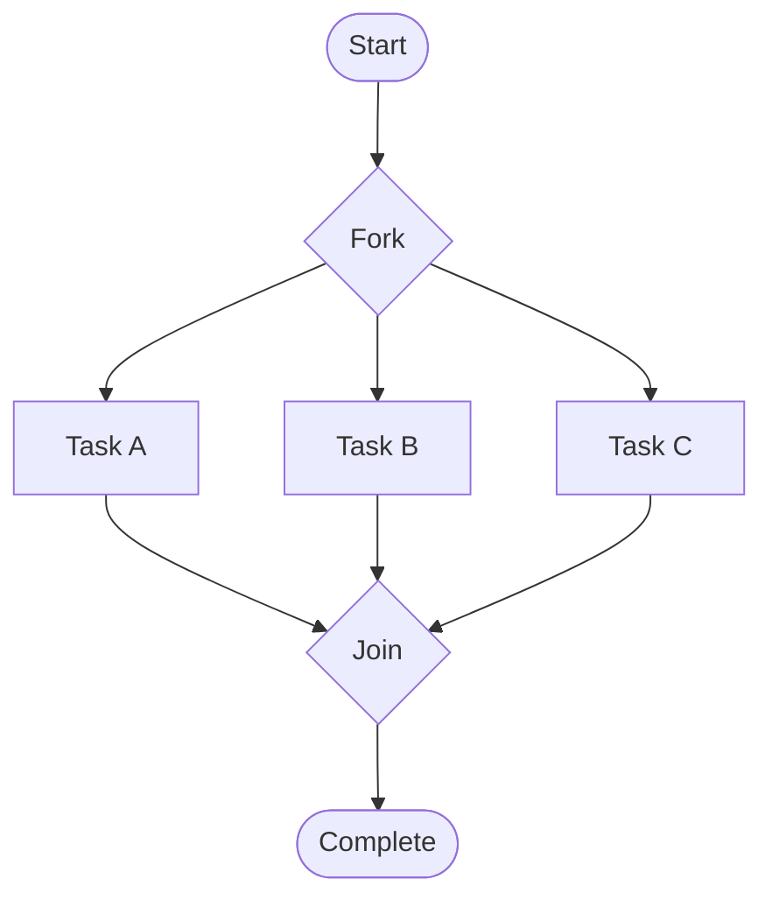

## Salesforce-Specific Templates

### Lead Conversion Flow
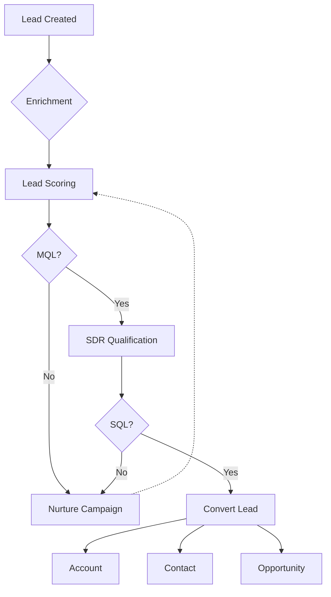

### Opportunity Stage Flow
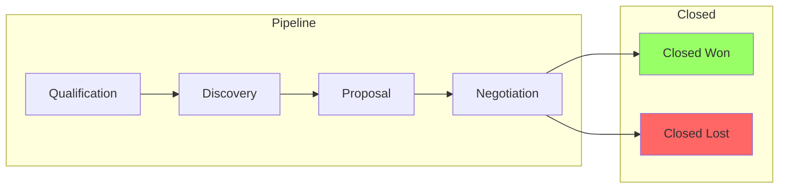

### Approval Process
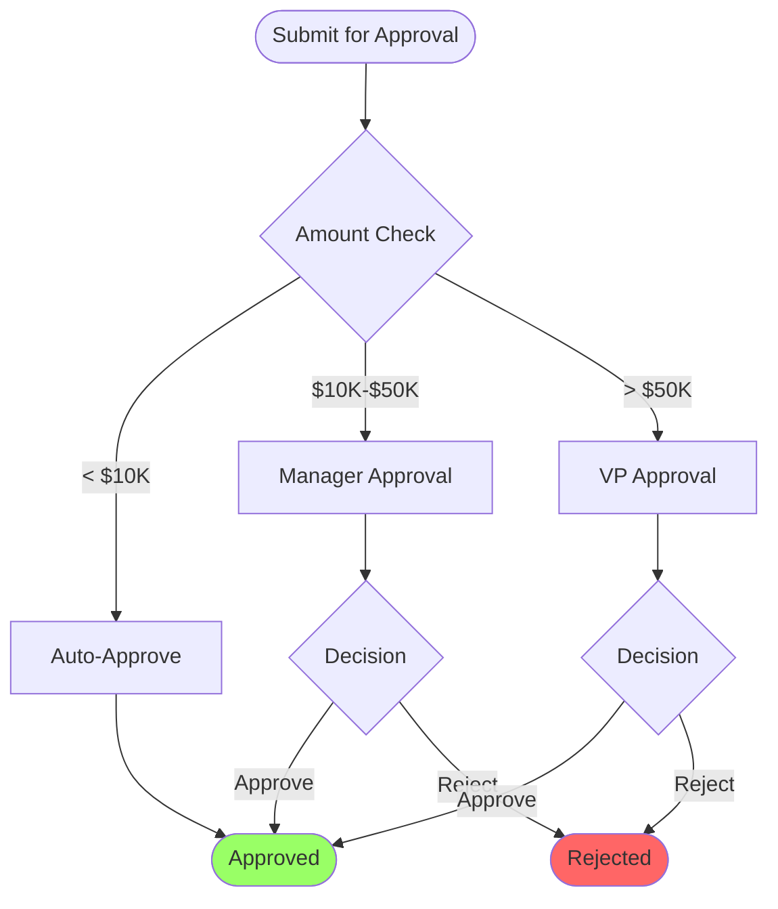

## HubSpot-Specific Templates

### Workflow Decision Flow
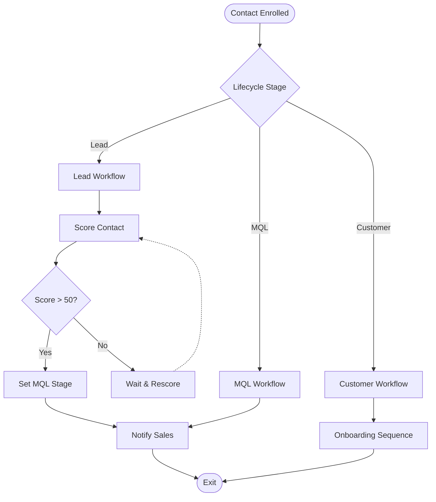

### Form Submission Flow
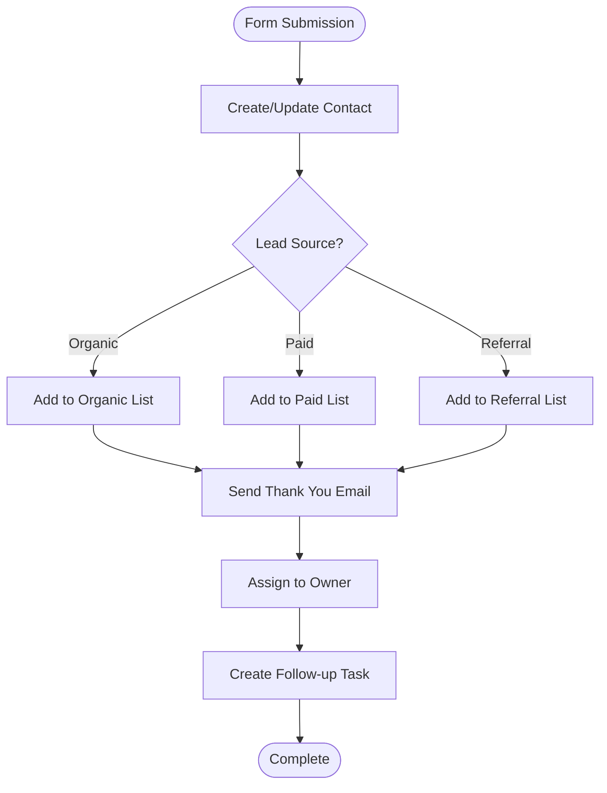
