# Sequence Diagram Syntax

## Basic Syntax

### Participants
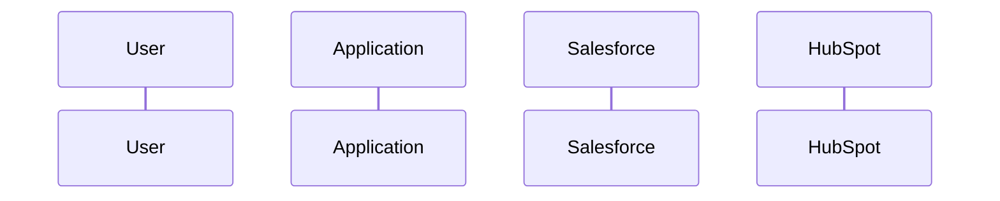

### Message Types
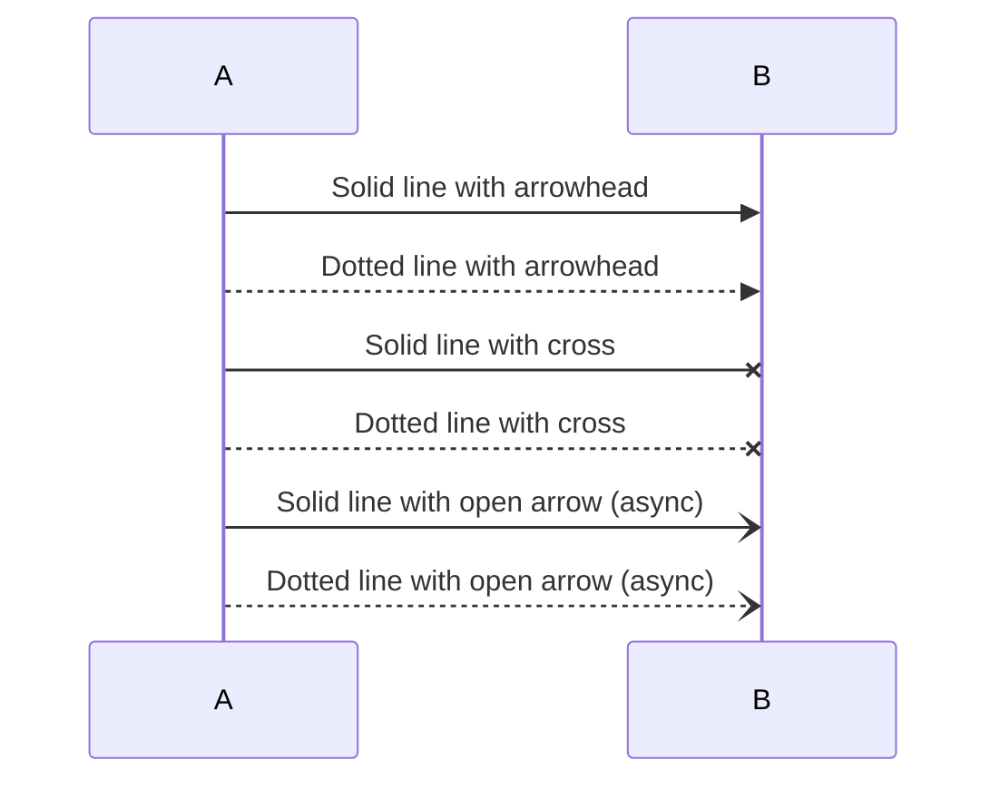

### Message Reference
| Arrow | Syntax | Meaning |
|-------|--------|---------|
| Solid arrow | `->>` | Synchronous request |
| Dotted arrow | `-->>` | Synchronous response |
| Solid async | `-)` | Async message |
| Dotted async | `--)` | Async response |
| Cross | `-x` | Failed message |

## Activation and Notes

### Activation Boxes
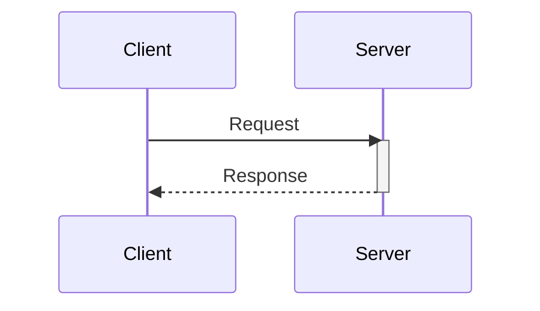

### Notes
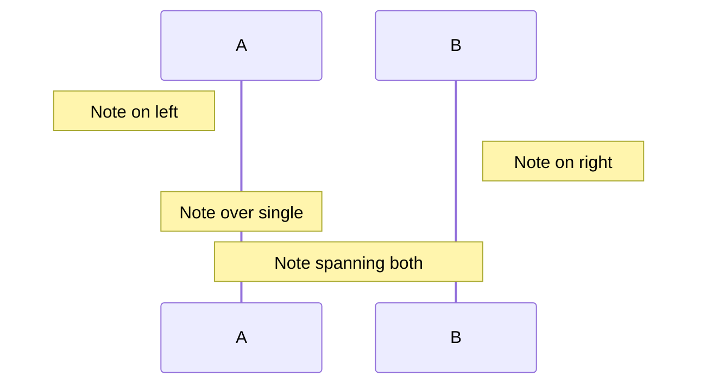

### Loops and Conditionals
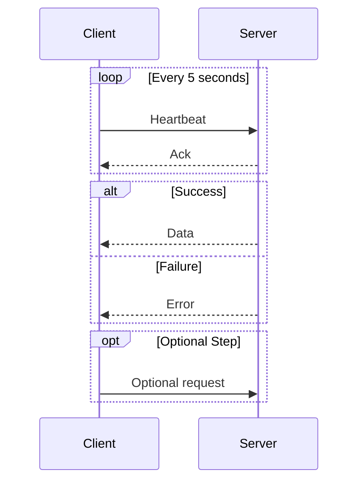

## Common Integration Patterns

### REST API Call
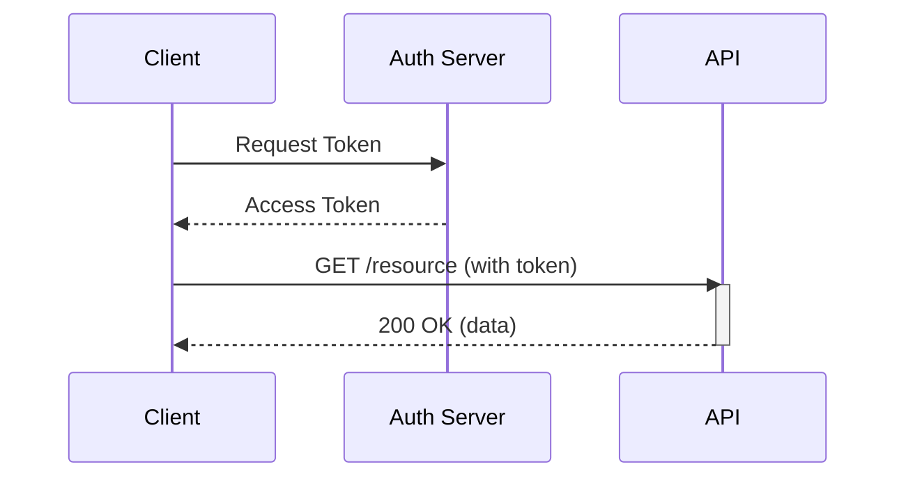

### OAuth 2.0 Flow
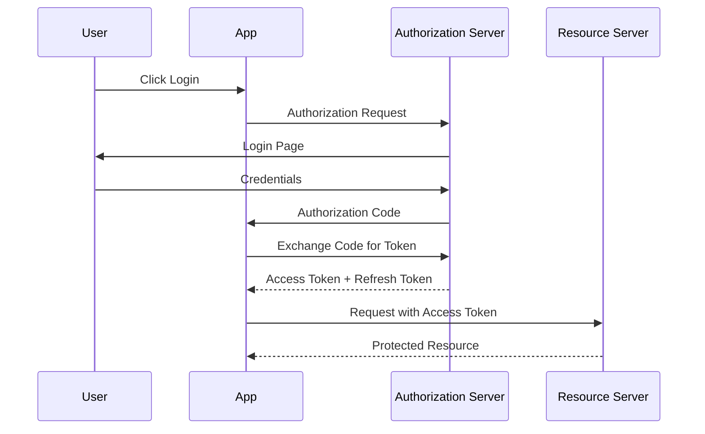

### Webhook Processing
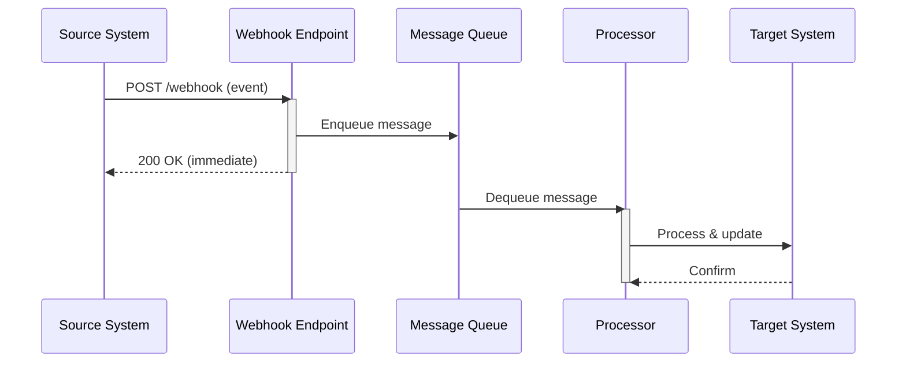

## Salesforce Integration Patterns

### API Callout
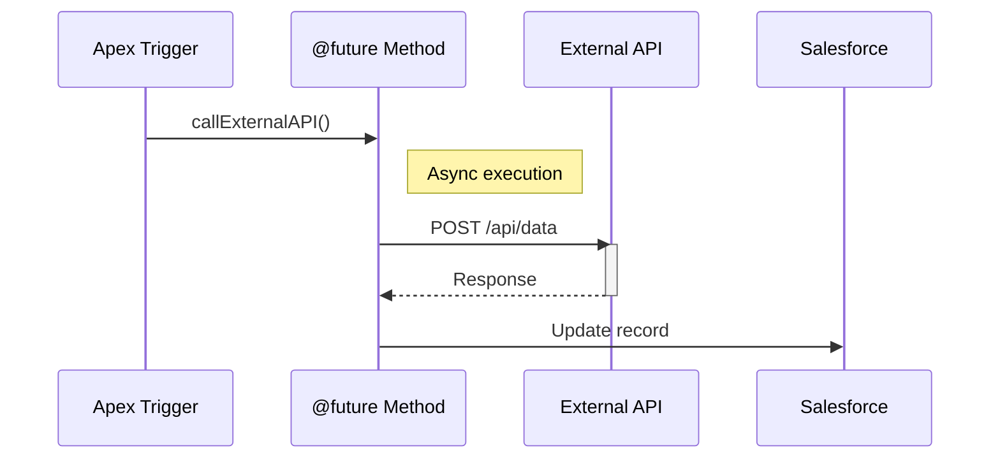

### Platform Event Flow
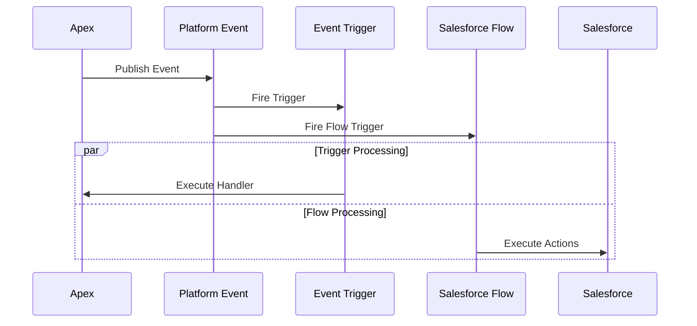

### Composite API
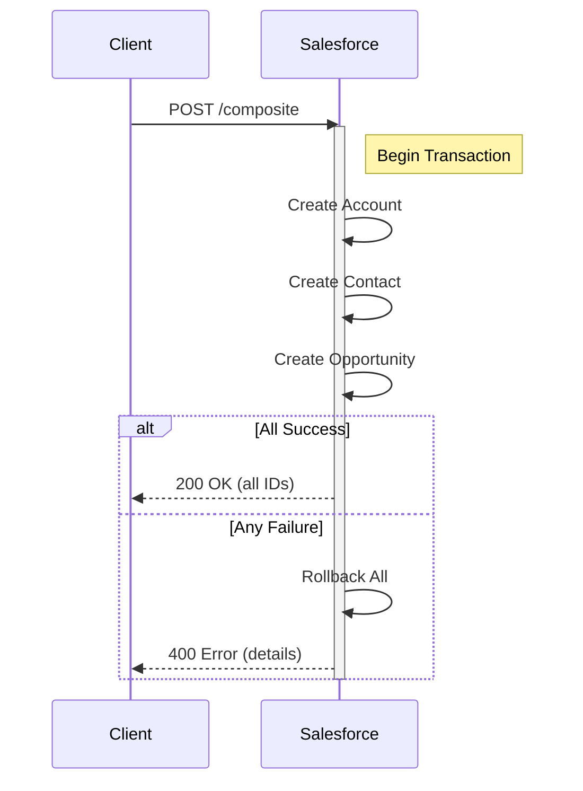

## HubSpot Integration Patterns

### CRM Sync
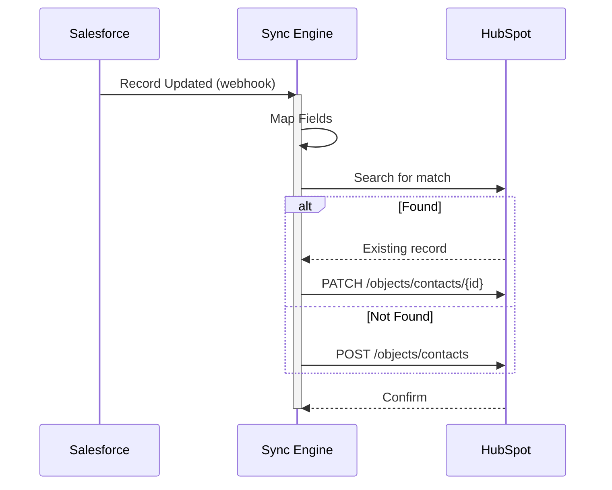

### Workflow Automation
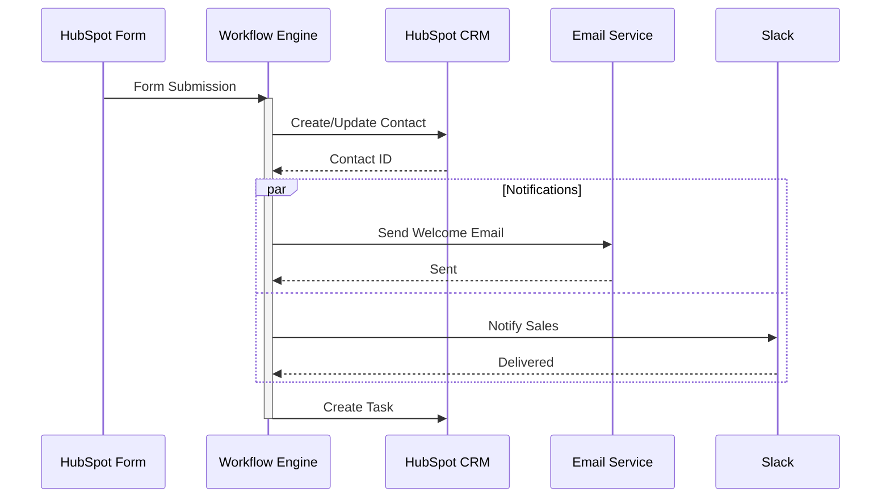

### Bidirectional Sync
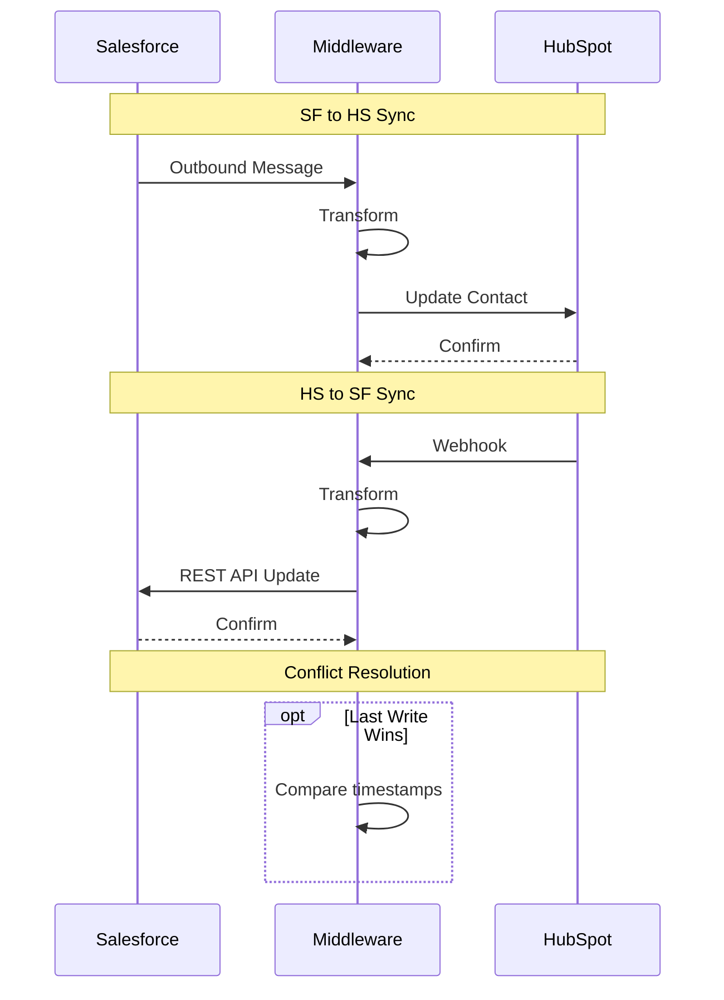
