# State Diagram Syntax

## Basic Syntax

### Simple States
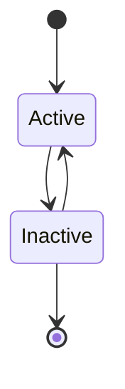

### State Descriptions
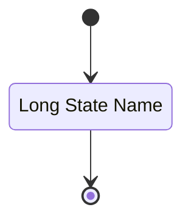

### Transitions with Labels
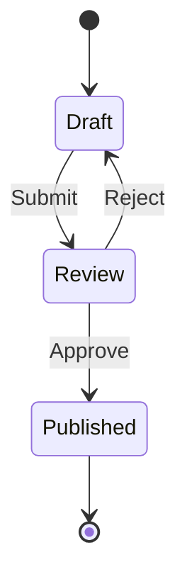

## Advanced Syntax

### Composite States
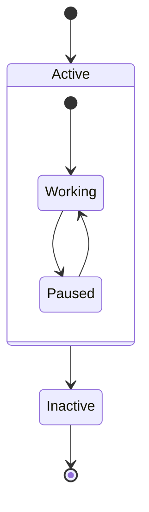

### Fork and Join
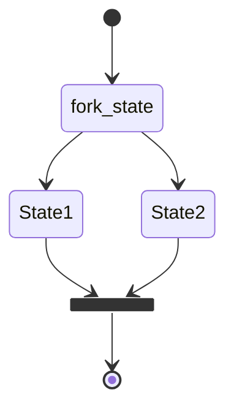

### Choice (Decision)
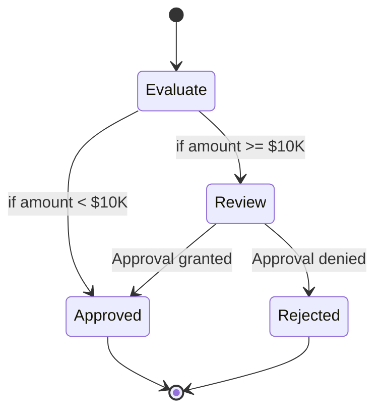

### Notes
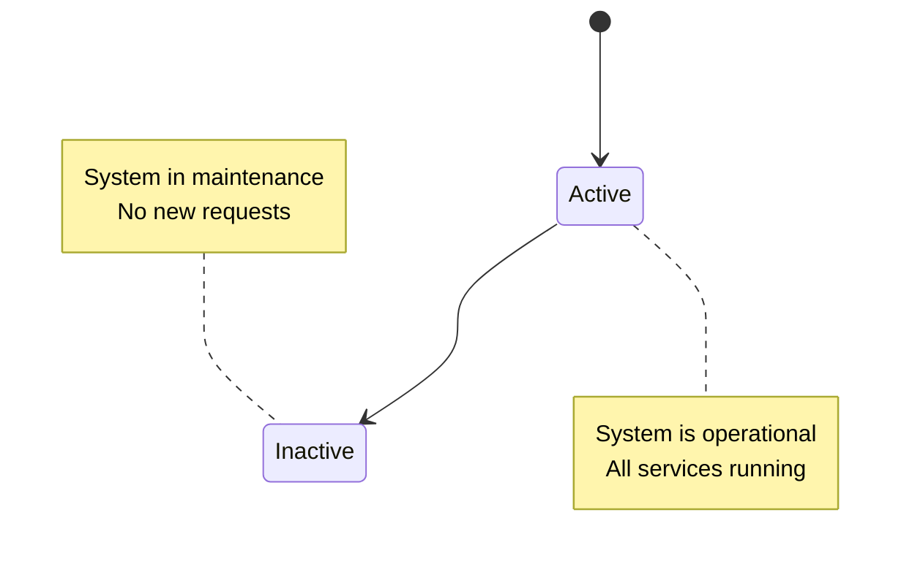

## Salesforce State Diagrams

### Lead Lifecycle
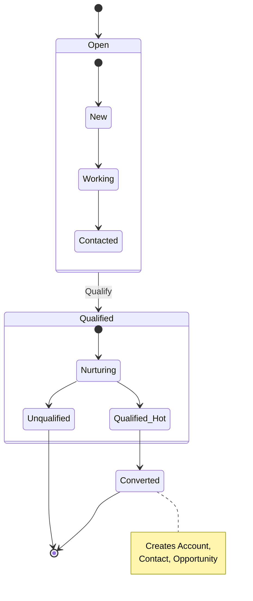

### Opportunity Stages
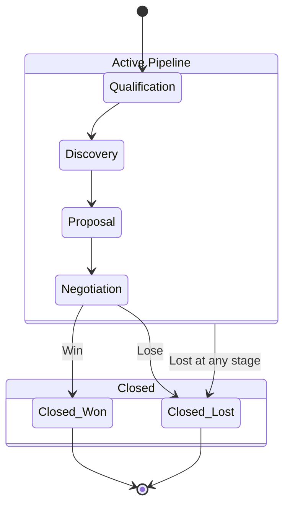

### Case Status Flow
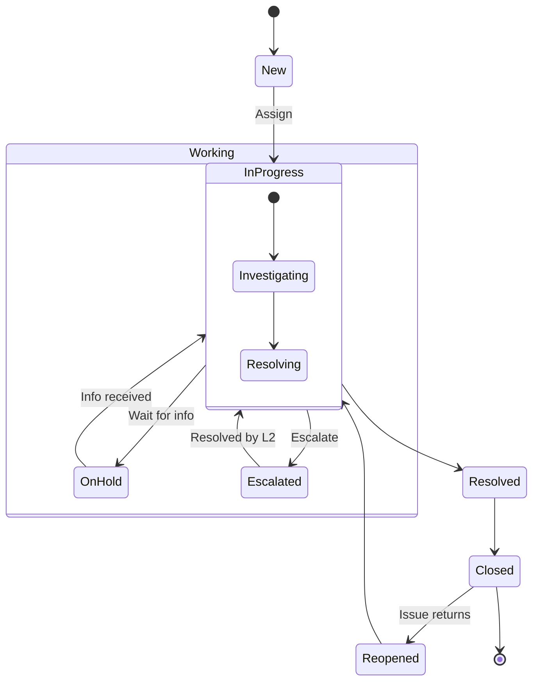

### Approval Flow
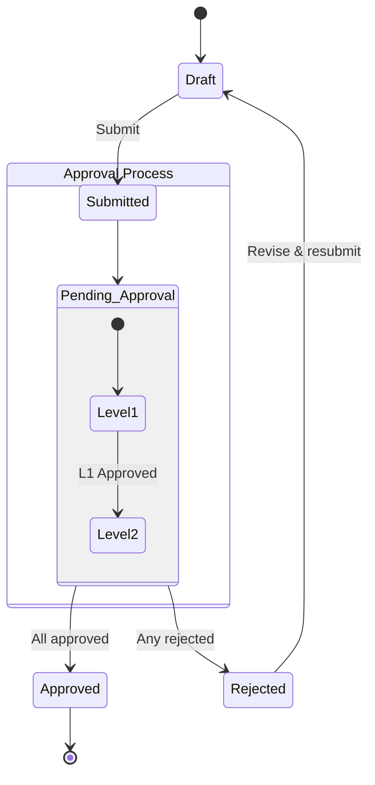

## HubSpot State Diagrams

### Contact Lifecycle
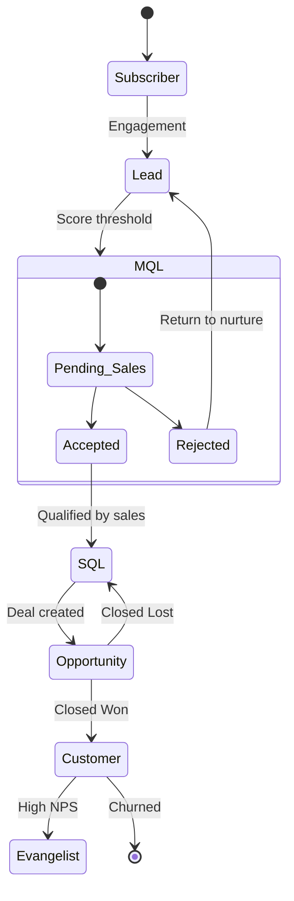

### Deal Pipeline
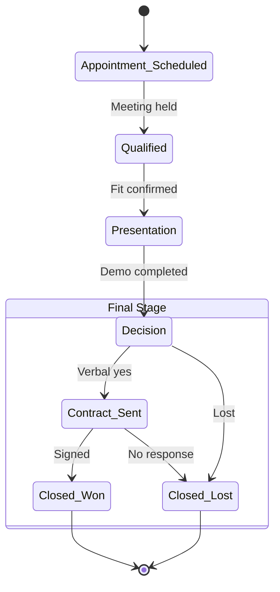

### Workflow Enrollment
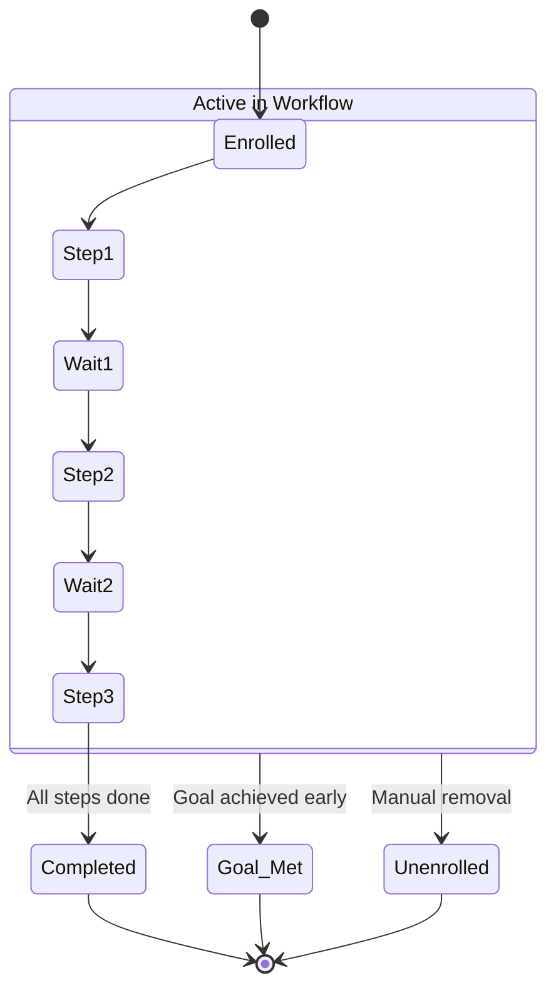

## Integration State Diagrams

### Sync Record State
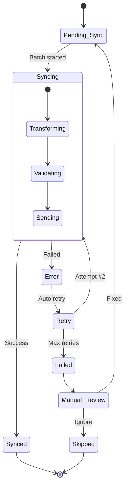

### API Request Lifecycle
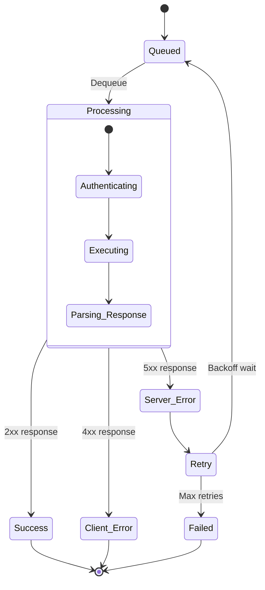
