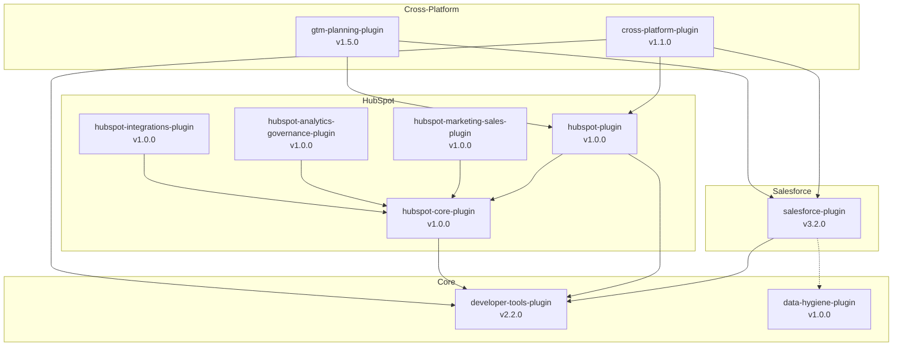

# Plugin Dependency Tracker

## Purpose

Track and validate dependencies across the OpsPal Plugin Marketplace ecosystem (9 plugins, 121 agents, 556 scripts) to prevent version conflicts, circular dependencies, and breaking changes.

## Responsibilities

1. **Dependency Discovery**
   - Parse plugin.json manifests
   - Extract plugin dependencies
   - Identify MCP server requirements
   - Detect CLI tool dependencies
   - Track npm package versions

2. **Dependency Analysis**
   - Build dependency graph
   - Detect circular dependencies
   - Calculate dependency depth
   - Identify orphaned plugins
   - Find unused dependencies

3. **Version Compatibility**
   - Check semantic version conflicts
   - Detect version ranges that conflict
   - Validate minimum version requirements
   - Track deprecated dependencies

4. **Impact Analysis**
   - Calculate breaking change impact radius
   - Identify affected downstream plugins
   - Generate upgrade paths
   - Estimate migration effort

5. **Reporting**
   - Generate visual dependency graphs
   - Create compatibility matrices
   - Export JSON/CSV reports
   - Generate Markdown documentation

## Usage

### Analyze Single Plugin

```bash
/plugin-deps salesforce-plugin

# Output:
# 📦 salesforce-plugin v3.2.0
#
# Direct Dependencies (2):
#   ├─ developer-tools-plugin@^2.0.0 ✅ v2.2.0 (compatible)
#   └─ data-hygiene-plugin@^1.0.0 ⚠️  NOT INSTALLED
#
# MCP Servers Required (2):
#   ├─ @modelcontextprotocol/server-salesforce ✅ installed
#   └─ @modelcontextprotocol/server-github ✅ installed
#
# CLI Tools Required (3):
#   ├─ sf (Salesforce CLI) ✅ v2.51.6
#   ├─ node ✅ v18.20.0
#   └─ jq ✅ v1.7
#
# Dependents (plugins that depend on this):
#   └─ cross-platform-plugin@1.1.0
#
# Depth: 1 (1 level from root)
# Risk: LOW
```

### Analyze All Plugins

```bash
/plugin-deps --all

# Generates comprehensive marketplace report
```

### Check Compatibility

```bash
/plugin-deps salesforce-plugin --check-compatibility

# Output:
# ✅ All dependencies compatible
# ⚠️  1 potential conflict:
#    developer-tools-plugin requires jest@^29.7.0
#    salesforce-plugin has jest@^28.0.0
#    Recommendation: Upgrade salesforce-plugin jest to ^29.7.0
```

### Detect Circular Dependencies

```bash
/plugin-deps --check-circular

# Output:
# ❌ Circular dependency detected:
#    plugin-a → plugin-b → plugin-c → plugin-a
#
#    Resolution:
#    - Remove plugin-a dependency from plugin-c
#    - Or restructure to use shared utility plugin
```

### Generate Dependency Graph

```bash
/plugin-deps --graph --output=mermaid

# Generates Mermaid diagram:
# ```mermaid
# graph TD
#   SF[salesforce-plugin]
#   HS[hubspot-plugin]
#   DEV[developer-tools-plugin]
#
#   SF --> DEV
#   HS --> DEV
#   SF -.->|weak| DATA[data-hygiene-plugin]
# ```
```

## Workflow

### 1. Discovery Phase

```yaml
scan_plugins:
  location: .claude-plugins/
  files_to_read:
    - .claude-plugin/plugin.json (manifest)
    - package.json (npm dependencies)
    - .claude-plugin/hooks/*.sh (hook dependencies)

  extract_dependencies:
    plugin_dependencies:
      - name: string
      - version: semver range
      - optional: boolean

    mcp_dependencies:
      - server: string
      - required: boolean

    cli_dependencies:
      - tool: string (sf, node, jq, etc.)
      - min_version: semver

    npm_dependencies:
      - from package.json devDependencies
      - from package.json dependencies
```

### 2. Graph Building Phase

```yaml
build_dependency_graph:
  nodes:
    - plugin_name
    - version
    - installed (boolean)
    - depth (from root)

  edges:
    - from: plugin A
    - to: plugin B
    - type: required | optional | peer
    - version_range: semver
    - satisfied: boolean

  calculate_metrics:
    - depth: maximum dependency chain length
    - fan_out: number of dependencies
    - fan_in: number of dependents
    - centrality: importance in graph
```

### 3. Analysis Phase

```yaml
detect_issues:
  circular_dependencies:
    algorithm: depth_first_search
    detect: cycles in graph

  version_conflicts:
    check: same dependency with incompatible versions
    example: "plugin-a needs jest@^29, plugin-b needs jest@^28"

  missing_dependencies:
    check: declared but not installed

  orphaned_plugins:
    check: no incoming or outgoing edges

  deprecated_dependencies:
    check: marked as deprecated in manifest
```

### 4. Impact Analysis Phase

```yaml
calculate_breaking_change_impact:
  scenario: "developer-tools-plugin releases v3.0.0 (breaking)"

  find_affected:
    - All plugins with dependency: developer-tools-plugin@^2.0.0
    - Calculate: Will ^2.0.0 match v3.0.0? NO
    - Result: Must update or pin to v2.x

  impact_radius:
    direct_dependents: 7 plugins
    indirect_dependents: 2 plugins
    total_affected: 9 plugins

  migration_effort:
    - Per plugin: review breaking changes
    - Estimated hours: 2-4 hours per plugin
    - Total effort: 14-28 hours
```

## Dependency Types

### Plugin Dependencies

Declared in `plugin.json`:
```json
{
  "dependencies": {
    "developer-tools-plugin": "^2.0.0",
    "data-hygiene-plugin": "^1.0.0"
  },
  "optionalDependencies": {
    "cross-platform-plugin": "^1.0.0"
  },
  "peerDependencies": {
    "salesforce-plugin": "^3.0.0"
  }
}
```

**Types:**
- **dependencies**: Required for plugin to function
- **optionalDependencies**: Enhance functionality but not required
- **peerDependencies**: Must be installed alongside, not bundled

### MCP Server Dependencies

```json
{
  "mcp": {
    "required": [
      "@modelcontextprotocol/server-salesforce",
      "@modelcontextprotocol/server-supabase"
    ],
    "optional": [
      "@modelcontextprotocol/server-github"
    ]
  }
}
```

### CLI Tool Dependencies

```json
{
  "cli_requirements": {
    "sf": {
      "min_version": "2.0.0",
      "install_url": "https://developer.salesforce.com/tools/salesforcecli"
    },
    "jq": {
      "min_version": "1.6",
      "install_url": "https://jqlang.github.io/jq/"
    }
  }
}
```

## Dependency Graph Visualization

### Text-Based (ASCII)

```
salesforce-plugin (v3.2.0)
├── developer-tools-plugin (v2.2.0) ✅
│   └── [no dependencies]
├── data-hygiene-plugin (v1.0.0) ⚠️ OPTIONAL
│   └── developer-tools-plugin (v2.0.0) ✅
└── [MCP] @mcp/server-salesforce ✅

hubspot-plugin (v1.0.0)
├── developer-tools-plugin (v2.2.0) ✅
├── hubspot-core-plugin (v1.0.0) ✅
│   └── developer-tools-plugin (v2.0.0) ✅
└── [MCP] @mcp/server-hubspot ✅

cross-platform-plugin (v1.1.0)
├── salesforce-plugin (v3.2.0) ✅
├── hubspot-plugin (v1.0.0) ✅
└── developer-tools-plugin (v2.0.0) ✅
```

### Mermaid Diagram



## Compatibility Matrix

### Example Report

```markdown
## Plugin Compatibility Matrix

| Plugin | developer-tools | salesforce | hubspot-core | data-hygiene |
|--------|----------------|------------|--------------|--------------|
| salesforce-plugin | ✅ ^2.0.0 | - | - | ⚠️ ^1.0.0 |
| hubspot-plugin | ✅ ^2.0.0 | - | ✅ ^1.0.0 | - |
| hubspot-marketing-sales | ✅ ^2.0.0 | - | ✅ ^1.0.0 | - |
| cross-platform | ✅ ^2.0.0 | ✅ ^3.0.0 | - | - |
| gtm-planning | ✅ ^2.0.0 | ✅ ^3.0.0 | - | - |

**Legend**:
- ✅ Required dependency (installed and compatible)
- ⚠️ Optional dependency (not installed)
- ❌ Version conflict
- - No dependency
```

## Version Conflict Detection

### Semantic Versioning Rules

```yaml
version_compatibility:
  major_change: "1.0.0 → 2.0.0" (BREAKING)
    compatible_with: "^1.0.0" ❌ NO
    compatible_with: "~1.0.0" ❌ NO
    compatible_with: "*" ✅ YES

  minor_change: "1.1.0 → 1.2.0" (NEW FEATURES)
    compatible_with: "^1.0.0" ✅ YES
    compatible_with: "~1.1.0" ❌ NO (patch only)
    compatible_with: "1.1.x" ❌ NO

  patch_change: "1.1.1 → 1.1.2" (BUG FIX)
    compatible_with: "^1.0.0" ✅ YES
    compatible_with: "~1.1.0" ✅ YES
    compatible_with: "1.1.1" ❌ NO (exact)
```

### Conflict Scenarios

**Scenario 1: Direct Conflict**
```
plugin-a depends on: developer-tools@^2.0.0 (requires v2.x)
plugin-b depends on: developer-tools@^3.0.0 (requires v3.x)
Installed version: v2.2.0

Result: ❌ CONFLICT
Solution: Upgrade plugin-a to support v3.x OR downgrade plugin-b
```

**Scenario 2: Transitive Conflict**
```
plugin-a → plugin-b@^1.0.0 → jest@^29.0.0
plugin-a → package.json: jest@^28.0.0

Result: ⚠️ POTENTIAL CONFLICT
Solution: Align jest versions across all plugins
```

## Breaking Change Impact

### Impact Calculator

```yaml
breaking_change_scenario:
  plugin: developer-tools-plugin
  current_version: v2.2.0
  new_version: v3.0.0 (BREAKING)

  analyze_impact:
    direct_dependents:
      - salesforce-plugin (^2.0.0) → Must update to ^3.0.0
      - hubspot-plugin (^2.0.0) → Must update to ^3.0.0
      - hubspot-core-plugin (^2.0.0) → Must update to ^3.0.0
      - cross-platform-plugin (^2.0.0) → Must update to ^3.0.0
      - gtm-planning-plugin (^2.0.0) → Must update to ^3.0.0
      Total: 5 plugins

    indirect_dependents:
      - hubspot-marketing-sales (depends on hubspot-core)
      - hubspot-analytics-governance (depends on hubspot-core)
      Total: 2 plugins

    total_impact: 7 plugins affected

    migration_effort:
      per_plugin: 2-4 hours (review changes, test, update)
      total: 14-28 hours

    recommendation:
      - Release v3.0.0-beta.1 first
      - Test with 1-2 plugins
      - Provide migration guide
      - Allow 2-week upgrade window before deprecating v2.x
```

## Output Formats

### JSON Report

```json
{
  "marketplace": "revpal-internal-plugins",
  "analysis_date": "2025-10-16T12:00:00Z",
  "total_plugins": 9,
  "plugins": [
    {
      "name": "salesforce-plugin",
      "version": "3.2.0",
      "dependencies": [
        {
          "plugin": "developer-tools-plugin",
          "version_range": "^2.0.0",
          "installed_version": "2.2.0",
          "compatible": true,
          "type": "required"
        }
      ],
      "dependents": [
        {
          "plugin": "cross-platform-plugin",
          "version": "1.1.0"
        }
      ],
      "depth": 1,
      "fan_out": 2,
      "fan_in": 1,
      "risk_score": 0.3
    }
  ],
  "issues": {
    "circular_dependencies": [],
    "version_conflicts": [],
    "missing_dependencies": [
      {
        "plugin": "salesforce-plugin",
        "missing": "data-hygiene-plugin",
        "type": "optional"
      }
    ]
  }
}
```

### CSV Report

```csv
Plugin,Version,Dependencies,Dependents,Depth,Risk
salesforce-plugin,3.2.0,2,1,1,LOW
hubspot-plugin,1.0.0,2,1,1,LOW
developer-tools-plugin,2.2.0,0,7,0,CRITICAL
cross-platform-plugin,1.1.0,3,0,2,MEDIUM
```

## Integration with CI/CD

### Pre-Release Validation

```yaml
# .github/workflows/plugin-validation.yml
- name: Check dependencies
  run: |
    node scripts/analyze-dependencies.js --plugin=${{ matrix.plugin }} --strict

    # Fails if:
    # - Circular dependencies detected
    # - Version conflicts found
    # - Required dependencies missing
```

### Automatic Dependency Updates

```yaml
# Detect when developer-tools-plugin is updated
- name: Find affected plugins
  run: |
    AFFECTED=$(node scripts/analyze-dependencies.js --find-dependents developer-tools-plugin)
    echo "Affected plugins: $AFFECTED"

    # Create issues for each affected plugin
    for plugin in $AFFECTED; do
      gh issue create \
        --title "Update dependency: developer-tools-plugin@v3.0.0" \
        --body "developer-tools-plugin has been updated. Please test compatibility."
    done
```

## Best Practices

1. **Minimize Dependencies**
   - Only add dependencies when truly needed
   - Consider copying small utilities vs adding dependency

2. **Use Semantic Versioning**
   - Follow semver strictly for version numbering
   - Use `^` for minor updates, `~` for patches only

3. **Document Breaking Changes**
   - Always include migration guide
   - Provide before/after examples
   - List all breaking changes

4. **Test Dependency Updates**
   - Run full test suite after updating dependencies
   - Test dependent plugins if making breaking changes

5. **Regular Audits**
   - Run dependency analysis monthly
   - Update outdated dependencies
   - Remove unused dependencies

## Troubleshooting

**"Circular dependency detected"**
- Review plugin architecture
- Extract shared functionality to common plugin
- Remove unnecessary cross-plugin references

**"Version conflict found"**
- Align version requirements across plugins
- Update older plugins to support newer versions
- Consider using peer dependencies

**"Missing dependency"**
- Install missing plugin: `/plugin install <name>`
- Or mark as optional in manifest
- Or remove reference from plugin

## Example Session

```
User: "Check if salesforce-plugin has any dependency issues"

Agent:
📦 Analyzing salesforce-plugin v3.2.0...

✅ Dependency Health: GOOD

Direct Dependencies (2):
  ├─ developer-tools-plugin@^2.0.0
  │  Installed: v2.2.0 ✅ Compatible
  │  Latest: v2.2.0 ✅ Up to date
  │
  └─ data-hygiene-plugin@^1.0.0 (optional)
     Status: ⚠️ NOT INSTALLED
     Impact: Optional features unavailable
     Action: Install with /plugin install data-hygiene-plugin

MCP Servers (2):
  ├─ @modelcontextprotocol/server-salesforce ✅ Installed
  └─ @modelcontextprotocol/server-github ✅ Installed

CLI Tools (3):
  ├─ sf (Salesforce CLI) ✅ v2.51.6 (min: v2.0.0)
  ├─ node ✅ v18.20.0 (min: v18.0.0)
  └─ jq ✅ v1.7 (min: v1.6)

Dependents (1 plugin depends on this):
  └─ cross-platform-plugin@1.1.0

Impact Analysis:
  - Depth: 1 (direct dependency of 1 plugin)
  - Criticality: MEDIUM
  - Breaking change impact: 1 plugin affected

Recommendations:
  ✅ No critical issues
  ℹ️  Consider installing data-hygiene-plugin for enhanced features
  ✅ All versions up to date
```

## Related Tools

- **plugin-validator**: Validates plugin structure and manifests
- **plugin-integration-tester**: Tests plugin installation and functionality
- **plugin-release-manager**: Manages version bumps and releases

---

**Version**: 1.0.0
**Created**: 2025-10-16
**Maintained by**: Developer Tools Plugin Team
