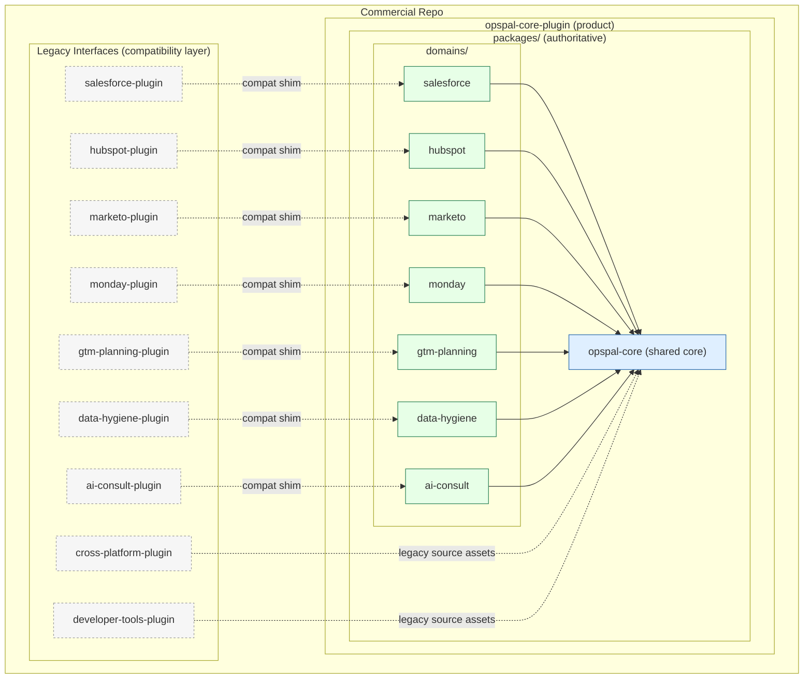

# OpsPal Core Architecture

## Compatibility Shims (Package-Local)
- `opspal-core/cross-platform-plugin` and `opspal-core/developer-tools-plugin` provide root-style layouts with symlinks to package assets.
- Domain packages include symlinks back to these roots to satisfy legacy relative imports without changing runtime behavior.
