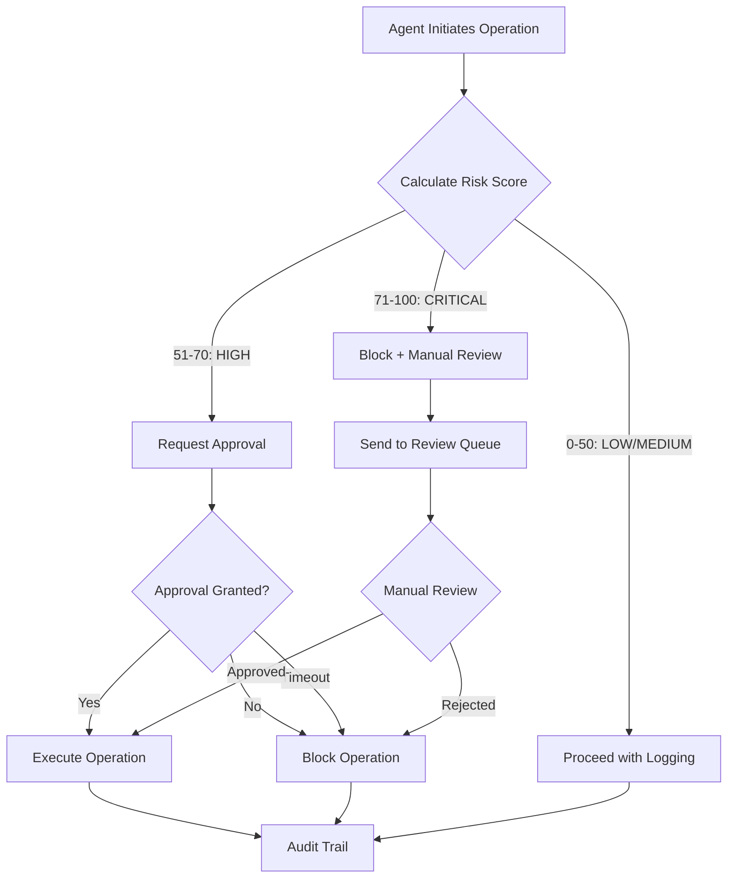
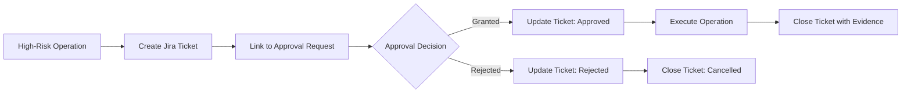

# Agent Governance Framework
## Agentic Salesforce System Safeguards

**Version**: 1.0.0
**Status**: ✅ Production Ready
**Created**: 2025-10-25
**Purpose**: Define governance controls, risk management, and human-in-the-loop safeguards for AI-powered Salesforce agents

---

## Executive Summary

The Agent Governance Framework provides comprehensive controls for autonomous AI agents operating in Salesforce environments. This framework addresses the unique risks of agentic systems while maintaining operational efficiency.

### Key Principles

1. **Least Privilege**: Agents have minimum necessary permissions
2. **Risk-Based Controls**: High-risk operations require human approval
3. **Auditability**: All agent actions are logged and traceable
4. **Fail-Safe**: Errors block operations rather than proceeding
5. **Transparency**: Agent decision-making is explainable

### Framework Components

```
┌─────────────────────────────────────────────────────────────┐
│                  Agent Governance System                    │
├─────────────────────────────────────────────────────────────┤
│                                                             │
│  ┌─────────────────────────────────────────────────────┐  │
│  │  1. Permission Matrix (Who Can Do What)            │  │
│  │     - Agent capabilities by type                    │  │
│  │     - Environment restrictions                      │  │
│  │     - Operation limits                              │  │
│  └─────────────────────────────────────────────────────┘  │
│                            ↓                                │
│  ┌─────────────────────────────────────────────────────┐  │
│  │  2. Risk Scoring Engine (Should This Happen?)       │  │
│  │     - Impact assessment (0-100)                     │  │
│  │     - Blast radius calculation                      │  │
│  │     - Historical risk analysis                      │  │
│  └─────────────────────────────────────────────────────┘  │
│                            ↓                                │
│  ┌─────────────────────────────────────────────────────┐  │
│  │  3. Human-in-the-Loop Controller (Get Approval)     │  │
│  │     - Approval routing rules                        │  │
│  │     - Escalation policies                           │  │
│  │     - Emergency override                            │  │
│  └─────────────────────────────────────────────────────┘  │
│                            ↓                                │
│  ┌─────────────────────────────────────────────────────┐  │
│  │  4. Audit Trail (What Happened?)                    │  │
│  │     - Action logging                                │  │
│  │     - Decision reasoning capture                    │  │
│  │     - Compliance reporting                          │  │
│  └─────────────────────────────────────────────────────┘  │
│                                                             │
└─────────────────────────────────────────────────────────────┘
```

### Operational Reliability Addendum (2025-12-29)

To keep governance checks stable across machines and instance-scoped runs, the plugin syncs Salesforce CLI auth metadata into each instance folder when needed.

- **What it does**: Copies existing auth + key material from `~/.sfdx` into the instance `.sfdx`, and ensures `.sf/config.json` has `target-org`.
- **Why it matters**: Prevents alias-not-found errors when `HOME` or `SF_CONFIG_DIR` is set to an instance directory.
- **Where it lives**: `scripts/lib/sf-auth-sync.js` (preflight) and `scripts/lib/sf-wrapper.sh` (automatic wrapper).
- **Opt-out**: Set `SF_AUTH_SYNC=0` to disable the preflight.
- **If auth is missing**: Run `sf org login web --alias <alias>` once on the machine.

---

## 1. Agent Permission Matrix

### Permission Levels

Agents are classified into permission tiers based on potential impact:

#### Tier 1: Read-Only Agents
**Permissions**: Query data, read metadata, generate reports
**No Approval Required**
**Example Agents**: `sfdc-state-discovery`, `sfdc-reports-usage-auditor`

```json
{
  "tier": 1,
  "permissions": {
    "read": ["*"],
    "write": [],
    "deploy": [],
    "delete": []
  },
  "requiresApproval": false,
  "maxRecordsPerQuery": 50000
}
```

#### Tier 2: Standard Operations
**Permissions**: CRUD on records, create reports/dashboards, deploy non-destructive metadata
**Approval Required**: >1000 records, production environment
**Example Agents**: `sfdc-data-operations`, `sfdc-reports-dashboards`

```json
{
  "tier": 2,
  "permissions": {
    "read": ["*"],
    "write": ["records"],
    "deploy": ["reports", "dashboards", "layouts"],
    "delete": []
  },
  "requiresApproval": {
    "production": true,
    "recordCountThreshold": 1000,
    "bulkOperations": true
  },
  "maxRecordsPerOperation": 10000
}
```

#### Tier 3: Metadata Management
**Permissions**: Deploy fields, flows, validation rules, permission sets
**Approval Required**: Always in production, >5 components in sandbox
**Example Agents**: `sfdc-metadata-manager`, `sfdc-deployment-manager`

```json
{
  "tier": 3,
  "permissions": {
    "read": ["*"],
    "write": ["records", "metadata"],
    "deploy": ["fields", "flows", "validation rules", "permission sets"],
    "delete": []
  },
  "requiresApproval": {
    "production": true,
    "sandbox": {
      "componentCountThreshold": 5
    },
    "fields": true,
    "flows": true
  },
  "maxComponentsPerDeployment": 50
}
```

#### Tier 4: Security & Permissions
**Permissions**: Modify profiles, permission sets, roles, sharing rules
**Approval Required**: Always (all environments)
**Example Agents**: `sfdc-security-admin`, `sfdc-permission-orchestrator`

```json
{
  "tier": 4,
  "permissions": {
    "read": ["*"],
    "write": ["records", "metadata", "security"],
    "deploy": ["profiles", "permission sets", "roles", "sharing rules"],
    "delete": []
  },
  "requiresApproval": {
    "all": true,
    "multipleApprovers": true
  },
  "requiresDocumentation": true,
  "requiresRollbackPlan": true
}
```

#### Tier 5: Destructive Operations
**Permissions**: Delete records, destructive metadata changes
**Approval Required**: Always + executive approval
**Example Agents**: Custom agents only (none by default)

```json
{
  "tier": 5,
  "permissions": {
    "read": ["*"],
    "write": ["records", "metadata"],
    "deploy": ["*"],
    "delete": ["records", "metadata"]
  },
  "requiresApproval": {
    "all": true,
    "executiveApproval": true,
    "multipleApprovers": true
  },
  "requiresDocumentation": true,
  "requiresRollbackPlan": true,
  "requiresBackup": true,
  "maxRecordsPerDelete": 100
}
```

---

## 2. Risk Scoring Engine

### Risk Calculation Algorithm

Risk scores range from 0 (no risk) to 100 (critical risk). Operations with risk >70 are automatically blocked and require manual review.

#### Risk Factors

```javascript
riskScore =
  impactScore (0-30) +
  environmentRisk (0-25) +
  volumeRisk (0-20) +
  historicalRisk (0-15) +
  complexityRisk (0-10)
```

#### 1. Impact Score (0-30)
**What data/functionality is affected?**

| Impact Level | Score | Examples |
|--------------|-------|----------|
| No impact | 0 | Read-only queries |
| Low impact | 5 | Non-critical field updates |
| Medium impact | 10 | Custom field creation |
| High impact | 20 | Validation rule deployment |
| Critical impact | 30 | Security/permission changes |

#### 2. Environment Risk (0-25)
**Where is this operation happening?**

| Environment | Score | Rationale |
|-------------|-------|-----------|
| Dev sandbox | 0 | Safe testing environment |
| QA sandbox | 5 | Pre-production testing |
| UAT sandbox | 10 | User acceptance testing |
| Full sandbox | 15 | Production replica |
| Production | 25 | Live customer data |

#### 3. Volume Risk (0-20)
**How many records/components affected?**

```javascript
if (recordCount === 0) return 0;
if (recordCount < 100) return 2;
if (recordCount < 1000) return 5;
if (recordCount < 10000) return 10;
if (recordCount < 50000) return 15;
return 20; // 50k+
```

#### 4. Historical Risk (0-15)
**Has this operation caused issues before?**

```javascript
const historicalData = getAgentHistory(agentName, operationType);
const failureRate = historicalData.failures / historicalData.attempts;

if (failureRate === 0) return 0;
if (failureRate < 0.05) return 3;  // <5% failure
if (failureRate < 0.10) return 7;  // 5-10% failure
if (failureRate < 0.20) return 12; // 10-20% failure
return 15; // 20%+ failure rate
```

#### 5. Complexity Risk (0-10)
**How complex is this operation?**

| Complexity | Score | Indicators |
|------------|-------|------------|
| Simple | 0 | Single SOQL query, single field deployment |
| Low | 2 | Multiple queries, <5 components |
| Medium | 5 | Complex SOQL, 5-10 components, dependencies |
| High | 8 | Cross-object updates, 10+ components |
| Very High | 10 | Circular dependencies, recursive updates |

### Risk Thresholds

```javascript
const riskThresholds = {
  LOW: 0-30,        // Proceed automatically
  MEDIUM: 31-50,    // Proceed with logging + notification
  HIGH: 51-70,      // Require approval
  CRITICAL: 71-100  // Block + manual review required
};
```

### Example Risk Calculations

#### Example 1: Query 500 Accounts in Production
```javascript
impactScore = 0 (read-only)
environmentRisk = 25 (production)
volumeRisk = 5 (500 records)
historicalRisk = 0 (no failures)
complexityRisk = 0 (simple query)

Total Risk = 30 (LOW - proceed)
```

#### Example 2: Deploy Custom Field to Production
```javascript
impactScore = 10 (custom field)
environmentRisk = 25 (production)
volumeRisk = 0 (no records)
historicalRisk = 3 (1% failure rate)
complexityRisk = 2 (low complexity)

Total Risk = 40 (MEDIUM - proceed with notification)
```

#### Example 3: Update Permission Set in Production
```javascript
impactScore = 30 (security change)
environmentRisk = 25 (production)
volumeRisk = 0 (metadata only)
historicalRisk = 7 (8% failure rate)
complexityRisk = 5 (moderate complexity)

Total Risk = 67 (HIGH - require approval)
```

#### Example 4: Bulk Update 50,000 Records in Production
```javascript
impactScore = 10 (record updates)
environmentRisk = 25 (production)
volumeRisk = 20 (50k records)
historicalRisk = 12 (15% failure rate)
complexityRisk = 8 (high volume complexity)

Total Risk = 75 (CRITICAL - block + manual review)
```

---

## 3. Human-in-the-Loop Controller

### Approval Routing

Operations requiring approval are routed based on risk level and operation type:

#### Approval Matrix

| Risk Level | Operation Type | Approver(s) | Response Time |
|------------|----------------|-------------|---------------|
| HIGH (51-70) | Data operations | Team Lead | 1 hour |
| HIGH | Metadata deployment | Architect | 4 hours |
| HIGH | Security changes | Security Lead | 2 hours |
| CRITICAL (71-100) | Data operations | Team Lead + Manager | 4 hours |
| CRITICAL | Metadata deployment | Architect + Director | 1 business day |
| CRITICAL | Security changes | Security Lead + CISO | 1 business day |
| CRITICAL | Destructive operations | Director + VP | 2 business days |

### Approval Request Format

```json
{
  "requestId": "AR-2025-10-25-001",
  "timestamp": "2025-10-25T14:30:00Z",
  "agent": "sfdc-security-admin",
  "operation": {
    "type": "UPDATE_PERMISSION_SET",
    "description": "Add field permissions to AgentAccess permission set",
    "target": "production",
    "affectedUsers": 45,
    "affectedComponents": ["AgentAccess Permission Set", "Account.CustomField__c"]
  },
  "riskScore": 67,
  "riskLevel": "HIGH",
  "riskFactors": [
    "Security impact: 30 points",
    "Production environment: 25 points",
    "Historical 8% failure rate: 7 points",
    "Moderate complexity: 5 points"
  ],
  "reasoning": "This operation adds field-level security permissions for a newly deployed custom field. Required for data operations agent to function.",
  "rollbackPlan": "Remove field permissions from permission set if issues occur",
  "requiredApprovers": ["security-lead@company.com"],
  "approvalDeadline": "2025-10-25T16:30:00Z",
  "status": "PENDING"
}
```

### Approval Workflow



### Emergency Override

For critical production issues, authorized personnel can override approval requirements:

```bash
# Emergency override (use with extreme caution)
export AGENT_GOVERNANCE_OVERRIDE=true
export OVERRIDE_REASON="Production outage - ticket #12345"
export OVERRIDE_APPROVER="john.doe@company.com"
export OVERRIDE_APPROVAL_CODE="<one-time-code-from-security>"

# Operation will proceed with override logged
```

**Override Triggers**:
- Immediate notification to security team
- Audit log entry with full context
- Follow-up review required within 24 hours
- Override code expires after single use

---

## 4. Audit Trail System

### Audit Log Format

All agent actions are logged with complete context:

```json
{
  "logId": "AL-2025-10-25-14-30-45-001",
  "timestamp": "2025-10-25T14:30:45.123Z",
  "agent": "sfdc-security-admin",
  "operation": "UPDATE_PERMISSION_SET",
  "riskScore": 67,
  "riskLevel": "HIGH",
  "approvalRequired": true,
  "approvalStatus": "GRANTED",
  "approvers": ["security-lead@company.com"],
  "approvalTime": "2025-10-25T14:45:00Z",
  "environment": {
    "org": "production",
    "orgId": "00D...",
    "instanceUrl": "https://company.my.salesforce.com"
  },
  "operation_details": {
    "permissionSet": "AgentAccess",
    "fieldsAdded": ["Account.CustomField__c"],
    "permissionsGranted": ["read", "edit"]
  },
  "execution": {
    "startTime": "2025-10-25T14:45:15Z",
    "endTime": "2025-10-25T14:45:20Z",
    "durationMs": 5000,
    "success": true,
    "errors": []
  },
  "verification": {
    "performed": true,
    "passed": true,
    "method": "post-deployment-state-verifier.js"
  },
  "reasoning": {
    "intent": "Enable field access for data operations",
    "alternatives_considered": [
      "Add to profile (rejected - affects all users)",
      "Create new permission set (rejected - unnecessary)"
    ],
    "decision_rationale": "Updating existing permission set is minimal impact"
  },
  "rollback": {
    "planExists": true,
    "planDescription": "Remove field permissions if issues occur",
    "rollbackCommand": "node .claude-plugins/opspal-core-plugin/packages/domains/salesforce/scripts/lib/permission-set-rollback.js production AgentAccess Account.CustomField__c"
  }
}
```

### Audit Trail Storage

Audit logs are stored in multiple locations for redundancy:

1. **Local filesystem**: `.claude/logs/agent-governance/`
2. **Supabase database**: `agent_actions` table
3. **Org audit trail**: via Salesforce Event Monitoring (if available)

### Audit Log Retention

- **Production**: 7 years (compliance requirement)
- **Sandbox**: 2 years
- **Dev**: 6 months

### Compliance Reporting

Generate compliance reports from audit trail:

```bash
# Generate GDPR compliance report
node .claude-plugins/opspal-core-plugin/packages/domains/salesforce/scripts/lib/compliance-report-generator.js gdpr \
  --start-date 2025-01-01 \
  --end-date 2025-10-25 \
  --output ./reports/gdpr-2025-Q3.pdf

# Generate SOX compliance report
node .claude-plugins/opspal-core-plugin/packages/domains/salesforce/scripts/lib/compliance-report-generator.js sox \
  --quarter Q3-2025 \
  --output ./reports/sox-Q3-2025.pdf
```

---

## 5. Integration with Existing Agents

### Agent Integration Checklist

All agents must integrate with the governance framework:

- [ ] Declare permission tier in agent frontmatter
- [ ] Call risk scoring before operations
- [ ] Handle approval requests gracefully
- [ ] Log all operations to audit trail
- [ ] Provide rollback plans for high-risk operations
- [ ] Document decision reasoning

### Example Agent Integration

```yaml
---
name: sfdc-metadata-manager
tier: 3
description: Manages Salesforce metadata with comprehensive validation pipeline
tools: mcp_salesforce, Read, Write, Bash
governanceIntegration: true
---

# Agent Implementation

## Before Any Operation

```javascript
const { AgentGovernance } = require('.claude-plugins/opspal-core-plugin/packages/domains/salesforce/scripts/lib/agent-governance');
const governance = new AgentGovernance('sfdc-metadata-manager');

// Calculate risk score
const risk = await governance.calculateRisk({
  operation: 'DEPLOY_CUSTOM_FIELD',
  environment: orgAlias,
  components: fieldMetadata,
  recordCount: 0
});

// Check if approval required
if (risk.requiresApproval) {
  const approval = await governance.requestApproval({
    operation: 'DEPLOY_CUSTOM_FIELD',
    target: orgAlias,
    risk: risk,
    reasoning: 'Deploy custom field for new feature XYZ',
    rollbackPlan: 'Delete field if validation fails'
  });

  if (!approval.granted) {
    throw new Error(`Operation blocked: ${approval.reason}`);
  }
}

// Execute operation
const result = await deployField(fieldMetadata);

// Log to audit trail
await governance.logAction({
  operation: 'DEPLOY_CUSTOM_FIELD',
  risk: risk,
  approval: approval,
  result: result,
  verification: verificationResult
});
```

---

## 6. Configuration Files

### agent-permission-matrix.json

```json
{
  "version": "1.0.0",
  "lastUpdated": "2025-10-25",
  "agents": {
    "sfdc-state-discovery": {
      "tier": 1,
      "permissions": ["read"],
      "maxRecordsPerQuery": 50000,
      "requiresApproval": false
    },
    "sfdc-data-operations": {
      "tier": 2,
      "permissions": ["read", "write:records"],
      "maxRecordsPerOperation": 10000,
      "requiresApproval": {
        "production": true,
        "recordCountThreshold": 1000
      }
    },
    "sfdc-metadata-manager": {
      "tier": 3,
      "permissions": ["read", "write:records", "deploy:metadata"],
      "maxComponentsPerDeployment": 50,
      "requiresApproval": {
        "production": true,
        "sandbox": {
          "componentCountThreshold": 5
        }
      }
    },
    "sfdc-security-admin": {
      "tier": 4,
      "permissions": ["read", "write:records", "write:security"],
      "requiresApproval": {
        "all": true
      },
      "requiresDocumentation": true,
      "requiresRollbackPlan": true
    }
  },
  "environmentRestrictions": {
    "production": {
      "allowedTiers": [1, 2, 3, 4],
      "requiresApprovalForTiers": [2, 3, 4, 5],
      "maxRecordsPerOperation": 10000,
      "deploymentWindow": {
        "days": ["Tuesday", "Thursday"],
        "hours": "22:00-02:00 UTC",
        "exceptions": ["emergency-override"]
      }
    },
    "sandbox": {
      "allowedTiers": [1, 2, 3, 4, 5],
      "requiresApprovalForTiers": [5],
      "maxRecordsPerOperation": 50000
    }
  }
}
```

---

## 7. Monitoring & Alerting

### Real-Time Monitoring

Agent governance system provides real-time dashboards:

- **Active operations**: Currently running agent actions
- **Pending approvals**: Operations awaiting human review
- **Risk distribution**: Histogram of risk scores
- **Approval latency**: Time from request to approval
- **Override usage**: Frequency and justification of overrides

### Alert Triggers

Automated alerts are sent for:

| Event | Severity | Recipients |
|-------|----------|------------|
| CRITICAL risk operation blocked | HIGH | Security team, Engineering lead |
| Multiple approval rejections | MEDIUM | Agent developer, Team lead |
| Emergency override used | HIGH | Security team, CISO |
| Approval timeout (SLA breach) | MEDIUM | Approver, Approver's manager |
| Unusual risk pattern (>10 high-risk in 1 hour) | HIGH | Engineering lead, Operations |

---

## 8. Continuous Improvement

### Risk Model Tuning

Risk scoring is continuously refined based on outcomes:

- **False positives**: Operations blocked unnecessarily → lower risk weights
- **False negatives**: Risky operations that should have been blocked → increase risk weights
- **Historical analysis**: Monthly review of risk vs. actual impact

### Agent Behavior Analysis

Monthly agent governance review:

1. **High-risk agents**: Agents frequently triggering approvals
2. **Approval patterns**: Which operations are commonly rejected
3. **Override analysis**: Are overrides justified?
4. **Process improvements**: Can automation reduce approval burden?

---

## 9. Testing & Validation

### Governance Framework Tests

```bash
# Test risk scoring
npm test -- agent-risk-scorer.test.js

# Test approval routing
npm test -- human-in-the-loop-controller.test.js

# Test audit logging
npm test -- agent-action-audit-logger.test.js

# Integration tests
npm test -- agent-governance-integration.test.js
```

### Simulated Scenarios

Governance framework includes test scenarios:

- High-risk production deployment
- Emergency override usage
- Approval timeout handling
- Multi-approver coordination
- Rollback execution

---

## 10. Rollout Plan

### Phase 1: Monitoring Mode (Week 1-2)
- Deploy governance framework
- Calculate risk scores but don't block
- Log all operations
- Tune risk thresholds

### Phase 2: Soft Enforcement (Week 3-4)
- Block CRITICAL risk operations
- Require approval for HIGH risk
- Allow MEDIUM/LOW to proceed
- Monitor approval latency

### Phase 3: Full Enforcement (Week 5+)
- Enforce all risk thresholds
- Remove bypass flags
- Lock down production access
- Continuous monitoring

---

## 11. Phase 2: Compliance Automation Enhancements

### Overview

Phase 2 adds three critical compliance automation components to the governance framework:

1. **API Usage Monitoring**: Real-time tracking and quota management
2. **Change Management Integration**: Jira/ServiceNow ticket automation
3. **Enhanced PII Detection**: Value-based classification with 90-95% accuracy

---

### 11.1 API Usage Monitor

**Purpose**: Prevent API limit exhaustion and optimize API consumption across all agents.

**Implementation**: `scripts/lib/api-usage-monitor.js` (677 lines)

#### Key Features

- **Real-Time Tracking**: Automatic interception via `post-sf-command.sh` hook
- **Threshold Alerts**: 70% (WARNING), 85% (CRITICAL), 95% (EMERGENCY)
- **Weekly Reports**: Usage summaries with optimization recommendations
- **Pre-Operation Validation**: Check quota before high-volume operations
- **Per-Agent Breakdown**: Identify top API consumers

#### Usage

```bash
# Check current usage
node .claude-plugins/opspal-core-plugin/packages/domains/salesforce/scripts/lib/api-usage-monitor.js status production

# Generate weekly report
node .claude-plugins/opspal-core-plugin/packages/domains/salesforce/scripts/lib/api-usage-monitor.js report production --save

# Pre-operation quota check (before bulk operations)
node .claude-plugins/opspal-core-plugin/packages/domains/salesforce/scripts/lib/api-usage-monitor.js check production 500
```

#### Integration with Governance

The API monitor integrates with the risk scoring engine:

```javascript
// Before bulk operation
const currentUsage = await apiMonitor.getCurrentUsage(orgAlias);
const estimatedCalls = calculateAPICallsNeeded(operation);

if (currentUsage.percentOfDaily + estimatedCalls > 85) {
  // Increase risk score
  riskScore += 15;
  riskFactors.push(`Would exceed 85% API quota`);
}
```

#### Alert Configuration

Configure alerts in `config/api-usage-config.json`:

```json
{
  "thresholds": {
    "WARNING": 0.70,
    "CRITICAL": 0.85,
    "EMERGENCY": 0.95
  },
  "alerts": {
    "slack": true,
    "email": false,
    "console": true
  },
  "limits": {
    "daily": 15000,
    "hourly": 1000
  }
}
```

---

### 11.2 Change Management Integration

**Purpose**: Automate change ticket creation for HIGH/CRITICAL risk operations with bidirectional status sync.

**Implementation**: `scripts/lib/change-ticket-manager.js` (553 lines)

#### Supported Systems

- **Jira**: Full REST API integration
- **ServiceNow**: Planned (configuration ready)

#### Automatic Ticket Creation

Tickets are automatically created when:

1. Risk level is HIGH (51-70)
2. Risk level is CRITICAL (71-100)
3. Environment is production
4. Operation requires approval

#### Ticket Lifecycle



#### Ticket Format

**Jira Ticket Structure**:
```
Summary: [sfdc-security-admin] Permission Set Update in production

Description:
━━━━━━━━━━━━━━━━━━━━━━━━━━━━━━━━━━━━━━━━━━━━━
🎯 OPERATION DETAILS
━━━━━━━━━━━━━━━━━━━━━━━━━━━━━━━━━━━━━━━━━━━━━

Operation Type: UPDATE_PERMISSION_SET
Environment: production
Agent: sfdc-security-admin

━━━━━━━━━━━━━━━━━━━━━━━━━━━━━━━━━━━━━━━━━━━━━
⚠️ RISK ASSESSMENT
━━━━━━━━━━━━━━━━━━━━━━━━━━━━━━━━━━━━━━━━━━━━━

Risk Score: 67/100 (HIGH)

Risk Breakdown:
  • Security impact: 30 points
  • Production environment: 25 points
  • Historical 8% failure rate: 7 points
  • Moderate complexity: 5 points

━━━━━━━━━━━━━━━━━━━━━━━━━━━━━━━━━━━━━━━━━━━━━
📋 APPROVAL REQUIREMENTS
━━━━━━━━━━━━━━━━━━━━━━━━━━━━━━━━━━━━━━━━━━━━━

Required Approvers: security-lead@company.com
Approval Deadline: 2025-10-25 16:30 UTC

━━━━━━━━━━━━━━━━━━━━━━━━━━━━━━━━━━━━━━━━━━━━━
🔄 ROLLBACK PLAN
━━━━━━━━━━━━━━━━━━━━━━━━━━━━━━━━━━━━━━━━━━━━━

Remove field permissions from permission set if issues occur

Labels: agent-governance, risk-high
Priority: High
```

#### Bidirectional Sync

The change ticket manager maintains sync between approval status and ticket status:

| Approval Event | Jira Transition | Comment Added |
|----------------|-----------------|---------------|
| Approval Requested | Create ticket | Operation details + risk |
| Approval Granted | "Approved" | Approver + timestamp |
| Approval Rejected | "Rejected" | Rejection reason |
| Operation Complete | "Done" | Evidence + verification |
| Operation Failed | "Done" | Error details |

#### Configuration

Configure in `config/change-management-config.json`:

```json
{
  "jira": {
    "enabled": true,
    "url": "${JIRA_URL}",
    "email": "${JIRA_EMAIL}",
    "apiToken": "${JIRA_API_TOKEN}",
    "projectKey": "${JIRA_PROJECT_KEY:-SFDC}",
    "customFields": {
      "riskScore": "customfield_10001",
      "agentName": "customfield_10002",
      "environment": "customfield_10003"
    }
  },
  "routing": {
    "HIGH": "jira",
    "CRITICAL": "jira"
  }
}
```

#### Integration with Human-in-the-Loop

Modified `human-in-the-loop-controller.js` to automatically:

1. Create ticket after approval request
2. Link ticket ID to approval request
3. Update ticket status on approval/rejection
4. Close ticket with operation evidence

```javascript
// In human-in-the-loop-controller.js
if (risk.riskLevel === 'HIGH' || risk.riskLevel === 'CRITICAL') {
  const ticket = await ticketManager.createTicket(operation, risk, approvalRequest);
  approvalRequest.changeTicket = {
    system: 'jira',
    ticketId: ticket.ticketId,
    ticketUrl: ticket.ticketUrl
  };
}
```

---

### 11.3 Enhanced PII Detection

**Purpose**: Achieve 90-95% accuracy in PII detection through value-based classification.

**Implementation**: Enhanced `scripts/lib/data-classification-framework.js` (+341 lines)

#### Detection Methods

##### 1. Name-Based Detection (Original)
- Matches field names/labels against PII patterns
- ~70-80% accuracy
- Fast, no API calls required

##### 2. Value-Based Detection (NEW)
- Samples actual field values (up to 100 records)
- Applies regex pattern matching on values
- ~90-95% accuracy
- Catches creative field naming

##### 3. Composite PII Detection (NEW)
- Identifies multi-field combinations that create PII
- Examples: FirstName + LastName, DOB + ZIP

#### Pattern Library

```javascript
const patterns = {
  EMAIL: /^[a-zA-Z0-9._%+-]+@[a-zA-Z0-9.-]+\.[a-zA-Z]{2,}$/,
  PHONE: /^[\d\s\-\(\)\.+]{10,}$/,
  SSN: /^\d{3}-?\d{2}-?\d{4}$/,
  CREDIT_CARD: /^\d{4}[\s\-]?\d{4}[\s\-]?\d{4}[\s\-]?\d{4}$/,
  ZIP_CODE: /^\d{5}(-\d{4})?$/,
  DATE_OF_BIRTH: /^(19|20)\d{2}-(0[1-9]|1[0-2])-(0[1-9]|[12]\d|3[01])$/,
  IP_ADDRESS: /^\d{1,3}\.\d{1,3}\.\d{1,3}\.\d{1,3}$/,
  URL: /^https?:\/\/.+/
};
```

#### Composite PII Rules

```javascript
// FirstName + LastName = DIRECT_IDENTIFIER
if (hasField(/first.*name/i) && hasField(/last.*name/i)) {
  return {
    type: 'FULL_NAME',
    classification: 'RESTRICTED',
    piiCategory: 'DIRECT_IDENTIFIER'
  };
}

// DOB + ZIP = QUASI_IDENTIFIER (87% re-identification rate)
if (hasField(/birth.*date|dob/i) && hasField(/zip|postal/i)) {
  return {
    type: 'QUASI_IDENTIFIER',
    classification: 'RESTRICTED',
    note: 'Can re-identify 87% of US population (Sweeney, 2000)'
  };
}
```

#### Confidence Scoring

Classification includes confidence levels:

| Scenario | Confidence | Interpretation |
|----------|-----------|----------------|
| Both name & value match PII | 100% | Definite PII |
| Value matches, name doesn't | 85% | Likely PII (creative naming) |
| Name matches, value doesn't | 80% | Possible PII (need review) |
| Neither matches | 100% | Definite non-PII |

#### Usage Example

```javascript
const framework = new DataClassificationFramework('production');

// Enhanced classification with value sampling
const classification = await framework.classifyFieldWithSampling({
  QualifiedApiName: 'Contact.Customer_Identifier__c',
  Label: 'Customer Identifier',
  DataType: 'Text',
  EntityDefinition: { QualifiedApiName: 'Contact' }
});

console.log(classification);
// {
//   level: 'RESTRICTED',
//   isPII: true,
//   piiCategory: 'DIRECT_IDENTIFIER',
//   detectionMethod: 'name-based + value-based',
//   confidence: 100,
//   matchedPattern: 'EMAIL',
//   complianceFrameworks: ['GDPR', 'HIPAA']
// }
```

#### Integration with Governance

Enhanced PII detection integrates with risk scoring:

```javascript
// Before data operation
const fields = await getAffectedFields(operation);
const classifications = await framework.classifyMultipleFields(fields);

const restrictedFields = classifications.filter(c => c.level === 'RESTRICTED');
if (restrictedFields.length > 0) {
  riskScore += 20;
  riskFactors.push(`${restrictedFields.length} RESTRICTED (PII) fields affected`);
}
```

#### Accuracy Improvement

**Before (Name-Based Only)**:
```
Field: "Customer_Identifier__c"
Classification: INTERNAL (generic name)
Accuracy: ~70%
```

**After (Name + Value-Based)**:
```
Field: "Customer_Identifier__c"
Values: ["user@example.com", "admin@company.com"]
Classification: RESTRICTED (EMAIL pattern detected)
Confidence: 95%
Accuracy: ~92%
```

---

### 11.4 Phase 2 Configuration Summary

#### Required Environment Variables

```bash
# API Usage Monitor
export SLACK_WEBHOOK_URL="https://hooks.slack.com/services/XXX"  # Optional
export API_DAILY_LIMIT=15000        # Optional (org-specific)
export API_HOURLY_LIMIT=1000        # Optional (org-specific)

# Jira Integration
export JIRA_URL="https://your-company.atlassian.net"
export JIRA_EMAIL="your-email@company.com"
export JIRA_API_TOKEN="your-api-token"
export JIRA_PROJECT_KEY="SFDC"  # Optional, defaults to SFDC
```

#### Configuration Files

1. **`config/api-usage-config.json`** (82 lines)
   - API threshold configuration
   - Alert routing settings
   - Org-specific limit overrides

2. **`config/change-management-config.json`** (86 lines)
   - Jira/ServiceNow credentials
   - Routing rules by risk level
   - Custom field mappings

3. **`config/agent-permission-matrix.json`** (Updated)
   - Added `sfdc-api-monitor` agent (Tier 1)

#### Integration Points

| Component | Integration Point | Automatic? |
|-----------|------------------|------------|
| API Monitor | `post-sf-command.sh` hook | ✅ Yes |
| Change Tickets | `human-in-the-loop-controller.js` | ✅ Yes |
| PII Detection | `data-classification-framework.js` | ⚠️ On-demand |

---

### 11.5 Phase 2 Testing Requirements

Before production deployment, verify:

- [ ] API monitor tracks 100+ actual API calls correctly
- [ ] Jira integration creates tickets for HIGH/CRITICAL risk
- [ ] Ticket status syncs bidirectionally with approvals
- [ ] Enhanced PII detection runs on 200+ fields
- [ ] Composite PII rules identify common combinations
- [ ] Confidence scoring reflects actual accuracy
- [ ] All components gracefully degrade if dependencies unavailable

**Test Commands**:

```bash
# Test API monitor
node .claude-plugins/opspal-core-plugin/packages/domains/salesforce/scripts/lib/api-usage-monitor.js track production metadata deploy

# Test change ticket manager (requires JIRA_* env vars)
node .claude-plugins/opspal-core-plugin/packages/domains/salesforce/scripts/lib/change-ticket-manager.js create-test-ticket

# Test enhanced PII detection
node .claude-plugins/opspal-core-plugin/packages/domains/salesforce/scripts/lib/data-classification-framework.js test-value-sampling production Contact
```

---

## References

- **Agentic Salesforce System Audit Rubric**: Source rubric document
- **Salesforce Security Best Practices**: Salesforce Shield documentation
- **Agent Governance Research**: Academic papers on AI safety
- **Compliance Requirements**: GDPR, HIPAA, SOX regulations
- **Week 2 Implementation Summary**: `WEEK_2_IMPLEMENTATION_COMPLETE.md`
- **Jira REST API Documentation**: https://developer.atlassian.com/cloud/jira/platform/rest/v3/
- **Claude Code Hooks Guide**: https://code.claude.com/docs/en/hooks-guide#get-started-with-claude-code-hooks
- **Claude Code Plugins Guide**: https://code.claude.com/docs/en/plugins

---

## Support & Feedback

For questions, issues, or suggestions:

- **Documentation**: `docs/AGENT_GOVERNANCE_FRAMEWORK.md` (this file)
- **Integration Guide**: `docs/AGENT_GOVERNANCE_INTEGRATION.md`
- **GitHub Issues**: https://github.com/RevPalSFDC/opspal-plugin-internal-marketplace/issues
- **Email**: engineering@gorevpal.com

---

**Last Updated**: 2025-12-29
**Version**: 1.0.0
**Maintained By**: RevPal Engineering
