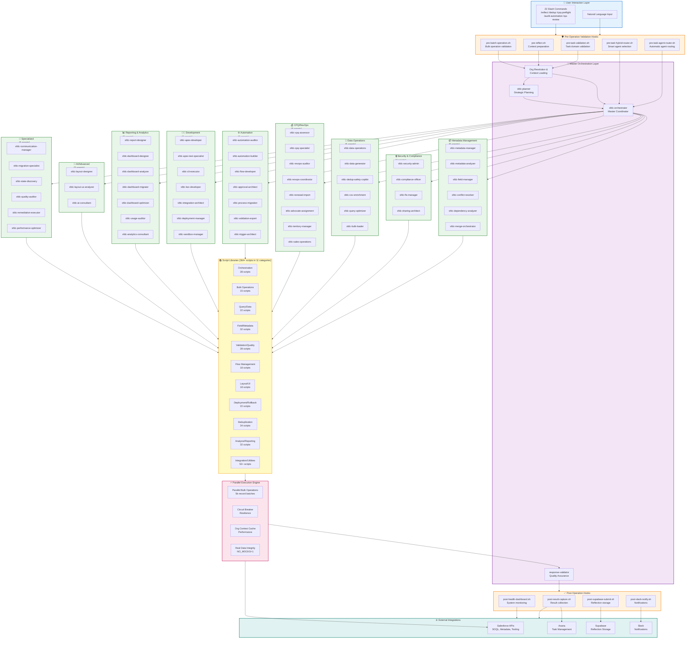

# Salesforce Plugin System Architecture

**Version**: 3.18.0
**Last Updated**: 2025-10-20

## Overview

This diagram illustrates the comprehensive architecture of the Salesforce Plugin, showing the flow from user interactions through validation hooks, orchestration layers, specialized agents, script libraries, and external integrations. The plugin supports enterprise-scale operations with 10k+ bulk operations and parallel execution patterns.

## System Architecture Diagram



## Architecture Components

### 1. User Interaction Layer (Blue)
- **Natural Language Input**: Conversational requests to Claude Code
- **22 Slash Commands**: Specialized commands like `/reflect`, `/dedup`, `/cpq-preflight`, `/audit-automation`

### 2. Pre-Operation Validation Hooks (Orange)
Automatic quality gates that run before operations:
- **pre-task-validation.sh**: Validates task domain and routing
- **pre-reflect.sh**: Prepares context for reflection analysis
- **pre-batch-operation.sh**: Validates bulk operations before execution
- **pre-task-agent-router.sh**: Automatic agent routing based on task
- **pre-task-hybrid-router.sh**: Smart agent selection with user confirmation

### 3. Master Orchestration Layer (Purple)
Central coordination system:
- **Org Resolution & Context Loading**: Resolves Salesforce org aliases and loads cached context
- **sfdc-orchestrator**: Master coordinator that delegates to specialist agents
- **sfdc-planner**: Strategic planning for complex implementations
- **response-validator**: Quality assurance for all agent responses

### 4. Specialist Agent Categories (Green)
57 specialized agents organized into 10 functional domains:
- **Metadata Management** (6): Objects, fields, validation rules, conflicts, dependencies
- **Security & Compliance** (4): Profiles, permission sets, FLS, sharing
- **Data Operations** (6): Bulk imports/exports, deduplication, CSV processing
- **CPQ/RevOps** (8): CPQ assessments, renewals, territory management
- **Automation** (7): Flows, process builder, approval processes, validation rules
- **Development** (7): Apex, LWC, testing, deployment, sandboxes
- **Reporting & Analytics** (7): Reports, dashboards, usage auditing
- **AI/Advanced** (3): AI-powered layout design and UX analysis
- **Specialized** (6): Communication, migration, state discovery, quality auditing

### 5. Script Libraries Layer (Yellow)
364+ JavaScript/Shell scripts organized into 11 functional categories:
- **Orchestration** (28): Multi-agent coordination, workflow management
- **Bulk Operations** (15): Async bulk API, parallel processing
- **Query/Data** (22): Safe query builder, SOQL optimization
- **Field/Metadata** (32): Field managers, metadata parsers
- **Validation/Quality** (28): Preflight validators, data quality checks
- **Flow Management** (18): Flow activation, versioning, migration
- **Layout/UI** (18): Lightning page analysis, layout optimization
- **Deployment/Rollback** (22): Deployment tools, rollback automation
- **Deduplication** (34): Duplicate detection, master selection, merge operations
- **Analysis/Reporting** (32): Impact analysis, usage reports, quality scoring
- **Integration/Utilities** (52+): API wrappers, file utilities, common libraries

### 6. Parallel Execution Engine (Pink)
High-performance execution layer:
- **Parallel Bulk Operations**: Processes 5k-record batches in parallel
- **Circuit Breaker**: Resilience patterns for API failures
- **Org Context Cache**: Performance optimization through caching
- **Real Data Integrity**: NO_MOCKS=1 enforcement (no fake data)

### 7. Post-Operation Hooks (Orange)
Automatic actions after operations complete:
- **post-result-capture.sh**: Collects execution results
- **post-supabase-submit.sh**: Stores reflections in Supabase
- **post-health-dashboard.sh**: Updates monitoring dashboards
- **post-slack-notify.sh**: Sends notifications to Slack channels

### 8. External Integrations (Teal)
Third-party system connections:
- **Salesforce APIs**: SOQL, Metadata API, Tooling API
- **Asana**: Task and project management
- **Supabase**: Reflection storage and analytics
- **Slack**: Real-time notifications

## Key Workflow Patterns

### 1. Discovery → Analysis → Remediation
```
User Request → sfdc-orchestrator → sfdc-state-discovery (current state)
→ sfdc-metadata-analyzer (identify issues) → sfdc-remediation-executor (fix)
→ response-validator (verify) → Results
```

### 2. Parallel Bulk Operations (10k+ records)
```
User Request → pre-batch-operation.sh (validate)
→ sfdc-data-operations → Bulk Operation Scripts (5k batches)
→ Parallel Execution Engine → Circuit Breaker (resilience)
→ post-result-capture.sh → Results
```

### 3. Automatic Agent Routing
```
Natural Language Input → pre-task-agent-router.sh (analyze task)
→ Route to appropriate specialist agent → Execute → Validate
```

### 4. Reflection & Continuous Improvement
```
/reflect command → Analyze session errors → Generate playbook
→ post-supabase-submit.sh → Supabase → /processreflections (internal)
→ Asana tasks → Fix implementation → Update plugin
```

## Legend

### Shape Meanings
- **Rectangles**: Individual components (agents, scripts, tools)
- **Rounded Rectangles (subgraphs)**: Logical groupings of related components
- **Arrows**: Data flow and execution paths

### Color Coding
- **Blue**: User-facing interaction points
- **Orange**: Validation and post-processing hooks
- **Purple**: Master orchestration and coordination
- **Green**: Specialist agent categories
- **Yellow**: Reusable script libraries
- **Pink**: Execution and performance optimization
- **Teal**: External system integrations

### Arrow Types
- **Solid arrows**: Primary execution flow
- All connections show direction of data flow from user input to external systems

## Performance Characteristics

- **Bulk Operation Capacity**: 10k+ records with parallel execution
- **Batch Size**: 5k records per batch
- **Agent Count**: 57 specialized agents across 10 domains
- **Script Library**: 364+ reusable JavaScript/Shell scripts
- **Commands**: 22 slash commands for common operations
- **Hooks**: 15 validation points (8 pre-operation, 7 post-operation)
- **Response Time**: Sub-second for cached org context
- **Reliability**: Circuit breaker patterns for API resilience

## Architecture Principles

1. **Master/Specialist Delegation**: Central orchestrator delegates to domain specialists
2. **Parallel Execution**: Bulk operations split into parallel batches for performance
3. **Validation Gates**: Pre/post hooks ensure quality at every stage
4. **Real Data Integrity**: NO_MOCKS=1 enforcement prevents fake data
5. **Org Resolution**: Dynamic org alias resolution with context caching
6. **Circuit Breaker**: Resilience patterns for external API failures
7. **Continuous Improvement**: Reflection system feeds improvements back to plugin

## Related Documentation

- **Usage Guide**: `.claude-plugin/USAGE.md` - Comprehensive usage instructions
- **Script Library Reference**: `scripts/lib/README.md` - Detailed script documentation
- **Agent Organization**: See agent-specific documentation in `agents/`
- **Hook System**: See hook documentation in `hooks/`
- **Template Library**: `templates/README.md` - Reusable templates

---

**Generated**: 2025-10-20
**Diagram Tool**: Mermaid
**View Online**: Use any Mermaid viewer (GitHub, VS Code, mermaid.live)
