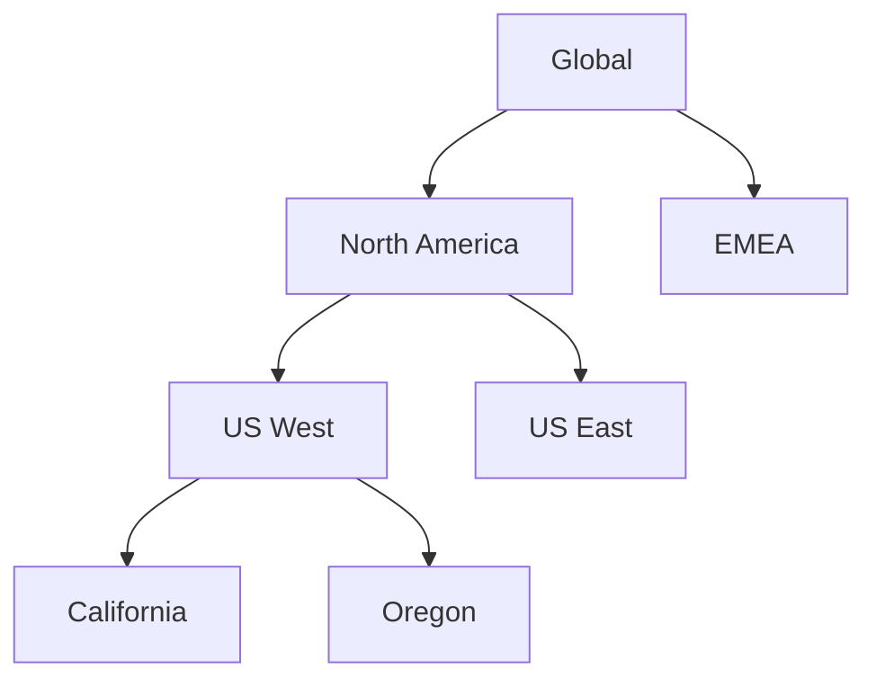

# Runbook 4: Hierarchy Configuration

**Version**: 1.0.0
**Last Updated**: 2025-12-12
**Audience**: Administrators, Developers

---

## Table of Contents

1. [Building Hierarchies](#building-hierarchies)
2. [Reparenting Territories](#reparenting-territories)
3. [Hierarchy Validation](#hierarchy-validation)
4. [Bulk Operations](#bulk-operations)
5. [Visualization](#visualization)

---

## Building Hierarchies

### Top-Down Creation Order

**Rule**: Always create parent territories before children.

```
Order of creation:
1. Root territories (ParentTerritory2Id = null)
2. Level 2 territories (children of roots)
3. Level 3 territories
4. Continue until all levels created
```

### CLI Creation Example

```bash
# Step 1: Create root territory
sf data create record --sobject Territory2 \
  --values "Name='Global' DeveloperName='Global' Territory2ModelId='0MC...' Territory2TypeId='0MT...' AccountAccessLevel='Read' OpportunityAccessLevel='Read' CaseAccessLevel='Read'" \
  --target-org $ORG

# Note the returned Id (e.g., 0MI000000000001)

# Step 2: Create child territory using parent Id
sf data create record --sobject Territory2 \
  --values "Name='North America' DeveloperName='North_America' Territory2ModelId='0MC...' Territory2TypeId='0MT...' ParentTerritory2Id='0MI000000000001' AccountAccessLevel='Edit' OpportunityAccessLevel='Edit' CaseAccessLevel='Read'" \
  --target-org $ORG
```

### Metadata Deployment

```
force-app/main/default/territory2Models/FY2026/
├── FY2026.territory2Model-meta.xml
└── territories/
    ├── Global.territory2-meta.xml
    ├── North_America.territory2-meta.xml
    └── US_West.territory2-meta.xml
```

**Territory Metadata XML:**

```xml
<?xml version="1.0" encoding="UTF-8"?>
<Territory2 xmlns="http://soap.sforce.com/2006/04/metadata">
    <name>US West</name>
    <developerName>US_West</developerName>
    <territory2Model>FY2026</territory2Model>
    <territory2Type>Region</territory2Type>
    <parentTerritory2>North_America</parentTerritory2>
    <accountAccessLevel>Edit</accountAccessLevel>
    <opportunityAccessLevel>Edit</opportunityAccessLevel>
    <caseAccessLevel>Read</caseAccessLevel>
</Territory2>
```

---

## Reparenting Territories

### Update Parent Reference

```bash
sf data update record --sobject Territory2 \
  --record-id '0MI...' \
  --values "ParentTerritory2Id='0MI...(new parent)'" \
  --target-org $ORG
```

### Validation Before Reparenting

```javascript
// Check 1: New parent exists
const newParent = await query(`
  SELECT Id, Territory2ModelId FROM Territory2 WHERE Id = '${newParentId}'
`);
if (newParent.length === 0) throw new Error('New parent not found');

// Check 2: Same model
const territory = await query(`
  SELECT Id, Territory2ModelId FROM Territory2 WHERE Id = '${territoryId}'
`);
if (territory[0].Territory2ModelId !== newParent[0].Territory2ModelId) {
  throw new Error('Cannot reparent to different model');
}

// Check 3: Would not create cycle
if (wouldCreateCycle(territoryId, newParentId)) {
  throw new Error('Cannot create circular reference');
}
```

### Cycle Detection Algorithm

```javascript
function wouldCreateCycle(territoryId, newParentId, hierarchy) {
  const visited = new Set();
  let current = newParentId;

  while (current) {
    // Found the territory we're moving - would create cycle
    if (current === territoryId) return true;

    // Already visited this node - existing cycle in data
    if (visited.has(current)) return true;

    visited.add(current);
    current = hierarchy.get(current)?.parentId;
  }

  return false;
}
```

### Moving Subtrees

When moving a territory with children, the entire subtree moves:

```
Before:
Global
├── NA
│   └── US West (moving this)
│       ├── California
│       └── Oregon
└── EMEA

After (US West moved under EMEA):
Global
├── NA
└── EMEA
    └── US West
        ├── California
        └── Oregon
```

**Only the top-level node's ParentTerritory2Id changes** - children automatically follow.

---

## Hierarchy Validation

### Check for Orphaned Territories

```sql
SELECT Id, Name, ParentTerritory2Id
FROM Territory2
WHERE Territory2ModelId = '<model_id>'
AND ParentTerritory2Id IS NOT NULL
AND ParentTerritory2Id NOT IN (
  SELECT Id FROM Territory2 WHERE Territory2ModelId = '<model_id>'
)
```

### Check for Cycles

```javascript
async function detectCyclesInModel(orgAlias, modelId) {
  const territories = await query(`
    SELECT Id, ParentTerritory2Id FROM Territory2
    WHERE Territory2ModelId = '${modelId}'
  `);

  const parentMap = new Map(territories.map(t => [t.Id, t.ParentTerritory2Id]));
  const cycles = [];

  for (const territory of territories) {
    const visited = new Set();
    let current = territory.Id;

    while (current && parentMap.has(current)) {
      if (visited.has(current)) {
        cycles.push(territory.Id);
        break;
      }
      visited.add(current);
      current = parentMap.get(current);
    }
  }

  return cycles;
}
```

### Calculate Hierarchy Depth

```javascript
async function calculateDepth(orgAlias, modelId) {
  const territories = await query(`
    SELECT Id, ParentTerritory2Id FROM Territory2
    WHERE Territory2ModelId = '${modelId}'
  `);

  const parentMap = new Map(territories.map(t => [t.Id, t.ParentTerritory2Id]));
  let maxDepth = 0;

  for (const territory of territories) {
    let depth = 0;
    let current = territory.Id;

    while (current && parentMap.has(current)) {
      depth++;
      current = parentMap.get(current);
      if (depth > 100) break; // Safety limit
    }

    maxDepth = Math.max(maxDepth, depth);
  }

  return maxDepth;
}
```

---

## Bulk Operations

### Bulk Create with CSV

**CSV Format:**

```csv
Name,DeveloperName,Territory2ModelId,Territory2TypeId,ParentTerritory2Id,AccountAccessLevel,OpportunityAccessLevel,CaseAccessLevel
US West,US_West,0MCxxx,0MTxxx,,Edit,Edit,Read
California,California,0MCxxx,0MTxxx,0MI001,Edit,Edit,Edit
Oregon,Oregon,0MCxxx,0MTxxx,0MI001,Edit,Edit,Edit
```

**Note**: Create in hierarchy order (roots first, then children).

```bash
# Import territories
sf data import bulk \
  --sobject Territory2 \
  --file territories.csv \
  --target-org $ORG
```

### Bulk Update with Upsert

```bash
# Upsert using DeveloperName as external ID
sf data upsert bulk \
  --sobject Territory2 \
  --external-id DeveloperName \
  --file territories_update.csv \
  --target-org $ORG
```

### Chunked Processing Pattern

```javascript
const CHUNK_SIZE = 200;

async function bulkCreateTerritories(territories) {
  // Sort by hierarchy level (roots first)
  const sorted = sortByHierarchyLevel(territories);

  for (let i = 0; i < sorted.length; i += CHUNK_SIZE) {
    const chunk = sorted.slice(i, i + CHUNK_SIZE);
    console.log(`Creating chunk ${Math.floor(i/CHUNK_SIZE) + 1}`);

    await sfBulkCreate('Territory2', chunk);

    // Wait between chunks
    await sleep(500);
  }
}
```

---

## Visualization

### Generate Mermaid Diagram

```javascript
function generateHierarchyDiagram(territories) {
  let mermaid = 'graph TD\n';

  for (const t of territories) {
    const safeId = t.DeveloperName.replace(/[^a-zA-Z0-9]/g, '_');
    const safeName = t.Name.replace(/"/g, '\\"');

    if (t.ParentTerritory2Id) {
      const parent = territories.find(p => p.Id === t.ParentTerritory2Id);
      if (parent) {
        const parentId = parent.DeveloperName.replace(/[^a-zA-Z0-9]/g, '_');
        mermaid += `    ${parentId} --> ${safeId}["${safeName}"]\n`;
      }
    } else {
      mermaid += `    ${safeId}["${safeName}"]\n`;
    }
  }

  return mermaid;
}
```

### Example Output



### Hierarchy Statistics Query

```sql
-- Count territories per level
-- Level 0 = roots (no parent)
SELECT
  CASE
    WHEN ParentTerritory2Id = null THEN 'Level 0 (Root)'
    ELSE 'Level 1+'
  END Level,
  COUNT(Id) cnt
FROM Territory2
WHERE Territory2ModelId = '<model_id>'
GROUP BY ParentTerritory2Id = null
```

---

## Best Practices

1. **Document hierarchy decisions** in model description
2. **Use consistent naming** convention for DeveloperNames
3. **Limit depth** to 5-6 levels for performance
4. **Validate before bulk operations** to prevent orphans
5. **Create checkpoints** before major restructuring
6. **Test in sandbox** before production changes

---

## Related Runbooks

- [Runbook 3: Territory2 Object Relationships](03-territory2-object-relationships.md)
- [Runbook 5: User Assignment Strategies](05-user-assignment-strategies.md)
- [Runbook 7: Testing and Validation](07-testing-and-validation.md)
