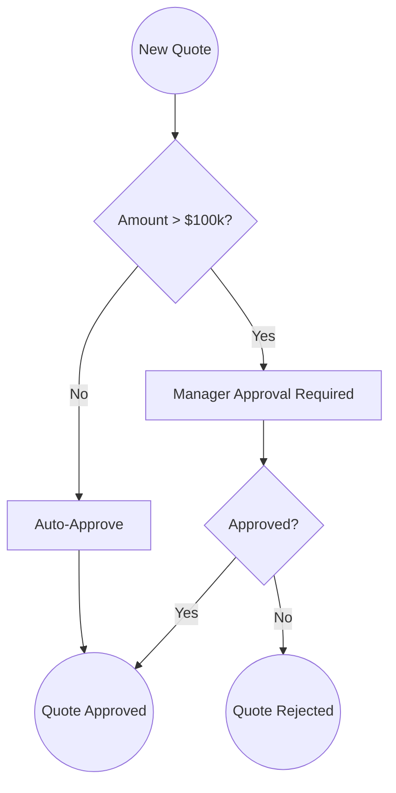
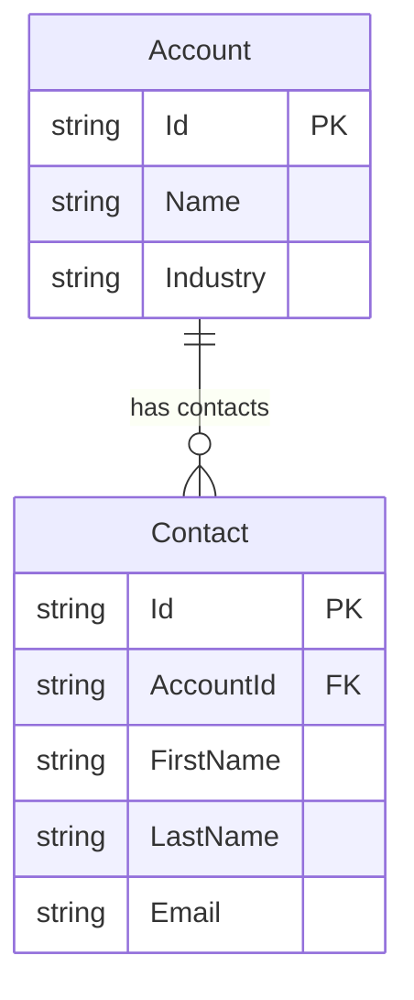
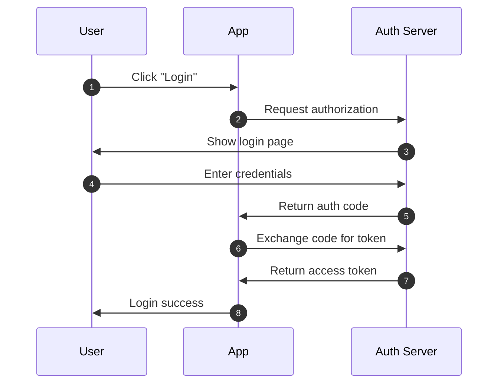
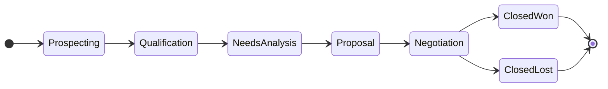
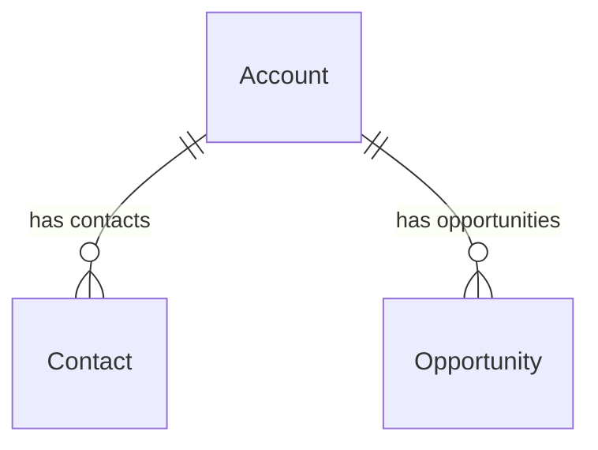

# Mermaid Diagram System - User Guide

## Overview

The **Mermaid Diagram System** provides comprehensive diagram generation capabilities across all OpsPal plugins. Generate professional flowcharts, ERDs, sequence diagrams, and state diagrams from natural language, metadata, or structured data.

**Key Features**:
- 🎯 4 diagram types (Flowchart, ERD, Sequence, State)
- 🤖 Natural language to diagram conversion
- 📊 Metadata-driven generation (Salesforce, HubSpot)
- 🔄 Multiple invocation methods (command, agent, library)
- ✅ Automatic syntax validation
- 📝 Dual output formats (.md and .mmd)
- 🎨 Pre-built templates for common patterns

## Quick Start

### 1. Interactive Diagram Creation

```bash
/diagram
```

Follow the prompts to create your diagram. The system will guide you through:
- Diagram type selection
- Data source (natural language, metadata, file)
- Specific details for your diagram type
- Output location and format

### 2. Quick Generation

```bash
# Flowchart from description
/diagram flowchart "Lead conversion process"

# ERD from Salesforce metadata
/diagram erd Account Contact Opportunity

# Sequence diagram for API
/diagram sequence "Stripe payment flow"

# State diagram for lifecycle
/diagram state "Opportunity stages"
```

### 3. From Data File

```bash
/diagram from instances/production/metadata/schema.json
```

## Diagram Types

### Flowcharts

**Best For**: Process flows, workflows, decision trees, automation logic

**Example Use Cases**:
- Lead routing process
- Approval workflows
- Data migration flows
- Business process documentation

**Quick Example**:
```bash
/diagram flowchart "Quote approval process"
```

**What You'll Describe**:
- Process steps (actions)
- Decision points (if/then branches)
- Start and end points
- Flow direction (top-to-bottom, left-to-right)

**Generated Code**:


### Entity Relationship Diagrams (ERDs)

**Best For**: Database schemas, object relationships, data models

**Example Use Cases**:
- Salesforce object relationships
- HubSpot custom objects
- Data architecture documentation
- Integration mapping

**Quick Example**:
```bash
/diagram erd --org production --objects Account Contact
```

**What You'll Provide**:
- Objects/entities to include
- Org/portal for metadata (optional)
- Whether to include field details
- Relationship types

**Generated Code**:


### Sequence Diagrams

**Best For**: API interactions, system flows, temporal sequences

**Example Use Cases**:
- API integration flows
- Authentication sequences
- Multi-system interactions
- Event-driven processes

**Quick Example**:
```bash
/diagram sequence "OAuth authentication"
```

**What You'll Describe**:
- Participants/actors (User, App, API)
- Messages/calls in sequence
- Synchronous vs asynchronous
- Notes and activation periods

**Generated Code**:


### State Diagrams

**Best For**: Lifecycle states, status transitions, state machines

**Example Use Cases**:
- Opportunity stage progression
- Contact lifecycle
- Case status workflow
- Custom object states

**Quick Example**:
```bash
/diagram state --org production --object Opportunity --field StageName
```

**What You'll Provide**:
- States (stages, statuses)
- Transitions and conditions
- Start/end states
- Composite states (optional)

**Generated Code**:


## Templates

Use pre-built templates for common patterns:

### Salesforce Templates

```bash
# Opportunity lifecycle
/diagram from-template salesforce/opportunity-lifecycle

# Lead routing
/diagram from-template salesforce/lead-routing

# CPQ quote process
/diagram from-template salesforce/cpq-quote-process

# Standard objects ERD
/diagram from-template salesforce/standard-objects-erd
```

### HubSpot Templates

```bash
# Contact lifecycle
/diagram from-template hubspot/contact-lifecycle

# Workflow template
/diagram from-template hubspot/workflow-template
```

### Cross-Platform Templates

```bash
# Sync architecture
/diagram from-template cross-platform/sync-architecture

# Data migration flow
/diagram from-template cross-platform/data-migration-flow
```

## Programmatic Usage

### Using the Library Directly

```javascript
const MermaidGenerator = require('./scripts/lib/mermaid-generator');
const generator = new MermaidGenerator();

// Create flowchart
const flowchart = generator.flowchart({ direction: 'TB', title: 'My Process' })
  .addNode('start', 'Start', { shape: 'circle' })
  .addNode('process', 'Process Data')
  .addNode('end', 'End', { shape: 'circle' })
  .addEdge('start', 'process')
  .addEdge('process', 'end')
  .generate();

// Save diagram
await generator.saveAs('/path/to/diagram', flowchart, {
  formats: ['md', 'mmd'],
  title: 'My Process Flow',
  description: 'Data processing workflow'
});
```

### Using the Agent

```javascript
const Task = require('claude-code-task');

// Delegate to diagram-generator agent
await Task.invoke('opspal-core:diagram-generator', {
  type: 'erd',
  source: 'salesforce',
  org: 'production',
  objects: ['Account', 'Contact', 'Opportunity'],
  outputPath: 'instances/production/diagrams/core-objects'
});
```

### Using Converters

```javascript
const { salesforceMetadataToERD, jsonToFlowchart } = require('./scripts/lib/mermaid-converters');

// From Salesforce metadata
const metadata = await fetchSalesforceMetadata('Account');
const erd = salesforceMetadataToERD(metadata);

// From JSON data
const flowData = {
  nodes: [
    { id: 'start', label: 'Start', shape: 'circle' },
    { id: 'end', label: 'End', shape: 'circle' }
  ],
  edges: [
    { from: 'start', to: 'end' }
  ]
};
const flowchart = jsonToFlowchart(flowData);
```

## Validation

All generated diagrams are automatically validated. If validation fails:

```
❌ Diagram Validation Failed

Errors:
  - Line 12: Unbalanced brackets in node definition
  - Line 25: Undefined node reference "step5"

Suggestions:
  - Fix bracket closure: [text]
  - Add missing node: step5[Label]

🛠️  Auto-fix available? Yes
? Apply auto-fixes? (y/n):
```

You can also validate manually:

```javascript
const MermaidValidator = require('./scripts/lib/mermaid-validator');
const validator = new MermaidValidator();

const result = validator.validate(mermaidCode);

if (!result.valid) {
  console.error('Errors:', result.errors);
  console.log('Suggestions:', result.suggestions);

  // Get detailed report
  const report = validator.getDetailedReport(mermaidCode);
  console.log(report.summary);
}
```

## Previews

Generate previews in multiple formats:

### ASCII Preview (Quick Terminal View)

```javascript
const { generateASCIIPreview } = require('./scripts/lib/mermaid-preview');

const preview = generateASCIIPreview(mermaidCode);
console.log(preview);
```

**Output**:
```
════════════════════════════════════════
📊 FLOWCHART DIAGRAM PREVIEW
════════════════════════════════════════

  [start] Start
  [process] Process Data
  [end] End

  Connections (2):
  start --> process
  process --> end

════════════════════════════════════════
```

### HTML Preview (Browser View)

```javascript
const { generateHTMLPreview, openInBrowser } = require('./scripts/lib/mermaid-preview');

// Generate HTML file
await generateHTMLPreview(mermaidCode, '/path/to/preview.html');

// Or open directly in browser
await openInBrowser(mermaidCode);
```

### PNG Export (Requires Mermaid CLI)

```bash
# Install Mermaid CLI globally
npm install -g @mermaid-js/mermaid-cli

# Generate PNG
node -e "const { generatePNGPreview } = require('./scripts/lib/mermaid-preview'); generatePNGPreview(mermaidCode, '/path/to/diagram.png');"
```

### Mermaid Live Editor Link

```javascript
const { generateLiveEditorURL } = require('./scripts/lib/mermaid-preview');

const url = generateLiveEditorURL(mermaidCode);
console.log(`Edit online: ${url}`);
```

## Integration with Agents

### Calling from Other Agents

Any agent can generate diagrams by delegating to the `diagram-generator` agent:

```markdown
---
name: my-custom-agent
tools: Read, Write, TodoWrite
---

When documenting architecture, use the diagram-generator agent:

```javascript
// In your agent's logic
await Task.invoke('opspal-core:diagram-generator', {
  type: 'erd',
  source: 'salesforce',
  org: context.org,
  objects: discoveredObjects
});
```

### Example Integrations

**sfdc-dependency-analyzer** → Generate dependency graphs

**sfdc-automation-auditor** → Visualize workflow flows

**hubspot-workflow-builder** → Preview workflow structure

**sfdc-planner** → Document implementation plans

## Common Workflows

### Workflow 1: Document Salesforce Org Architecture

```bash
# Step 1: Generate ERD for core objects
/diagram erd --org production --objects Account Contact Opportunity Lead

# Step 2: Generate opportunity lifecycle
/diagram state --org production --object Opportunity --field StageName

# Step 3: Generate lead routing process
/diagram from-template salesforce/lead-routing
```

### Workflow 2: Document HubSpot Integration

```bash
# Step 1: Generate sync architecture
/diagram from-template cross-platform/sync-architecture

# Step 2: Generate API sequence
/diagram sequence "HubSpot to Salesforce sync process"

# Step 3: Generate contact lifecycle
/diagram from-template hubspot/contact-lifecycle
```

### Workflow 3: Plan Data Migration

```bash
# Step 1: Generate source ERD
/diagram erd --org legacy --objects Account Contact

# Step 2: Generate target ERD
/diagram erd --org production --objects Account Contact

# Step 3: Generate migration flow
/diagram from-template cross-platform/data-migration-flow
```

## Tips & Best Practices

### 1. Start Simple, Iterate
Generate a basic diagram first, then refine:
```bash
# First pass
/diagram flowchart "Basic process"

# Edit .mmd file, then regenerate
node -e "const gen = require('./scripts/lib/mermaid-generator'); /* regenerate */"
```

### 2. Use Metadata When Possible
Let the system query Salesforce/HubSpot for accuracy:
```bash
# Better: Auto-query metadata
/diagram erd --org production --auto-discover

# Avoid: Manual specification (prone to errors)
/diagram erd --manual Entity1 Entity2
```

### 3. Leverage Templates
Don't start from scratch for common patterns:
```bash
/diagram from-template salesforce/opportunity-lifecycle
# Customize the generated .mmd file as needed
```

### 4. Split Complex Diagrams
If diagram has >50 nodes, split into multiple:
```bash
/diagram erd Account Contact  # Part 1
/diagram erd Opportunity Quote  # Part 2
```

### 5. Validate Before Sharing
Always check validation:
```bash
node -e "const { MermaidValidator } = require('./scripts/lib/mermaid-validator'); const validator = new MermaidValidator(); console.log(validator.validate(mermaidCode));"
```

## Troubleshooting

### "Diagram too complex"

**Problem**: Diagram has too many nodes or edges

**Solution**:
```bash
# Split into multiple diagrams
/diagram erd Account Contact  # Core CRM
/diagram erd Opportunity Product2  # Sales objects
/diagram erd Case Solution  # Service objects
```

### "Validation failed"

**Problem**: Syntax errors in generated diagram

**Solution**:
1. Check the detailed error message
2. Review the specific line mentioned
3. Apply suggested fixes
4. Regenerate diagram

### "Metadata query failed"

**Problem**: Cannot connect to Salesforce/HubSpot

**Solution**:
```bash
# Verify authentication
sf org list  # For Salesforce
echo $HUBSPOT_ACCESS_TOKEN  # For HubSpot

# Re-authenticate if needed
sf org login web  # Salesforce
```

### "Output location not found"

**Problem**: Directory doesn't exist

**Solution**:
```bash
# Create directory manually
mkdir -p instances/production/diagrams

# Or use custom path
/diagram [type] [subject] --output /custom/path/
```

## File Formats

### Markdown (.md)

Contains embedded Mermaid with context:
```markdown
# Account Data Model

Entity relationship diagram for core CRM objects.


```

**Use When**: Documentation, README files, GitHub/GitLab wikis

### Mermaid (.mmd)

Standalone Mermaid syntax:


**Use When**: Importing into tools, programmatic processing

## Viewing Diagrams

### GitHub/GitLab
Markdown files with embedded Mermaid render automatically.

### VS Code
Install "Markdown Preview Mermaid Support" extension.

### Mermaid Live Editor
Visit https://mermaid.live/edit and paste .mmd content.

### Local HTML
Generate and open HTML preview:
```bash
node -e "const { openInBrowser } = require('./scripts/lib/mermaid-preview'); openInBrowser(mermaidCode);"
```

## Advanced Features

### Custom Styling

```javascript
const flowchart = generator.flowchart()
  .addNode('critical', 'Critical Step')
  .addStyle('critical', {
    fill: '#ff6b6b',
    stroke: '#c92a2a',
    'stroke-width': '3px'
  });
```

### Subgraphs (Grouping)

```javascript
const flowchart = generator.flowchart()
  .addSubgraph('phase1', 'Phase 1: Discovery', builder => {
    builder.addNode('step1', 'Analyze');
    builder.addNode('step2', 'Document');
    builder.addEdge('step1', 'step2');
  });
```

### Batch Generation

Create multiple diagrams at once:
```bash
/diagram batch config.json
```

**config.json**:
```json
{
  "diagrams": [
    {
      "type": "erd",
      "org": "production",
      "objects": ["Account", "Contact"],
      "output": "instances/production/diagrams/crm-core"
    },
    {
      "type": "flowchart",
      "title": "Lead Routing",
      "output": "instances/production/diagrams/lead-routing"
    }
  ]
}
```

## API Reference

### MermaidGenerator

```javascript
const MermaidGenerator = require('./scripts/lib/mermaid-generator');
const generator = new MermaidGenerator(options);

// Methods
generator.flowchart(config)  // FlowchartBuilder
generator.erd(config)  // ERDBuilder
generator.sequence(config)  // SequenceBuilder
generator.state(config)  // StateBuilder
generator.saveAs(path, code, options)  // Promise<{md, mmd}>
```

### MermaidValidator

```javascript
const MermaidValidator = require('./scripts/lib/mermaid-validator');
const validator = new MermaidValidator(options);

// Methods
validator.validate(code)  // {valid, errors, warnings, suggestions}
validator.suggestFixes(result)  // Array<string>
validator.getDetailedReport(code)  // {summary, fixes, lineCount}
```

### Converters

```javascript
const converters = require('./scripts/lib/mermaid-converters');

// Methods
converters.salesforceMetadataToERD(metadata, relatedObjects)
converters.jsonToFlowchart(data)
converters.csvToERD(csvContent, options)
converters.hubspotWorkflowToFlowchart(workflow)
converters.dependencyGraphToFlowchart(dependencies)
converters.stateMachineToStateDiagram(stateMachine)
converters.apiSpecToSequence(apiSpec)
converters.fileToDiagram(filePath, diagramType)
```

### Preview Utilities

```javascript
const preview = require('./scripts/lib/mermaid-preview');

// Methods
preview.generateASCIIPreview(code, options)
preview.generateHTMLPreview(code, outputPath)
preview.generatePNGPreview(code, outputPath)
preview.openInBrowser(code)
preview.generateLiveEditorURL(code)
preview.generateAllPreviews(code, basePath, options)
```

## Support & Resources

- **Documentation**: This guide
- **Examples**: `templates/diagrams/`
- **Mermaid Official Docs**: https://mermaid.js.org/
- **Mermaid Live Editor**: https://mermaid.live/edit
- **OpsPal Plugins**: https://github.com/RevPalSFDC/opspal-plugin-internal-marketplace

## Version History

### v1.0.0 (Current)
- Initial release
- 4 diagram types supported (Flowchart, ERD, Sequence, State)
- 8 pre-built templates
- Natural language generation
- Metadata-driven diagrams
- Multiple output formats
- Comprehensive validation

---

**💡 Need Help?** Use `/diagram` with no arguments for interactive guidance, or invoke the `diagram-generator` agent for advanced use cases.
