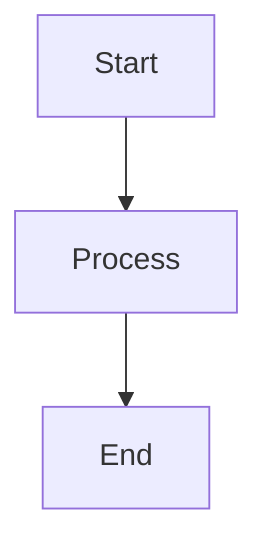

# PDF Generation - User Guide

**Version**: 1.4.0
**Audience**: End users, report consumers, non-technical staff
**Last Updated**: 2025-10-22

---

## Table of Contents

1. [What Can You Do?](#what-can-you-do)
2. [Quick Start: 3 Ways to Generate PDFs](#quick-start-3-ways-to-generate-pdfs)
3. [Common Workflows](#common-workflows)
4. [Using Cover Pages](#using-cover-pages)
5. [Working with Diagrams](#working-with-diagrams)
6. [Understanding Your PDF](#understanding-your-pdf)
7. [Troubleshooting](#troubleshooting)
8. [Tips & Best Practices](#tips--best-practices)
9. [Getting Help](#getting-help)

---

## What Can You Do?

The PDF generation system lets you:

✅ **Convert markdown reports to professional PDFs** - Make reports client-ready
✅ **Combine multiple reports into one PDF** - Executive summaries + detailed analysis
✅ **Add table of contents** - Easy navigation through long reports
✅ **Include professional cover pages** - Branded, professional appearance
✅ **Render diagrams automatically** - Technical diagrams appear as images
✅ **Share via email or Google Drive** - One file, easy to distribute

**Use Cases:**
- Client deliverables (audit reports, assessments)
- Executive summaries (board presentations)
- Archive documentation (compliance, historical records)
- Internal reports (team reviews, project status)

---

## Quick Start: 3 Ways to Generate PDFs

### Method 1: Slash Command (Easiest)

```
/generate-pdf "instances/acme/audit-*.md" acme-complete.pdf --toc
```

**When to use:** Quick PDF generation from Claude Code interface

---

### Method 2: Natural Language (Most Flexible)

Just ask in natural language:

```
"Please convert all the audit reports in instances/acme/ to a single PDF with a table of contents and cover page"
```

The `pdf-generator` agent will interpret your request and generate the PDF.

**When to use:** When you want Claude to figure out the details

---

### Method 3: Command Line (Most Control)

```bash
cd .claude-plugins/opspal-core
node scripts/lib/pdf-generator.js input.md output.pdf --render-mermaid
```

**When to use:** Automation, scripting, or advanced customization

---

## Preset Profiles (Recommended)

Use profiles to guarantee branded output across machines:

- `simple` - Branded PDF with no cover and no TOC
- `cover-toc` - Branded PDF with cover page and TOC

**Examples:**
```
/generate-pdf report.md report.pdf --profile simple

/generate-pdf "instances/acme/*.md" acme-complete.pdf --profile cover-toc
```

---

## Common Workflows

### Workflow 1: Single Report to PDF

**Scenario:** You have one markdown report and need a PDF version

**Steps:**
1. Locate your report: `instances/acme/audit-report.md`
2. Run command:
   ```
   /generate-pdf "instances/acme/audit-report.md" audit-report.pdf
   ```
3. Find PDF in same directory: `instances/acme/audit-report.pdf`

**Result:** Professional PDF with same content as markdown

---

### Workflow 2: Multi-Report PDF with TOC

**Scenario:** You have multiple reports to combine (summary, analysis, recommendations)

**Steps:**
1. Identify reports to combine:
   - `EXECUTIVE_SUMMARY.md`
   - `TECHNICAL_ANALYSIS.md`
   - `RECOMMENDATIONS.md`

2. Run command:
   ```
   /generate-pdf "instances/acme/*.md" acme-complete.pdf --toc
   ```

3. Open PDF and verify:
   - Table of Contents at beginning
   - All reports included
   - Section breaks between reports

**Result:** Single PDF with navigation and all content

---

### Workflow 3: Client Deliverable with Cover Page

**Scenario:** Creating a client-ready audit report

**Steps:**
1. Generate reports (automation audit, executive summary, etc.)

2. Create PDF with cover:
   ```
   /generate-pdf "instances/acme/*.md" acme-audit.pdf --toc --cover salesforce-audit --org "ACME Corporation"
   ```

3. Review cover page shows:
   - Client name (ACME Corporation)
   - Report title
   - Generation date
   - Professional branding

4. Share PDF via email or Google Drive

**Result:** Professional client deliverable ready to send

---

### Workflow 4: Automation Audit PDF (Fully Automated)

**Scenario:** Running Salesforce automation audit with automatic PDF generation

**Steps:**
1. Run automation audit:
   ```bash
   node scripts/lib/automation-audit-v2-orchestrator.js acme ./audit-output
   ```

2. PDF is automatically generated:
   - `audit-output/automation-audit-complete-acme-2025-10-22.pdf`

3. PDF includes:
   - Executive Summary
   - Automation Summary
   - Conflict Analysis
   - Field Collisions
   - Remediation Plan
   - Table of Contents
   - Cover page with org name

**Result:** Comprehensive audit PDF ready without manual steps

---

## Using Cover Pages

### Available Templates

| Template | Best For | Example Use |
|----------|----------|-------------|
| `salesforce-audit` | Salesforce automation audits | Automation health reports |
| `hubspot-assessment` | HubSpot portal assessments | Portal optimization reviews |
| `executive-report` | Executive summaries | Board presentations |
| `gtm-planning` | Go-to-market planning | Compensation & quota plans |
| `data-quality` | Data hygiene assessments | Deduplication reports |
| `cross-platform-integration` | Multi-platform work | Sync & integration audits |
| `security-audit` | Security assessments | Compliance reports |
| `default` | General purpose | Any report type |

### How to Use

**Basic usage:**
```
/generate-pdf reports.md output.pdf --cover salesforce-audit --org "Client Name"
```

**With additional metadata:**
```
/generate-pdf reports.md output.pdf \
  --cover executive-report \
  --org "ACME Corp" \
  --title "Q3 Performance Review" \
  --period "Q3 2025"
```

---

## Working with Diagrams

### What Happens to Diagrams?

The system automatically detects Mermaid diagrams in your markdown:

```markdown

```

**Behavior:**
- ✅ **If Mermaid CLI installed**: Diagrams render as images in PDF
- ⚠️ **If Mermaid CLI NOT installed**: Diagrams show as code blocks (still readable)

### Supported Diagram Types

All Mermaid diagram types work:
- Flowcharts (`graph TD`)
- Sequence diagrams (`sequenceDiagram`)
- Class diagrams (`classDiagram`)
- State diagrams (`stateDiagram`)
- Entity relationship diagrams (`erDiagram`)
- Gantt charts (`gantt`)
- Pie charts (`pie`)

### Tips for Diagrams

1. **Keep diagrams simple** - Complex diagrams may not render well in PDF
2. **Use descriptive labels** - Make diagrams understandable standalone
3. **Test rendering** - Generate test PDF to verify diagrams appear correctly
4. **Fallback is OK** - Code blocks are still readable if rendering fails

---

## Understanding Your PDF

### Table of Contents

When you use `--toc` flag, you get:
- **Hierarchical listing** of all headings
- **Clickable links** to sections (if PDF viewer supports)
- **Heading levels** (H1, H2, H3) properly indented

Example TOC:
```
Table of Contents
1. Executive Summary........................1
   1.1 Key Findings..........................2
   1.2 Recommendations.......................3
2. Technical Analysis........................5
   2.1 Data Model...........................6
   2.2 Automation...........................8
```

### Document Order

PDFs are generated in **smart order** based on filename patterns:

**Automatic Priority:**
1. Summary/Overview files (e.g., `EXECUTIVE_SUMMARY.md`)
2. Introduction files (e.g., `INTRODUCTION.md`)
3. Analysis/Details (e.g., `TECHNICAL_ANALYSIS.md`)
4. Plans/Recommendations (e.g., `REMEDIATION_PLAN.md`)
5. Appendices (e.g., `APPENDIX_*.md`)

**Manual Override:**
Use numbered prefixes: `01-summary.md`, `02-analysis.md`, `03-plan.md`

### Metadata

Every PDF includes metadata:
- **Title** - Document title
- **Organization** - Client/org name
- **Date** - Generation date
- **Version** - Report version
- **Author** - "Generated by OpsPal"

**View metadata:**
- Right-click PDF → Properties → Details

---

## Troubleshooting

### Problem 1: "PDF is empty or very small"

**Causes:**
- Input markdown file is empty
- Wrong file path

**Solutions:**
1. Check input file exists: `cat input.md`
2. Verify file has content (not empty)
3. Use absolute paths: `$(pwd)/input.md`

---

### Problem 2: "Cannot find module 'md-to-pdf'"

**Cause:** Dependencies not installed

**Solution:**
```bash
cd .claude-plugins/opspal-core
npm install --save md-to-pdf pdf-lib
```

---

### Problem 3: "Diagrams showing as code blocks"

**Cause:** Mermaid CLI not installed (this is OK!)

**Solutions:**
- **Option 1:** Accept code blocks (diagrams still readable)
- **Option 2:** Install Mermaid CLI:
  ```bash
  cd .claude-plugins/opspal-core
  npm install --save @mermaid-js/mermaid-cli
  ```

---

### Problem 4: "Cover page not showing"

**Cause:** Cover page feature requires programmatic API (not CLI yet)

**Workaround:** Ask Claude Code to generate PDF with cover page using natural language:
```
"Generate PDF with salesforce-audit cover page for ACME Corporation"
```

---

### Problem 5: "PDF generation very slow"

**Normal behavior:**
- Single report: 5-10 seconds
- Multi-document: 15-30 seconds
- With diagrams: +2-3 seconds per diagram

**If longer than expected:**
- Check number of diagrams (each takes 2-3 seconds)
- Verify disk space available
- Check for very large markdown files (>1MB)

---

## Tips & Best Practices

### 1. Organize Reports First

Before generating PDF:
- ✅ Name files clearly (`01-summary.md`, `02-analysis.md`)
- ✅ Remove draft/temp files from directory
- ✅ Verify all images/diagrams render in markdown

### 2. Use Descriptive Titles

When generating PDFs:
```
# ✅ GOOD: Clear title
/generate-pdf reports.md "ACME-Audit-2025-Q3.pdf"

# ❌ BAD: Generic title
/generate-pdf reports.md "output.pdf"
```

### 3. Include TOC for Long Reports

**Rule of thumb:**
- Report > 10 pages → Use `--toc`
- Report < 10 pages → Skip TOC (adds overhead)

### 4. Test Before Sharing

Before sending to clients:
1. **Open PDF** and scroll through all pages
2. **Check diagrams** render correctly (if applicable)
3. **Verify TOC links** work (click to test)
4. **Review cover page** has correct info
5. **Check file size** is reasonable (<10MB preferred)

### 5. Save Source Markdown

Always keep markdown files:
- PDFs are for distribution
- Markdown is source of truth
- Regenerate PDF if content changes

### 6. Use Consistent Cover Templates

**For same client/project:**
- ✅ Use same cover template (e.g., `salesforce-audit`)
- ✅ Use consistent org name spelling
- ✅ Results in professional brand consistency

---

## Getting Help

### Quick Reference Commands

**Single file:**
```bash
/generate-pdf report.md report.pdf
```

**Multiple files:**
```bash
/generate-pdf "path/*.md" output.pdf --toc
```

**With cover:**
```bash
/generate-pdf "path/*.md" output.pdf --toc --cover salesforce-audit --org "Client"
```

**Natural language:**
```
"Convert all reports in instances/acme to PDF with table of contents"
```

---

### Documentation

| Document | Purpose | Location |
|----------|---------|----------|
| **This Guide** | User training | `docs/PDF_GENERATION_USER_GUIDE.md` |
| **Technical Guide** | Developer reference | `docs/PDF_GENERATION_GUIDE.md` |
| **Integration Guide** | System integration | `docs/PDF_GENERATION_INTEGRATION.md` |
| **Wiring Checklist** | Setup instructions | `WIRING_CHECKLIST.md` |

---

### Support

**Questions?**
- Check documentation above
- Ask Claude Code: "How do I generate a PDF with cover page?"
- Review examples in this guide

**Issues?**
- Verify dependencies installed (`npm list md-to-pdf pdf-lib`)
- Check input files exist and have content
- Review troubleshooting section above

---

## Success Checklist

Before considering PDF generation "working":

- [ ] Can generate single-file PDF
- [ ] Can generate multi-document PDF with TOC
- [ ] Cover page appears with correct metadata
- [ ] Diagrams render (or code blocks if mmdc not installed)
- [ ] File size is reasonable (<10MB)
- [ ] PDF opens correctly in Adobe Reader/Preview
- [ ] TOC links work (clickable)
- [ ] Shared successfully with team/client

---

## Real-World Examples

### Example 1: Quarterly Executive Report

**Input:**
- `Q3-Executive-Summary.md`
- `Q3-Key-Metrics.md`
- `Q3-Strategic-Initiatives.md`

**Command:**
```
/generate-pdf "Q3-*.md" Q3-Executive-Report.pdf --toc --cover executive-report --org "ACME Corp" --title "Q3 2025 Performance Review"
```

**Output:**
- Professional cover page with ACME branding
- Table of contents
- 3 sections combined
- Ready to present to board

---

### Example 2: Client Audit Deliverable

**Input:**
- Automation audit output directory

**Command:**
```bash
node scripts/lib/automation-audit-v2-orchestrator.js acme ./audit-output
```

**Output:**
- `audit-output/automation-audit-complete-acme-2025-10-22.pdf`
- Includes: Summary, Analysis, Conflicts, Remediation Plan
- Professional Salesforce audit cover page
- Table of contents with navigation
- Ready to email to client

---

### Example 3: Data Quality Assessment

**Input:**
- `Data-Quality-Summary.md`
- `Duplicate-Analysis.md`
- `Remediation-Plan.md`

**Command:**
```
/generate-pdf "*.md" ACME-Data-Quality-Assessment.pdf --toc --cover data-quality --org "ACME Corporation"
```

**Output:**
- Data quality cover page
- Combined assessment
- Professional deliverable for client

---

## Keyboard Shortcuts & Time Savers

**Quick PDF Generation:**
1. Type `/generate` → Tab to autocomplete `/generate-pdf`
2. Type glob pattern → `"instances/*/report.md"`
3. Type output name → `report.pdf`
4. Add flags → `--toc --cover salesforce-audit`

**Natural Language Shortcut:**
```
"pdf all audit reports for acme with cover"
```
Claude will interpret and generate appropriate command.

---

**Version**: 1.4.0
**Status**: Production Ready
**Feedback**: Share your experience to improve this guide!
