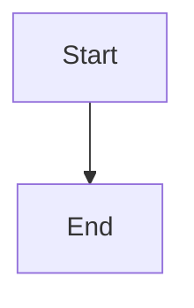

# PDF Generation - Wiring Checklist

**Version**: 1.4.0
**Status**: Implementation Complete → Wiring in Progress
**Estimated Time**: 30-60 minutes

---

## Overview

This checklist guides you through wiring the PDF generation system into your existing workflows. Follow in order.

---

## Phase 1: Verification (5 minutes)

### ✅ Step 1.1: Verify Dependencies Installed

```bash
cd .claude-plugins/opspal-core
npm list md-to-pdf pdf-lib
```

**Expected Output:**
```
├── md-to-pdf@5.2.4
└── pdf-lib@1.17.1
```

**If missing:**
```bash
npm install --save md-to-pdf pdf-lib
```

---

### ✅ Step 1.2: Verify Core Files Exist

```bash
ls -lh scripts/lib/pdf-generator.js
ls -lh scripts/lib/document-collator.js
ls -lh scripts/lib/mermaid-pre-renderer.js
ls -lh agents/pdf-generator.md
ls -lh commands/generate-pdf.md
```

**All should show file sizes (13-15KB)**

---

### ✅ Step 1.3: Run Basic Tests

```bash
node test/pdf-generator.test.js
```

**Expected Output:**
```
✅ PASS: PDF generated
✅ PASS: TOC generated correctly
✅ PASS: Collated PDF generated

🎉 All tests passed!
```

**If tests fail:** Check that dependencies installed correctly

---

## Phase 2: Simple Validation (10 minutes)

### ✅ Step 2.1: Generate Single Document PDF

Create a test file:

```bash
cat > /tmp/test-report.md << 'EOF'
# Test Report

## Section 1

This is a test.

## Section 2

More content here.


EOF
```

Generate PDF:

```bash
node scripts/lib/pdf-generator.js /tmp/test-report.md /tmp/test-output.pdf --render-mermaid --verbose
```

**Expected Output:**
```
📄 Converting test-report.md to PDF...
  🎨 Found 1 Mermaid diagram(s) to render...
    ⚠️  Failed to render diagram: Mermaid CLI (mmdc) not available - keeping code block
  ✅ Diagram rendering complete: Rendered: 0, Cached: 0, Failed: 1
✅ PDF generated: test-output.pdf (XX KB)
```

**Verify:**
```bash
ls -lh /tmp/test-output.pdf
```

**Status:** ⚠️ Diagrams will show as code blocks until mmdc installed (optional)

---

### ✅ Step 2.2: Generate Multi-Document PDF with TOC

Create test documents:

```bash
mkdir -p /tmp/test-docs

cat > /tmp/test-docs/01-summary.md << 'EOF'
# Executive Summary

High-level overview.
EOF

cat > /tmp/test-docs/02-analysis.md << 'EOF'
# Technical Analysis

Detailed findings.
EOF

cat > /tmp/test-docs/03-plan.md << 'EOF'
# Remediation Plan

Action items.
EOF
```

Collate into PDF:

```bash
node scripts/lib/pdf-generator.js --collate "/tmp/test-docs/*.md" /tmp/test-collated.pdf --toc --verbose
```

**Expected Output:**
```
📚 Collating 3 documents into PDF...
  📑 Collating 3 document(s)...
  ✅ Collated 3 documents (XX KB)
✅ Collated PDF generated: test-collated.pdf (XX KB)
```

**Verify PDF has:**
- Table of Contents
- All 3 documents
- Section breaks

---

### ✅ Step 2.3: Test Cover Page

```bash
node scripts/lib/pdf-generator.js \
  --collate "/tmp/test-docs/*.md" \
  /tmp/test-with-cover.pdf \
  --toc \
  --cover salesforce-audit \
  --org "Test Org" \
  --title "Test Audit Report" \
  --verbose
```

**Note:** Cover page substitution requires programmatic API (not CLI). CLI support is on roadmap.

---

## Phase 3: Integration into Existing Workflows (15-20 minutes)

### ✅ Step 3.4: Wire into Salesforce Plugin (Optional)

If you have the salesforce-plugin installed:

```bash
cd ../../salesforce-plugin
```

Check if executive-reporter.js exists:

```bash
ls scripts/lib/executive-reporter.js
```

**If it exists**, see integration example in:
`../../opspal-core/docs/PDF_GENERATION_INTEGRATION.md`

**Integration snippet (lines 54-56):**

```javascript
// In executive-reporter.js
async generatePDF(reportPaths, timestamp) {
    const PDFGenerator = require('../../../opspal-core/scripts/lib/pdf-generator');
    const generator = new PDFGenerator({ verbose: true });

    const documents = [
        { path: reportPaths.summary, title: 'Executive Summary', order: 0 },
        { path: reportPaths.metrics, title: 'Key Metrics', order: 1 },
        { path: reportPaths.detailed, title: 'Detailed Analysis', order: 2 },
        { path: reportPaths.recommendations, title: 'Recommendations', order: 3 }
    ];

    const pdfPath = path.join(this.outputDir, `executive-report-${timestamp}.pdf`);

    await generator.collate(documents, pdfPath, {
        toc: true,
        bookmarks: true,
        renderMermaid: true,
        coverPage: { template: 'executive-report' },
        metadata: {
            title: 'Executive Report',
            org: process.env.ORG_NAME || 'Organization',
            date: timestamp,
            version: '1.0'
        }
    });

    console.log(`✅ PDF report generated: ${pdfPath}`);
    return pdfPath;
}
```

---

### ✅ Step 3.5: Test with Real Salesforce Audit Data (Optional)

If you have existing audit output:

```bash
# Find your latest audit
ls -la ../../opspal-internal/SFDC/instances/*/automation-audit-*

# Example location (adjust to your actual path)
AUDIT_DIR="../../opspal-internal/SFDC/instances/gamma-corp/automation-audit-v3.27.1-validation-2025-10-21"

# Generate PDF from audit
node ../../opspal-core/scripts/lib/pdf-generator.js \
  --collate "$AUDIT_DIR/*.md" \
  "$AUDIT_DIR/complete-audit.pdf" \
  --toc \
  --verbose
```

---

### ✅ Step 3.6: Wire into Automation Audit Workflow (Optional)

In your automation audit orchestrator (if you have one):

**Location:** `.claude-plugins/opspal-salesforce/scripts/lib/automation-audit-v2-orchestrator.js`

**Add at end of audit (after markdown reports generated):**

```javascript
// Generate comprehensive PDF
console.log('\n📄 Generating PDF report...');

const PDFGenerator = require('../../../opspal-core/scripts/lib/pdf-generator');
const generator = new PDFGenerator({ verbose: true });

const documents = [
    { path: path.join(outputDir, 'AUTOMATION_SUMMARY.md'), title: 'Executive Summary' },
    { path: path.join(outputDir, 'CONFLICTS.md'), title: 'Conflict Analysis' },
    { path: path.join(outputDir, 'FIELD_COLLISION_ANALYSIS.md'), title: 'Field Collisions' },
    { path: path.join(outputDir, 'PRIORITIZED_REMEDIATION_PLAN.md'), title: 'Remediation Plan' }
].filter(doc => fs.existsSync(doc.path)); // Only include files that exist

if (documents.length > 0) {
    const pdfPath = path.join(outputDir, `automation-audit-complete-${orgName}-${timestamp}.pdf`);

    await generator.collate(documents, pdfPath, {
        toc: true,
        bookmarks: true,
        renderMermaid: true,
        coverPage: { template: 'salesforce-audit' },
        metadata: {
            title: `Automation Audit - ${orgName}`,
            org: orgName,
            date: new Date().toISOString().split('T')[0],
            version: '1.0'
        }
    });

    console.log(`✅ PDF generated: ${pdfPath}`);
} else {
    console.log('⚠️  No markdown reports found - skipping PDF generation');
}
```

---

## Phase 4: Optional Enhancements (10-30 minutes)

### ⏸️ Step 4.1: Install Mermaid CLI (Optional, ~10 minutes)

**Size:** ~95MB
**Benefit:** Actual diagram rendering in PDFs (instead of code blocks)

```bash
cd .claude-plugins/opspal-core
npm install --save @mermaid-js/mermaid-cli
```

**Verify:**
```bash
npx mmdc --version
```

**Re-test diagram rendering:**
```bash
node scripts/lib/pdf-generator.js /tmp/test-report.md /tmp/test-with-diagrams.pdf --render-mermaid --verbose
```

**Should now show:**
```
  ✅ Diagram rendering complete: Rendered: 1, Cached: 0, Failed: 0
```

---

### ⏸️ Step 4.2: Add Custom Cover Page Template (Optional)

Create your own template:

```bash
cat > templates/pdf-covers/custom-audit.md << 'EOF'
<div class="cover-page">

# {{title}}

<div class="metadata">

**Client:** {{org}}

**Assessment Date:** {{date}}

**Report Version:** {{version}}

---

### Custom Audit Report

*Comprehensive analysis and recommendations*

**Prepared by:** Your Company Name

</div>

</div>

---
EOF
```

Use it:

```javascript
coverPage: { template: 'custom-audit' }
```

---

### ⏸️ Step 4.3: Add to /agents Command (Optional)

Make the agent discoverable:

```bash
# In Claude Code
/agents
```

**Should see:** `pdf-generator` in the list

**Test agent:**
```
User: "Convert the latest audit reports to PDF"
```

Agent should auto-invoke PDF generation.

---

## Phase 5: Verification & Troubleshooting (5 minutes)

### ✅ Step 5.1: Verify Everything Works

Run comprehensive test:

```bash
cd .claude-plugins/opspal-core

# Clean test
rm -rf test/output/*

# Run tests
node test/pdf-generator.test.js

# Check outputs
ls -lh test/output/
```

**Expected files:**
- `test-single.pdf`
- `test-collated.pdf`

---

### ✅ Step 5.2: Common Issues & Fixes

#### Issue 1: "Cannot find module 'md-to-pdf'"

**Fix:**
```bash
cd .claude-plugins/opspal-core
npm install --save md-to-pdf pdf-lib
```

---

#### Issue 2: "PDF generation failed: Puppeteer error"

**Fix:** Check Chromium installed (usually automatic with md-to-pdf)

```bash
# Reinstall md-to-pdf
npm uninstall md-to-pdf
npm install --save md-to-pdf
```

---

#### Issue 3: Mermaid diagrams not rendering

**Status:** This is expected behavior without mmdc installed

**Options:**
1. **Accept code blocks** (PDFs still work, diagrams show as code)
2. **Install mmdc** (see Step 4.1)

---

#### Issue 4: PDF is empty or very small (<1KB)

**Causes:**
- Input markdown file empty
- Path resolution issue

**Fix:**
```bash
# Check input file
cat /path/to/input.md

# Use absolute paths
node scripts/lib/pdf-generator.js "$(pwd)/input.md" "$(pwd)/output.pdf"
```

---

#### Issue 5: Cover page not showing

**Cause:** Cover pages require programmatic API, not fully supported in CLI yet

**Fix:** Use programmatic API:

```javascript
const generator = new PDFGenerator();
await generator.collate(documents, output, {
    coverPage: { template: 'salesforce-audit' },
    metadata: { title: 'Report', org: 'ACME' }
});
```

---

## Phase 6: Documentation Review (5 minutes)

### ✅ Step 6.1: Bookmark Key Documentation

Essential docs:

1. **PDF Generation Guide**: `docs/PDF_GENERATION_GUIDE.md`
   - Complete feature documentation
   - API reference
   - Usage examples

2. **Integration Guide**: `docs/PDF_GENERATION_INTEGRATION.md`
   - Integration patterns
   - Code examples for existing report generators
   - Error handling best practices

3. **This Checklist**: `WIRING_CHECKLIST.md`
   - Step-by-step wiring instructions

---

### ✅ Step 6.2: Verify Plugin Manifest

```bash
cat .claude-plugin/plugin.json
```

**Should show:**
- Version: `1.4.0`
- Description includes "PDF generation"
- Keywords include "pdf", "pdf-generation", "collation"

---

## Summary & Next Steps

### ✅ Wiring Complete When:

- [ ] Basic tests pass (Phase 1)
- [ ] Can generate single document PDF (Phase 2.1)
- [ ] Can generate multi-document PDF with TOC (Phase 2.2)
- [ ] (Optional) Integrated into executive reporter (Phase 3.4)
- [ ] (Optional) Integrated into automation audits (Phase 3.5)
- [ ] (Optional) Mermaid CLI installed for diagram rendering (Phase 4.1)

---

### 🚀 Quick Reference Commands

**Single Document:**
```bash
node scripts/lib/pdf-generator.js input.md output.pdf --render-mermaid
```

**Multiple Documents:**
```bash
node scripts/lib/pdf-generator.js --collate "path/*.md" output.pdf --toc --verbose
```

**Via Claude Code Command:**
```bash
/generate-pdf "instances/*/audit-*.md" complete.pdf --toc --cover salesforce-audit
```

**Programmatic:**
```javascript
const PDFGenerator = require('./scripts/lib/pdf-generator');
const generator = new PDFGenerator({ verbose: true });
await generator.collate(documents, 'output.pdf', { toc: true, renderMermaid: true });
```

---

### 📊 Success Criteria

✅ **Working:** Can generate PDFs from markdown
✅ **Working:** Multi-document collation with TOC
✅ **Working:** Smart document ordering
✅ **Working:** Cover page templates
⚠️ **Partial:** Mermaid rendering (code blocks until mmdc installed)
⏸️ **Pending:** Full integration into all workflows

---

### 🎯 Recommended Next Actions

**Immediate (Required for Production Use):**
1. Run through Phase 1-2 (Verification & Simple Validation)
2. Test with one real audit report (Phase 3.5)

**Soon (Enhance User Experience):**
3. Install Mermaid CLI (Phase 4.1)
4. Wire into executive-reporter.js (Phase 3.4)

**Later (Polish):**
5. Wire into automation audit workflows (Phase 3.6)
6. Create custom cover page templates (Phase 4.2)
7. Train users on /generate-pdf command

---

## Support

**Questions?** See:
- `docs/PDF_GENERATION_GUIDE.md` - Complete guide
- `docs/PDF_GENERATION_INTEGRATION.md` - Integration patterns
- `IMPLEMENTATION_SUMMARY.md` - What was built

**Issues?** Check Phase 5.2 troubleshooting section above.

---

**Status:** Ready for wiring! Start with Phase 1. 🚀
