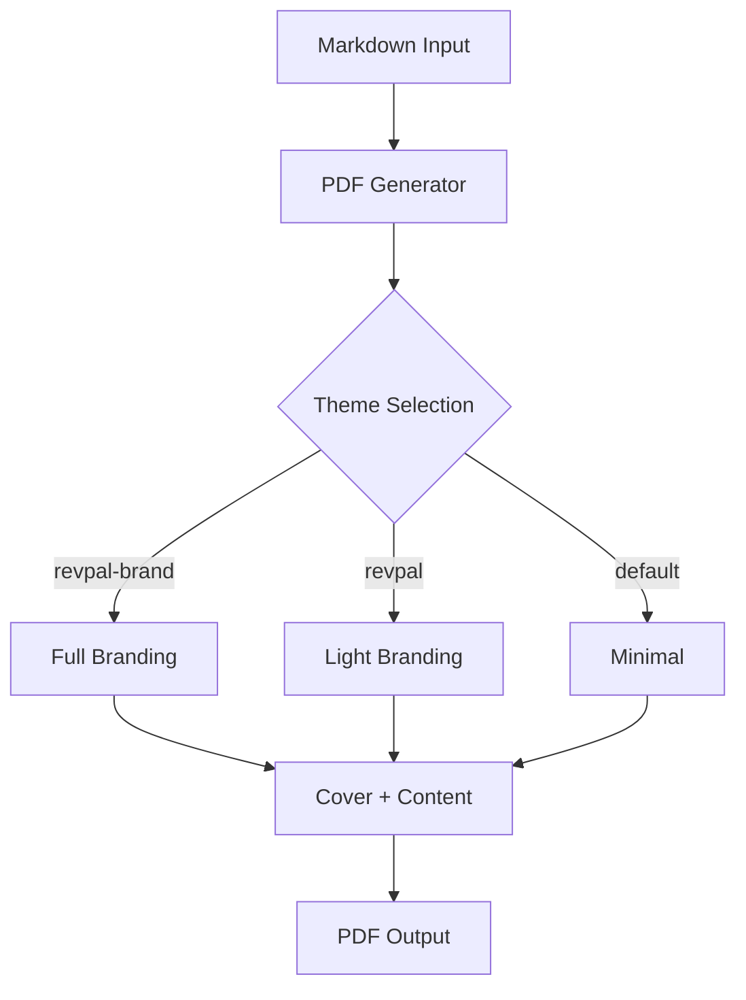

# Test Report: PDF Pipeline Validation

This document tests all PDF generation features including headers, tables, code blocks, and diagrams.

## Executive Summary

This is a test report to validate the PDF generation pipeline after branding updates.

## Key Findings

| Metric | Value | Status |
|--------|-------|--------|
| Templates | 9 | ✓ |
| Themes | 3 | ✓ |
| Brand Colors | 5 | ✓ |

## Architecture Diagram



## Code Example

```javascript
const generator = new PDFGenerator({
  theme: 'revpal-brand',
  verbose: true
});
```

## Conclusion

If this PDF renders with:
1. Purple headers (Grape: #5F3B8C)
2. Apricot accents (#E99560)
3. Montserrat headings
4. Figtree body text
5. Visible Mermaid diagram

Then the pipeline is working correctly.
