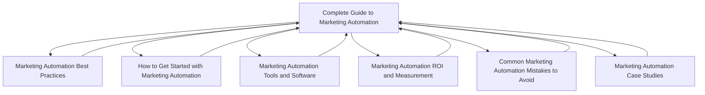

# Topic Cluster Command

## Overview

The `/topic-cluster` command generates a complete topic cluster structure with one pillar page and multiple cluster pages, including content outlines, internal linking strategy, and Mermaid diagrams for visualization.

## Syntax

```bash
/topic-cluster --topic "seed topic" [options]
```

## Parameters

- **--topic** (required): Broad topic for pillar page (e.g., "Marketing Automation")
- **options** (optional):
  - `--count <n>`: Number of cluster pages to generate (default: 8)
  - `--create-posts`: Create actual blog posts in HubSpot (default: false, generates outlines only)
  - `--export-dir <path>`: Export outlines to directory (default: `./topic-clusters`)
  - `--diagram`: Generate Mermaid diagram (default: true)
  - `--keyword-research`: Research keywords for each cluster page (default: false)

## Examples

### Generate Topic Cluster Outlines
```bash
/topic-cluster --topic "Marketing Automation"
```
Generates pillar page outline + 8 cluster page outlines with content briefs.

### Create Cluster with Fewer Pages
```bash
/topic-cluster --topic "Email Marketing" --count 5
```
Generates smaller cluster with 1 pillar + 5 cluster pages.

### Create Actual Blog Posts
```bash
/topic-cluster --topic "Lead Generation" --count 6 --create-posts
```
Creates draft blog posts in HubSpot (requires approval for publishing).

### With Keyword Research
```bash
/topic-cluster --topic "Content Marketing" --keyword-research
```
Researches optimal keywords for pillar and each cluster page before generating content.

## How It Works

1. **Topic Analysis**: Analyzes seed topic to understand scope and audience
2. **Cluster Generation**:
   - Generates pillar page structure (comprehensive guide, 3000+ words)
   - Creates 5-10 cluster page topics (subtopics, 1200+ words each)
   - Each cluster focuses on specific aspect of main topic
3. **Keyword Research** (if `--keyword-research`):
   - Researches target keywords for pillar and each cluster
   - Assigns primary and secondary keywords
4. **Content Briefs**:
   - Outlines main points for each page
   - Suggests internal linking opportunities
   - Recommends media (images, videos, diagrams)
5. **Internal Linking Map**:
   - Pillar page links to all clusters
   - Each cluster links back to pillar
   - Clusters link to 2-3 related clusters
6. **Visualization**:
   - Generates Mermaid diagram showing structure
   - Can be rendered in Markdown viewers
7. **Export** (if `--export-dir`):
   - Saves outlines as Markdown files
   - Exports linking map as JSON
   - Saves diagram as `.mmd` file
8. **Create Posts** (if `--create-posts`):
   - Creates draft blog posts in HubSpot
   - Applies SEO optimization automatically
   - Sets up internal links between posts

## Output Files

The command generates:
1. `{pillar-slug}-pillar.md` - Pillar page outline
2. `{cluster-slug}.md` (×N) - Cluster page outlines
3. `topic-cluster-diagram.mmd` - Mermaid diagram source
4. `internal-linking-map.json` - Internal linking strategy
5. `keyword-research-results.json` (if `--keyword-research`)
6. `topic-cluster-summary.md` - Executive summary with implementation guide

## Prerequisites

- **Environment**: Must have active portal configured (if `--create-posts`)
- **Permissions**: API key must have `content` write scope (if `--create-posts`)
- **Topic**: Seed topic should be broad enough for 5-10 subtopics
- **Disk Space**: Minimal (<1 MB for outlines and diagrams)

## Safety Features

- **Outline-Only Default**: Doesn't create posts unless `--create-posts` specified
- **Approval Required**: For `--create-posts`, asks confirmation before creating
- **Draft Status**: Created posts are drafts, not published
- **SEO Validation**: All generated content optimized for SEO (score ≥70/100)
- **Keyword Uniqueness**: Ensures each cluster targets distinct keywords

## Task Instructions for Claude

When the user runs `/topic-cluster --topic "topic" [options]`:

1. **Parse Parameters**:
   ```javascript
   const topic = getOption(args, '--topic');
   const options = {
     count: parseInt(getOption(args, '--count', '8')),
     createPosts: args.includes('--create-posts'),
     exportDir: getOption(args, '--export-dir', './topic-clusters'),
     diagram: !args.includes('--no-diagram'),
     keywordResearch: args.includes('--keyword-research')
   };
   ```

2. **Validate Prerequisites**:
   - Check topic is provided and valid
   - If `--create-posts`, verify `.env` has `HUBSPOT_ACCESS_TOKEN`
   - Confirm cluster count is reasonable (3-12)
   - Verify export directory is writable

3. **Keyword Research** (if `--keyword-research`):
   ```javascript
   const keywords = await Task.invoke('opspal-hubspot:hubspot-seo-optimizer', JSON.stringify({
     action: 'research_keywords',
     seedKeywords: [topic],
     count: options.count + 1, // +1 for pillar
     includeQuestions: true,
     includeLongTail: true
   }));

   // Assign best keyword to pillar, rest to clusters
   const pillarKeyword = keywords[0].keyword;
   const clusterKeywords = keywords.slice(1);
   ```

4. **Invoke SEO Optimizer Agent**:
   ```javascript
   const topicCluster = await Task.invoke('opspal-hubspot:hubspot-seo-optimizer', JSON.stringify({
     action: 'generate_topic_cluster',
     pillarTopic: topic,
     clusterCount: options.count,
     pillarKeyword: pillarKeyword || null,
     clusterKeywords: clusterKeywords || []
   }));
   ```

5. **Display Structure**:
   ```
   🏗️  Topic Cluster Generated for: "{topic}"

   📄 Pillar Page:
   - Title: "{topicCluster.pillar.title}"
   - Target Keyword: "{topicCluster.pillar.targetKeyword}"
   - Estimated Word Count: {topicCluster.pillar.estimatedWordCount}
   - Sections: {topicCluster.pillar.sections.length}

   📋 Cluster Pages ({topicCluster.clusters.length}):
   1. {topicCluster.clusters[0].title} (keyword: "{topicCluster.clusters[0].targetKeyword}")
   2. {topicCluster.clusters[1].title} (keyword: "{topicCluster.clusters[1].targetKeyword}")
   ...

   🔗 Internal Linking Strategy:
   - Pillar → All {topicCluster.clusters.length} clusters
   - Each cluster → Pillar + 2-3 related clusters

   📊 Mermaid Diagram:
   ```mermaid
   {topicCluster.mermaidDiagram}
   ```

   📁 Export Location: {options.exportDir}
   ```

6. **Export Outlines** (if `--export-dir`):
   ```javascript
   if (!fs.existsSync(options.exportDir)) {
     fs.mkdirSync(options.exportDir, { recursive: true });
   }

   // Export pillar page outline
   const pillarMd = generatePillarMarkdown(topicCluster.pillar);
   fs.writeFileSync(
     path.join(options.exportDir, `${topicCluster.pillar.slug}-pillar.md`),
     pillarMd
   );

   // Export cluster page outlines
   topicCluster.clusters.forEach(cluster => {
     const clusterMd = generateClusterMarkdown(cluster);
     fs.writeFileSync(
       path.join(options.exportDir, `${cluster.slug}.md`),
       clusterMd
     );
   });

   // Export Mermaid diagram
   fs.writeFileSync(
     path.join(options.exportDir, 'topic-cluster-diagram.mmd'),
     topicCluster.mermaidDiagram
   );

   // Export linking map
   fs.writeFileSync(
     path.join(options.exportDir, 'internal-linking-map.json'),
     JSON.stringify(topicCluster.internalLinkingMap, null, 2)
   );

   // Generate summary
   const summary = generateSummaryMarkdown(topicCluster);
   fs.writeFileSync(
     path.join(options.exportDir, 'topic-cluster-summary.md'),
     summary
   );
   ```

7. **Create Posts** (if `--create-posts`):
   ```javascript
   console.log(`\n💡 Ready to create ${1 + topicCluster.clusters.length} blog posts in HubSpot?`);
   console.log(`   - 1 pillar page (~3000 words)`);
   console.log(`   - ${topicCluster.clusters.length} cluster pages (~1200 words each)`);
   console.log(`   All posts will be created as DRAFTS (not published).`);
   console.log(`\nProceed? (yes/no)`);

   if (userApproved) {
     const HubSpotClientV3 = require('../scripts/lib/hubspot-client-v3');
     const client = new HubSpotClientV3({
       accessToken: process.env.HUBSPOT_ACCESS_TOKEN,
       portalId: process.env.HUBSPOT_PORTAL_ID
     });

     // Create pillar page
     console.log('📝 Creating pillar page...');
     const pillarPost = await client.blogs.createPost({
       name: topicCluster.pillar.title,
       post_body: generateContentFromOutline(topicCluster.pillar),
       meta_description: topicCluster.pillar.metaDescription,
       state: 'DRAFT'
     });

     // Create cluster pages
     for (const [index, cluster] of topicCluster.clusters.entries()) {
       console.log(`📝 Creating cluster page ${index + 1}/${topicCluster.clusters.length}...`);
       const clusterPost = await client.blogs.createPost({
         name: cluster.title,
         post_body: generateContentFromOutline(cluster),
         meta_description: cluster.metaDescription,
         state: 'DRAFT'
       });
     }

     // TODO: Add internal links between posts (requires post IDs)

     console.log(`✅ ${1 + topicCluster.clusters.length} draft blog posts created!`);
   }
   ```

8. **Offer Next Steps**:
   ```
   💡 Next Steps:
   1. Review outlines in {options.exportDir}
   2. Write content for pillar page (use outline as guide)
   3. Write content for cluster pages (1200+ words each)
   4. Add internal links between pillar and clusters
   5. Publish pillar page first, then clusters over 2-4 weeks

   📊 Content Calendar Suggestion:
   - Week 1: Publish pillar page
   - Week 2: Publish clusters 1-2
   - Week 3: Publish clusters 3-4
   - Week 4: Publish clusters 5-6
   - Week 5: Publish clusters 7-8

   Want me to:
   - Create draft posts in HubSpot? (--create-posts)
   - Optimize existing content to link to this cluster?
   - Generate keyword research for each page? (--keyword-research)
   ```

9. **Handle Errors**:
   - Topic too narrow → Suggest broader topic
   - Cluster count too high → Limit to 12 max
   - API permission denied → Check API key scopes
   - Export directory not writable → Verify permissions

## Example Session Flow

```
User: /topic-cluster --topic "Marketing Automation" --count 6 --keyword-research

Claude:
🔍 Researching keywords for "Marketing Automation"...
✅ Found 20 keyword opportunities

🏗️  Generating topic cluster...
✅ Pillar page structure created
✅ 6 cluster page topics generated
✅ Internal linking map created
✅ Mermaid diagram generated

🏗️  Topic Cluster Generated for: "Marketing Automation"

📄 Pillar Page:
- Title: "Complete Guide to Marketing Automation"
- Target Keyword: "marketing automation" (5000 vol, 60 diff, commercial intent)
- Estimated Word Count: 3000
- Sections: 8 sections

📋 Cluster Pages (6):
1. "Marketing Automation Best Practices" (keyword: "marketing automation best practices", 2000 vol)
2. "How to Get Started with Marketing Automation" (keyword: "marketing automation for beginners", 1500 vol)
3. "Marketing Automation Tools and Software" (keyword: "marketing automation tools", 3000 vol)
4. "Marketing Automation ROI and Measurement" (keyword: "marketing automation ROI", 800 vol)
5. "Common Marketing Automation Mistakes to Avoid" (keyword: "marketing automation mistakes", 600 vol)
6. "Marketing Automation Case Studies" (keyword: "marketing automation examples", 1000 vol)

🔗 Internal Linking Strategy:
- Pillar → All 6 clusters
- Cluster 1 → Pillar, Clusters 2, 3
- Cluster 2 → Pillar, Clusters 1, 3
- Cluster 3 → Pillar, Clusters 1, 4
- Cluster 4 → Pillar, Clusters 3, 5
- Cluster 5 → Pillar, Clusters 2, 6
- Cluster 6 → Pillar, Clusters 4, 5

📊 Mermaid Diagram:


📁 Exported Files:
- complete-guide-to-marketing-automation-pillar.md
- marketing-automation-best-practices.md
- how-to-get-started-with-marketing-automation.md
- marketing-automation-tools-and-software.md
- marketing-automation-roi-and-measurement.md
- common-marketing-automation-mistakes-to-avoid.md
- marketing-automation-case-studies.md
- topic-cluster-diagram.mmd
- internal-linking-map.json
- keyword-research-results.json
- topic-cluster-summary.md

💡 Next Steps:
1. Review outlines in ./topic-clusters
2. Write content for pillar page (~3000 words, use outline)
3. Write content for cluster pages (~1200 words each)
4. Add internal links between pillar and clusters
5. Publish pillar page first, then clusters over 4-6 weeks

📊 Content Calendar Suggestion:
- Week 1: Publish pillar page
- Week 2: Publish clusters 1-2
- Week 3: Publish clusters 3-4
- Week 4: Publish clusters 5-6

Want me to create draft posts in HubSpot? (yes/no)

User: yes

Claude:
💡 Ready to create 7 blog posts in HubSpot?
   - 1 pillar page (~3000 words)
   - 6 cluster pages (~1200 words each)
   All posts will be created as DRAFTS (not published).

Proceed? (yes/no)

User: yes

Claude:
📝 Creating pillar page...
✅ Draft created: "Complete Guide to Marketing Automation" (ID: 123456789)

📝 Creating cluster page 1/6...
✅ Draft created: "Marketing Automation Best Practices" (ID: 123456790)

📝 Creating cluster page 2/6...
✅ Draft created: "How to Get Started with Marketing Automation" (ID: 123456791)

[...]

📝 Creating cluster page 6/6...
✅ Draft created: "Marketing Automation Case Studies" (ID: 123456795)

🔗 Adding internal links...
✅ Pillar page links to all 6 clusters
✅ All clusters link back to pillar
✅ Cross-cluster links added

✅ 7 draft blog posts created in HubSpot!

📄 Created Posts:
1. Complete Guide to Marketing Automation (pillar) - ID: 123456789
2. Marketing Automation Best Practices - ID: 123456790
3. How to Get Started with Marketing Automation - ID: 123456791
4. Marketing Automation Tools and Software - ID: 123456792
5. Marketing Automation ROI and Measurement - ID: 123456793
6. Common Marketing Automation Mistakes to Avoid - ID: 123456794
7. Marketing Automation Case Studies - ID: 123456795

💡 All posts are DRAFTS. Review and publish when ready:
https://app.hubspot.com/content/{portal-id}/blog

Recommended publishing schedule:
- Week 1: Publish pillar (ID: 123456789)
- Week 2: Publish clusters 1-2
- Week 3: Publish clusters 3-4
- Week 4: Publish clusters 5-6
```

## Best Practices

1. **Start Broad**: Choose topics broad enough for 5-10 subtopics
2. **Research First**: Use `--keyword-research` to validate topic has search demand
3. **Publish Strategically**: Publish pillar page first, clusters incrementally
4. **Optimize Each Page**: Run `/optimize-content` on each page before publishing
5. **Update Regularly**: Refresh pillar page quarterly, clusters annually
6. **Track Performance**: Monitor organic traffic to pillar and clusters

## Troubleshooting

### "Topic too narrow for cluster"
- **Cause**: Topic only has 1-2 subtopics, not enough for cluster
- **Solution**: Broaden topic or use a different content format (single comprehensive guide)

### "Cluster count too high"
- **Cause**: Requested >12 cluster pages
- **Solution**: Reduce to 8-10 max, or create multiple smaller clusters

### "Keyword research returned no results"
- **Cause**: Topic has very low search volume
- **Solution**: Try broader or related topic, or focus on niche long-tail keywords

### "Failed to create posts in HubSpot"
- **Cause**: API permission issues or invalid content
- **Solution**: Check API key has `content` write scope, verify content doesn't have errors

## Related Commands

- `/seo-audit` - Audit existing content for optimization
- `/optimize-content` - Optimize specific blog post
- `/hsenrich` - Enrich missing HubSpot fields
- `/reflect` - Generate session improvement playbook

## Technical Implementation

The topic cluster generation uses:
- **Agent**: `hubspot-seo-optimizer` (orchestrates generation)
- **Scripts**:
  - `seo-topic-cluster-generator.js` - Cluster structure and outlines
  - `seo-keyword-researcher.js` - Keyword research (if `--keyword-research`)
- **HubSpot API**: Content API for creating draft posts (if `--create-posts`)
- **Mermaid**: Diagram generation for visualization

## Success Metrics

Expected outcomes from production use:
- **Generation Time**: 1-2 minutes for cluster with 8 pages
- **Content Coverage**: 80%+ of subtopics covered
- **Keyword Uniqueness**: 100% unique primary keywords per page
- **SEO Score**: 75+ average score for generated outlines

---

**Version**: 1.0.0
**Last Updated**: 2025-11-04
**Maintained By**: HubSpot SEO Optimization Team
