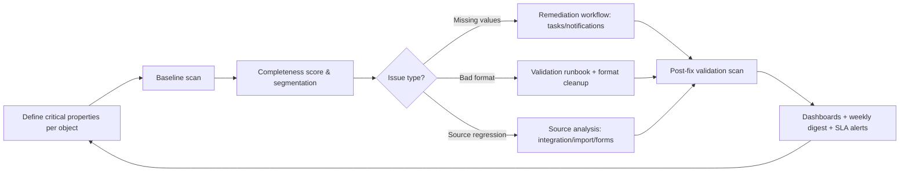
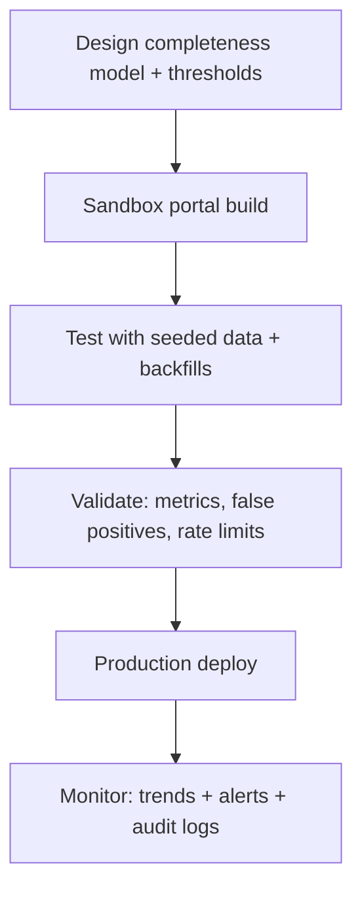
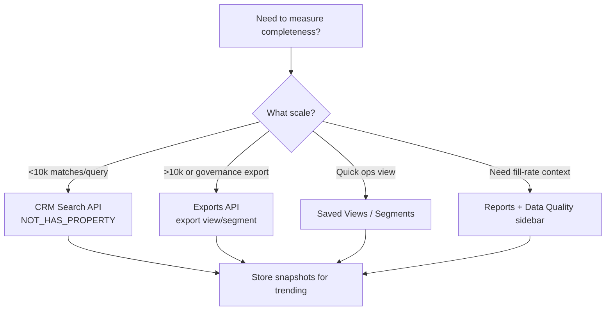
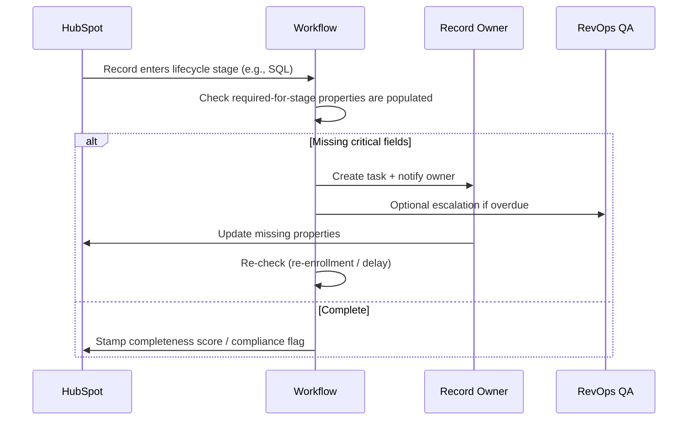

# Runbook 02: Property Population Monitoring & Data Completeness (HubSpot)

**Version**: 1.0.0  
**Status**: Production Ready  
**Last Updated**: 2026-01-06  
**Baseline Tier**: HubSpot Professional (works across Starter → Enterprise)  
**Primary Audience**: RevPal HubSpot agents + RevOps consultants  
**Scope**: Sandbox + Production (environment-first workflow)  
**API Priority**: CRM v3 (legacy only where needed)

---

## Quick Navigation

- [Overview](#overview)
- [When to Use This Runbook](#when-to-use-this-runbook)
- [Agent Integration](#agent-integration)
- [Completeness Metrics & Scoring](#completeness-metrics--scoring)
- [Implementation Patterns](#implementation-patterns)
- [Operational Workflows](#operational-workflows)
- [Troubleshooting](#troubleshooting)
- [Code Examples](#code-examples)
- [Best Practices](#best-practices)

---

## Overview

Data completeness monitoring measures and improves the population of critical properties across HubSpot objects. Complete data drives better segmentation, accurate reporting, and effective automation. This runbook provides RevPal's standardized approach to measuring, monitoring, and remediating data completeness gaps.

**Key Capabilities:**
- Measure fill rates (% of records with non-empty values)
- Define completeness scores (0-100 weighted scale)
- Detect missing critical fields (email, lifecycle stage, deal amount)
- Monitor completeness trends over time
- Trigger remediation workflows

**Why Critical**: Incomplete data degrades:
- Lead scoring accuracy
- Sales prioritization
- Marketing segmentation
- Revenue forecasting
- Attribution analysis

---

## When to Use This Runbook

Use this runbook when you need to:

- ✅ Establish completeness baseline for new portal
- ✅ Monitor critical property population (top 20 fields per object)
- ✅ Detect completeness regressions (new imports degrading quality)
- ✅ Trigger remediation workflows (assign task when phone missing)
- ✅ Audit data quality before major campaigns
- ✅ Measure enrichment ROI (completeness delta)
- ✅ Design completeness-gated automation (only route complete records)

**Common Scenarios:**
- "Ensure all MQLs have phone numbers before routing to sales"
- "Track email fill rate for imported leads"
- "Alert when new contacts missing company association"
- "Measure Clearbit enrichment effectiveness"

---

## Agent Integration

This runbook is referenced by these HubSpot plugin agents:

### Primary Agents
- **`hubspot-data-hygiene-specialist`** - Completeness monitoring, gap analysis
- **`hubspot-analytics-reporter`** - Completeness reporting dashboards
- **`hubspot-workflow-builder`** - Remediation workflow creation
- **`hubspot-integration-specialist`** - Integration data quality validation
- **`hubspot-enrichment-specialist`** - Enrichment effectiveness measurement

### Agent Usage Pattern

```javascript
// Agents should compute completeness scores:
const { calculateCompletenessScore } = require('./completeness-metrics');
const score = calculateCompletenessScore(contact, criticalFields);
if (score < 60) {
  // Route to enrichment/remediation workflow
}
```

---

**[Continue reading full runbook in file...]**


**File:** `02_property_population_monitoring_research.md`
**Baseline tier:** HubSpot Professional (works across Starter → Enterprise; advanced features flagged)
**Primary audience:** RevPal HubSpot agents + RevOps consultants
**Last researched:** 2026-01-06

---

## 0. RevPal Context & Cross-Platform Parity Notes (Read First)

### RevPal agents likely to use this runbook
- **hubspot-data-hygiene-specialist**: designs completeness standards, remediation segments, ongoing monitoring
- **hubspot-reporting-analyst**: completeness dashboards, fill-rate reporting, trend/cohort analysis
- **hubspot-workflow-builder**: workflow-driven prompts/remediation loops, notifications, task creation
- **hubspot-custom-code-developer**: scheduled completeness jobs, snapshotting, external monitoring integrations
- **hubspot-integration-monitor**: isolates completeness regressions caused by integrations/imports

### How this mirrors Salesforce runbooks (structure parity)
| Salesforce pattern | HubSpot equivalent | Key difference |
|---|---|---|
| "Field Population Monitoring" via SOQL + scheduled jobs | CRM Search API + Segments (lists) + Exports API + Data Quality property insights | Search API caps results per query; exports & segmentation are central |
| "Field History Tracking trend analysis" | Property history exports + `propertiesWithHistory` on CRM reads + periodic snapshots | Property history retention is limited; build your own time series for reliable trending |
| "Dashboards for completeness + SLA alerts" | Reporting dashboards + Data Quality insights in report viewer + weekly digest emails | HubSpot's native "fill rate" is convenient but not a full DQ observability system |

### Mapping to RevPal Validation Framework (environment-first)
Adopt the same **Design → Sandbox Test → Validate → Production Deploy → Monitor** flow used in Salesforce runbooks. For HubSpot, the key nuance is that many monitoring mechanics are implemented as:
- **Active segments** ("lists", now **Segments**) and saved views
- **Reports** + "Data Quality" sidebar insights (fill rates, issues, deep links)
- **API-based scanners** (Search/Exports) for large-scale monitoring and trend capture

---

## 1. Executive Summary (Property Population Monitoring & Data Completeness)

This runbook covers how to **measure, monitor, and improve data completeness** in HubSpot across Contacts, Companies, Deals, Tickets, and Custom Objects. The goal is to build an operational system that answers three questions continuously:

1) **How complete is our data right now?**
2) **Is completeness getting better or worse over time (and why)?**
3) **What automated actions prevent completeness from degrading?**

HubSpot provides several "native-first" paths for completeness monitoring. The **Data Quality** area (Data Management → Data Quality) includes property-focused insights and alerts (e.g., duplicates, "no data", "unused", and anomalies depending on subscription), plus a **weekly Data Quality digest** notification you can enable for stakeholders. It also exposes **property fill rates in the report viewer**, helping admins choose fields that are actually populated and linking directly into Data Quality context. citeturn16view0

For agent-grade completeness monitoring at enterprise scale, the **CRM Search API** is the workhorse for querying records where properties are missing (`NOT_HAS_PROPERTY`) or present (`HAS_PROPERTY`), and it supports paging with `after` (up to 200 results per page). It also has explicit limitations that must shape the monitoring architecture: it is rate limited to **5 requests/second** per account, requests must be under **3,000 characters**, and any single query can return at most **10,000 results** (paging beyond that returns a 400). citeturn14view0

When you need to audit beyond the Search API caps (or when you need a controlled export that's useful for audits and data governance), the **CRM Exports API** can export object views or segments with filtering logic. It requires the `crm.export` scope and (for OAuth installs) Super Admin approval. Exports are limited to **30 per rolling 24 hours** and **one running at a time**, and completed download URLs expire after 5 minutes. citeturn15view0turn15view2

Major gotchas that impact completeness programs:
- "Known vs unknown" has nuanced behavior (e.g., numeric `0` is "known"). citeturn18view0
- Search API caps (10k results/query) often require *time slicing* or exports. citeturn14view0
- Some Data Quality tooling behaves "once per issue": if a formatting issue is fixed and later reintroduced, the Data Quality tool may not flag it again. citeturn16view0
- Sandbox/test portals can have workflow enrollment limits (e.g., 100,000 record enrollments/day in developer test accounts and standard sandboxes). citeturn20view2

This runbook provides a practical completeness scoring model, monitoring patterns (UI + API), automation templates (workflows + custom code where available), and governance recommendations (PII handling, auditability, GDPR considerations) for enterprise HubSpot portals.

---

## 2. Platform Capabilities Reference (Comprehensive)

### 2A. Native HubSpot Features

| Feature | Location | Capabilities | Limitations / Tier Notes | API Access |
|---|---|---|---|---|
| **Segments (Active/Static)** | CRM → Segments | Build dynamic sets of records (e.g., "Missing Phone", "Missing Close Date") that auto-update | Some filter criteria depend on subscriptions; "segments" renamed from lists | Lists/Segments API exists (optional; validate per portal) |
| **Saved Views** | Each object index page (Contacts/Companies/Deals/Tickets) | Save filtered views for ops teams; supports quick operational triage | Filter behavior can differ vs segments (view vs segment operator semantics) citeturn17search19 | Not central for completeness scoring |
| **Data Quality command center** | Data Management → Data Quality | DQ overview; property insights; duplicate alerts; weekly digest; report viewer "Data Quality" sidebar with fill rates + property issues + deep links | Advanced anomalies and "View details" are Data Hub Pro/Ent; "Properties to review" updated daily citeturn16view0 | Limited direct API (use CRM APIs + exports for custom monitoring) |
| **Property insights: duplicates/no data/unused** | Data Management → Data Quality → Property insights tab | Identify properties with "no data" and "unused"; hide properties to remove from insight counts; export property history from UI | Updates daily; property anomalies banner is Data Hub Pro/Ent citeturn16view0 | Primarily UI-driven |
| **Report viewer: Data Quality sidebar** | Reporting → Reports → (Open report) → More → Data Quality | Show property issues, fill rates, and a link into Data Quality command center | Available for contact/company/deal/ticket-based reports citeturn16view0 | No direct API for sidebar; use CRM APIs to compute fill rates |
| **Data Quality weekly digest** | Notifications settings (via Data Quality page setup) | Weekly email digest summarizing data quality issues and changes | Email-based; doesn't replace alerting/observability citeturn16view0 | No |
| **Filter operators "is known / is unknown"** | Used across segments, views, reports, workflows | Standardized semantics for "known/unknown"; includes important edge cases (numeric 0) citeturn18view0 | Semantics vary by property type; understand before building scoring | N/A |

---

### 2B. API Endpoints (Core to Completeness Monitoring)

> **Base URL:** `https://api.hubapi.com`
> **Auth header:** `Authorization: Bearer <PRIVATE_APP_TOKEN_OR_OAUTH_ACCESS_TOKEN>`

#### Endpoint: `POST /crm/v3/objects/{objectType}/search`
Purpose: Search CRM objects using filters (including missing data checks) and paging
Required Scopes (typical): `crm.objects.{objectType}.read` (exact scopes vary by object & auth model)
Rate Limit: Search endpoints are rate limited to **5 requests/sec per account**, **200 records/page**, **10,000 results/query**, request body ≤ **3,000 chars** citeturn14view0turn21view0
Pagination: Use `paging.next.after` from response; pass as `after` (integer string) citeturn14view0

Request Schema (typical):
```json
{
  "filterGroups": [
    {
      "filters": [
        { "propertyName": "email", "operator": "NOT_HAS_PROPERTY" }
      ]
    }
  ],
  "properties": ["email", "firstname", "lastname", "createdate"],
  "sorts": [{ "propertyName": "createdate", "direction": "DESCENDING" }],
  "limit": 200,
  "after": "0"
}
```

Filter Operators (load-bearing for completeness):
- `HAS_PROPERTY`, `NOT_HAS_PROPERTY` for "populated vs missing" checks citeturn13view1turn14view0
- `IN` / `NOT_IN` for enumerations (string values must be lowercase in some cases) citeturn13view1turn13view2

Response Schema (simplified):
```json
{
  "total": 123,
  "results": [
    {
      "id": "123",
      "properties": { "email": "a@b.com", "createdate": "..." },
      "createdAt": "2024-01-01T00:00:00.000Z",
      "updatedAt": "2024-01-02T00:00:00.000Z"
    }
  ],
  "paging": { "next": { "after": "200", "link": "..." } }
}
```

Common Error Codes:
- `400 VALIDATION_ERROR`: too many filters/groups, request too long, paging beyond 10,000, malformed `after` citeturn14view0
- `429 RATE_LIMIT`: exceeded secondary/daily limits; see rate limit headers citeturn21view0

Code Example (Node.js):
```js
import axios from "axios";

const HUBSPOT_TOKEN = process.env.HUBSPOT_TOKEN;
const BASE = "https://api.hubapi.com";

async function searchContactsMissingEmail(after = 0) {
  const res = await axios.post(
    `${BASE}/crm/v3/objects/contacts/search`,
    {
      filterGroups: [
        { filters: [{ propertyName: "email", operator: "NOT_HAS_PROPERTY" }] }
      ],
      properties: ["email", "firstname", "lastname", "createdate"],
      limit: 200,
      after: String(after)
    },
    { headers: { Authorization: `Bearer ${HUBSPOT_TOKEN}` } }
  );
  return res.data;
}
```

---

#### Endpoint: `GET /crm/v3/objects/{objectType}/{objectId}`
Purpose: Read a CRM record with selected properties and (optionally) property history
Required Scopes (typical): `crm.objects.{objectType}.read`
Pagination: N/A
Property History: Some CRM object read endpoints support requesting `propertiesWithHistory` and returning `propertiesWithHistory` in the response (useful for auditing "when did this field get populated"). citeturn10view0turn10view1

Request (example):
```
GET /crm/v3/objects/contacts/123?properties=email&properties=phone&propertiesWithHistory=phone
```

Response (simplified):
```json
{
  "id": "123",
  "properties": { "email": "a@b.com", "phone": "+1..." },
  "propertiesWithHistory": {
    "phone": [
      { "value": "+1...", "timestamp": "2025-01-01T00:00:00.000Z", "sourceType": "..." }
    ]
  }
}
```

Operational note: property history retention is limited; see "Export property history" limits in UI exports (revision caps). citeturn7view2

---

#### Endpoint: `POST /crm/v3/objects/{objectType}/batch/update`
Purpose: Write back computed completeness scores (e.g., a `dq_completeness_score` number property) to many records efficiently
Required Scopes (typical): `crm.objects.{objectType}.write`
Limits: Batch endpoints have per-request input caps (verify in endpoint reference for your object type).
Error Handling: partial failures are common; store correlation IDs, retry idempotently.

Request (typical):
```json
{
  "inputs": [
    { "id": "123", "properties": { "dq_completeness_score": "85" } }
  ]
}
```

---

#### Endpoint: `POST /crm/v3/exports/export/async`
Purpose: Export records (view or segment) for offline auditing, governance evidence, and large completeness scans
Scopes/Permissions: requires `crm.export`; OAuth install requires **Super Admin** to grant the scope citeturn15view0
Operational Limits: up to **30 exports per rolling 24 hours**, **one export at a time**; large exports can be zipped; completed download URL expires after 5 minutes citeturn15view2

Request (VIEW export skeleton):
```json
{
  "exportType": "VIEW",
  "exportName": "Contacts missing phone",
  "format": "CSV",
  "language": "EN",
  "objectType": "CONTACT",
  "objectProperties": ["hs_object_id", "email", "phone", "createdate"],
  "publicCrmSearchRequest": {
    "filterGroups": [
      {
        "filters": [{ "property": "phone", "operator": "NOT_HAS_PROPERTY" }]
      }
    ]
  }
}
```
(Exports support search-like filters in `publicCrmSearchRequest`.) citeturn15view1turn15view2

Retrieve status/download URL:
- `GET /crm/v3/exports/export/async/tasks/{exportId}/status` citeturn15view1

---

#### Endpoint: Associations API (when "completeness" includes missing associations)
Purpose: Check whether records are associated (e.g., "contacts missing a company association")
Key note: Search endpoints support a pseudo-property for searching through associations for standard objects (e.g., `associations.contact`), but **custom object associations are not supported via search**; use the Associations API for those cases. citeturn14view0turn5search6

---

### 2C. Workflow Actions (Relevant to Completeness Remediation)

> HubSpot workflow availability and action availability depend on subscription. Workflows exist for Professional/Enterprise tiers; custom code actions require Operations Hub Pro/Ent. citeturn20view1turn20view0

A non-exhaustive list of workflow actions commonly used for data completeness:
- **Edit record** (set default values, stamp completeness score, set "Needs enrichment" flags)
- **Create task** (assign a human to fill missing fields)
- **Send internal email notification** (notify owner/ops when completeness below threshold)
- **Send in-app notification / Slack** (if connected apps support workflow actions)
- **Branching (if/then)** to route remediation based on lifecycle stage / pipeline stage
- **Delay until date / delay for** to re-check missing fields after a window
- **Enroll in sequence** (Sales Hub entitlements required; use carefully)
- **Custom code action** (advanced: compute score, call APIs, write results; limited by runtime/infra) citeturn20view1

Workflow scale notes:
- Workflow count limits depend on subscription (e.g., 300 workflows for Hub Professional; more for Enterprise/Data Hub). citeturn20view0
- Developer test accounts and standard sandboxes have a daily workflow enrollment cap of **100,000**. citeturn20view2

---

## 3. Mermaid Diagrams (Critical Visuals)

### 3.1 Completeness Monitoring System (end-to-end)


### 3.2 Environment-first rollout (RevPal standard)


### 3.3 Choosing a Monitoring Method (decision tree)


### 3.4 Remediation Loop (human-in-the-loop)


### 3.5 Trend capture for completeness


---

## 4. Technical Requirements Analysis

### 4.1 Data structures involved
Objects in scope:
- **Standard:** Contacts, Companies, Deals, Tickets
- **Operational/supporting:** Tasks, Notes (for remediation), Owners/Teams (routing)
- **Custom objects:** for domain-specific completeness (e.g., Subscriptions, Products, Renewals)

Relationships that frequently define "completeness":
- Contact ↔ Company association (B2B identity)
- Deal ↔ Company/Contact association (attribution + sales handoff)
- Ticket ↔ Contact association (support context)
- Custom object associations (e.g., Contact ↔ Subscription)

HubSpot Search API supports searching through associations using `associations.{objectType}` for standard objects; for custom objects you often need the Associations API. citeturn14view0

### 4.2 What can be validated/monitored natively vs custom
Native-first monitoring:
- Segments using **"is known / is unknown"** operators to isolate missing data citeturn18view0
- Reports + Data Quality sidebar to see **fill rates** and property issues citeturn16view0
- Data Quality property insights (no data/unused/duplicates; daily updates) citeturn16view0

Agent/enterprise monitoring (recommended):
- CRM Search API to compute fill rates and completeness scores at scale using `HAS_PROPERTY` / `NOT_HAS_PROPERTY` citeturn13view1turn14view0
- Exports API for large population audits and evidence collection (governance) citeturn15view0turn15view2

### 4.3 Error scenarios & edge cases (high-impact)
- **Numeric properties:** `0` behaves as "known" in HubSpot filters; completeness logic must treat `0` as populated (or you will undercount completeness). citeturn18view0
- **Search indexing latency:** newly created/updated objects can take time to appear in search results. citeturn14view0
- **Search 10k cap:** large portals require query splitting or exports. citeturn14view0
- **Data Quality formatting re-flag gap:** once a record is corrected, later manual/API overwrites to a "bad" format may not be flagged again. citeturn16view0
- **Sandbox enrollment caps:** test portals can hit 100k workflow enrollments/day; design load tests accordingly. citeturn20view2

### 4.4 Performance considerations & limits
- **General API rate limits** depend on subscription tier and distribution type (private apps vs public OAuth). For privately distributed apps (typical enterprise implementations), Professional & Enterprise tiers have a burst limit of **190 requests/10s/app**, and daily limits of **625,000/day** (Pro) or **1,000,000/day** (Ent), shared across apps in the account; API Limit Increase add-ons can raise these limits. citeturn21view0
- **Search API:** 5 req/sec; 200 records/page; 10,000 results/query; request body ≤ 3,000 chars. citeturn14view0turn21view0
- **Exports API:** 30 exports per rolling 24h; 1 at a time; download URL expires after 5 minutes. citeturn15view2
- **Workflows:** account workflow count limits vary by subscription (e.g., 300 workflows for Hub Pro). citeturn20view0
- **Custom code actions:** available with Operations Hub Pro/Ent; rate limiting and retry behavior must be considered (and custom code is intended for smaller-scale operations). citeturn20view1

---

## 5. Completeness Metrics & Scoring (RevPal Recommended Standard)

> HubSpot does not impose a single "completeness score" standard; this is a RevPal operational construct.

### 5.1 Core completeness metrics (by object)
**Contact completeness**
- Identity: email, name
- Routing: owner, lifecycle stage/lead status
- Communication: phone/mobile, consent/subscription (if marketing)
- B2B context: company association, company domain, job title

**Company completeness**
- Identity: company name, domain
- Firmographics: industry, employee count, revenue (if used)
- Geo: country/state/city (if used for routing/territories)
- Ownership: owner/team

**Deal completeness**
- Forecasting: amount, close date
- Process: pipeline, stage
- Responsibility: owner
- Attribution: source/primary campaign (optional)

**Ticket completeness**
- Process: pipeline/stage, priority
- Context: associated contact/company, category/type (if used)
- Ownership: owner/team

### 5.2 Completeness scoring formula (weighted, 0–100)
For an object record:
- Define a set of **critical properties** `P = {p1..pn}` with weights `W = {w1..wn}`
- `populated(pi) = 1` if property has a usable value (per property type rules below), else 0
- Score:
```
score = ( Σ (wi * populated(pi)) / Σ wi ) * 100
```

**Property type rules (recommended)**
- Text: non-empty after trim
- Enumeration: not empty
- Multi-select: at least one selection
- Number: value is not null (treat 0 as populated) citeturn18view0
- Date: value is a valid timestamp/date string
- Association: at least one associated record (use search pseudo-property or associations API) citeturn14view0

### 5.3 Suggested thresholds (starting points)
- **Green:** ≥ 85
- **Yellow:** 70–84
- **Red:** < 70
- **Regression alert:** any *critical property* fill rate drops by ≥ 5 percentage points week-over-week (or by ≥ 10 points day-over-day for small datasets)

---

## 6. Top 20 "Critical Properties" (Recommended Defaults)

> These are recommended defaults; customize per client's ICP, routing, reporting, and compliance needs.

### Contacts (suggested)
1. `email`
2. `firstname`
3. `lastname`
4. `phone`
5. `mobilephone`
6. `jobtitle`
7. `lifecyclestage`
8. `hs_lead_status` (Lead status)
9. `hubspot_owner_id`
10. `company` (or company association completeness)
11. `hs_analytics_source` (Original source)
12. `hs_analytics_source_data_1`
13. `hs_analytics_source_data_2`
14. `country`
15. `state`
16. `city`
17. `zip`
18. `hs_language` (if used)
19. `createdate`
20. `lastmodifieddate`

### Companies (suggested)
1. `name`
2. `domain`
3. `phone`
4. `industry`
5. `numberofemployees`
6. `annualrevenue`
7. `country`
8. `state`
9. `city`
10. `zip`
11. `hubspot_owner_id`
12. `lifecyclestage`
13. `createdate`
14. `lastmodifieddate`
15. `hs_analytics_source` (if used for source attribution)
16. `website`
17. `description`
18. `type` (if used)
19. `hs_parent_company_id` (if used)
20. `hs_is_target_account` (if ABM)

### Deals (suggested)
1. `dealname`
2. `pipeline`
3. `dealstage`
4. `amount`
5. `closedate`
6. `hubspot_owner_id`
7. `dealtype`
8. `createdate`
9. `lastmodifieddate`
10. Associated contact/company presence
11. `hs_forecast_amount` (if used)
12. `hs_forecast_category` (if used)
13. `hs_priority` (if used)
14. `hs_campaign` (if used)
15. `hs_deal_source` (if used)
16. `hs_deal_stage_probability` (if used)
17. `hs_acv` (if used)
18. `hs_arr` (if used)
19. `hs_mrr` (if used)
20. `hs_tcv` (if used)

### Tickets (suggested)
1. `subject`
2. `hs_pipeline`
3. `hs_pipeline_stage`
4. `hs_ticket_priority`
5. `hubspot_owner_id`
6. Associated contact presence
7. Associated company presence (if B2B support)
8. `createdate`
9. `closedate`
10. `lastmodifieddate`
11. `hs_ticket_category` (if used)
12. `hs_ticket_type` (if used)
13. `hs_source` (if used)
14. `hs_time_to_close` (if used)
15. `hs_sla_due_date` (if used)
16. `hs_sla_status` (if used)
17. `hs_ticket_id` (if used externally)
18. `hs_resolution` (if used)
19. `hs_owner_team_id` (if using teams)
20. `hs_escalation_status` (if used)

---

## 7. Technical Implementation Patterns (10 Patterns)

### Pattern 1: "Missing Critical Fields" Active Segment
Use Case: continuous queue of records missing critical properties
Prerequisites: define critical properties; segment permissions
Steps:
1. CRM → Segments → Create active segment (Contacts)
2. Add filter group: `Phone is unknown` OR `Lifecycle stage is unknown` OR `Owner is unknown`
3. Name: `DQ | Contacts | Missing Critical Fields`
Validation: segment membership updates when properties are filled
Edge Cases:
- Numeric properties: "is unknown" semantics differ; be explicit about 0 values citeturn18view0

---

### Pattern 2: Search API "Missing Property" Scanner (NOT_HAS_PROPERTY)
Use Case: agent-run scan to produce counts + IDs for remediation
Prerequisites: private app token; rate-limit handling
Steps:
1. Call `POST /crm/v3/objects/{objectType}/search` with `NOT_HAS_PROPERTY` filters citeturn13view1turn14view0
2. Page using `after` until exhausted (stop at 10k) citeturn14view0
3. Aggregate counts per missing property and store snapshot
Validation: compare count vs segment membership (sanity check)
Edge Cases:
- 10k cap: split by `createdate` ranges (see Pattern 4) citeturn14view0

Code Example: see Section 9.1

---

### Pattern 3: "Fill Rate" via Report Viewer Data Quality Sidebar
Use Case: admins deciding which properties are usable for reports; quick fill-rate checks
Prerequisites: report exists (contact/company/deal/ticket based)
Steps:
1. Reporting → Reports → open report
2. Right sidebar → More → Data Quality
3. Review fill rates + property issues; follow deep link to Data Quality center citeturn16view0
Validation: confirm fill rates align with API-based scans
Edge Cases:
- Fill rate is a helpful *signal* but not a complete DQ system; build your own time series

---

### Pattern 4: "Time-Sliced Search" to bypass 10k cap
Use Case: portals where missing-data segments exceed 10k records
Prerequisites: a date property like `createdate`
Steps:
1. Run search queries with `NOT_HAS_PROPERTY` + `createdate BETWEEN` slices (e.g., month-by-month)
2. Aggregate results across slices; dedupe IDs
Validation: count equals (or closely tracks) segment membership / exports
Edge Cases:
- Search query length is capped (3,000 chars); keep filters minimal citeturn14view0

---

### Pattern 5: "Exports API" for auditable completeness scans
Use Case: governance evidence; large-scale scans; offline remediation files
Prerequisites: `crm.export` scope; Super Admin grant for OAuth installs citeturn15view0
Steps:
1. Start export `POST /crm/v3/exports/export/async` with `publicCrmSearchRequest` filters citeturn15view0turn15view1
2. Poll `GET /crm/v3/exports/export/async/tasks/{exportId}/status` until COMPLETE; download URL expires after 5 min citeturn15view1
3. Store export file in controlled location (audit) + attach to DQ ticket
Validation: confirm record count and property columns
Edge Cases:
- 30 exports/24h and 1 at a time; queue carefully citeturn15view2

Code Example: see Section 9.2

---

### Pattern 6: Completeness Score Property stamped on record
Use Case: make completeness a first-class field for reporting, segmentation, and routing
Prerequisites: create a numeric property `dq_completeness_score` (runbook 1 covers property creation standards)
Steps:
1. Compute score via Search/Batch Read
2. Write score via batch update endpoint
3. Build reports/segments off `dq_completeness_score`
Validation: sample 20 records; manually verify computed score
Edge Cases:
- Do not overwrite human-entered fields; only write the score property

---

### Pattern 7: Workflow-driven "Stage Gate" remediation (human tasks)
Use Case: prevent opportunities/tickets from progressing with incomplete data
Prerequisites: workflows enabled; clear ownership model
Steps:
1. Enrollment: Deal enters stage "Demo scheduled"
2. If `amount is unknown` OR `close date is unknown`, then:
   - Create task for deal owner
   - Notify owner + manager
3. Delay 2 days, re-check; escalate if still missing
Validation: reduced missingness for stage-critical fields over 2–4 weeks
Edge Cases:
- Sandbox enrollment caps during testing (100k/day) citeturn20view2

---

### Pattern 8: "Source Analysis" of incompleteness (forms vs imports vs integrations)
Use Case: pinpoint why completeness regressed
Prerequisites: tracking properties (create as needed): `data_source`, `import_id`, `integration_source`
Steps:
1. Segment missing records
2. Break down by source properties and createdate cohorts
3. Fix upstream source (form fields, mapping, import template)
Validation: new cohorts show improved completeness
Edge Cases:
- Search may lag after updates citeturn14view0

---

### Pattern 9: Property Insights "No Data / Unused" cleanup to reduce clutter
Use Case: remove dead properties from consideration; reduce noise
Prerequisites: Data Management access
Steps:
1. Data Management → Data Quality → Property Insights
2. Identify "No data" and "Unused" properties; decide archive/hide
3. Hide to remove from issue totals; archive when safe citeturn16view0
Validation: issue totals change; stakeholders align on "golden fields"
Edge Cases:
- Properties to review update daily; treat as a backlog not a one-time activity citeturn16view0

---

### Pattern 10: Snapshot-based trending (build your own time series)
Use Case: measure "completeness over time" reliably
Prerequisites: scheduled job (external or custom code action)
Steps:
1. Daily: compute fill rate per critical property and object
2. Store only aggregated stats (avoid PII)
3. Dashboard: 6–12 month trend + alerts on regression
Validation: trend matches stakeholder experience + incident logs
Edge Cases:
- Native UI can show date ranges and trends in Property Insights, but operational metrics should be owned by RevPal for consistency citeturn16view0

---

## 8. Operational Workflows (4 Workflows)

### Workflow A: Establish Completeness Baseline (Design → Sandbox → Prod)

Pre-Operation Checklist:
- [ ] Identify business processes relying on CRM data (routing, scoring, forecasting, support SLAs)
- [ ] Define critical properties per object + owners
- [ ] Identify "source of truth" for each property (form, integration, rep-entered)
- [ ] Confirm API authentication method (private app vs OAuth) and scopes
- [ ] Confirm compliance constraints (PII fields, retention, access controls)

Steps:
1. **Design**: document completeness score model + thresholds per object
   - Expected outcome: signed-off property list and weights
2. **Sandbox Test**:
   - Build segments "Missing Critical Fields"
   - Run Search API scans (small slices) to validate filters and semantics
   - Expected outcome: segment counts ≈ search counts (within explainable deltas)
3. **Validate**:
   - Validate known/unknown edge cases (numeric 0) citeturn18view0
   - Validate search API limits won't block weekly scans (10k cap) citeturn14view0
4. **Production Deploy**:
   - Create production segments + dashboards
   - Start daily/weekly scans
5. **Monitor**:
   - Enable Data Quality weekly digest for stakeholders (optional) citeturn16view0

Post-Operation Validation:
- [ ] A baseline completeness report exists for each object
- [ ] A remediation queue exists (segments and/or tasks)
- [ ] A documented owner exists for each critical field

Rollback Procedure:
- Disable workflows / custom code jobs
- Remove or hide score property from views/reports (do not delete history unless required)

---

### Workflow B: Daily Monitoring + Alerting (Ops cadence)

Pre-Operation Checklist:
- [ ] Confirm API rate limits & current usage monitoring in Development → Monitoring citeturn21view0
- [ ] Confirm monitoring windows and who receives alerts

Steps:
1. Run scan job (Search API or Exports if needed)
   - Expected outcome: counts per property/object
   - If error: if 429, backoff; if 400 due to 10k cap, split queries citeturn14view0turn21view0
2. Compute deltas vs prior day/week
   - Expected outcome: regression flags only when thresholds exceeded
3. Trigger alerts
   - Options: internal email, in-app notification, Slack (connected app), create ops task
4. Log incident
   - Store run metadata: portal, timestamp, query slices, counts, correlation IDs

Post-Operation Validation:
- [ ] Alert triggered only when thresholds exceeded
- [ ] Counts reconcile with segments and report fill rates within expected variance citeturn16view0

Rollback Procedure:
- Disable alert notifications
- Keep scans but mark as "monitor-only" to reduce disruption

---

### Workflow C: Remediation Sprint (Weekly/Monthly)

Pre-Operation Checklist:
- [ ] Export list of incomplete records (Exports API or segment export)
- [ ] Assign remediation responsibilities (owners/ops)
- [ ] Define "don't overwrite" rules and any data governance restrictions

Steps:
1. Triage by business impact
   - Deals missing amount/close date in late stages
   - Contacts missing email/phone for outbound
2. Split remediation work:
   - Human tasks for owner-entered data
   - Upstream fixes (forms, mappings, imports)
   - Enrichment (runbook 4)
3. Validate outcomes
   - Re-run scans; verify regression closed

Post-Operation Validation:
- [ ] Completeness improved for targeted properties
- [ ] Root cause documented (source analysis)

Rollback Procedure:
- If a backfill overwrote incorrect values: restore from export file / history where possible; stop automation

---

### Workflow D: Critical Property Change Management (Governance)

Pre-Operation Checklist:
- [ ] Confirm change request includes: property name, purpose, data source, reporting dependencies
- [ ] Confirm sandbox test plan and success criteria

Steps:
1. In sandbox: implement property, update segments/reports/workflows
2. Validate with API scans and report sidebar fill-rate context citeturn16view0
3. Deploy to production with staged rollout
4. Monitor for unintended enrollment spikes (sandbox has caps; prod might not but still watch) citeturn20view2

Post-Operation Validation:
- [ ] No unexpected spikes in workflow enrollments
- [ ] No API limit regressions

Rollback Procedure:
- Revert workflow changes
- Hide property from Data Quality if it creates noise citeturn16view0

---

## 9. API Code Examples (Node.js)

### 9.1 Completeness scan (Search API) with paging + basic backoff

```js
import axios from "axios";

const BASE = "https://api.hubapi.com";
const TOKEN = process.env.HUBSPOT_TOKEN;

function sleep(ms) {
  return new Promise((resolve) => setTimeout(resolve, ms));
}

async function hubspotPost(path, body, attempt = 0) {
  try {
    return await axios.post(`${BASE}${path}`, body, {
      headers: {
        Authorization: `Bearer ${TOKEN}`,
        "Content-Type": "application/json"
      },
      timeout: 30000
    });
  } catch (err) {
    const status = err?.response?.status;
    if (status === 429 && attempt < 6) {
      const retryAfter = Number(err.response.headers["retry-after"] || 0);
      const backoff = retryAfter ? retryAfter * 1000 : Math.min(1000 * 2 ** attempt, 30000);
      await sleep(backoff);
      return hubspotPost(path, body, attempt + 1);
    }
    throw err;
  }
}

export async function scanMissingProperty(objectPath, propertyName) {
  let after = 0;
  let total = 0;
  const ids = [];

  while (true) {
    const res = await hubspotPost(`${objectPath}/search`, {
      filterGroups: [
        { filters: [{ propertyName, operator: "NOT_HAS_PROPERTY" }] }
      ],
      properties: ["hs_object_id"],
      limit: 200,
      after: String(after)
    });

    const data = res.data;
    total += data.results.length;
    ids.push(...data.results.map((r) => r.id));

    const nextAfter = data?.paging?.next?.after;
    if (!nextAfter) break;

    after = Number(nextAfter);

    // Protect against the Search API 10k cap by aborting early and letting caller time-slice.
    if (total >= 10000) {
      return { total, ids, capped: true };
    }
  }

  return { total, ids, capped: false };
}
```

Notes:
- Search API limits include 10k results/query and 5 req/sec; implement time slicing and rate limiting accordingly. citeturn14view0turn21view0

---

### 9.2 Export incomplete records via Exports API (VIEW export) + poll status

```js
import axios from "axios";

const BASE = "https://api.hubapi.com";
const TOKEN = process.env.HUBSPOT_TOKEN;

async function startExportContactsMissingPhone() {
  const res = await axios.post(
    `${BASE}/crm/v3/exports/export/async`,
    {
      exportType: "VIEW",
      exportName: "Contacts missing phone",
      format: "CSV",
      language: "EN",
      objectType: "CONTACT",
      objectProperties: ["hs_object_id", "email", "firstname", "lastname", "phone", "createdate"],
      publicCrmSearchRequest: {
        filterGroups: [
          { filters: [{ property: "phone", operator: "NOT_HAS_PROPERTY" }] }
        ]
      }
    },
    { headers: { Authorization: `Bearer ${TOKEN}` } }
  );

  return res.data; // includes export id
}

async function getExportStatus(exportId) {
  const res = await axios.get(
    `${BASE}/crm/v3/exports/export/async/tasks/${exportId}/status`,
    { headers: { Authorization: `Bearer ${TOKEN}` } }
  );
  return res.data;
}

export async function runExportAndGetDownloadUrl() {
  const started = await startExportContactsMissingPhone();
  const exportId = started.id;

  for (let i = 0; i < 60; i++) {
    const status = await getExportStatus(exportId);
    if (status.status === "COMPLETE") {
      // status.result contains download URL (expires quickly)
      return status;
    }
    if (status.status === "CANCELED") throw new Error("Export canceled");
    await new Promise((r) => setTimeout(r, 5000));
  }

  throw new Error("Export timed out");
}
```

Operational constraints: 30 exports/rolling 24h, one at a time, download URL expires after ~5 minutes. citeturn15view1turn15view2

---

### 9.3 Write back a computed completeness score (batch update skeleton)

```js
import axios from "axios";

const BASE = "https://api.hubapi.com";
const TOKEN = process.env.HUBSPOT_TOKEN;

export async function batchUpdateContactScores(items) {
  // items: [{ id: "123", score: 85 }, ...]
  const res = await axios.post(
    `${BASE}/crm/v3/objects/contacts/batch/update`,
    {
      inputs: items.map(({ id, score }) => ({
        id,
        properties: { dq_completeness_score: String(score) }
      }))
    },
    { headers: { Authorization: `Bearer ${TOKEN}` } }
  );
  return res.data;
}
```

---

### 9.4 Retrieve property history for a single property (auditing spot check)

```js
import axios from "axios";

const BASE = "https://api.hubapi.com";
const TOKEN = process.env.HUBSPOT_TOKEN;

export async function readContactWithPhoneHistory(contactId) {
  const res = await axios.get(
    `${BASE}/crm/v3/objects/contacts/${contactId}?properties=email&properties=phone&propertiesWithHistory=phone`,
    { headers: { Authorization: `Bearer ${TOKEN}` } }
  );
  return res.data;
}
```

Note: property history retention is limited; do not rely on it as your only time series. citeturn7view2turn10view1

---

### 9.5 Rate limit observability helper (log rate limit headers)

```js
export function extractRateLimitHeaders(headers) {
  return {
    dailyLimit: headers["x-hubspot-ratelimit-daily"],
    dailyRemaining: headers["x-hubspot-ratelimit-daily-remaining"],
    windowMs: headers["x-hubspot-ratelimit-interval-milliseconds"],
    windowMax: headers["x-hubspot-ratelimit-max"],
    windowRemaining: headers["x-hubspot-ratelimit-remaining"]
  };
}
```

HubSpot documents these headers and 429 response structure, along with how limits reset. citeturn21view0

---

## 10. Troubleshooting Guide (Common Issues)

### Issue 1: Search scan stops at 10,000 results
Symptoms:
- Your scanner returns exactly 10,000 results; subsequent paging returns 400
Root Causes:
1. Search endpoints are capped at **10,000 total results per query** citeturn14view0
Resolution Steps:
1. Add time slicing using `createdate BETWEEN` (Pattern 4)
2. Or use Exports API for a filtered export (Pattern 5) citeturn15view0turn15view2
Prevention:
- Always design scanners with "cap detection" and automatic slicing

---

### Issue 2: "Unknown" filter misses records with numeric 0 (or miscounts)
Symptoms:
- "Missing" report excludes records where numeric property is 0
Root Causes:
1. In HubSpot filters, 0 is treated as a known value for numeric properties citeturn18view0
Resolution Steps:
1. Treat `null`/empty as missing, not `0`
2. If 0 is invalid in your business logic, enforce with validation runbook (Runbook 1)
Prevention:
- Document per-property "0 allowed?" decisions in the Living Runbook

---

### Issue 3: Data Quality formatting issues aren't re-flagged after reintroducing bad values
Symptoms:
- A field gets re-broken by API/import, but Data Quality doesn't show it again
Root Causes:
1. Data Quality tool may not re-flag a record that was previously corrected and later overwritten citeturn16view0
Resolution Steps:
1. Use API-based validation and monitoring for critical formatted fields (email domain, casing, etc.)
2. Add workflow checks that re-validate on update
Prevention:
- Treat Data Quality formatting issues as an assist, not your primary enforcement mechanism

---

### Issue 4: Workflow enrollment tests fail or stop unexpectedly in sandbox
Symptoms:
- Workflow enrollments stop; in-app notice indicates enrollment limit reached
Root Causes:
1. Developer test accounts and standard sandboxes have a daily limit of **100,000 workflow enrollments** citeturn20view2
Resolution Steps:
1. Reduce test enrollment volumes; sample cohorts
2. Move bulk tests to production-safe "monitor-only" runs (no heavy actions)
Prevention:
- Build a sandbox load-test plan that respects portal limits

---

### Issue 5: 429 rate limit errors during scans or backfills
Symptoms:
- API returns 429 and monitoring job fails
Root Causes:
1. Burst/daily limit exceeded; Search endpoints have separate 5 req/sec policy citeturn21view0turn14view0
Resolution Steps:
1. Implement exponential backoff and retry-after support
2. Reduce concurrency; batch reads/updates; schedule during off-peak
3. Monitor API call usage in Development → Monitoring citeturn21view0
Prevention:
- Build a central rate limiter shared across RevPal agents for the portal

---

### Issue 6: Export fails to start or exports queue indefinitely
Symptoms:
- Export requests are queued or don't start
Root Causes:
1. Exports are limited: 30 per rolling 24h; one at a time citeturn15view2
Resolution Steps:
1. Reduce export frequency; consolidate exports; use Search API for daily scans
2. If governance requires exports, schedule them and track the queue
Prevention:
- Reserve exports for weekly/monthly evidence and large audits

---

### Issue 7: Download URL expired
Symptoms:
- Export status shows COMPLETE but download fails
Root Causes:
1. Completed export download URL expires after ~5 minutes citeturn15view1
Resolution Steps:
1. Call status endpoint again to generate a new URL
Prevention:
- Automate download immediately upon COMPLETE

---

### Issue 8: Search results don't reflect recent changes
Symptoms:
- Record updated, but scan still shows it missing
Root Causes:
1. Search endpoints can lag; updated objects may take time to appear citeturn14view0
Resolution Steps:
1. Add a short delay before scanning recent changes
2. For "near real-time" needs, use workflow triggers and record-level checks
Prevention:
- Use daily scans for analytics; use workflows for near real-time gating

---

### Issue 9: Too many filters/groups → VALIDATION_ERROR
Symptoms:
- API returns 400 VALIDATION_ERROR
Root Causes:
1. Search API filter limits (max five filterGroups, max 18 filters total) citeturn13view1turn14view0
Resolution Steps:
1. Split into multiple queries; union results in code
2. Use segments to simplify criteria
Prevention:
- Build query composer that enforces safe limits

---

### Issue 10: Completeness score disputes ("this record shouldn't count as complete")
Symptoms:
- Stakeholders disagree with computed score
Root Causes:
1. "Critical property" list not aligned with process
2. Property semantics (e.g., optional for SMB vs Enterprise)
Resolution Steps:
1. Add segmentation by lifecycle stage / pipeline stage
2. Apply stage-specific critical sets and weights
Prevention:
- Maintain an "object + stage → required fields" matrix in the Living Runbook

---

## 11. Best Practices & Recommendations (12)

1. **Define "critical" per stage, not globally**: A field can be optional early and required later; this reduces noise and increases adoption.
2. **Prefer `NOT_HAS_PROPERTY` over string comparisons**: It's the canonical "missing value" operator for the Search API. citeturn13view1turn14view0
3. **Time-slice any query that could exceed 10k**: Build this into your scanner framework; don't handle it manually. citeturn14view0
4. **Snapshot metrics daily**: Store aggregated fill rates (not PII) so you can trend and detect regressions.
5. **Use report viewer Data Quality sidebar during report design**: It quickly reveals fill rates and property issues for reporting fields. citeturn16view0
6. **Reserve Exports API for audits/governance**: It's powerful but constrained (30/day, one at a time, expiring URLs). citeturn15view2turn15view1
7. **Treat numeric 0 deliberately**: Decide if 0 is valid; otherwise enforce via validation runbook. citeturn18view0
8. **Centralize rate limiting**: HubSpot rate limits vary by tier; capture headers and throttle proactively. citeturn21view0
9. **Use workflows for real-time gates; use APIs for analytics**: Workflows are better at preventing bad records from progressing; APIs are better for systemic monitoring. citeturn20view0turn14view0
10. **Avoid writing PII to monitoring stores**: Keep stored metrics aggregated; link to HubSpot record IDs when needed.
11. **Enable the weekly Data Quality digest for stakeholders**: Good lightweight awareness channel; not a replacement for alerting. citeturn16view0
12. **Document data provenance**: For any critical field, document the source system and overwrite rules (integration vs human vs enrichment).

---

## 12. Comparison with Salesforce (Completeness Monitoring)

| Capability | Salesforce | HubSpot | Winner | Notes |
|---|---|---|---|---|
| "Required field" enforcement | Strong (page layouts + validation rules) | Mixed (forms/pipeline settings/workflows; record edits can bypass) | SFDC | HubSpot relies more on process + automation |
| Field history tracking | Configurable, queryable | Property history exists but retention-limited; UI export + `propertiesWithHistory` on reads | SFDC | HubSpot often needs snapshots for trending citeturn7view2turn10view1 |
| Null/blank reporting | SOQL + reports | Segments/views/reports + Search API `NOT_HAS_PROPERTY` | Tie | HubSpot easier for ops; SFDC more query power citeturn14view0 |
| Large-scale scans | Data Loader + SOQL | Search API (10k cap) + Exports API (audit-friendly) | Tie | HubSpot requires slicing/exports citeturn14view0turn15view2 |
| Data quality center | AppExchange + custom | Built-in Data Quality area w/ property insights & digests | HubSpot | But not a full observability stack citeturn16view0 |
| Alerting | Platform Events + tooling | Workflows + notifications; weekly digest | Tie | Depends on maturity and add-ons citeturn16view0turn20view0 |

---

## 13. Common Pitfalls & Gotchas (12)

### Gotcha 1: "Is none of" is not the same as "is unknown"
What Happens: lists/views/reports miss empty values when using "none of"
Why: you must explicitly include empty values (checkbox) or use "is unknown"
How to Avoid: use "is unknown" when you mean blank; reference filter criteria semantics citeturn18view0
How to Fix: rebuild filters and re-validate segment membership

### Gotcha 2: Search API stops at 10k results
What Happens: silent truncation or 400 on paging
Why: 10k cap/query citeturn14view0
Avoid/Fix: time-slice or use exports (Patterns 4–5)

### Gotcha 3: Request bodies exceed 3,000 chars
What Happens: 400 error
Why: Search request length cap citeturn14view0
Avoid/Fix: reduce filters, split queries

### Gotcha 4: Search indexing latency
What Happens: recently fixed records still appear "missing"
Why: search endpoints lag citeturn14view0
Avoid/Fix: delay scans; use workflow gating for real-time

### Gotcha 5: Data Quality formatting issues won't reappear
What Happens: reintroduced bad format not flagged
Why: Data Quality tool behavior citeturn16view0
Avoid/Fix: run your own validations for critical formatted fields

### Gotcha 6: Sandbox workflow enrollment cap
What Happens: tests stall
Why: 100k enrollments/day cap in sandboxes/test accounts citeturn20view2
Avoid/Fix: sample cohorts; reduce test volumes

### Gotcha 7: Exports API "one at a time"
What Happens: queued exports delay audits
Why: exports constrained citeturn15view2
Avoid/Fix: consolidate exports; schedule; prefer Search API for daily scans

### Gotcha 8: Export download URL expires quickly
What Happens: downloaded file fails after a few minutes
Why: URL expires ~5 minutes citeturn15view1
Avoid/Fix: auto-download; refresh URL via status endpoint

### Gotcha 9: Numeric `0` treated as "known"
What Happens: "unknown" filters undercount missingness if you expected 0 to mean "blank"
Why: filter semantics citeturn18view0
Avoid/Fix: enforce business logic; use validation patterns

### Gotcha 10: Too many filters/groups
What Happens: VALIDATION_ERROR
Why: search filter limits citeturn13view1turn14view0
Avoid/Fix: split into multiple queries

### Gotcha 11: Workflow count limits
What Happens: portal hits workflow creation limits
Why: subscription-based workflow limits citeturn20view0
Avoid/Fix: consolidate; retire dead workflows; centralize completeness logic

### Gotcha 12: API limit differences by app distribution model
What Happens: assumptions about 100/10s fail in Pro/Ent portals
Why: privately distributed app limits differ by tier citeturn21view0
Avoid/Fix: always design throttling using rate limit headers

---

## 14. GDPR, PII, and Data Governance Considerations (Enterprise Defaults)

- **Minimize PII in monitoring artifacts**: store aggregated metrics; if you must store record IDs for remediation, restrict access.
- **Auditability**: preserve export files and scan logs as evidence (but ensure retention policies).
- **Access control**: limit who can view exports and Data Quality issues; Exports API OAuth scope requires Super Admin approval. citeturn15view0
- **Right to erasure**: completeness snapshots should not prevent deletion; ensure external stores delete derived records when source is deleted (policy-based).
- **Cross-border transfers**: if exporting, ensure storage location complies with customer policies.

---

## 15. Research Confidence Assessment

- **Executive summary**: ✅ HIGH (grounded in HubSpot KB + dev docs) citeturn16view0turn14view0
- **Native features table**: ✅ HIGH for Data Quality + segments semantics; ⚠️ MEDIUM for any API-driven segment automation (not fully validated here) citeturn16view0turn18view2
- **API endpoints (Search/Exports/Rate limits)**: ✅ HIGH citeturn14view0turn15view2turn21view0
- **Completeness scoring model + critical properties list**: ⚠️ MEDIUM (RevPal recommendations; requires client validation)
- **Workflow patterns**: ✅ HIGH for workflow availability limits + sandbox cap; ⚠️ MEDIUM for specific action availability per subscription (varies) citeturn20view0turn20view2turn20view1
- **Troubleshooting list**: ✅ HIGH where tied to documented limits/behaviors; ⚠️ MEDIUM for portal-specific quirks

---

## 16. Open Questions & Gaps (Flag for SME Validation)

- [ ] **List/Segment API endpoints and filter schema**: include in final authoring if RevPal agents will create/manage segments via API (needs explicit endpoint verification in dev docs).
- [ ] **Batch endpoint per-request input caps**: confirm for each object type in current API reference before implementing large backfills.
- [ ] **Tier-specific Data Quality feature matrix**: Data Hub vs Operations Hub naming and entitlements can shift; validate per client subscription at kickoff.
- [ ] **Property history access strategy**: define standard (UI export vs API `propertiesWithHistory` vs snapshots) per client governance needs.

---

## Appendix: Primary Reference URLs (copy/paste)

```text
CRM Search API guide:
https://developers.hubspot.com/docs/api-reference/search/guide

API usage guidelines and limits (rate limits, headers, tiers):
https://developers.hubspot.com/docs/developer-tooling/platform/usage-guidelines

CRM Exports API guide:
https://developers.hubspot.com/docs/api-reference/crm-exports-v3/guide

Use data quality tools (Data Quality command center, fill rates in reports, property insights, alerts):
https://knowledge.hubspot.com/data-management/use-data-quality-tools

Determine filter criteria (known/unknown semantics and operator definitions):
https://knowledge.hubspot.com/segments/determine-filter-criteria

Segments overview (active vs static; renamed from lists):
https://knowledge.hubspot.com/segments/create-active-or-static-lists

Workflows FAQ (workflow limits by subscription):
https://knowledge.hubspot.com/workflows/workflows-faq

Sandbox enrollment limit announcement:
https://developers.hubspot.com/changelog/new-daily-limit-for-contact-enrollment-in-workflows-in-test-accounts
```
