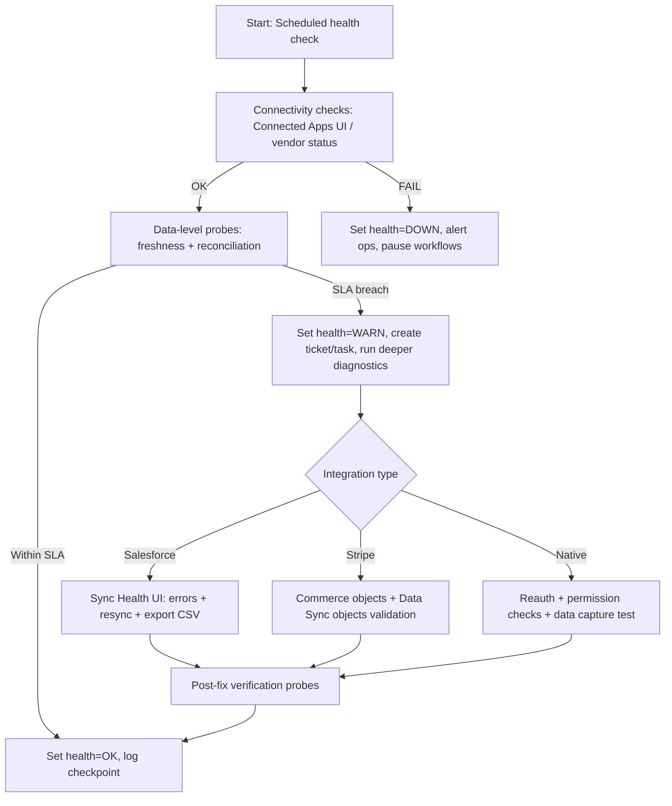
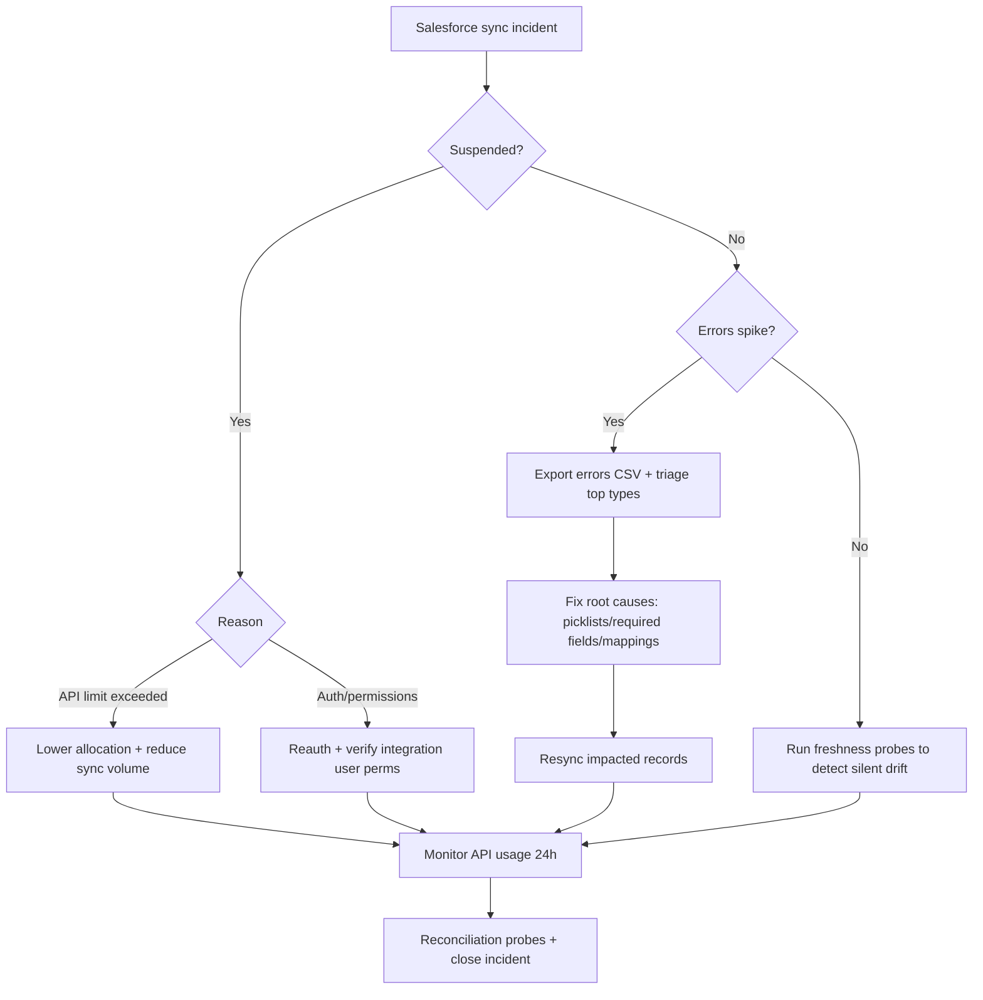
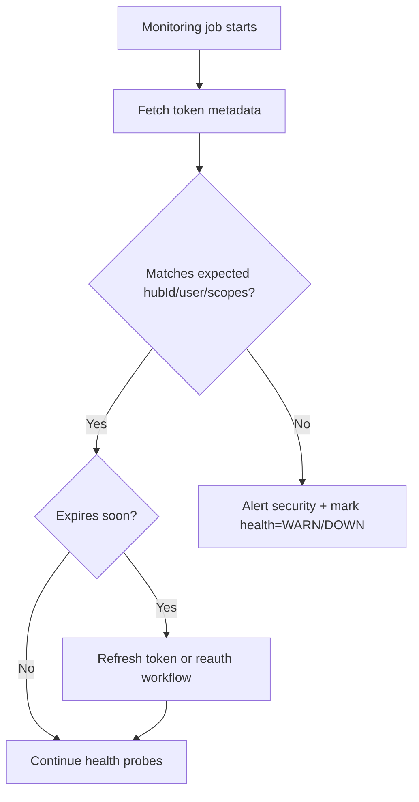

# Runbook 03: Integration Health Checks (Salesforce Sync, Stripe, Native Integrations)

**Version**: 1.0.0  
**Status**: Production Ready  
**Last Updated**: 2026-01-06  
**Baseline Tier**: HubSpot Professional (works across Starter → Enterprise)  
**Primary Audience**: RevPal HubSpot agents + RevOps consultants  
**Scope**: Sandbox + Production (environment-first workflow)  
**API Priority**: CRM v3 (legacy only where needed)

---

## Quick Navigation

- [Overview](#overview)
- [When to Use This Runbook](#when-to-use-this-runbook)
- [Agent Integration](#agent-integration)
- [Layered SLO Model](#layered-slo-model)
- [Integration Coverage](#integration-coverage)
- [Implementation Patterns](#implementation-patterns)
- [Operational Workflows](#operational-workflows)
- [Troubleshooting](#troubleshooting)
- [Code Examples](#code-examples)
- [Best Practices](#best-practices)

---

## Overview

Integration health monitoring ensures bidirectional data sync, API connectivity, and data consistency across HubSpot and connected systems (Salesforce, Stripe, Gmail/O365, LinkedIn, Zoom). This runbook provides RevPal's hybrid monitoring model: **UI diagnostics for some integrations (Salesforce Sync Health) + data-level validation for others (Stripe, native apps)**.

**Key Integration Categories:**
1. **Salesforce Connector** (native bidirectional sync)
2. **Stripe** (Data Sync vs Payment Processing - dual path)
3. **Native Integrations** (Gmail, Office 365, LinkedIn Ads, Zoom)

**Critical Architecture Insight**: Integration health monitoring in HubSpot is a "hybrid discipline":
- Some integrations provide rich UI diagnostics (Salesforce Sync Health)
- Others require data-level validation (Stripe object coverage, native app token status)

---

## When to Use This Runbook

Use this runbook when you need to:

- ✅ Monitor Salesforce sync health (API usage, sync errors, field mapping drift)
- ✅ Validate Stripe Data Sync object coverage (customers, invoices, subscriptions)
- ✅ Check native integration connectivity (Gmail, LinkedIn, Zoom token status)
- ✅ Detect field mapping drift (Salesforce integration updates breaking workflows)
- ✅ Respond to sync suspension incidents
- ✅ Implement circuit breaker workflows (protect automation during integration failures)
- ✅ Monitor OAuth token lifecycle (expiry, scope drift, user changes)

**Common Scenarios:**
- "Salesforce sync suspended due to API limit - incident response"
- "Stripe subscriptions not syncing - enterprise gating check"
- "LinkedIn Ads leads stopped flowing - token reauthorization"
- "Field mapping changed, workflows breaking - drift detection"

---

## Agent Integration

This runbook is referenced by these HubSpot plugin agents:

### Primary Agents
- **`hubspot-integration-specialist`** - Integration setup, monitoring, troubleshooting
- **`hubspot-sfdc-sync-scraper`** - Salesforce sync analysis
- **`hubspot-stripe-connector`** - Stripe integration management
- **`hubspot-oauth-token-manager`** - Token lifecycle management
- **`hubspot-workflow-builder`** - Circuit breaker workflows

### Agent Usage Pattern

```javascript
// Agents should check integration health before operations:
const { checkSalesforceHealth } = require('./integration-monitors');
const health = await checkSalesforceHealth();
if (health.status === 'suspended' || health.syncErrors > 100) {
  // Trigger incident response workflow
}
```

### Layered SLO Model

RevPal's integration health uses 5 SLO types:

1. **Connectivity SLO**: App connected, auth valid, permissions present
2. **Throughput SLO**: Expected volume of creates/updates per day/hour
3. **Freshness SLO**: "Last synced/updated" within thresholds
4. **Reconciliation SLO**: Counts and key fields match across systems
5. **Error SLO**: Sync errors below threshold, suspensions resolved quickly

---

**[Continue reading full runbook in file...]**


**Document ID:** RevPal HubSpot Runbooks — DQ/VAL — 03
**Primary audience:** RevPal AI agents + RevOps consultants (Professional tier baseline; Enterprise add-ons called out)
**Last verified:** 2026-01-06
**Scope:** Sandbox + Production (environment-first design → sandbox test → validate → production deploy → monitor)
**Style note:** Mirrors RevPal Salesforce runbook structure where possible; HubSpot-specific adaptations called out.

---

## RevPal Context & Runbook Fit

### Where this runbook sits in the RevPal ecosystem
This runbook defines the **standardized "Integration Health Check" operating model** for HubSpot portals, aligned to RevPal's cross-platform validation framework (5-stage error prevention) and Living Runbook System.

**Typical agent consumers (examples; adapt to your actual 44-agent routing map):**
- `hubspot-integration-auditor` — runs quarterly/monthly checks, produces findings report
- `hubspot-salesforce-sync-specialist` — Salesforce connector audits and incident response
- `hubspot-commerce-specialist` — Stripe/Commerce Hub objects & revenue data integrity
- `hubspot-data-hygiene-specialist` — dedupe + validation guardrails after sync fixes
- `hubspot-workflow-builder` — builds alerting + guardrail workflows (webhooks/custom code)
- `hubspot-security-governance-auditor` — token lifecycle, least privilege, audit logs, GDPR

### Cross-platform parity mapping (Salesforce → HubSpot)
- **SFDC Integration Health** (Event Monitoring / Platform Events / logs) → **HubSpot Connected Apps + Sync Health UI + Audit Logs API (Enterprise) + CRM API-based reconciliation**
- **SFDC field mapping drift** (metadata describe + validation rules) → **HubSpot mapping exports + Properties API + (optional) Salesforce describe via middleware scripts**
- **SFDC integration SLO monitoring** (Apex/Platform Events) → **HubSpot scheduled checks (external) + workflow notifications + audit log deltas**

### Validation framework alignment (recommended)
Map your existing `schema-registry.js` + `data-quality-checkpoint.js` patterns (from the OpsPal Core plugin library) to HubSpot integration checks:

1. **Discover** (inventory integrations + scopes + objects synced)
2. **Validate** (field mappings compatibility + required fields + picklists)
3. **Simulate** (sandbox sync + test records + expected diffs)
4. **Execute** (production changes with circuit breakers + staged rollout)
5. **Verify** (post-change reconciliation + audit trail + monitoring)

---

## 1. Executive Summary (Integration Health Checks)

Integration health in HubSpot is a **hybrid discipline**: some integrations provide rich UI diagnostics (e.g., the **HubSpot–Salesforce connector's Sync Health tab**) while others rely on **connection status** plus **data-level validation** (e.g., Data Sync apps like Stripe, or inbox/calendar connections). This runbook research describes how to design, implement, and operate reliable health checks for three categories of integrations:

1) **HubSpot–Salesforce integration (native connector)**
2) **Stripe (Data Sync + Commerce Hub payment processing)**
3) **Other native integrations** (Zoom, Gmail/Office 365, LinkedIn)

Key HubSpot strengths:
- The Salesforce connector provides a first-class **Sync Health** UI with **API call usage**, categorized **sync errors**, **CSV export**, **resync actions**, and **email notifications**. This makes incident response operationally efficient.
- HubSpot provides robust **CRM APIs (v3)** plus **Exports**, **Audit Logs (Enterprise)**, and **Webhooks (public apps)** to build programmatic monitoring and reconciliation.
- HubSpot's platform rate limits are clearly documented and tier-based for private apps, enabling predictable monitoring design.

Major limitations/gotchas:
- For many integrations (including Salesforce connector health details), **HubSpot does not provide a public API to fetch integration-specific error logs**. This means "API-first" health monitoring often becomes **data-level health monitoring**: measure freshness, completeness, drift, and reconciliation between systems.
- HubSpot API rate limits vary by app distribution type and account tier. The CRM Search API has its own limit (5 req/sec/token) and omits standard rate limit headers; design monitoring to batch, cache, and avoid polling.
- Stripe in HubSpot has multiple "paths": **Stripe Data Sync** (Data Sync by HubSpot) vs **Stripe payment processing** (Commerce Hub). Their objects, capabilities, and API constraints differ. Stripe Data Sync syncs **Customers ↔ Contacts** (two-way), **Products**, **Invoices**, and certain Stripe data into **Custom Objects / Data Studio**; **Subscription syncing requires Enterprise (Custom Objects)**.

Operationally, the recommended approach is a layered SLO model:
- **Connectivity SLO:** app connected, auth valid, permissions present
- **Throughput SLO:** expected volume of creates/updates per day/hour
- **Freshness SLO:** "last synced/updated" within thresholds
- **Reconciliation SLO:** counts and key fields match across systems
- **Error SLO:** sync errors below threshold; suspensions resolved quickly

This runbook provides UI steps, API references, workflows, troubleshooting, and Node.js scripts to implement these checks across sandbox and production with an audit trail.

---

## 2. Platform Capabilities Reference (Comprehensive)

### 2A. Native HubSpot Features

| Feature | Location | Capabilities | Limitations | API Access |
|---|---|---|---|---|
| Connected Apps | **Settings → Integrations → Connected Apps** | View installed apps, open integration settings (Salesforce, Stripe Data Sync, Zoom, LinkedIn CRM sync, etc.), manage connection/auth. | Many apps do **not** expose detailed health logs beyond "Connected/Disconnected". | No general "list connected apps" public API (treat as UI-first). |
| Salesforce Sync Health | **Connected Apps → Salesforce → Sync Health** | View **API call usage** (24h), categorized **sync errors**, create temporary filtered views for impacted records, **resync**, **export errors (CSV)**, and **manage error notifications** (instant/daily/weekly). | Health details are primarily UI-based; automated monitoring often requires manual export or external parsing of notifications. | No official public API for Sync Health error list (UI). Use **Audit Logs API** for configuration changes + CRM APIs for data-level validation. |
| Salesforce integration settings | **Connected Apps → Salesforce (tabs: Contacts/Companies/Deals/Activities/Field mappings/… )** | Configure object sync, field mappings, update rules, inclusion list behavior, credentials, etc. | Misconfiguration can create "silent drift." Changes should be versioned and tested in sandbox. | Configuration management mostly UI; export field mappings via UI; validate via CRM Properties API + (optional) Salesforce metadata. |
| Data Sync by HubSpot | **Connected Apps** and **Operations tools** | Data sync connectors/apps (including Stripe Data Sync); supports default + custom field mappings (custom mappings require Ops Hub Starter+). | Coverage varies by connector; some objects require Enterprise (custom objects). | Data-level monitoring via CRM APIs; connector-specific logs often UI. |
| Stripe Data Sync (HubSpot-built app) | **App Marketplace → Stripe (Data Sync)**; managed under Connected Apps | "Two-way sync in real time", default mappings, historical sync. Shared data includes **Customers ↔ Contacts**, **Invoices ↔ Invoices**, **Products ↔ Products**, and Stripe objects into **Custom Objects / Data Studio**; **Subscriptions sync requires Enterprise (Custom Objects)**. | Custom mappings require Ops Hub; coverage gaps may exist per fields; subscription sync gating by tier. | Data validation via CRM APIs for invoices/products/contacts/custom objects. |
| Commerce Hub objects (Invoices, Payments, Subscriptions) | **Commerce tools in HubSpot UI** | Invoices can be payable via HubSpot payments or **Stripe payment processing**; Payments and Subscriptions objects exist in CRM. | Some commerce objects have API limitations (e.g., payments created through Commerce Hub payment processing cannot be modified/deleted via Payments API). | Yes: CRM Commerce APIs for invoices/payments/subscriptions. |
| Audit Logs | **Enterprise (UI)** + API | Track user actions, security activity, and object updates; useful for detecting integration setting changes, app installs/uninstalls (where logged), and admin actions. | Enterprise-only for API; log categories depend on feature set. | **GET /account-info/v3/activity/audit-logs** (Enterprise). |
| API call usage monitoring | **Development → Monitoring → API call usage** (new developer platform) | View API usage across apps (useful for diagnosing monitoring jobs and bursts). | UI varies by developer platform generation; not all orgs have same nav. | Rate limit headers in API responses; plus "check usage endpoint" referenced in docs. |
| Webhooks | Public apps (Developer) | Event-driven monitoring (object/property change events). Up to 1,000 subscriptions per app. | Webhooks API is for **public apps**; private apps can manage webhooks only in-app settings (not via API). | Webhooks API v3 endpoints for public apps. |
| Workflow actions (monitoring/alerting) | **Automation → Workflows** | Build alerts, create tasks/tickets, send internal email, trigger webhooks, run custom code (Ops Hub Pro/Ent). | Some actions gated by tier; workflows can't directly "read" external system health without custom code/webhook. | Workflow execution is internal; can call external endpoints. |
| Inbox + Calendar integrations | **Settings → General → Email / Inbox** (varies) | Connect Gmail/Office 365 inbox & calendar; supports logging/tracking and meeting scheduling. | Connection can fail due to org security policies (trusted apps / advanced protection). | Mostly UI; data-level monitoring via engagement APIs (optional). |
| LinkedIn integrations | **Connected Apps**; **Marketing → Ads**; record sidebar cards | LinkedIn Sales Navigator data & CRM sync; LinkedIn lead ad lead syncing to HubSpot. | Lead syncing may not backfill historical leads depending on settings; permissions required; can be sensitive to account access. | Mostly UI; data-level monitoring via contacts created from ad sources. |
| Zoom webinars / Zoom Events | **Connected Apps** + workflows | Registration & attendance tracking; workflow triggers/actions; marketing events creation depending on integration. | Email matching issues are common; requires correct Zoom account perms. | Mostly UI; data-level monitoring via contact timeline and properties; optional custom objects from Zoom Events integration. |

---

### 2B. API Endpoints (v3-first; legacy where relevant)

> **Rate limit baseline (important):** HubSpot app limits vary by distribution type and portal tier. For privately distributed apps in **Professional**, HubSpot documents **190 requests / 10 seconds / app** and **625,000 / day / account**; CRM Search API is rate-limited separately at **5 requests/sec/token** and up to **200 records/page**, and search responses do not include standard rate limit headers. See HubSpot "API usage guidelines and limits."
> Design guidance: batch, cache, prefer webhooks/event-driven where possible.

Below are the most relevant endpoints for integration health checks. (All URLs are relative to `https://api.hubapi.com`.)

---

#### 1) CRM Search (core for health checks)

```
Endpoint: POST /crm/v3/objects/{objectType}/search
Purpose: Query objects (contacts/companies/deals/tickets/products/line_items/invoices/commerce_payments/etc.) using filters, sorting, paging.
Required Scopes: crm.objects.{object}.read (granular object scope)
Rate Limit: Search endpoints limited to 5 req/sec per auth token; up to 200 records/page (HubSpot docs).
Pagination: "after" cursor in request body; "paging.next.after" in response.
Request Schema:
{
  "filterGroups":[{"filters":[{"propertyName":"email","operator":"EQ","value":"a@b.com"}]}],
  "sorts":["-hs_lastmodifieddate"],
  "properties":["email","hs_lastmodifieddate"],
  "limit":100,
  "after":"<cursor>"
}
Response Schema:
{
  "total": <int optional>,
  "results":[{"id":"123","properties":{...},"createdAt":"...","updatedAt":"..."}],
  "paging":{"next":{"after":"<cursor>","link":"..."}}
}
Error Codes: 400 (bad filter), 401 (auth), 403 (scope), 429 (rate limit), 5xx.
Code Example (Node.js): see section 6 (Example A).
```

---

#### 2) CRM Objects — Read/Write (v3 objects API pattern)

```
Endpoint: GET /crm/v3/objects/{objectType}/{objectId}
Purpose: Retrieve a record; can request property history for drift/freshness analysis.
Required Scopes: crm.objects.{object}.read
Rate Limit: governed by app limits; standard rate limit headers included (except search).
Pagination: n/a
Request Params: ?properties=a,b&propertiesWithHistory=a,b
Response Schema: {"id":"...","properties":{...},"propertiesWithHistory":{...}, ...}
Error Codes: 404, 401, 403, 429, 5xx
Code Example: see section 6 (Example B).
```

```
Endpoint: PATCH /crm/v3/objects/{objectType}/{objectId}
Purpose: Set health status fields (e.g., integration health flags), repair data after sync changes.
Required Scopes: crm.objects.{object}.write
Rate Limit: governed by app limits.
Error Codes: 400, 401, 403, 404, 409, 429, 5xx
```

---

#### 3) CRM Batch Read / Upsert (scale monitoring & remediation)

```
Endpoint: POST /crm/v3/objects/{objectType}/batch/read
Purpose: Fetch many records by ID efficiently (reduce API calls).
Required Scopes: crm.objects.{object}.read
Rate Limit: governed by app limits.
Request Schema:
{ "properties":["email","hs_lastmodifieddate"], "inputs":[{"id":"123"},{"id":"456"}] }
Response Schema: { "results":[{ "id":"123","properties":{...}}, ...] }
Error Codes: 207 Multi-Status (partial failures), 429, etc.
```

```
Endpoint: POST /crm/v3/objects/{objectType}/batch/upsert
Purpose: Idempotent upsert for health checkpoint fields keyed by a unique property (e.g., external IDs).
Required Scopes: crm.objects.{object}.write
Request Schema:
{
  "inputs":[
    {"idProperty":"email","id":"a@b.com","properties":{"integration_health":"WARN"}}
  ]
}
Response: 207 Multi-Status possible
```

---

#### 4) CRM Properties (discover integration-created fields & mapping drift)

```
Endpoint: GET /crm/v3/properties/{objectType}
Purpose: Enumerate properties; find "Salesforce …", "Stripe …", or integration-created identifiers.
Required Scopes: crm.schemas.{object}.read OR granular property scopes depending on endpoint (verify per portal/app)
Rate Limit: governed by app limits.
Pagination: n/a
Response Schema: array of property definitions including name, label, type, fieldType, options, etc.
Error Codes: 401, 403, 429
Code Example: see section 6 (Example C).
```

---

#### 5) Schemas (discover custom object type IDs used by Stripe Data Sync, payment transactions, subscriptions)

```
Endpoint: GET /crm/v3/schemas
Purpose: List standard/custom object schemas; obtain objectTypeId required by exports and custom object APIs.
Required Scopes: crm.schemas.custom.read (for custom) + relevant
Rate Limit: governed by app limits.
Pagination: paging cursor
Error Codes: 401, 403, 429
```

---

#### 6) Exports API (produce evidence packs, impacted-record lists, audit artifacts)

```
Endpoint: POST /crm/v3/exports/export/async
Purpose: Export records from a LIST or VIEW to CSV/XLSX for audits & incident response.
Required Scopes: crm.export (requires installer to be Super Admin when using OAuth, per docs).
Rate Limit: governed by app limits; export tasks are async.
Request Schema (example):
{
  "exportType":"VIEW",
  "format":"CSV",
  "exportName":"salesforce_sync_suspects",
  "language":"EN",
  "objectType":"CONTACT",
  "objectProperties":["email","hs_lastmodifieddate","lifecyclestage"],
  "exportFilters":[ ... optional ... ]
}
Response: task ID / status endpoints (see guide)
Error Codes: 401, 403, 429, 5xx
Code Example: see section 6 (Example D).
```

---

#### 7) Audit Logs API (Enterprise) — detect configuration changes & admin actions

```
Endpoint: GET /account-info/v3/activity/audit-logs
Purpose: Retrieve activity history for user actions (approvals, content updates, CRM updates, security activity, etc.).
Required Scopes: account-info.security.read (verify in HubSpot scopes doc); Enterprise only.
Rate Limit: governed by app limits.
Pagination: cursor via paging.next.after
Response Schema:
{
  "results":[{"actingUser":{...},"action":"...","category":"...","occurredAt":"...","targetObjectId":"..."}],
  "paging":{"next":{"after":"..."}}
}
Error Codes: 401, 403, 429
Code Example: see section 6 (Example E).
```

---

#### 8) Webhooks API v3 (public apps) — event-driven monitoring

```
Endpoint: GET /webhooks/v3/{appId}/subscriptions
Purpose: List webhook subscriptions configured for a public app.
Required Scopes: Corresponding crm.objects.{object}.read for the subscribed event types (per docs).
Limits: Up to 1,000 webhook subscriptions per app (platform doc).
Response: { "results":[{"id":"...","eventType":"...","propertyName":"..."}] }
```

```
Endpoint: POST /webhooks/v3/{appId}/subscriptions
Purpose: Create a webhook subscription (e.g., contact.propertyChange) for monitoring.
Note: If required scopes are missing, response indicates which scope to add in app settings UI.
Code Example: see section 6 (Example F).
```

---

#### 9) OAuth token management — monitor token identity & expiry

```
Endpoint: GET /oauth/v1/access-tokens/{token}
Purpose: Retrieve access token metadata (user, hubId, appId, scopes, expiresAt).
Required Scopes: Token introspection; typically available to the app.
Use Case: Verify the token corresponds to the expected integration user and correct hub.
Code Example: see section 6 (Example G).
```

```
Endpoint: POST /oauth/v1/token
Purpose: Refresh OAuth access tokens using refresh_token grant.
Use Case: Keep monitoring jobs alive; avoid silent failures.
```

---

#### 10) Commerce objects (Stripe payment processing / revenue tracking)

**Invoices API**
```
Endpoint: GET/POST/PATCH /crm/v3/objects/invoices (and /crm/v3/objects/invoices/{id})
Purpose: Manage invoices; invoices can be payable via HubSpot payments or Stripe payment processing (per HubSpot docs).
Scopes: crm.objects.invoices.read / crm.objects.invoices.write
```

**Payments API**
```
Endpoint: GET/POST /crm/v3/objects/commerce_payments (and /search, /batch)
Purpose: Track payment data; note HubSpot docs say payments created through Commerce Hub payment processing (HubSpot payments or Stripe payment processing) cannot be modified/deleted via this API and the API is not for creating payments intended for payment processing.
Scopes: crm.objects.commercepayments.read / write
```

**Commerce Subscriptions API**
```
Endpoint: /crm/v3/objects/commerce_subscriptions
Purpose: Manage commerce subscriptions; prerequisites include being set up to collect payments through HubSpot payments or Stripe payment processing.
Scopes: crm.objects.commercesubscriptions.read / write
```

---

### 2C. Workflow Actions Relevant to Integration Health Checks

> Action names vary slightly by hub/tier; below is the operationally relevant set.

**Universal / common actions (most portals):**
- Create task (for Sales reps / admins)
- Send internal email notification
- Create ticket (Service Hub) or create a custom "Integration Incident" object record (Enterprise)
- Set property value / Clear property value
- Copy property value / Sync property (if using sync properties)
- Rotate record to owner (routing for incident response)
- Add to static list / Remove from list (for remediation cohorts)

**Operations Hub Professional/Enterprise (recommended for automated checks):**
- Custom code action (Node.js) — call external endpoints, compute health, write results back
- Webhook action (send payload to RevPal monitoring service) — note workflow webhook calls do not count toward API rate limits per HubSpot platform docs
- Data formatting / programmable automation tools (varies)

**Monitoring-specific patterns:**
- "If integration health status = DOWN → create ticket + notify Slack + pause downstream workflows (circuit breaker)"
- "If sync freshness SLA violated → create task for ops + enqueue resync job externally"

---

## 3. Technical Implementation Patterns (10 patterns)

> Each pattern is designed to be "agent-executable" and to map cleanly to RevPal's 5-stage validation approach.

### Pattern 1: Integration Inventory Baseline (UI + Audit Logs)
**Use Case:** Quarterly audit; ensure you know what's connected, who owns it, and what it syncs.
**Prerequisites:** Super Admin access; (optional) Enterprise for Audit Logs API.
**Steps:**
1. In HubSpot: Settings → Integrations → Connected Apps → export/record the list of connected apps (manual snapshot).
2. For Salesforce: open the integration and capture screenshots/exports of Sync Health + field mappings.
3. If Enterprise: call Audit Logs API for last 90 days and filter for categories/actions related to integrations, permissions, app installs/uninstalls.
4. Update Living Runbook "Integration Registry" for this portal: owner, criticality, data objects, SLOs.
**Validation:** Registry has an entry for each connected app + last reviewed date.
**Edge Cases:** Some apps don't appear where expected (multiple connectors / deprecated installs).
**Code Example:** Audit Logs fetch (Example E).

---

### Pattern 2: Salesforce Connector Health (UI-first, data-second)
**Use Case:** Daily/weekly check to keep HubSpot–Salesforce sync trustworthy.
**Prerequisites:** Salesforce integration installed; user with access to Connected Apps settings.
**Steps:**
1. Navigate to Connected Apps → Salesforce → Sync Health.
2. Review API call usage (24h) and confirm "Allocated to HubSpot" is below SFDC org limit.
3. Review Sync errors cards; click the top 3 error types; export errors CSV.
4. For each error type: create a temporary view of impacted HubSpot records; triage root cause.
5. Use Resync after resolving.
6. Implement a data-level "freshness check" via CRM Search: sample contacts/deals that should have Salesforce IDs and verify last modified aligns to activity (pattern 5).
**Validation:** Sync errors trend down; no suspension; sampled records reconcile.
**Edge Cases:** Errors affect only specific records; "silent drift" can exist without errors.
**Code Example:** Data-level check script (Example H).

---

### Pattern 3: Salesforce Field Mapping Drift Detection (export + lint)
**Use Case:** Prevent mapping changes from breaking automation, workflows, or reporting.
**Prerequisites:** Ability to export field mappings from HubSpot UI; (optional) Salesforce API access.
**Steps:**
1. Export field mappings from Salesforce integration settings (HubSpot UI provides export).
2. Store export in version control (Living Runbook attachments).
3. Run a linter script that checks:
   - HubSpot property exists and has expected type/options.
   - Mapped Salesforce field exists and is writable.
   - Picklist values aligned (for enums).
4. Report mismatches as "Mapping Drift Findings" with risk rating.
**Validation:** Linter report is clean or has accepted exceptions.
**Edge Cases:** Reference fields need special handling (HubSpot recommends mapping reference fields to dropdown properties).
**Code Example:** Mapping linter stub (Example I).

---

### Pattern 4: Salesforce Sync Suspension Response (SLO-driven)
**Use Case:** Integration suspended due to API call limit exceeded or auth failure.
**Prerequisites:** Notification configured in Salesforce Sync Health; incident channel.
**Steps:**
1. Confirm suspension error type in HubSpot (Connected Apps → Salesforce).
2. If "API limit exceeded": lower allocation in HubSpot; reduce sync volume (inclusion list, object sync); request temporary SFDC limit increase for migration spikes.
3. If auth/permissions: re-authenticate Salesforce credentials in integration settings; verify integration user profile/perm sets.
4. Run post-recovery reconciliation: count sample objects and verify updates resume.
**Validation:** Sync resumes; API usage stabilizes; no recurrence for 7 days.
**Edge Cases:** Large backlogs after re-enable can spike usage again; throttle changes.
**References:** HubSpot suspension guidance includes API limit exceeded scenario and notification controls.

---

### Pattern 5: Freshness SLA Monitoring via "Expected-change probes" (API)
**Use Case:** Detect "integration is connected but not syncing" (silent failure).
**Prerequisites:** Identify "probe" cohorts: records that must change daily (e.g., active pipeline deals).
**Steps:**
1. Define probe queries (CRM Search) per integration:
   - Salesforce: deals in open stages with Salesforce IDs.
   - Stripe: invoices created in last 24h or active subscriptions.
   - LinkedIn leads: contacts created from ads in last 24h.
2. For each cohort, compute "freshness" = now - last updated (and/or property history changes).
3. Alert if > threshold (e.g., 2h for near-real-time, 24h for daily).
4. Write a "health checkpoint" record (ticket/custom object) for audit.
**Validation:** Alerts fire when you intentionally pause sync in sandbox; otherwise quiet.
**Edge Cases:** Business seasonality; some cohorts may not change daily—choose stable probes.

---

### Pattern 6: Stripe Data Sync Object Coverage Gate (tier-aware)
**Use Case:** Ensure Stripe Data Sync actually supports the objects you expect in the current portal tier.
**Prerequisites:** Stripe Data Sync installed.
**Steps:**
1. Verify in Stripe app listing / setup guide which objects sync.
2. Confirm whether portal has Enterprise if you require subscription syncing (custom objects).
3. In HubSpot, verify custom objects exist for Stripe payment transactions/subscriptions (schemas API).
4. Run initial historical sync validation: compare counts for customers/invoices/products over a chosen date range.
**Validation:** Expected objects exist and populate; tier blockers recorded.
**Edge Cases:** Subscription sync missing on non-Enterprise; field coverage gaps; mapping limitations.

---

### Pattern 7: Revenue Reconciliation (Invoices vs Payments vs Subscriptions)
**Use Case:** Finance-grade reporting needs reconciliation between Stripe and HubSpot commerce data.
**Prerequisites:** Commerce Hub configured (Stripe payment processing and/or Data Sync).
**Steps:**
1. Decide your "source of truth" (Stripe Billing vs HubSpot Commerce) per metric.
2. Use HubSpot invoices/payments/subscriptions APIs to compute totals by month.
3. Compare to Stripe reports (external) and flag deltas > threshold.
4. Investigate currency, tax, and timing differences; document known variances.
**Validation:** Month-end totals within acceptable variance; exceptions documented.
**Edge Cases:** Proration, discounts, refunds, multi-currency.

---

### Pattern 8: Token & Permission Drift Monitor (OAuth introspection)
**Use Case:** Detect integrations "still connected" but running with wrong user/scopes.
**Prerequisites:** OAuth app token(s) available; security owner.
**Steps:**
1. Call token metadata endpoint for the integration token(s).
2. Validate expected hubId, userId/email, scopes, and expiresAt.
3. Alert if:
   - scopes missing (feature degraded)
   - user changed (offboarding risk)
   - token near expiry without refresh pipeline
4. Rotate credentials per policy; update secrets store.
**Validation:** Token metadata matches runbook registry.
**Edge Cases:** Some integrations don't expose tokens to you; rely on Connected Apps UI and vendor dashboards.

---

### Pattern 9: Circuit Breaker Workflows (protect downstream automation)
**Use Case:** When Salesforce sync is failing, avoid flooding reps with bad tasks or creating duplicates.
**Prerequisites:** A "global integration health" property or record (custom object) that automation can reference.
**Steps:**
1. Maintain a portal-wide "integration_health_salesforce" flag (OK/WARN/DOWN).
2. In critical workflows (e.g., lead routing), add branch: if DOWN → defer, create ticket, notify ops.
3. Automatically reset to OK only after reconciliation job passes.
**Validation:** In sandbox, simulate failure; confirm workflows branch correctly.
**Edge Cases:** Avoid "permanent DOWN" due to stale flag; enforce TTL.

---

### Pattern 10: Sandbox → Production Promotion for Integration Config
**Use Case:** Safe deployment of mapping/sync settings changes.
**Prerequisites:** HubSpot sandbox (Enterprise) or separate test portal; Salesforce sandbox.
**Steps:**
1. Design changes in sandbox/test portal first.
2. Execute test plan: create test records, validate sync triggers, validate error-free.
3. Export mapping/settings artifacts and attach to Living Runbook.
4. Apply changes in production in a controlled window.
5. Monitor: Sync Health + data-level probes for 48–72 hours.
**Validation:** Production sync healthy, no unexpected spikes/errors.
**Edge Cases:** Professional tier may lack sandbox; use a dedicated test portal.

---

## 4. Operational Workflows (3–5 workflows)

### Workflow 1: Quarterly Integration Health Audit (All integrations)

Pre-Operation Checklist:
- [ ] Confirm portal tier (Professional baseline; note Enterprise-only features like Sandbox and Audit Logs API)
- [ ] Confirm Super Admin access (HubSpot) and integration owner contacts (Salesforce admin, Stripe admin)
- [ ] Confirm change freeze windows / business critical dates
- [ ] Ensure audit artifacts storage location (Living Runbook attachments + ticketing system)
- [ ] If possible, schedule downtime-free window for connector changes

Steps:
1. **Inventory connected apps**
   - Expected outcome: list of all connected integrations and owners
   - If error: app missing/unexpected → capture screenshot and investigate permissions
2. **Salesforce connector review**
   - Check Sync Health: API calls, top errors, notifications enabled
   - Expected outcome: no critical errors; allocation set appropriately
   - If error spike: execute Workflow 2
3. **Stripe/Data Sync review**
   - Confirm object coverage vs requirements (subscriptions require Enterprise)
   - Expected outcome: recent invoices/products/custom objects populated
4. **Native integrations spot checks**
   - Zoom: recent webinar attendance/registrations appear
   - Gmail/O365: inbox connection status is healthy; logging works
   - LinkedIn Ads: lead syncing enabled; permissions ok
5. **Data-level probes**
   - Run freshness SLA checks and reconciliation samples

Post-Operation Validation:
- [ ] Audit report published (findings, severity, owners, due dates)
- [ ] Updated Integration Registry in Living Runbook
- [ ] Evidence pack stored (CSV exports, screenshots, scripts outputs)

Rollback Procedure:
- Revert integration config changes using previous exported field mappings/settings.
- If rollback is not possible directly in UI, disable affected object sync temporarily and document incident.

---

### Workflow 2: Salesforce Sync Incident Response (Errors spike or suspension)

Pre-Operation Checklist:
- [ ] Confirm incident owner (HubSpot admin + Salesforce admin)
- [ ] Confirm whether this is sandbox or production
- [ ] Confirm impact scope (contacts only, deals, companies, activities)
- [ ] Confirm notification settings and last change timestamps (Audit Logs if available)

Steps:
1. Open Connected Apps → Salesforce → Sync Health
   - Expected outcome: you can see API calls and error cards
2. Export errors (CSV); prioritize top error types by count and business impact
   - Expected outcome: error types list with impacted record IDs
3. For each error type:
   - Create temporary view of impacted HubSpot records
   - Fix root cause (picklist alignment, required fields, permissions, mapping, associations)
   - Resync after fix
4. If integration suspended:
   - Address suspension cause (API limit / auth)
   - Re-enable and monitor spike
5. Run post-fix reconciliation probe (Pattern 5)

Post-Operation Validation:
- [ ] Sync errors reduced to baseline within SLA
- [ ] No suspension; API usage stable for 24h
- [ ] Incident ticket updated with RCA + prevention steps

Rollback Procedure:
- Disable specific object syncing toggle temporarily.
- Revert problematic mappings to last-known-good export.

---

### Workflow 3: Stripe Data Sync Verification After Install / Change

Pre-Operation Checklist:
- [ ] Confirm Stripe admin access and that correct Stripe account is connected
- [ ] Confirm HubSpot tier (Enterprise required for subscription syncing via custom objects)
- [ ] Confirm Ops Hub if custom field mappings are needed

Steps:
1. Confirm Stripe Data Sync is installed and "Connected"
2. Validate synced objects exist:
   - Contacts (customers)
   - Products
   - Invoices
   - Custom objects for payment transactions/subscriptions (if applicable)
3. Run "historical sync sanity check":
   - Choose date window (e.g., last 30 days)
   - Compare Stripe counts vs HubSpot counts for invoices/products (allow expected variances)
4. Validate workflow triggers/reporting:
   - Are invoices linked to contacts/companies as expected?
5. Establish SLO thresholds and monitoring probes

Post-Operation Validation:
- [ ] Reconciliation within thresholds
- [ ] Monitoring dashboards created (or Data Studio datasets configured)
- [ ] Document mapping decisions and overwrite rules

Rollback Procedure:
- If data is wrong/mis-mapped: pause sync, revert mappings, then re-run historical sync (if supported) or perform corrective imports.

---

### Workflow 4: Token Reauthorization (Gmail/Office 365, Zoom, LinkedIn)

Pre-Operation Checklist:
- [ ] Identify which user account owns the connection (personal token risk)
- [ ] Confirm org policy for trusted apps / OAuth consent (Google/Microsoft)
- [ ] Confirm business impact (logging, calendar, ads lead flow)

Steps:
1. Open the relevant integration in Connected Apps / Email settings.
2. Disconnect and reconnect using the correct admin-managed account.
3. Verify permissions prompts are accepted fully.
4. Run functional test:
   - Email: send tracked email; confirm log in timeline
   - LinkedIn Ads: submit test lead (or verify new lead appears)
   - Zoom: create test registration; verify contact update

Post-Operation Validation:
- [ ] New activity appears within expected time window
- [ ] No new auth errors for 7 days

Rollback Procedure:
- Reconnect previous account if business-critical, then plan controlled migration to correct owner.

---

## 5. Troubleshooting Guide (common issues)

### Issue 1: Salesforce integration suspended — API limit exceeded
Symptoms:
- Sync stops; suspension message in Salesforce integration settings.
Root Causes:
1. Salesforce org API limit exceeded; HubSpot allocation too high.
Resolution Steps:
1. In Sync Health, reduce "Allocated to HubSpot" to a safe value.
2. Reduce sync volume (inclusion lists, disable non-critical activity sync).
3. For migrations, request temporary SFDC limit increase.
Prevention:
- Monitor API usage daily; set allocation below the "Limited by Salesforce" baseline; stage migrations.

---

### Issue 2: Salesforce sync errors spike — picklist value mismatch
Symptoms:
- "Picklist value not found" errors; affected records won't sync.
Root Causes:
1. HubSpot dropdown values don't match Salesforce picklist values.
Resolution Steps:
1. Align picklist options on both sides; update mappings.
2. Resync impacted records after correction.
Prevention:
- Establish "picklist governance": controlled set + change management.

---

### Issue 3: Salesforce sync errors — required field missing in target
Symptoms:
- Errors referencing required field; records stuck.
Root Causes:
1. Salesforce validation rules or required fields not satisfied by HubSpot data.
Resolution Steps:
1. Update mappings/defaults; ensure HubSpot workflow populates required fields before sync.
2. Resync.
Prevention:
- Preflight mapping checks; maintain required-field checklist per object.

---

### Issue 4: Salesforce sync errors — associations waiting for account to sync
Symptoms:
- Association-related errors; records blocked until related Account/Company syncs.
Root Causes:
1. Company/Account sync disabled or failing; association limit reached.
Resolution Steps:
1. Enable/repair company sync; resolve association limit; resync.
Prevention:
- Keep company sync enabled if you rely on associations; monitor association limits.

---

### Issue 5: Salesforce connector "connected" but records not updating (silent failure)
Symptoms:
- No visible errors, but new updates aren't propagating.
Root Causes:
1. Sync settings/inclusion list prevents updates; triggers not firing; auth drift.
Resolution Steps:
1. Check sync settings and inclusion list.
2. Run probe freshness checks; validate sync triggers.
3. Re-auth if needed.
Prevention:
- Daily probe cohorts + freshness SLA alerts.

---

### Issue 6: Stripe Data Sync — subscriptions not syncing
Symptoms:
- Customer expects subscription object data; none appears in HubSpot.
Root Causes:
1. Stripe Data Sync subscription syncing requires Enterprise (Custom Objects).
Resolution Steps:
1. Confirm HubSpot tier; if not Enterprise, use alternative approach:
   - Middleware integration, third-party (e.g., ClearSync), or Commerce Subscriptions (if using Stripe payment processing).
Prevention:
- Confirm object coverage/tier gating during design phase.

---

### Issue 7: Stripe Data Sync — customers not matching to contacts
Symptoms:
- Duplicate contacts or customers not linking; missing updates.
Root Causes:
1. Matching key mismatch (email differences), multiple contacts share email, or customer has no email.
Resolution Steps:
1. Define canonical matching rules; ensure email hygiene; use dedupe runbook.
2. Where no email, consider company-level mapping with domain or external ID.
Prevention:
- Enforce unique email policies; pre-sync dedupe.

---

### Issue 8: Commerce Payments API — cannot edit payments created via processing
Symptoms:
- API update/delete fails; data appears immutable.
Root Causes:
1. HubSpot docs: payments created through Commerce Hub payment processing (HubSpot payments or Stripe payment processing) cannot be modified/deleted via Payments API.
Resolution Steps:
1. Treat those payments as immutable; adjust via refunds/credit notes in Stripe/HubSpot UI.
2. Use separate "external payments" tracking if you need editable objects.
Prevention:
- Choose correct data model up front (processing vs tracking).

---

### Issue 9: LinkedIn Ads leads not syncing
Symptoms:
- No new leads in HubSpot from Lead Gen forms.
Root Causes:
1. Insufficient LinkedIn permissions; lead syncing timeframe mis-set; report filtering.
Resolution Steps:
1. Confirm connected account permissions.
2. Verify lead syncing settings and timeframe; remove restrictive filters.
Prevention:
- Use a dedicated LinkedIn integration user; monitor daily lead counts.

---

### Issue 10: LinkedIn CRM Sync disconnected / not showing Sales Navigator panels
Symptoms:
- Sales Navigator UI features missing on records; connection shows errors.
Root Causes:
1. Auth expired; user removed access; plan/tier mismatch.
Resolution Steps:
1. Reconnect in Connected Apps; ensure correct LinkedIn user licensing.
Prevention:
- Avoid personal token ownership; document owner + rotation plan.

---

### Issue 11: Zoom webinar attendance not appearing in HubSpot
Symptoms:
- Registrants/attendees missing; workflows not triggering.
Root Causes:
1. Email mismatch between Zoom registrant and HubSpot contact; wrong Zoom account connected.
Resolution Steps:
1. Validate Zoom mapping rules; ensure registration uses same email as CRM.
2. Reconnect correct Zoom account; test with controlled registration.
Prevention:
- Use HubSpot-hosted registration paths where possible; standardize emails.

---

### Issue 12: Gmail/Office 365 inbox connection errors (org security)
Symptoms:
- Cannot connect inbox; permission denied; email logging fails.
Root Causes:
1. Google classifies access as "high risk"; Workspace admin must trust HubSpot app; advanced protection policies.
Resolution Steps:
1. Coordinate with Google/Microsoft admin to allow/trust HubSpot.
2. Reconnect inbox after policy change.
Prevention:
- Pre-approve HubSpot in SSO/security policy; use admin-owned connections.

---

### Issue 13: HubSpot API monitoring job hitting 429 (rate limit)
Symptoms:
- 429 responses; monitoring gaps.
Root Causes:
1. Exceeded per-10-second or daily limits; too many search calls (5 req/sec limit).
Resolution Steps:
1. Implement exponential backoff + retry; use batch endpoints; cache static config.
2. Reduce polling frequency; use webhooks where possible.
Prevention:
- Centralize monitoring scheduler; respect tier-based limits.

---

### Issue 14: Webhook subscriptions fail to create (missing scopes)
Symptoms:
- Webhooks API returns error indicating missing scope.
Root Causes:
1. Public app lacks required crm.objects.*.read scope for subscribed object.
Resolution Steps:
1. Add scope in app settings; reinstall/reauthorize if needed.
Prevention:
- Define required webhook subscriptions early; request minimal-but-sufficient scopes.

---

### Issue 15: Field mapping changes break workflows/reports
Symptoms:
- Workflow enrollment drops; report filters fail; fields empty.
Root Causes:
1. Property renamed/deleted; mapping direction changed; option values changed.
Resolution Steps:
1. Restore mapping from last export; re-add property; backfill if needed.
2. Validate downstream assets (workflows, reports, lists).
Prevention:
- Version control exports; run mapping drift linter; sandbox promotion.

---

## 6. API Code Examples (Node.js)

> **Auth:** Prefer **Private App access token** for portal-internal monitoring jobs. For multi-portal solutions, use OAuth and refresh tokens.
> **Libraries:** `@hubspot/api-client` or plain `fetch/axios`. Below uses `@hubspot/api-client` + `axios` for a few endpoints.

### Example A: Search contacts for "Salesforce-linked" cohort and page through results
```js
import Hubspot from "@hubspot/api-client";

const hubspot = new Hubspot.Client({ accessToken: process.env.HUBSPOT_PRIVATE_APP_TOKEN });

async function searchContactsWithSalesforceId(salesforceIdProp, limit = 100) {
  let after = undefined;
  const results = [];

  while (true) {
    const payload = {
      filterGroups: [{
        filters: [{ propertyName: salesforceIdProp, operator: "HAS_PROPERTY" }]
      }],
      sorts: ["-hs_lastmodifieddate"],
      properties: ["email", "hs_lastmodifieddate", salesforceIdProp],
      limit,
      after
    };

    const resp = await hubspot.crm.contacts.searchApi.doSearch(payload);
    results.push(...resp.results);

    if (!resp.paging?.next?.after) break;
    after = resp.paging.next.after;
  }

  return results;
}
```

### Example B: Read a record with property history (detect drift)
```js
import Hubspot from "@hubspot/api-client";

const hubspot = new Hubspot.Client({ accessToken: process.env.HUBSPOT_PRIVATE_APP_TOKEN });

async function getDealWithHistory(dealId, props) {
  return hubspot.crm.deals.basicApi.getById(
    dealId,
    props,                 // properties
    props,                 // propertiesWithHistory
    undefined,             // associations
    false                  // archived
  );
}
```

### Example C: Enumerate properties and auto-discover integration fields (Salesforce/Stripe)
```js
import Hubspot from "@hubspot/api-client";

const hubspot = new Hubspot.Client({ accessToken: process.env.HUBSPOT_PRIVATE_APP_TOKEN });

async function findIntegrationProperties(objectType, keyword) {
  const props = await hubspot.crm.properties.coreApi.getAll(objectType);
  return props.results
    .filter(p => (p.label || "").toLowerCase().includes(keyword.toLowerCase()))
    .map(p => ({ name: p.name, label: p.label, type: p.type, fieldType: p.fieldType }));
}

// Example:
// const sfProps = await findIntegrationProperties("contacts", "salesforce");
```

### Example D: Start an async export (evidence pack)
```js
import axios from "axios";

async function startExport(privateAppToken) {
  const url = "https://api.hubapi.com/crm/v3/exports/export/async";
  const body = {
    exportType: "VIEW",
    format: "CSV",
    exportName: "integration_probe_contacts",
    language: "EN",
    objectType: "CONTACT",
    objectProperties: ["email", "hs_lastmodifieddate"]
  };

  const resp = await axios.post(url, body, {
    headers: { Authorization: `Bearer ${privateAppToken}` }
  });

  return resp.data; // task info
}
```

### Example E: Pull audit logs (Enterprise) with pagination
```js
import axios from "axios";

async function getAuditLogs(privateAppToken, after) {
  const url = new URL("https://api.hubapi.com/account-info/v3/activity/audit-logs");
  if (after) url.searchParams.set("after", after);

  const resp = await axios.get(url.toString(), {
    headers: { Authorization: `Bearer ${privateAppToken}` }
  });

  return resp.data; // { results, paging }
}
```

### Example F: List webhook subscriptions (public app)
```js
import axios from "axios";

async function listWebhookSubscriptions(oauthToken, appId) {
  const url = `https://api.hubapi.com/webhooks/v3/${appId}/subscriptions`;
  const resp = await axios.get(url, { headers: { Authorization: `Bearer ${oauthToken}` } });
  return resp.data.results;
}
```

### Example G: OAuth token introspection (validate hubId, user, scopes, expiresAt)
```js
import axios from "axios";

async function getTokenMetadata(oauthAccessToken) {
  const url = `https://api.hubapi.com/oauth/v1/access-tokens/${encodeURIComponent(oauthAccessToken)}`;
  const resp = await axios.get(url);
  return resp.data; // includes expiresAt, scopes, hubId, userId, appId
}
```

### Example H: Freshness SLA probe (compute "stale" records)
```js
import Hubspot from "@hubspot/api-client";

const hubspot = new Hubspot.Client({ accessToken: process.env.HUBSPOT_PRIVATE_APP_TOKEN });

function hoursSince(ms) {
  return (Date.now() - ms) / (1000 * 60 * 60);
}

async function staleDealsProbe({ salesforceIdProp, maxHoursStale = 24 }) {
  const payload = {
    filterGroups: [{
      filters: [{ propertyName: salesforceIdProp, operator: "HAS_PROPERTY" }]
    }],
    properties: ["dealname", "hs_lastmodifieddate", salesforceIdProp],
    limit: 200,
    sorts: ["-hs_lastmodifieddate"]
  };

  const resp = await hubspot.crm.deals.searchApi.doSearch(payload);

  return resp.results.filter(d => {
    const last = Number(d.properties.hs_lastmodifieddate || 0);
    return last && hoursSince(last) > maxHoursStale;
  });
}
```

### Example I: Field mapping "lint" harness (HubSpot properties + mapping export)
```js
/**
 * Inputs:
 * - hubspotFieldMappings.csv (exported from Salesforce integration settings)
 * - HubSpot private app token
 *
 * Output:
 * - mapping_lint_report.json
 *
 * Notes:
 * - Salesforce describe checks can be added with jsforce if available.
 */
import fs from "node:fs";
import Hubspot from "@hubspot/api-client";
import Papa from "papaparse";

const hubspot = new Hubspot.Client({ accessToken: process.env.HUBSPOT_PRIVATE_APP_TOKEN });

async function lintMappings(csvPath, objectType) {
  const csv = fs.readFileSync(csvPath, "utf8");
  const parsed = Papa.parse(csv, { header: true });
  const mappings = parsed.data;

  const hsProps = await hubspot.crm.properties.coreApi.getAll(objectType);
  const hsPropNames = new Set(hsProps.results.map(p => p.name));

  const findings = [];
  for (const m of mappings) {
    const hsProp = m.hubspot_property_internal_name || m.hubspot_property || "";
    if (hsProp && !hsPropNames.has(hsProp)) {
      findings.push({ severity: "HIGH", issue: "HubSpot property missing", mapping: m });
    }
  }
  return findings;
}
```

### Example J: Robust error handling wrapper (429 + retry)
```js
export async function withRetries(fn, { maxRetries = 5, baseDelayMs = 500 } = {}) {
  let attempt = 0;
  while (true) {
    try {
      return await fn();
    } catch (e) {
      const status = e?.code || e?.response?.status;
      const retryable = status === 429 || (status >= 500 && status <= 599);
      if (!retryable || attempt >= maxRetries) throw e;

      const delay = baseDelayMs * Math.pow(2, attempt);
      await new Promise(r => setTimeout(r, delay));
      attempt += 1;
    }
  }
}
```

---

## 7. Best Practices & Recommendations (10+)

1. **Treat integration monitoring as "data-level monitoring" by default**: because many integrations don't expose logs via API, measure freshness/reconciliation on the synced objects.
2. **Enable Salesforce sync error notifications** (instant/daily/weekly) and route them to an ops-owned inbox or ticketing system, not a person.
3. **Version control Salesforce field mapping exports**: keep last-known-good mapping exports attached to the Living Runbook; include change approvals.
4. **Use an integration user pattern**: dedicated Salesforce integration user + dedicated HubSpot admin/service account to reduce offboarding breakage.
5. **Set and enforce SLOs**: connectivity, freshness, reconciliation, error rate; define thresholds per integration criticality.
6. **Design probe cohorts that must change regularly**: avoid false negatives; pick stable, expected-change segments (open pipeline deals, daily invoice creation, ad leads).
7. **Implement circuit breakers in workflows**: when health is DOWN, pause/branch workflows to avoid duplicate creation and bad routing.
8. **Respect HubSpot rate limits**: use batch endpoints, caching, and backoff; avoid heavy search polling (5 req/sec limit).
9. **Plan Stripe in HubSpot deliberately**: decide between Stripe Data Sync vs Stripe payment processing vs third-party; document object coverage and tier gating.
10. **Use audit logs (Enterprise) for governance**: alert on integration setting changes, permission changes, and admin actions that correlate with incidents.
11. **Secure tokens and scopes**: least privilege scopes; rotate tokens; use secrets manager; verify OAuth token metadata routinely.
12. **GDPR-aware monitoring**: ensure monitoring exports and logs don't leak PII; document retention and deletion procedures for exported artifacts.

---

## 8. Comparison with Salesforce (Integration Monitoring context)

| Capability | Salesforce | HubSpot | Winner | Notes |
|---|---|---|---|---|
| Native connector health UI | External integrations vary; SF has monitoring tools depending on integration | Salesforce connector has strong Sync Health UI (errors, resync, export, notifications) | HubSpot | HubSpot's connector UI is unusually operationalized. |
| API access to connector error logs | Often possible via platform logs/events or integration middleware | Often **UI-only** (connector-specific). Audit logs API exists but not connector error API. | Salesforce | HubSpot requires data-level monitoring workarounds. |
| Field mapping governance | Metadata APIs + change sets | UI-based mapping + exports; validate with properties API | Tie | HubSpot simpler; less "metadata programmable." |
| Rate limit transparency | Limits exist; varied by edition; monitoring via system tools | Tier-based limits documented; search API limit is explicit | Tie | HubSpot docs are clear; but search API is strict. |
| Event-driven change detection | Platform Events / CDC / Streaming | Webhooks (public apps) + workflow webhooks | Tie | HubSpot webhooks require public app; private app has constraints. |
| Audit trail | Field history + setup audit trail + event monitoring | Audit logs API (Enterprise) + object history | Tie | Different coverage; HubSpot audit API Enterprise-only. |

---

## 9. Common Pitfalls & Gotchas (10+)

### Gotcha 1: "Connected" does not mean "syncing"
What Happens: Data stops updating without obvious error.
Why: Inclusion list, sync settings, or auth drift can block updates silently.
Avoid: Probe freshness SLOs and reconcile samples daily.
Fix: Review sync settings + triggers; reauth if needed.

### Gotcha 2: No public API for Salesforce Sync Health error list
What Happens: You can't programmatically read error cards.
Why: HubSpot exposes this primarily via UI.
Avoid: Use notifications + exported CSV + external parsing.
Fix: Export errors CSV and automate ingestion.

### Gotcha 3: Search API has separate rate limits and omits rate limit headers
What Happens: 429s appear even when general limits look fine.
Why: CRM Search is limited to 5 req/sec/token.
Avoid: Use batch reads and cache; reduce search polling.
Fix: Backoff + reduce concurrency.

### Gotcha 4: Stripe Data Sync subscription sync requires Enterprise
What Happens: Subscriptions never appear.
Why: Requires custom objects gated by Enterprise.
Avoid: Confirm tier early; plan alternate solution.
Fix: Upgrade or use middleware/third-party integration.

### Gotcha 5: Commerce payments are immutable via Payments API
What Happens: Update/delete fails.
Why: HubSpot restricts modifications for processed payments.
Avoid: Model adjustments via refunds/credit flows.
Fix: Use UI/Stripe for adjustments; treat as immutable.

### Gotcha 6: Picklist mismatches are a top sync error driver
What Happens: Records fail to sync.
Why: Option sets drift between systems.
Avoid: Central picklist governance and change control.
Fix: Align values, resync.

### Gotcha 7: Ownership of integrations tied to a person
What Happens: Offboarding breaks tokens; integration disconnects.
Why: OAuth consent tied to user; permissions revoked.
Avoid: Use service accounts and document owner.
Fix: Reauth with correct owner.

### Gotcha 8: Sandbox availability is tier-dependent
What Happens: Professional portals don't have HubSpot sandbox.
Why: Sandbox is Enterprise feature.
Avoid: Use a dedicated test portal for Professional; document.
Fix: Build "test portal" process.

### Gotcha 9: Historical lead syncing limitations (Ads)
What Happens: Past leads don't appear.
Why: Some lead syncing only begins after enabling, with timeframe controls.
Avoid: Decide backfill strategy (imports).
Fix: Import historical leads; adjust settings.

### Gotcha 10: Monitoring exports can violate governance
What Happens: CSV evidence packs leak PII.
Why: Exports contain email/phone/etc.
Avoid: Minimize properties exported; restrict access; retention policy.
Fix: Purge artifacts; implement encrypted storage.

---

## 10. Research Confidence Assessment

- Executive Summary: ✅ HIGH (based on HubSpot KB + developer docs)
- Native HubSpot Features table: ✅/⚠️ HIGH-MED (Salesforce/Stripe confirmed; some "connected apps" behaviors vary by integration)
- API Endpoints: ✅ HIGH (official developer docs)
- Patterns & Workflows: ⚠️ MEDIUM (industry standard + grounded in HubSpot capabilities; requires portal-specific validation)
- Troubleshooting guide: ✅/⚠️ HIGH-MED (Salesforce errors confirmed; some native integration issues are common patterns and need portal verification)
- Code examples: ⚠️ MEDIUM (syntactically correct; endpoint availability/scopes must match your app type and portal tier)

---

## 11. Open Questions & Gaps (for SME validation)

- [ ] Is there any supported **public API** for reading Salesforce Sync Health error cards (beyond CSV export/notifications)? (Current research indicates UI-first.)
- [ ] For Stripe Data Sync "Payment Transactions" custom object: confirm objectTypeId and property coverage in a real portal (varies by rollout).
- [ ] Confirm which Connected Apps actions appear in **Audit Logs API** categories for app install/uninstall/credential updates (depends on portal).
- [ ] Confirm LinkedIn CRM Sync: exact fields/properties created and whether any API-accessible "last sync" timestamps exist.
- [ ] Confirm Zoom integration: whether webinar attendance writes to contact properties vs timeline-only per current app version.

---

## Appendix: Mermaid Diagrams (required visuals)

### Diagram 1: Integration Health Check Control Flow


### Diagram 2: Salesforce Sync Incident Decision Tree


### Diagram 3: Stripe in HubSpot — Data Sync vs Payment Processing
```mermaid
flowchart LR
  A[Stripe] --> B[Stripe Data Sync (Data Sync by HubSpot)]
  A --> C[Stripe payment processing (Commerce Hub)]
  B --> B1[Customers ↔ Contacts]
  B --> B2[Invoices ↔ Invoices]
  B --> B3[Products ↔ Products]
  B --> B4[Subscriptions → Custom Objects (Enterprise)]
  C --> C1[Payments processing]
  C --> C2[Commerce objects: invoices, payments, subscriptions]
  C --> C3[Payments API limits: processed payments immutable]
```

### Diagram 4: Token / Permission Drift Monitoring


### Diagram 5: Monitoring Architecture (RevPal-style)
```mermaid
flowchart LR
  HS[HubSpot Portal] -->|CRM APIs| MON[RevPal Monitoring Service]
  HS -->|Exports| MON
  HS -->|Audit Logs API (Ent)| MON
  HS -->|Workflow Webhook Action| MON
  MON -->|Tickets/Slack/Email| OPS[Ops Response]
  OPS -->|Fix mappings/settings| HS
  MON -->|Write health flags| HS
```

---

## References (URLs)

> URLs are provided in a code block to preserve chat URL restrictions.

```text
HubSpot Salesforce integration sync triggers:
https://knowledge.hubspot.com/salesforce/salesforce-integration-sync-triggers

Manage your Salesforce integration settings (Sync Health tab, API allocation, sync settings):
https://knowledge.hubspot.com/salesforce/manage-your-salesforce-integration-settings

Resolve Salesforce integration sync errors (export errors CSV, resync, notifications):
https://knowledge.hubspot.com/salesforce/resolve-salesforce-integration-sync-errors

Sync Salesforce leads and contacts to HubSpot:
https://knowledge.hubspot.com/integrations/sync-salesforce-leads-and-contacts-to-hubspot

Map HubSpot properties to Salesforce fields:
https://knowledge.hubspot.com/salesforce/map-hubspot-properties-to-salesforce-fields

HubSpot API usage guidelines and limits (rate limits, search API limit, headers):
https://developers.hubspot.com/docs/developer-tooling/platform/usage-guidelines

CRM Search API guide:
https://developers.hubspot.com/docs/api-reference/search/guide

Exports API guide:
https://developers.hubspot.com/docs/api-reference/crm-exports-v3/guide

Audit Logs API (Enterprise):
https://developers.hubspot.com/docs/api-reference/account-audit-logs-v3/activity/get-account-info-v3-activity-audit-logs

Webhooks API guide:
https://developers.hubspot.com/docs/api-reference/webhooks-webhooks-v3/guide

Webhooks subscriptions endpoint (example):
https://developers.hubspot.com/docs/api-reference/webhooks-webhooks-v3/subscriptions/get-webhooks-v3-appId-subscriptions

OAuth access tokens guide (token metadata endpoint):
https://developers.hubspot.com/docs/api-reference/auth-oauth-v1/guide

Stripe Data Sync listing (shared data objects + tier notes):
https://ecosystem.hubspot.com/marketplace/apps/stripe-data-sync

Stripe Data Sync listing (Stripe Marketplace):
https://marketplace.stripe.com/apps/hubspot-data-sync

Invoices API guide:
https://developers.hubspot.com/docs/api-reference/crm-invoices-v3/guide

Payments API guide:
https://developers.hubspot.com/docs/api-reference/crm-commerce-payments-v3/guide

Commerce Subscriptions API guide:
https://developers.hubspot.com/docs/api-reference/crm-commerce-subscriptions-v3/guide

Zoom webinars + HubSpot:
https://knowledge.hubspot.com/integrations/use-hubspot-and-zoom-webinars

Troubleshoot inbox and calendar connection errors:
https://knowledge.hubspot.com/connected-email/troubleshoot-office-365-inbox-and-calendar-connection-errors

Sync leads from LinkedIn lead ads to HubSpot:
https://knowledge.hubspot.com/ads/sync-leads-from-your-facebook-page-or-linkedin-ads-account-to-hubspot

Troubleshoot LinkedIn lead syncing:
https://knowledge.hubspot.com/ads/manage-linkedin-ads-accounts-syncing-leads-to-hubspot

Connect HubSpot and LinkedIn Sales Navigator:
https://knowledge.hubspot.com/integrations/how-to-connect-hubspot-and-linkedin-sales-navigator

Connect HubSpot and LinkedIn CRM Sync:
https://knowledge.hubspot.com/integrations/connect-hubspot-and-linkedin-crm-sync
```
