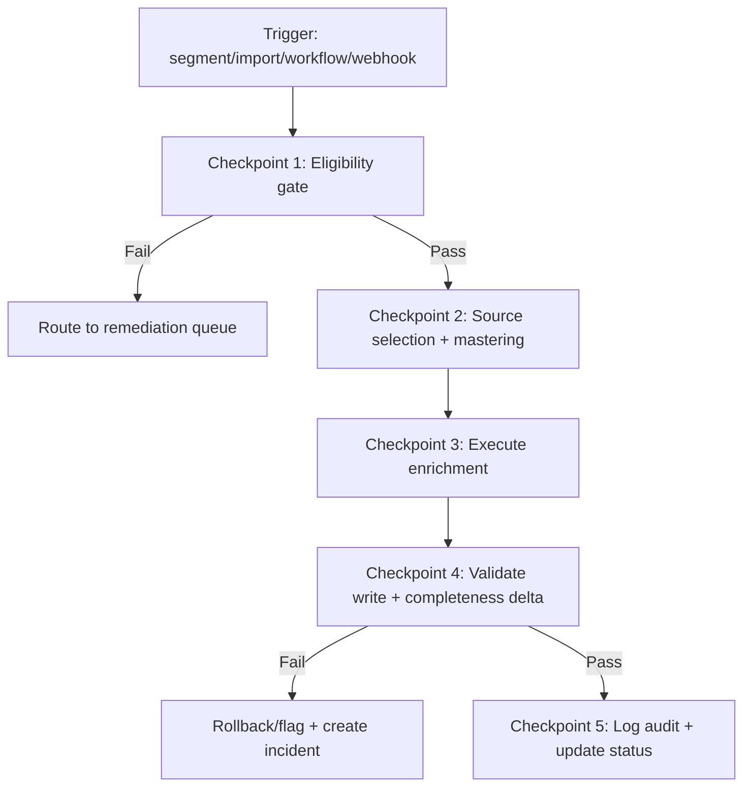
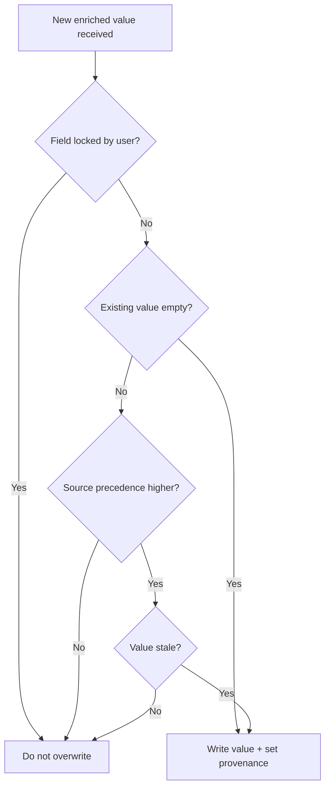
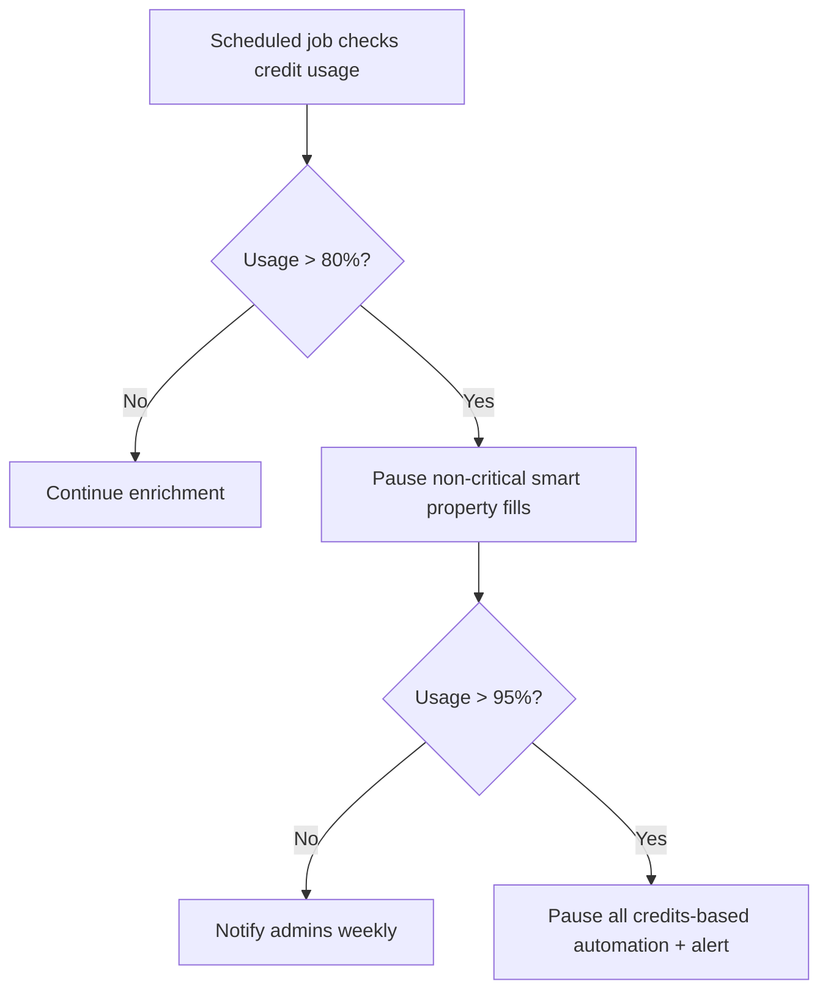
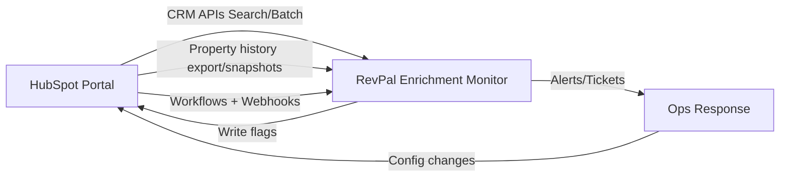

# Runbook 04: Data Enrichment Strategies & Automation (HubSpot)

**Version**: 1.0.0  
**Status**: Production Ready  
**Last Updated**: 2026-01-06  
**Baseline Tier**: HubSpot Professional (works across Starter → Enterprise; tier gates called out)  
**Primary Audience**: RevPal HubSpot agents + RevOps consultants  
**Scope**: Sandbox + Production (environment-first workflow)  
**API Priority**: CRM v3 (legacy only where needed)

---

## Quick Navigation

- [Overview](#overview)
- [When to Use This Runbook](#when-to-use-this-runbook)
- [Agent Integration](#agent-integration)
- [Enrichment Taxonomy](#enrichment-taxonomy)
- [Property-Level Mastering Policy](#property-level-mastering-policy)
- [HubSpot Credits Governance](#hubspot-credits-governance)
- [Implementation Patterns](#implementation-patterns)
- [Operational Workflows](#operational-workflows)
- [Troubleshooting](#troubleshooting)
- [Code Examples](#code-examples)
- [Best Practices](#best-practices)

---

## Overview

Data enrichment fills missing or outdated contact/company properties using external data sources. HubSpot supports four enrichment planes: **Native (Breeze Intelligence)**, **Workflow-based (Enrich record action)**, **AI/Agent (Data Agent + Smart Properties)**, and **Third-party (ZoomInfo, Apollo, Demandbase)**. This runbook provides RevPal's governance model to prevent unsafe overwrites, exhaust credits, or create compliance issues.

**Key Enrichment Planes:**
1. **Native Data Enrichment** (Breeze Intelligence) - automatic/manual/continuous modes
2. **Workflow-Based Enrichment** - "Enrich record" action at specific lifecycle stages
3. **AI/Agent Enrichment** - Data Agent for ICP scoring, Smart Properties for AI-inferred fields
4. **Third-Party Enrichment** - Vendor apps (ZoomInfo, Apollo) + custom webhooks

**Critical Governance Controls:**
- **Property-level mastering policy** (phone: ZoomInfo > Clearbit; industry: Clearbit > ZoomInfo)
- **HubSpot Credits circuit breaker** (pause at 80%, alert at 95%)
- **GDPR-safe enrichment gating** (consent properties, opt-out labels)

---

## When to Use This Runbook

Use this runbook when you need to:

- ✅ Deploy native enrichment (Breeze Intelligence) with governance
- ✅ Implement multi-source enrichment with mastering rules
- ✅ Configure HubSpot Credits governance and circuit breakers
- ✅ Create workflow-based enrichment ("enrich when Sales cares")
- ✅ Design GDPR-compliant enrichment patterns
- ✅ Measure enrichment effectiveness (coverage + accuracy + ROI)
- ✅ Prevent unsafe overwrites (preserve user-verified values)

**Common Scenarios:**
- "Enrich all MQLs with firmographics before routing to sales"
- "Use ZoomInfo for phone, Clearbit for industry (mastering policy)"
- "Pause enrichment when credits reach 80% (circuit breaker)"
- "Only enrich contacts with consent (GDPR gating)"

---

## Agent Integration

This runbook is referenced by these HubSpot plugin agents:

### Primary Agents
- **`hubspot-enrichment-specialist`** - Enrichment strategy, vendor selection
- **`hubspot-data-hygiene-specialist`** - Enrichment effectiveness measurement
- **`hubspot-workflow-builder`** - Enrichment workflows, circuit breakers
- **`hubspot-governance-enforcer`** - Credits governance, compliance
- **`hubspot-integration-specialist`** - Third-party enrichment setup

### Agent Usage Pattern

```javascript
// Agents should check mastering policy before enrichment:
const { shouldOverwrite } = require('./mastering-rules');
const history = await getPropertyHistory(contactId, 'phone');
if (shouldOverwrite(history, 'phone', 'zoominfo')) {
  // Safe to enrich
} else {
  // Skip - user-verified or more authoritative source exists
}
```

### Property-Level Mastering Policy Framework

**Key Innovation**: Define precedence **per property** (not per vendor):

```markdown
Example Policy:
- Phone: ZoomInfo > Clearbit > manual > import
- Industry: Clearbit > ZoomInfo > manual
- JobTitle: Manual > ZoomInfo > Clearbit
```

**Provenance Fields (Recommended):**
- `revpal_enrichment_source`
- `revpal_enriched_at`
- `revpal_enrichment_confidence`
- `revpal_lock_[property]` (user-verified, do not overwrite)

---

**[Continue reading full runbook in file...]**


**File:** `04_data_enrichment_strategies_research.md`  
**Baseline tier:** HubSpot Professional (works across Starter → Enterprise; advanced add-ons called out)  
**Primary audience:** RevPal HubSpot agents + RevOps consultants  
**Last verified:** 2026-01-06  
**Scope:** Sandbox + Production (environment-first: Design → Sandbox Test → Validate → Production Deploy → Monitor)  
**API priority:** CRM v3 (legacy only where needed)

---

## 0. RevPal Context & Cross-Platform Parity Notes (Read First)

### Where this runbook sits in the RevPal ecosystem
This runbook defines RevPal’s **standard enrichment operating model** for HubSpot portals: how to choose enrichment sources, configure HubSpot’s native enrichment, orchestrate third‑party enrichment, and automate enrichment safely with a **strong governance + audit trail posture**.

**Typical agent consumers (examples; adapt to your actual 44-agent routing map):**
- **hubspot-data-enrichment-specialist**: enrichment strategy, mapping, overwrite rules, vendor evaluation
- **hubspot-data-hygiene-specialist**: eligibility + domain hygiene, dedupe prevention/cleanup before/after enrichment
- **hubspot-workflow-builder**: enrichment workflows, guardrails, alerts, rep prompts, data agent workflows
- **hubspot-custom-code-developer**: webhook-driven enrichment, batch backfills, monitoring jobs, vendor APIs
- **hubspot-security-governance-auditor**: GDPR + consent gating, token hygiene, sensitive data controls
- **hubspot-reporting-analyst**: enrichment coverage dashboards, ROI instrumentation, change-source audits

### Cross-platform parity mapping (Salesforce → HubSpot)
| Salesforce pattern | HubSpot equivalent | Key difference |
|---|---|---|
| Data.com / Einstein / AppExchange enrichment + Flow orchestration | **HubSpot Data Enrichment (Breeze Intelligence)** + **Data Agent (Smart Properties)** + Marketplace enrichment apps + Workflows | HubSpot native enrichment focuses on Contacts/Companies; “Smart properties” can fill custom insights with credits |
| Validation Rules prevent bad/unsafe overwrites | Mapping + overwrite rules, workflows, custom code, and permissions | HubSpot doesn’t have Salesforce-style validation rules; governance is primarily procedural + workflow-based |
| Field History + Audit Trail | Property history UI + exports + API `propertiesWithHistory` + change sources | Property history is strong at record level; build your own time series for portfolio analytics |
| Sandbox-first deployment (metadata) | Test portal (sandbox) enrichment settings + workflows + apps; then production | Some settings are UI-only; document deltas and treat as configuration-as-code where possible |
| “Source of Truth” & “Mastering rules” | Enrichment precedence model + explicit provenance properties + overwrite logic | HubSpot has fewer native mastering controls—implement via properties + processes |

### Validation framework alignment (recommended)
Map RevPal’s existing cross-platform “5-stage error prevention system” to enrichment:

1. **Discover**: inventory objects, properties, current enrichment sources, and sensitive data policies  
2. **Validate**: confirm eligibility keys (business email/domain), mapping compatibility, overwrite rules, credit budgets  
3. **Simulate** (sandbox): run enrichment on controlled segments + diff results + measure accuracy/coverage  
4. **Execute** (prod): staged rollout (small segments → broader), circuit breakers (credit limit, opt-out, pause)  
5. **Verify**: coverage & completeness deltas, source-of-change audits, ROI + cost tracking, incident playbooks

> Repo note: RevPal referenced internal patterns in `schema-registry.js` and `data-quality-checkpoint.js`, but the repository was not accessible from public sources during this research. This runbook mirrors those patterns conceptually (schema → checkpoint → audit event) and flags implementation details for SME alignment.

---

## 1. Executive Summary (300–500 words)

HubSpot enrichment is the set of capabilities and operational patterns used to **increase completeness and usefulness** of CRM records by appending verified firmographic, demographic, and behavioral signals—without relying on manual entry. For RevOps, enrichment typically drives downstream outcomes: better routing, scoring, segmentation, personalization, and forecast hygiene.

HubSpot offers multiple enrichment “planes” that behave very differently:

- **Native Data Enrichment (Breeze Intelligence)**: enriches *contacts* (requires business email) and *companies* (requires domain). You can configure **automatic**, **manual**, and **continuous** enrichment, plus **mapping and overwrite rules** in *Settings → Data Management → Data Enrichment*. Automatic enrichment fills empty values and does not overwrite values set by users/other systems; manual enrichment can optionally overwrite; continuous enrichment updates previously enriched values monthly but stops enriching a property if a user/other system edits that property.  
- **Workflow-based enrichment orchestration**: HubSpot supports an **Enrich record** workflow action for contact/company workflows, plus workflow enrollment strategies (e.g., only enrich “Sales Qualified” or only enrich “high intent” companies). Bulk enrichment is also supported from an index view, a segment, or during imports, with certain UI limits (e.g., max 100 selected from an index view at a time).  
- **AI/Agent enrichment via Data Agent + Smart Properties**: Smart Properties (credits-based) can fill custom, AI-researched values (e.g., “ICP tier”, “funding status”, “key buying signal”) and can be auto-filled on schedule or record creation from **Data Management → Data Agent**, and filled in workflows with a dedicated action. This is powerful, but has governance implications (prompt hygiene, sensitive data handling, and credit budgets).  
- **Third-party enrichment**: Marketplace apps (e.g., ZoomInfo Inbound Enrich, Apollo Enrichment) and ABM platforms (e.g., Demandbase) commonly enrich records and/or sync signals into HubSpot. These typically provide deeper datasets than HubSpot native enrichment, but introduce mastering conflicts, vendor-specific rate limits/credits, and additional security/governance obligations.

Major gotchas:
- Native enrichment eligibility hinges on **business email** and **valid domain formatting**; personal domains won’t enrich.  
- Overwrite behavior differs by enrichment mode and stops in some scenarios (continuous enrichment stops for a property after manual/system edits).  
- Governance must include **credit budgets** (HubSpot Credits), **opt-out mechanisms**, and **data provenance** (who/what updated which fields).  
- Many critical controls are **UI-first** (mapping/overwrite rules, enrichment settings), so “configuration drift” is a real operational risk—treat enrichment setup like production code: document, test, and monitor.

---

## 2. Platform Capabilities Reference (Comprehensive)

### 2A. Native HubSpot Features

| Feature | Location | Capabilities | Limitations / Notes | API Access |
|---|---|---|---|---|
| Data Enrichment settings | **Settings → Data Management → Data Enrichment** | Configure automatic/continuous enrichment; map enrichment fields to HubSpot properties; set overwrite rules; “recently engaged” auto-enrich; opt-out free company name enrichment | UI-first; changes affect future enrichment only; mapping to custom dropdowns requires exact match between option labels/internal values; contact property “Enriched Email Bounce Detected” sunset Oct 31, 2025 (intent signals still available) | No dedicated public API for these settings (treat as config documentation) |
| Enrich record (single record) | Contact/Company record → left panel → Actions → **Enrich record** | Manual enrichment with selectable properties; can overwrite depending on options | Only Contacts/Companies; requires permissions; requires business email/domain and availability of data | No direct API (UI action) |
| Bulk enrichment from index view | CRM → Contacts/Companies table | Select records → **Enrich records** | **Max 100 records** selected from an index page at once | No direct API (UI action) |
| Bulk enrichment from Segments | CRM → Segments → Actions → **Enrich segment** | Enrich all records in a segment | Segment definitions matter; governance: segment size and eligibility | No direct API (UI action) |
| Enrichment during import | Data Management → Data Integration → Imports | “Enrich records” checkbox during import | Requires careful mapping + dedupe strategy; validate before production | Import APIs exist, but enrichment checkbox is UI |
| Workflow enrichment action | Automation → Workflows | **Enrich Record action** in Contact/Company workflows | Contact/company-based workflows only; enrollment strategy is key (avoid runaway enrichment) | Workflow APIs are limited; treat as UI config + documentation |
| Data test / Scan for enrichment gaps | Data Management → Data Enrichment → **Scan for enrichment gaps** | Coverage/match rate; per-property enrichment coverage; eligible vs ineligible diagnostics | Sample-size and segmentation constraints; fix domain formatting to improve eligibility | No direct API (UI) |
| Has been enriched property | Default Contact/Company property | Filter, report, segments; indicates whether record has ever had enriched properties written | Boolean only; doesn’t indicate vendor/source by itself | Available via CRM APIs like any property |
| Enrichment history in record timeline | Record → Activities → filter “Enrichment” | Shows which properties were enriched and count; click property for history | Portfolio analysis still requires exports/snapshots; record-level only | Property history via API read with `propertiesWithHistory` |
| Intelligence tab | Contact/Company record → **Intelligence** tab | Shows enriched insights, business & traffic data | Availability can vary by subscription/tooling and rollout | Not exposed as a stable public API |
| Prospects tool (visitor/company identification) | CRM/Marketing tools → Prospects | Identify visiting companies from IP; integrates with tracking code | Requires tracking code; caps on tracked traffic (e.g., 100k views/visitors); IP exclusions apply | Tracking code is client-side; no simple “enrichment API” |
| Data Agent (Smart Properties) | Data Management → Data Agent | Create smart properties; schedule auto-fill; supports web research / company website / property data / call transcripts; credits-based | Avoid sensitive data in prompts; AI settings must be enabled; credits consumed per prompt per record | Smart properties are properties; fill actions are UI/workflow-based |
| HubSpot Credits usage controls | Account & Billing → Usage & Limits → HubSpot Credits | Monthly resets; no rollovers; usage logs; max limit; overages/auto upgrades | Credit rates change; monitor regularly; many AI features require credits as of Nov 10, 2025 | No public API for billing/credits; UI-first governance |
| Sensitive data & property controls | Settings → Properties; Permissions | Sensitive data classification; restrict access to properties (Enterprise) | Plan-dependent; don’t enrich into sensitive properties without explicit policy | Properties API supports `dataSensitivity` fields |

### 2B. API Endpoints (Enrichment-adjacent)

> HubSpot does not expose a single “Enrichment API” for Breeze/Data Enrichment UI actions. Most enrichment automation in code is implemented by:  
> (a) detecting records that need enrichment (Search/Exports),  
> (b) calling an enrichment provider’s API, then  
> (c) writing values back to HubSpot via CRM object update endpoints.

Below are the core HubSpot endpoints you’ll use for enrichment automation and monitoring.

---

#### Endpoint: POST /crm/v3/objects/{objectType}/search
Purpose: Find records missing key fields or needing refresh (e.g., `jobtitle` is empty, `domain` malformed).  
Required Scopes (OAuth): `crm.objects.{objectType}.read` (e.g., `crm.objects.contacts.read`)  
Rate Limit: Search endpoints are limited to **5 requests/sec per auth token**, **200 records per page**; general app limits apply by tier (private apps Professional: 190 per 10s, 625k/day).  
Pagination: `limit` + `after` token.  
Request Schema (typical):
```json
{
  "filterGroups": [{
    "filters": [
      {"propertyName":"jobtitle","operator":"NOT_HAS_PROPERTY"}
    ]
  }],
  "properties":["email","firstname","lastname","jobtitle","company","hs_object_id"],
  "limit": 200,
  "after": 0
}
```
Response Schema (shape):
```json
{
  "total": 1234,
  "results": [{"id":"123","properties":{...}}],
  "paging": {"next":{"after":"200","link":"..." }}
}
```
Error Codes: 400 (bad filter), 401/403 (auth/scopes), 429 (rate limit), 5xx.  
Code Example (Node.js): see section 6.

---

#### Endpoint: PATCH /crm/v3/objects/{objectType}/{objectId}
Purpose: Write enriched values back to HubSpot records.  
Required Scopes: `crm.objects.{objectType}.write`  
Rate Limit: General app limits by tier (see API usage guidelines).  
Request Schema:
```json
{
  "properties": {
    "jobtitle": "VP Revenue Operations",
    "department": "Revenue Operations",
    "revpal_enriched_at": "2026-01-06T00:00:00Z",
    "revpal_enrichment_source": "clearbit"
  }
}
```
Response Schema: Updated object representation.  
Error Codes: 400 (invalid property value), 404 (record), 409 (conflict), 429 (rate limit).

---

#### Endpoint: POST /crm/v3/objects/{objectType}/batch/read
Purpose: Read many records at once (for vendor payload building, validation, or audit).  
Required Scopes: `crm.objects.{objectType}.read`  
Rate Limit: General app limits by tier.  
Request Schema:
```json
{
  "inputs":[{"id":"123"},{"id":"456"}],
  "properties":["email","domain","jobtitle","revpal_enrichment_source"],
  "propertiesWithHistory":["jobtitle","phone"]
}
```
Response Schema: `{results:[...]}` with per-record properties and optional history.

---

#### Endpoint: POST /crm/v3/objects/{objectType}/batch/update
Purpose: Apply enrichment results at scale with fewer API calls.  
Required Scopes: `crm.objects.{objectType}.write`  
Rate Limit: General app limits by tier; implement throttling + retry for 429.  
Request Schema:
```json
{
  "inputs":[
    {"id":"123","properties":{"jobtitle":"Director","revpal_enrichment_source":"zoominfo"}},
    {"id":"456","properties":{"jobtitle":"Manager","revpal_enrichment_source":"zoominfo"}}
  ]
}
```
Error Handling: Batch responses may contain per-input errors—log and retry selectively.

---

#### Endpoint: GET /crm/v3/properties/{objectType}
Purpose: Inventory properties that enrichment will populate (and ensure types/allowed values).  
Required Scopes: `crm.schemas.{objectType}.read`  
Use Cases:  
- Validate mapping compatibility (text vs enum)  
- Check `dataSensitivity` classification  
- Identify restricted/hidden properties

---

#### Endpoint: GET /crm/v3/objects/{objectType}/{objectId}
Purpose: Read a record (optionally with `propertiesWithHistory`) to verify provenance and prevent unsafe overwrites.  
Query Params: `properties`, `propertiesWithHistory`, `associations`, `archived`.  
Response: includes `propertiesWithHistory` containing value history when requested.

---

#### Endpoint: POST /crm/v3/objects/{objectType}
Purpose: Create records (useful when enrichment provider returns new Companies/Contacts from intent tools and you want to add them).  
Required Scopes: `crm.objects.{objectType}.write`  
Dedup Strategy: use unique properties + search first (or use idProperty on GET where applicable).

---

#### Endpoint: POST /crm/v3/objects/contacts/{contactId}/gdpr-delete
Purpose: GDPR right-to-erasure delete contact (and associated personal data) when required.  
Required Scopes: `crm.objects.contacts.write` (plus privacy controls; confirm in portal)  
Notes: Use the Data Requests tool/UI as the primary operational path; treat API as controlled escalation.

---

### 2C. Workflow Actions (Enrichment-relevant)

> Exact availability varies by HubSpot tier and purchased hubs/add-ons. Validate in sandbox.

Core actions to use for enrichment operations:
- **Enrich record** (Contact/Company workflows): triggers native contact/company enrichment on enrolled records.
- **Set property value**: write governance flags like `revpal_enrichment_status`, `revpal_enriched_at`, `revpal_enrichment_source`.
- **Create task / Send internal email / Slack (via integration)**: prompt reps to validate questionable enrichment.
- **Trigger a webhook**: call an external enrichment service (custom code / middleware).
- **Custom code** (Operations Hub Professional+ commonly required): call vendor API and update HubSpot via API.
- **If/then branching**: eligibility gates (business email, domain present, consent, opt-out labels, lifecycle stage).

Workflow data actions to support auditability:
- **Record timeline logging**: leverage property history + internal notes (manual) or external logging.

---

## 3. Technical Requirements Analysis

### 3A. Data structures & dependencies
**Primary objects:**
- **Contacts**: enrichment keys include **email** (business email required for native contact enrichment).
- **Companies**: enrichment key is typically **domain**.
- **Deals**: often consumes enriched signals indirectly (industry, size, ICP tier) for routing/scoring; most “enrichment” happens on company/contact then copied/used on deals.
- **Custom objects** (optional): use as an “Enrichment Audit Log” object for immutable history (recommended for enterprise governance).

**Key relationships:**
- Contact ↔ Company association is critical; company domain hygiene drives association quality, which drives reporting & segmentation.
- Deal ↔ Company association drives forecasting segmentation and ABM models.

**Data dependencies:**
- Eligibility keys must be present and well-formed:
  - Contact: business email (not Gmail/Yahoo/etc.)
  - Company: valid domain (no double dots, no protocol, no trailing slash)
- Consent & legal gating (GDPR/CCPA) for any personal data enrichment and data sharing.

### 3B. Validation rules & constraints (native vs custom)
- **Native (Breeze/Data Enrichment):** “requiredness” is not enforced by enrichment; it only fills what it can. Overwrite behavior depends on method (automatic/manual/continuous).
- **Workflows:** enforce operational gates (don’t enrich if opt-out / sensitive industry / credit low).
- **Custom code:** needed for multi-vendor mastering, advanced overwrite logic, or enrichment beyond contacts/companies.

### 3C. Error scenarios & edge cases (high-frequency)
- Personal email domains: contact enrichment will not run.
- Invalid domain formats: company enrichment eligibility fails (often discovered via Data Test match rate).
- Continuous enrichment stops per property after user/system edits (surprising “stale” values).
- Enum mapping drift: vendor returns values not in HubSpot dropdown options (or internal names mismatch), causing write failures.
- Credits exhausted: smart properties / AI actions pause; if credits governance absent, enrichment automations silently degrade.
- Data conflicts between native enrichment and third‑party apps (last-write-wins behavior on property values).

### 3D. Performance considerations
- **HubSpot API rate limits** depend on app type and subscription tier. Implement throttling and retries; avoid exceeding 5% error rate (HubSpot guidance for app certification).
- Search API is capped to 5 req/sec per auth token and 200 records per page; design backfills using pagination and/or Exports for large datasets.
- Batch update reduces call volume, but still needs robust error capture (per-input failures).
- For credits-based enrichment (Data Agent, Buyer Intent), treat credit spend like a budget with alert thresholds and “pause” circuit breakers.

---

## 4. Technical Implementation Patterns (10 patterns)

### Pattern 1: Native Data Enrichment “Auto + Continuous” with governance
Use Case: Keep contacts/companies up-to-date with minimal operational overhead.  
Prerequisites:
- Data enrichment enabled; mapping and overwrite rules set.
- Permissions: Super Admin or Data Enrichment access.
Steps:
1. Configure enrichment settings (contacts + companies) in Data Enrichment settings.
2. Set mapping to standard properties + optionally custom properties (type-compatible).
3. Set overwrite rule per property (e.g., names = fill empty only; job title = fill empty + overwrite).
4. Enable **continuous enrichment** for the properties you want refreshed monthly.
Validation:
- Run Data Test to confirm match rate and per-property coverage.
- Enrich a controlled segment in sandbox; confirm expected property changes and timelines.
Edge Cases:
- If user edits an enriched property, continuous enrichment stops for that property.
- Mapping to custom dropdown requires exact option matches; use “Load options” from the standard Industry property.
Code Example: N/A (UI configuration).

---

### Pattern 2: Targeted enrichment workflow (“Enrich when Sales cares”)
Use Case: Avoid enriching everything; enrich only Sales-usable records (cost/quality control).  
Prerequisites:
- Contact/company workflow access.
Steps:
1. Create workflow with enrollment criteria (e.g., lifecycle stage = SQL; OR lead score > threshold; OR recent engagement).
2. Add “Enrich record” action.
3. Add follow-up actions: set `revpal_enriched_at`, set `revpal_enrichment_status=completed`.
4. If match fails (still missing key fields), create a task to validate email/domain.
Validation:
- Compare “Has been enriched = true” counts to enrolled records.
- Sample records and verify enrichment timeline event.
Edge Cases:
- Be careful with re-enrollment rules to avoid repeated enrichment loops.

---

### Pattern 3: Bulk enrichment backfill via Segments (staged rollout)
Use Case: Backfill historical records safely.  
Prerequisites:
- Segments for eligibility (domain present, not personal email, etc.).
Steps:
1. Build an “Eligible for enrichment” segment in sandbox.
2. Run Data Test to assess match rate; fix domain formatting issues.
3. Enrich the segment (sandbox) and review before/after deltas.
4. Repeat in production with staged segments: 500 → 5k → entire eligible set.
Validation:
- Enrichment coverage dashboard (match rate + Has been enriched).
Edge Cases:
- Large segments may take time; monitor for integration conflicts.

---

### Pattern 4: Enrichment on import (front-door hygiene)
Use Case: Enrich net-new records as they enter (forms lists, events, tradeshow scans).  
Steps:
1. Configure import mapping and dedupe rules (see Runbook 5 for dedupe).
2. Enable “Enrich records” during import for contacts/companies.
3. Post-import: validate missing critical fields and run remediation workflow for ineligible records.
Edge Cases:
- Imports can create duplicates if unique keys aren’t respected.

---

### Pattern 5: Multi-source enrichment with mastering rules (native + vendor)
Use Case: Use HubSpot native enrichment for baseline and vendor enrichment for depth (phones, technographics, intent).  
Prerequisites:
- Defined “source of truth” per property group.
Recommended property design:
- Store **canonical business values** (e.g., `jobtitle`, `industry`, `phone`)
- Store **provenance**: `revpal_enrichment_source`, `revpal_enriched_at`, `revpal_enrichment_confidence`
Steps:
1. Define precedence per property (e.g., phone: ZoomInfo > Clearbit > manual).
2. Implement overwrite logic:
   - If value manually verified, lock it (e.g., `revpal_lock_phone=true`)
   - Else overwrite only if “stale” (> 180 days) or vendor confidence high.
3. Run scheduled job to refresh stale values; log changes.
Validation:
- Property history source filter (“HubSpot AI”, integration, workflow) and audit log entries.
Edge Cases:
- Third-party apps can overwrite unexpectedly; restrict property permissions where possible and use locked properties.

---

### Pattern 6: Data Agent Smart Property for ICP tiering
Use Case: Create AI-derived enrichment that’s specific to your business (e.g., “ICP tier”, “GTM motion”, “tech stack fit”).  
Prerequisites:
- Data Agent enabled; generative AI settings toggled on; credits available.
Steps:
1. Create a smart property on Company, e.g., `revpal_icp_tier` (enum or text).
2. Prompt: use property tokens + web research; avoid sensitive data.
3. Configure auto-fill schedule or “on record creation”.
4. In workflows, branch based on tier; route and create tasks.
Validation:
- Test on 20 known companies; compare to expected tiering.
Edge Cases:
- Prompts referencing LinkedIn may be filtered and return null; maintain a “fallback ruleset” using deterministic properties.

---

### Pattern 7: Webhook-triggered real-time enrichment (external)
Use Case: Enrich instantly when records are created/updated, using vendor APIs and writing results back to HubSpot.  
Prerequisites:
- HubSpot webhook subscription (app) OR workflow webhook action.
- External service endpoint, secure secrets management.
Steps:
1. Trigger: on Contact creation or Company domain change.
2. Eligibility gate: business email/domain present; not opt-out; consent ok.
3. Call vendor API; normalize payload.
4. Update HubSpot record using PATCH or batch update.
Validation:
- Log correlation IDs and confirm property history sources.
Edge Cases:
- Rate limits: implement queue + backoff; handle vendor outages.

---

### Pattern 8: Scheduled enrichment refresh (“stale data SLA”)
Use Case: Refresh high-value properties every N days (e.g., job title changes).  
Steps:
1. Build Search query for records where `revpal_enriched_at` < now-180d.
2. Process in pages of 200; batch update results.
3. Add circuit breakers: stop if 429s rise or error rate > 2%.
Validation:
- Track completion metrics: records scanned, enriched, skipped, failed.
Edge Cases:
- Search API and vendor API limits; use concurrency control.

---

### Pattern 9: Enrichment effectiveness measurement (coverage + accuracy + ROI)
Use Case: prove enrichment value and continuously tune it.  
Steps:
1. Before snapshot: completeness score (Runbook 2 method) + key KPI baselines.
2. After enrichment: compute deltas by source (native vs vendor) and by segment.
3. Accuracy sampling: select random sample (n=50) and verify fields (job title, industry, revenue range) against trusted sources.
4. ROI: tie enrichment to outcomes (conversion rate, speed-to-lead, win rate).
Validation:
- Dashboard: match rate, has been enriched, credit spend, completeness delta, outcome deltas.
Edge Cases:
- Attribution complexity; treat ROI as directional.

---

### Pattern 10: GDPR-safe enrichment gating
Use Case: enterprise governance for enrichment in regulated environments.  
Steps:
1. Classify properties with `dataSensitivity` and define “enrichment allowed” list.
2. Gate enrichment workflows with consent properties and opt-out labels.
3. For data subject requests:
   - stop enrichment on that record,
   - document request,
   - execute deletion via Data Requests tool (preferred) or GDPR delete endpoint if required.
Validation:
- Audit: no enrichment writes to restricted properties; log all enrichment runs.
Edge Cases:
- Some vendors may store/process data outside region; require DPA and cross-border transfer review.

---

## 5. Operational Workflows (3–5 workflows)

### Workflow 1: Deploy Native Data Enrichment (Sandbox → Production)

Pre-Operation Checklist:
- [ ] Confirm subscription supports Data Enrichment + required permissions
- [ ] Confirm legal review: enrichment notices/consent mechanisms, DPA implications
- [ ] Define property mastering policy (what can be overwritten; what is “manual lock”)
- [ ] Create/confirm provenance properties: `revpal_enriched_at`, `revpal_enrichment_source`, `revpal_enrichment_status`
- [ ] Set credit budget alerts (if using Data Agent / Buyer Intent)

Steps:
1. **Design (documentation-first)**
   - Document which properties will be enriched and by which source.
   - Expected outcome: a mapping spec + overwrite policy.
2. **Sandbox configuration**
   - Configure Data Enrichment settings + mapping + overwrite rules.
   - Expected outcome: settings reflect planned policy.
   - If error: ensure custom properties match field types; for dropdowns, load options from base property.
3. **Sandbox test**
   - Run Data Test “Scan for enrichment gaps”; enrich a small segment (e.g., 50 records).
   - Expected outcome: match rate and per-property coverage improve; property history shows enrichment updates.
4. **Validate**
   - Compare before/after completeness and accuracy sample.
   - Expected outcome: targeted properties improved without overwriting protected fields.
5. **Production deploy**
   - Replicate settings in production; run staged enrichment segments.
   - Expected outcome: controlled rollout with monitoring.
6. **Monitor**
   - Weekly: match rate, “has been enriched”, missing key fields, incident queue.

Post-Operation Validation:
- [ ] Has been enriched = true for targeted segments
- [ ] No unexpected overwrites of “protected” fields (names, owner, lifecycle stage)
- [ ] Credit usage is within budget (if applicable)

Rollback Procedure:
- In Data Enrichment mapping, set “Do not fill any values” for risky properties.
- Disable automatic/continuous enrichment temporarily.
- For third-party apps, pause/suspend sync or field updates per vendor settings.
- Use property history to restore values where possible (export + reimport or API update).

---

### Workflow 2: Implement ZoomInfo Inbound Enrich (or similar vendor) with mastering

Pre-Operation Checklist:
- [ ] Vendor security review + DPA signed
- [ ] Field mapping plan (standard vs custom properties)
- [ ] Dedupe plan (Runbook 5) and domain/email normalization
- [ ] Define which vendor fields are allowed to overwrite existing values

Steps:
1. Install vendor app in sandbox; connect; configure mapping.
2. Run test on a small inbound cohort (new contacts).
3. Validate:
   - Correct fields are populated
   - No sensitive fields are written unintentionally
4. Production install with the same mapping.
5. Add HubSpot workflow guardrails:
   - lock manual-verified fields
   - set `revpal_enrichment_source=zoominfo`
   - notify on high-risk changes (e.g., company name change)

Post-Operation Validation:
- [ ] Vendor writes show up as a distinct change source in property history
- [ ] No runaway overwrite loops with native enrichment

Rollback:
- Disable vendor enrichment (in app settings) or unmap fields.
- Restore from snapshot/export.

---

### Workflow 3: External enrichment service (webhook + custom code)

Pre-Operation Checklist:
- [ ] Private app token / OAuth app created with least privilege
- [ ] Webhook authentication, replay protection, idempotency keys
- [ ] Vendor API credentials stored securely
- [ ] Backoff strategy for HubSpot 429 and vendor limits

Steps:
1. Implement webhook receiver (cloud function/service).
2. On event, validate:
   - object type supported,
   - record meets eligibility,
   - consent and opt-out gates.
3. Call vendor enrichment; normalize values; enforce schema registry.
4. Write updates via batch update when possible.
5. Log checkpoint event + errors.

Post-Operation Validation:
- [ ] 0–2% failure rate; 429 handled with retries
- [ ] Enrichment writes include provenance fields
- [ ] Audit log/reports support reconstruction of “what changed and why”

Rollback:
- Disable webhook subscription or workflow webhook action.
- Pause service; revert fields using history export.

---

### Workflow 4: Data Agent Smart Property deployment

Pre-Operation Checklist:
- [ ] Credits budget and limits configured
- [ ] AI settings enabled; prompt approved (no sensitive inputs)
- [ ] Define a deterministic fallback if smart property returns null

Steps:
1. Create smart property in sandbox; quick-fill on sample records.
2. Validate outputs and bias/quality.
3. Production create; configure auto-fill schedule or record-creation trigger.
4. Add workflow checks:
   - if smart property missing, route to manual research queue.

Rollback:
- Disable auto-fill schedule; delete or archive the smart property prompt.

---

## 6. API Code Examples (Node.js)

> These examples use **Private App tokens** (server-to-server) for simplicity. For Marketplace apps or multi-portal installs, use OAuth and refresh tokens.  
> Implement robust logging, secret storage, and PII redaction.

### Example 1: HubSpot API client with rate-limit handling (429)
```js
// node >= 18 (global fetch)
// env: HUBSPOT_PRIVATE_APP_TOKEN
const BASE = "https://api.hubapi.com";

function sleep(ms) { return new Promise(r => setTimeout(r, ms)); }

async function hsRequest(method, path, body, { maxRetries = 5 } = {}) {
  const url = `${BASE}${path}`;
  const headers = {
    "Authorization": `Bearer ${process.env.HUBSPOT_PRIVATE_APP_TOKEN}`,
    "Content-Type": "application/json",
  };

  for (let attempt = 0; attempt <= maxRetries; attempt++) {
    const res = await fetch(url, {
      method,
      headers,
      body: body ? JSON.stringify(body) : undefined,
    });

    if (res.status === 429) {
      // HubSpot returns 429 for rate limiting; backoff with jitter.
      const retryAfter = Number(res.headers.get("retry-after")) || 1;
      const backoff = Math.min(60, retryAfter * Math.pow(2, attempt)) * 1000;
      await sleep(backoff + Math.floor(Math.random() * 250));
      continue;
    }

    const text = await res.text();
    const data = text ? JSON.parse(text) : null;

    if (!res.ok) {
      const err = new Error(`HubSpot API ${res.status}: ${data?.message || text}`);
      err.status = res.status;
      err.body = data;
      throw err;
    }

    return data;
  }

  throw new Error(`HubSpot API: exhausted retries for ${method} ${path}`);
}
```

### Example 2: Search for unenriched companies and batch update provenance fields
```js
async function searchCompaniesMissingDomainOrIndustry(after = 0) {
  return hsRequest("POST", "/crm/v3/objects/companies/search", {
    filterGroups: [{
      filters: [
        { propertyName: "industry", operator: "NOT_HAS_PROPERTY" },
        { propertyName: "domain", operator: "HAS_PROPERTY" },
      ]
    }],
    properties: ["name", "domain", "industry", "hs_object_id"],
    limit: 200,
    after
  });
}

async function batchUpdateCompanies(inputs) {
  return hsRequest("POST", "/crm/v3/objects/companies/batch/update", { inputs });
}

(async function main() {
  let after = 0;
  for (;;) {
    const page = await searchCompaniesMissingDomainOrIndustry(after);
    const results = page.results || [];
    if (!results.length) break;

    const inputs = results.map(r => ({
      id: r.id,
      properties: {
        revpal_enrichment_status: "queued",
        revpal_enriched_at: new Date().toISOString(),
        revpal_enrichment_source: "native_or_vendor"
      }
    }));

    await batchUpdateCompanies(inputs);

    after = page.paging?.next?.after;
    if (!after) break;
  }
})();
```

### Example 3: Fetch company with property history to prevent unsafe overwrites
```js
async function getCompanyWithHistory(companyId) {
  const params = new URLSearchParams();
  params.set("properties", "name");
  params.set("properties", "domain");
  params.set("properties", "phone");
  params.set("propertiesWithHistory", "phone");
  return hsRequest("GET", `/crm/v3/objects/companies/${companyId}?${params.toString()}`);
}

function shouldOverwritePhone(history) {
  // Example policy:
  // - if last update source is "user" or "import", do not overwrite
  // - if last update older than 180 days, allow overwrite
  if (!history || !history.length) return true;
  const latest = history[history.length - 1];
  const source = (latest.sourceType || "").toLowerCase();
  const ts = Number(latest.timestamp);
  const ageDays = (Date.now() - ts) / (1000*60*60*24);
  if (["user", "import"].includes(source)) return false;
  return ageDays > 180;
}

(async () => {
  const c = await getCompanyWithHistory("123");
  const phoneHist = c.propertiesWithHistory?.phone;
  if (shouldOverwritePhone(phoneHist)) {
    await hsRequest("PATCH", `/crm/v3/objects/companies/${c.id}`, {
      properties: { phone: "+14155550100", revpal_enrichment_source: "vendor_x" }
    });
  }
})();
```

### Example 4: Minimal webhook receiver (Express) to enrich newly created contacts
```js
import express from "express";
const app = express();
app.use(express.json({ type: "*/*" }));

app.post("/hubspot/webhook", async (req, res) => {
  // Validate signature here (HMAC) if using HubSpot webhooks; omitted for brevity.
  const events = Array.isArray(req.body) ? req.body : [];

  for (const ev of events) {
    if (ev.subscriptionType !== "contact.creation") continue;

    const contactId = ev.objectId;
    const contact = await hsRequest("GET", `/crm/v3/objects/contacts/${contactId}?properties=email,firstname,lastname`);

    const email = contact.properties?.email || "";
    if (!email || /@(gmail|yahoo|outlook)\./i.test(email)) continue; // naive personal email gate

    // Call vendor enrichment API here (pseudo):
    // const enriched = await vendor.enrichByEmail(email);

    // Write back to HubSpot:
    await hsRequest("PATCH", `/crm/v3/objects/contacts/${contactId}`, {
      properties: {
        jobtitle: "TODO_FROM_VENDOR",
        revpal_enrichment_source: "vendor_x",
        revpal_enriched_at: new Date().toISOString()
      }
    });
  }

  res.sendStatus(200);
});

app.listen(process.env.PORT || 3000);
```

### Example 5: Inventory properties and flag sensitive targets
```js
async function listCompanyProperties() {
  return hsRequest("GET", "/crm/v3/properties/companies");
}

(async () => {
  const props = await listCompanyProperties();
  const sensitive = (props.results || []).filter(p => ["sensitive", "highly_sensitive"].includes(p.dataSensitivity));
  console.log("Sensitive company properties:", sensitive.map(p => ({ name: p.name, label: p.label, dataSensitivity: p.dataSensitivity })));
})();
```

---

## 7. Best Practices & Recommendations (10+)

1. **Define a property-level mastering policy before turning on any enrichment**: decide what can be overwritten, by which source, and when.  
2. **Add provenance fields** (`revpal_enrichment_source`, `revpal_enriched_at`, `revpal_enrichment_status`) to every enriched object to support audits and debugging.  
3. **Use “Fill empty values only” for identity fields** (first/last name, legal company name) unless you have a verified override policy.  
4. **Stage enrichment rollouts via segments**: start with small cohorts; scale only after validating quality and conflict rates.  
5. **Normalize domains and emails first** (domain formatting hygiene dramatically increases native match rate).  
6. **Treat credits as a budget**: set limits, monitor usage logs, and implement circuit breakers when close to monthly limits.  
7. **Lock manual-verified values** (explicit lock property) so vendor/native enrichment cannot overwrite human-validated data.  
8. **Use batch endpoints whenever possible**: reduces call volume and risk of rate limiting.  
9. **Instrument enrichment effectiveness**: coverage (match rate), completeness delta, accuracy sampling, and outcome deltas.  
10. **Never enrich into sensitive properties by default**: classify properties and maintain an allowlist; require legal approval for PII enrichment.  
11. **Prefer workflow gating over “enrich everything”**: enrich only when a record is likely to be acted on (Sales, ABM, retention).  
12. **Document UI-only settings as configuration artifacts**: mapping/overwrite rules and enrichment toggles must be versioned in the Living Runbook System to prevent drift.

---

## 8. Comparison with Salesforce

| Capability | Salesforce | HubSpot | Winner | Notes |
|---|---|---|---|---|
| Native enrichment | Data.com (legacy), Einstein data, AppExchange | Breeze/Data Enrichment; Data Agent smart properties | Tie | HubSpot has strong native for contacts/companies; Salesforce relies more on ecosystem now |
| Enrichment orchestration | Flow + Apex + scheduled jobs | Workflows + Enrich action + custom code + webhooks | Tie | Salesforce offers deeper low-level control; HubSpot simpler but UI-first |
| Mastering / overwrite control | Validation rules, FLS, Shield policies | Mapping + overwrite rules + permissions + process | Salesforce | HubSpot requires stronger operational governance to prevent conflicts |
| Auditability | Field History + Shield | Property history UI + exports + change sources + `propertiesWithHistory` | Tie | HubSpot good record-level; Salesforce stronger enterprise audit tooling |
| Cost governance | Licenses + add-ons | HubSpot Credits (monthly reset, usage logs, auto-upgrades/overages) | HubSpot | Credits system is explicit but requires discipline |
| AI-driven enrichment | Einstein, Data Cloud | Data Agent smart properties (credits-based) | Tie | Depends on maturity; HubSpot emphasizes CRM-native agents |

### Salesforce migration workarounds (enrichment-specific)
| Salesforce feature/pattern | HubSpot gap | HubSpot workaround |
|---|---|---|
| Validation rules preventing enrichment overwrites | No formula validation rules | Workflow gates + lock properties + overwrite rules + custom code checks |
| “Field History across portfolio” analytics | Limited native fleet analytics | Export property history + periodic snapshot table via API |
| “Flow + Apex enrichment services” | Less code-native orchestration | Ops Hub custom code actions; external enrichment microservice + webhooks |
| Master data management rules | Limited mastering | Explicit provenance properties + precedence logic + scheduled reconciliation job |

---

## 9. Common Pitfalls & Gotchas (10+)

**Gotcha 1: “It won’t enrich this contact.”**  
What Happens: Contact stays incomplete.  
Why: Personal email domains aren’t eligible for native contact enrichment.  
Avoid: Gate enrichment eligibility; prompt for business email or enrich via vendor with alternate match keys.

**Gotcha 2: “Continuous enrichment stopped working for one field.”**  
What Happens: Some fields never refresh.  
Why: Continuous enrichment stops for a property if a user/another system edits the enriched property.  
Avoid: Don’t write to fields you want continuous refresh unless you also accept stopping behavior; use separate “manual override” properties.

**Gotcha 3: Dropdown mapping silently fails.**  
Why: Custom dropdown options must exactly match enrichment option labels/internal names.  
Avoid: Use “Load options” from standard properties; test in sandbox.

**Gotcha 4: Enrichment overwrites good manual data.**  
Avoid: Use fill-empty-only for identity fields; implement lock properties and mastering rules.

**Gotcha 5: Runaway workflows repeatedly enrich the same records.**  
Avoid: Use re-enrollment rules carefully; set `revpal_enrichment_status` and prevent re-enrollment once completed.

**Gotcha 6: Credits run out and features pause.**  
Avoid: Monitor Usage & Limits; configure maximum limits and alerts; pause non-critical smart property fills.

**Gotcha 7: Vendor + native enrichment conflict (last-write-wins).**  
Avoid: Decide a “single writer” per field; restrict which system updates which properties.

**Gotcha 8: Low match rate.**  
Why: Domain formatting errors (e.g., `hubspot..com`).  
Avoid: Fix domain hygiene; use data test to categorize ineligible records.

**Gotcha 9: Sensitive data exposure via AI prompts.**  
Avoid: Don’t include sensitive data in prompts; follow AI settings governance; create safe templates.

**Gotcha 10: Audit trail is insufficient in a governance review.**  
Avoid: Capture provenance fields + external logs; use property history sources; consider a custom “Enrichment Audit Log” object.

---

## 10. Research Confidence Assessment

- **Native enrichment UI capabilities, settings locations, overwrite behavior:** ✅ HIGH  
- **Credits model and governance controls:** ✅ HIGH  
- **Data Agent / smart properties workflow integration:** ✅ HIGH  
- **HubSpot CRM v3 endpoints + rate limits:** ✅ HIGH  
- **Third-party apps (ZoomInfo, Apollo, Demandbase) specifics:** ⚠️ MEDIUM (based on marketplace listings and vendor docs; validate in portal)  
- **GDPR delete endpoint operational nuances:** ⚠️ MEDIUM (endpoint exists; operational use should be validated with legal + HubSpot support)

---

## 11. Open Questions & Gaps (for SME validation)

- [ ] Confirm which exact HubSpot subscriptions expose the **Enrich record** workflow action in your customer base (and whether any portal-specific toggles exist).
- [ ] Confirm whether any **public API** exists for managing Data Enrichment settings (current research indicates UI-first).
- [ ] Validate Smart Property auto-fill behavior and any portal-level caps on prompts/records per day (credits govern usage, but implementation caps may exist).
- [ ] For enterprise customers, confirm the best practice for storing an immutable “enrichment audit log” (custom object vs external store) and required retention.

---

## Appendix: Mermaid Diagrams (required visuals)

### Diagram 1: Enrichment Strategy Decision Tree (Native vs Vendor vs Custom)
```mermaid
flowchart TD
  A[Need enrichment] --> B{Data type needed?}
  B -->|Firmographic / Contact basics| C{Eligible keys present?}
  C -->|Yes (biz email/domain)| D[Use HubSpot Data Enrichment]
  C -->|No| E[Fix keys (domain/email hygiene) or use vendor match]
  B -->|ICP/Intent/Custom insight| F[Use Data Agent Smart Property]
  B -->|Deep dataset / technographics / phones| G[Use third-party vendor app/API]
  G --> H{Need mastering rules?}
  H -->|Yes| I[External service + provenance + locks]
  H -->|No| J[Vendor app mapping]
  D --> K[Workflow gating + overwrite policy]
  F --> K
  J --> K
```

### Diagram 2: RevPal Enrichment Control Flow (checkpoint model)


### Diagram 3: Overwrite / Precedence Logic


### Diagram 4: Credits Governance Circuit Breaker


### Diagram 5: Monitoring Architecture (RevPal-style)


---

## References (URLs)

> URLs are provided in a code block to preserve chat URL restrictions.

```text
Get started with data enrichment (Breeze / native enrichment overview, data collection, quality, opt-out label):
https://knowledge.hubspot.com/records/get-started-with-data-enrichment

Enrich your contact and company data (settings location, mapping + overwrite rules, eligibility rules, workflow action, Has been enriched, history):
https://knowledge.hubspot.com/records/enrich-your-contact-and-company-data

Data test your records for enrichment (scan for enrichment gaps, match rate, eligible/ineligible definitions):
https://knowledge.hubspot.com/records/data-test-your-records-for-enrichment

Use the intelligence tab (record-level intelligence / insights):
https://knowledge.hubspot.com/records/use-the-intelligence-tab

Prospects tool (visitor/company identification; limits/caps):
https://knowledge.hubspot.com/prospects/use-the-prospects-tool

HubSpot tracking code / tracking visitors:
https://knowledge.hubspot.com/reports/install-the-hubspot-tracking-code-to-track-your-website-traffic
https://knowledge.hubspot.com/reports/tracking-visitors

Create and use smart properties (Data Agent, credits usage, workflow fill action):
https://knowledge.hubspot.com/properties/create-smart-properties

Set up and use the Data Agent (AI settings, credits, prompt sources, governance note):
https://knowledge.hubspot.com/data-management/use-data-agent

Understand HubSpot Credits and billing (monthly reset, no rollovers, usage logs, overages/auto upgrades, credits transition):
https://knowledge.hubspot.com/account-management/understand-hubspot-credits-and-billing

API usage guidelines and limits (rate limits, search limits, 429 behavior, app limits):
https://developers.hubspot.com/docs/developer-tooling/platform/usage-guidelines

CRM Search API guide:
https://developers.hubspot.com/docs/api-reference/crm-search-v3/guide

Companies API (example GET w/ propertiesWithHistory):
https://developers.hubspot.com/docs/api-reference/crm-objects/companies

CRM properties API guide (incl dataSensitivity):
https://developers.hubspot.com/docs/api-reference/crm-properties-v3/guide

Property permissions (restrict access):
https://knowledge.hubspot.com/object-settings/restrict-access-to-properties
Sensitive data properties:
https://knowledge.hubspot.com/object-settings/create-and-manage-sensitive-data-properties

View a record's property history (sources + filtering, record-level audit):
https://knowledge.hubspot.com/records/view-record-property-history

GDPR Delete contact API reference (developer docs; verify availability/GA status in your portal):
https://developers.hubspot.com/beta-docs/reference/api/crm/contacts/gdpr-delete

Manage data requests (GDPR/DSR operational tooling):
https://knowledge.hubspot.com/privacy-and-consent/manage-data-requests

Developer quickstart (HubSpot CLI install + hs init):
https://developers.hubspot.com/docs/getting-started/quickstart

ZoomInfo Inbound Enrich listing (field mapping, inbound enrichment):
https://ecosystem.hubspot.com/marketplace/apps/sales/data-management/zoominfo-instant-enrich-by-zoominformation

Apollo Enrichment listing:
https://ecosystem.hubspot.com/marketplace/apps/apollo-enrichment-1353872
Apollo HubSpot integration docs:
https://knowledge.apollo.io/hc/en-us/articles/4416619021837-Integrate-HubSpot-with-Apollo

Demandbase field mapping reference:
https://support.demandbase.com/hc/en-us/articles/10418407255835-Reference-Mapping-of-HubSpot-Fields-to-Demandbase
Demandbase HubSpot marketplace listing:
https://ecosystem.hubspot.com/marketplace/listing/demandbase
```
