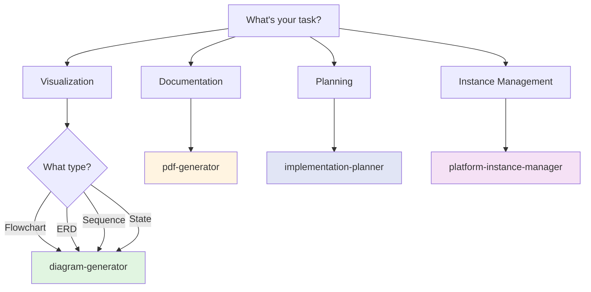

# Cross-Platform Agents Guide

This guide helps you find the right agent for cross-platform tasks.

## Quick Agent Finder

Answer these questions to find your agent:

### 1. What do you want to do?

**A. Create diagrams or flowcharts**
→ Use **diagram-generator** for Mermaid diagrams

**B. Generate PDF reports**
→ Use **pdf-generator** for PDF creation from Markdown

**C. Plan an implementation**
→ Use **implementation-planner** for project planning

**D. Manage platform instances**
→ Use **platform-instance-manager** for environment switching

---

## Decision Tree



---

## Agents by Category

### 📊 Visualization & Diagrams

**diagram-generator**
- **When to use**: Create flowcharts, ERDs, sequence diagrams
- **Example**: "Create an ERD showing Salesforce object relationships"
- **Takes**: 30 seconds - 2 minutes
- **Output**: Mermaid diagram (as code and rendered image)

**Supported diagram types:**
- Flowchart / Graph
- Entity Relationship Diagram (ERD)
- Sequence Diagram
- Class Diagram
- State Diagram
- Gantt Chart
- Pie Chart
- User Journey Map

---

### 📄 Documentation & PDF

**pdf-generator**
- **When to use**: Convert Markdown to PDF, create reports
- **Example**: "Convert audit-report.md to PDF with diagrams"
- **Takes**: 30-60 seconds
- **Output**: Professional PDF with rendered Mermaid diagrams

**Features:**
- Automatic Mermaid diagram rendering
- Multi-document collation
- Custom cover pages
- Table of contents
- Professional formatting

---

### 📋 Planning & Strategy

**implementation-planner**
- **When to use**: Plan complex implementations, create project roadmaps
- **Example**: "Create implementation plan for HubSpot-Salesforce integration"
- **Takes**: 3-5 minutes
- **Output**: Detailed project plan with timeline and tasks

**Features:**
- Requirement parsing
- Timeline estimation
- Dependency mapping
- Risk assessment
- Resource allocation
- Success criteria definition

---

### 🔄 Instance Management

**platform-instance-manager**
- **When to use**: Switch between environments, manage instances
- **Example**: "Switch to production environment for all platforms"
- **Takes**: 1-2 minutes
- **Output**: Environment switched with verification

**Supports:**
- Salesforce org switching
- HubSpot portal switching
- Multi-platform synchronized switching
- Environment isolation
- Instance health checks

---

## Common Use Cases

### "I need to document my architecture"
1. Use **diagram-generator** to create architecture diagrams
2. Use **pdf-generator** to create comprehensive documentation PDF
3. Include flowcharts, ERDs, and sequence diagrams

### "I need to plan a complex project"
1. Use **implementation-planner** to break down requirements
2. Get timeline and dependency map
3. Use **diagram-generator** to visualize project flow
4. Use **pdf-generator** to create stakeholder presentation

### "I need to switch between dev and prod"
1. Use **platform-instance-manager** to list all instances
2. Switch to desired environment
3. Verify connections to all platforms

### "I need to create a report with diagrams"
1. Create Markdown files with content
2. Use **diagram-generator** to create Mermaid diagrams
3. Use **pdf-generator** to combine everything into PDF

---

## Quick Reference Table

| Task | Agent | Time | Skill Level |
|------|-------|------|-------------|
| Create flowchart | diagram-generator | 1-2 min | Beginner |
| Convert Markdown to PDF | pdf-generator | 1 min | Beginner |
| List all instances | platform-instance-manager | 30 sec | Beginner |
| Create ERD | diagram-generator | 2-3 min | Intermediate |
| Multi-doc PDF | pdf-generator | 2-3 min | Intermediate |
| Switch environments | platform-instance-manager | 1-2 min | Intermediate |
| Project planning | implementation-planner | 3-5 min | Advanced |
| Create sequence diagram | diagram-generator | 2-3 min | Intermediate |

---

## Diagram Types Guide

### When to Use Each Diagram Type

**Flowchart**
- Process flows
- Decision trees
- Workflow diagrams
- Logic flows

**ERD (Entity Relationship Diagram)**
- Database schema
- Object relationships
- Data model visualization
- Integration mapping

**Sequence Diagram**
- API interactions
- System integrations
- Event flows
- User journeys

**Class Diagram**
- Object-oriented design
- Code architecture
- Component relationships

**State Diagram**
- Workflow states
- Status transitions
- Lifecycle management

**Gantt Chart**
- Project timelines
- Task schedules
- Resource allocation

---

## Tips for Success

### 1. Start with Diagrams
For any complex project, create diagrams first to visualize the solution before implementation.

### 2. Use PDF for Stakeholders
Convert technical documentation to PDF for easier sharing with non-technical stakeholders.

### 3. Plan Before Executing
For projects touching multiple platforms, always use **implementation-planner** first.

### 4. Environment Discipline
Always verify your current environment with **platform-instance-manager** before making changes.

### 5. Combine Tools
Most effective workflows combine multiple agents:
- Plan → Diagram → Document → Execute

---

## Agent Combinations

### Complete Documentation Workflow
1. **implementation-planner** → Create project plan
2. **diagram-generator** → Create architecture diagrams
3. **pdf-generator** → Compile everything into PDF deliverable

### Multi-Platform Project Workflow
1. **platform-instance-manager** → Verify all instances
2. **implementation-planner** → Create execution plan
3. **diagram-generator** → Visualize data flows
4. Execute with platform-specific agents

### Change Management Workflow
1. **diagram-generator** → Current state diagram
2. **diagram-generator** → Future state diagram
3. **implementation-planner** → Migration plan
4. **pdf-generator** → Change management documentation

---

## Diagram Examples

### Salesforce-HubSpot Integration Flow
```
Use diagram-generator to create a sequence diagram showing:
- Contact creation in HubSpot
- Webhook trigger to middleware
- Data transformation
- Contact creation in Salesforce
- Confirmation back to HubSpot
```

### Data Migration Process
```
Use diagram-generator to create a flowchart showing:
- Source data extraction
- Data validation
- Transformation logic
- Target system load
- Verification steps
- Rollback procedures
```

### Permission Model
```
Use diagram-generator to create an ERD showing:
- User entity
- Role entity
- Permission entity
- Resource entity
- Relationships between them
```

---

## PDF Generation Best Practices

### 1. Organize Content
Structure Markdown files logically:
- Cover page
- Executive summary
- Detailed sections
- Appendices

### 2. Use Headings
Proper heading hierarchy (# ## ###) ensures good PDF structure

### 3. Include Diagrams
Embed Mermaid diagrams directly in Markdown - they'll render automatically

### 4. Test Rendering
Generate PDF early to ensure diagrams render correctly

### 5. Use Templates
Start with existing templates for consistent formatting

---

## Implementation Planning Best Practices

### 1. Be Specific
Provide detailed requirements for accurate time estimates

### 2. Identify Dependencies
List known integrations and system dependencies upfront

### 3. Define Success
Clear success criteria help with scope management

### 4. Include Rollback
Every plan should include rollback procedures

### 5. Estimate Conservatively
Add buffer time for unknowns and complexity

---

## Still Not Sure?

Ask: "Which cross-platform agent should I use for [describe your task]?"

The system will analyze your request and recommend the best agent based on:
- Task type (visualization, documentation, planning, management)
- Complexity level
- Expected deliverable
- Time constraints

---

## Need More Help?

- View agent examples: Each agent has 3-4 copy-paste examples
- Check error codes: See templates/ERROR_MESSAGE_SYSTEM.md
- Review documentation: Each plugin has detailed README

**Pro Tip**: Cross-platform agents work best when combined with platform-specific agents:
1. Use cross-platform agents for **planning and documentation**
2. Use platform-specific agents for **execution**
3. Use cross-platform agents again for **reporting and visualization**
