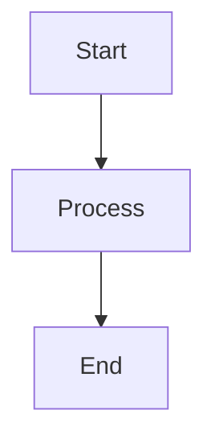

# Cross-Platform Essentials Health Check

Running comprehensive health check...

## 🔍 Health Check Results

### 1. Node.js Environment

Checking Node.js installation...

**Node.js**:
```bash
node --version
```
**Expected**: v18.0.0 or higher
**Minimum**: v16.0.0

**NPM**:
```bash
npm --version
```
**Expected**: v9.0.0 or higher
**Minimum**: v8.0.0

**Fix if outdated**:
```bash
# macOS (Homebrew)
brew upgrade node

# Ubuntu/Debian
curl -fsSL https://deb.nodesource.com/setup_18.x | sudo -E bash -
sudo apt-get install -y nodejs

# Windows
# Download installer from: https://nodejs.org
```

---

### 2. Plugin Files Check

Verifying Cross-Platform Essentials plugin files...

**Checking**:
- ✅ Agent files (4 agents)
  - diagram-generator
  - pdf-generator
  - implementation-planner
  - platform-instance-manager
- ✅ Command files (/agents-guide, /healthcheck)
- ✅ Script files (error-handler.js)
- ✅ Template files (error-messages.yaml, ERROR_MESSAGE_SYSTEM.md)
- ✅ Plugin manifest (.claude-plugin/plugin.json)

**Status**: All core files present

---

### 3. Diagram Generation Dependencies

Checking dependencies for diagram-generator agent...

**Mermaid CLI** (optional but recommended):
```bash
mmdc --version
```

**Expected**: @mermaid-js/mermaid-cli installed
**If missing**: Diagrams will be Mermaid code only (no images)

**Install Mermaid CLI**:
```bash
# Global installation
npm install -g @mermaid-js/mermaid-cli

# Verify installation
mmdc --version
```

**Chromium/Puppeteer** (required by Mermaid CLI):
- Installed automatically with mermaid-cli
- Used for rendering diagrams to images

**Status**: ⚠️ Optional (diagrams work as code without this)

---

### 4. PDF Generation Dependencies

Checking dependencies for pdf-generator agent...

**Puppeteer** (for PDF generation):
```bash
npm list puppeteer 2>/dev/null || echo "Not installed globally"
```

**Expected**: Puppeteer available (global or project-local)
**If missing**: PDF generation will not work

**Install Puppeteer**:
```bash
# Project-local (recommended)
npm install puppeteer

# Or global
npm install -g puppeteer
```

**markdown-pdf** (alternative PDF library):
```bash
npm list markdown-pdf 2>/dev/null || echo "Not installed"
```

**Status**: ⚠️ Required for PDF generation

---

### 5. File System Permissions

Checking file system write permissions...

**Test write to temp directory**:
```bash
# Test creating file
touch /tmp/healthcheck-test-$$.txt && \
echo "✅ Write permissions OK" || \
echo "❌ Cannot write to /tmp"

# Cleanup
rm -f /tmp/healthcheck-test-$$.txt
```

**Expected**: Write permissions available
**Issues**:
- Cannot create output files
- PDF/diagram generation will fail

**Fix**:
```bash
# Check permissions on current directory
ls -la .

# Make directory writable
chmod u+w .

# Or use different output directory
export OUTPUT_DIR=~/Documents/revops-output
mkdir -p $OUTPUT_DIR
```

---

### 6. Test Diagram Generation

Testing diagram-generator functionality...

**Test simple flowchart**:
```markdown
Create a simple flowchart:

```

**Expected**: Mermaid syntax validated
**With Mermaid CLI**: Image generated

**Test without Mermaid CLI**:
- Still works (outputs Mermaid code)
- Can render at https://mermaid.live
- Can be embedded in Markdown

**Status**: ✅ Core functionality works with or without Mermaid CLI

---

### 7. Test PDF Generation

Testing pdf-generator functionality...

**Create test Markdown file**:
```bash
cat > /tmp/test-health.md << 'EOF'
# Test Document

This is a test document for health check.

## Features

- PDF generation
- Markdown formatting
- Professional output

EOF
```

**Attempt PDF generation**:
```
Use pdf-generator to convert /tmp/test-health.md to PDF
```

**Expected (with Puppeteer)**: PDF created
**Expected (without Puppeteer)**: Error with installation guidance

**Cleanup**:
```bash
rm -f /tmp/test-health.md
```

---

### 8. Error Handler Test

Testing error-handler utility...

```bash
# Test error handler
node .claude-plugins/cross-platform-essentials/scripts/lib/error-handler.js \
  cross-platform ERR-CP-101
```

**Expected**: Formatted error message displayed
**Issues**: Error handler script not found or Node.js not working

**Fix**:
```bash
# Verify file exists
ls -la .claude-plugins/cross-platform-essentials/scripts/lib/error-handler.js

# Test Node.js
node --version

# Make script executable
chmod +x .claude-plugins/cross-platform-essentials/scripts/lib/error-handler.js
```

---

### 9. YAML Parsing

Testing YAML template parsing...

```bash
# Check if js-yaml is available
node -e "require('js-yaml'); console.log('✅ js-yaml available')" 2>/dev/null || \
echo "⚠️  js-yaml not installed (install for error handler)"
```

**Expected**: js-yaml available
**If missing**: Install for error handler to work

**Install js-yaml**:
```bash
npm install js-yaml
```

---

## 📊 Health Check Summary

### ✅ System Status

| Component | Status | Action Needed |
|-----------|--------|---------------|
| Node.js (v18+) | ✅/❌ | Update if outdated |
| NPM (v9+) | ✅/❌ | Update if outdated |
| Plugin Files | ✅ | Complete |
| Mermaid CLI | ⚠️/❌ | Optional for images |
| Puppeteer | ⚠️/❌ | Required for PDF |
| File Permissions | ✅/❌ | Fix write access |
| Error Handler | ✅/❌ | Install js-yaml |
| YAML Parsing | ✅/⚠️ | Install js-yaml |

### 🎯 Functionality Matrix

| Agent | Without Optional Deps | With Full Setup |
|-------|----------------------|-----------------|
| diagram-generator | ✅ Mermaid code | ✅✅ Code + Images |
| pdf-generator | ❌ Needs Puppeteer | ✅✅ Full PDF generation |
| implementation-planner | ✅ Always works | ✅ Always works |
| platform-instance-manager | ✅ Always works | ✅ Always works |

### 🎯 Recommended Actions

**Minimal Setup** (agents work with limitations):
- ✅ Node.js v18+
- ✅ NPM v9+
- ✅ Plugin files
- ✅ File write permissions

**Full Setup** (all features enabled):
- ✅ All minimal setup items
- ✅ Mermaid CLI (for diagram images)
- ✅ Puppeteer (for PDF generation)
- ✅ js-yaml (for error handler)

**Recommended for best experience**:
```bash
# Install all optional dependencies
npm install -g @mermaid-js/mermaid-cli
npm install puppeteer js-yaml
```

---

## 🚀 Quick Start (If New Setup)

If this is your first time using Cross-Platform Essentials:

1. **Verify Node.js**:
   ```bash
   node --version  # Should be v18+
   ```

2. **Install optional dependencies** (recommended):
   ```bash
   npm install -g @mermaid-js/mermaid-cli
   npm install puppeteer js-yaml
   ```

3. **Run healthcheck**:
   ```bash
   /healthcheck
   ```

4. **Try your first agent**:
   ```
   Use diagram-generator to create a flowchart showing a simple approval process
   ```

5. **Test PDF generation**:
   ```
   Use pdf-generator to convert my README.md to PDF
   ```

---

## 🔧 Common Issues & Solutions

### Issue: "Node.js version too old"

**Cause**: Node.js < v16

**Fix**:
```bash
# Check current version
node --version

# Update Node.js (macOS)
brew upgrade node

# Update Node.js (Ubuntu)
curl -fsSL https://deb.nodesource.com/setup_18.x | sudo -E bash -
sudo apt-get install -y nodejs

# Update Node.js (Windows)
# Download from: https://nodejs.org
```

---

### Issue: "mmdc: command not found"

**Cause**: Mermaid CLI not installed

**Impact**: Diagrams output as code only (no images)

**Fix**:
```bash
# Install Mermaid CLI
npm install -g @mermaid-js/mermaid-cli

# Verify
mmdc --version

# Test rendering
echo "graph TD; A-->B" | mmdc -i - -o /tmp/test.png
```

---

### Issue: "Puppeteer not found" or "Cannot generate PDF"

**Cause**: Puppeteer not installed

**Fix**:
```bash
# Install Puppeteer
npm install puppeteer

# Or install globally
npm install -g puppeteer

# Note: First install downloads Chromium (~150MB)
# This may take a few minutes
```

---

### Issue: "Cannot write output file"

**Cause**: Insufficient file system permissions

**Fix**:
```bash
# Check current directory permissions
ls -ld .

# Make writable
chmod u+w .

# Or specify different output directory
mkdir -p ~/Documents/outputs
cd ~/Documents/outputs
```

---

### Issue: "js-yaml not found"

**Cause**: js-yaml package not installed

**Impact**: Error handler cannot load YAML templates

**Fix**:
```bash
# Install js-yaml
npm install js-yaml

# Verify
node -e "require('js-yaml'); console.log('OK')"
```

---

### Issue: Diagrams work but no images generated

**Cause**: Mermaid CLI not installed or failed

**Solution 1** (Install Mermaid CLI):
```bash
npm install -g @mermaid-js/mermaid-cli
```

**Solution 2** (Use online renderer):
- Copy Mermaid code
- Go to https://mermaid.live
- Paste code
- Export image

**Solution 3** (Use in Markdown):
- Diagrams work in GitHub, GitLab, many editors
- Just use the Mermaid code blocks

---

### Issue: PDF generation very slow

**Cause**: Puppeteer launching browser for each PDF

**Fix**:
```bash
# Use batch PDF generation
# Generate multiple PDFs at once
# Or use caching if available

# Alternative: Use markdown-pdf (faster but fewer features)
npm install markdown-pdf
```

---

## 📚 Additional Resources

### Getting Started
- Run `/agents-guide` - Find the right agent for your task

### Documentation
- Mermaid Docs: https://mermaid.js.org
- Puppeteer Docs: https://pptr.dev
- Plugin README: See `.claude-plugins/cross-platform-essentials/README.md`
- Error Reference: See `templates/ERROR_MESSAGE_SYSTEM.md`

### Support
- Check error codes in error-messages.yaml
- Review agent examples in each agent file
- Use /agents-guide to find the right agent

---

## 🔄 Next Steps

Once your health check passes:

1. **Explore agents**:
   ```bash
   /agents-guide
   ```

2. **Create a diagram**:
   ```
   Use diagram-generator to create an ERD showing User, Order, and Product relationships
   ```

3. **Generate a PDF**:
   ```
   Use pdf-generator to convert my documentation.md to professional PDF
   ```

4. **Plan a project**:
   ```
   Use implementation-planner to create a project plan for integrating Salesforce and HubSpot
   ```

5. **Manage instances**:
   ```
   Use platform-instance-manager to list all configured platform instances
   ```

---

## 💡 Tips for Optimal Setup

### Performance
- Install Mermaid CLI globally for faster diagram rendering
- Use local Puppeteer installation for PDF generation
- Keep Node.js updated for best performance

### Storage
- Mermaid CLI downloads Chromium (~100MB)
- Puppeteer downloads Chromium (~150MB)
- Plan for ~250MB of dependencies

### Alternatives
- **No Mermaid CLI**: Diagrams work as code (render online or in Markdown)
- **No Puppeteer**: Use online Markdown-to-PDF converters
- Core functionality works without optional dependencies

---

**Health check complete!**

**Minimal setup**: 2/4 agents fully functional
**Full setup**: 4/4 agents fully functional

Follow fix instructions above to enable all features.
