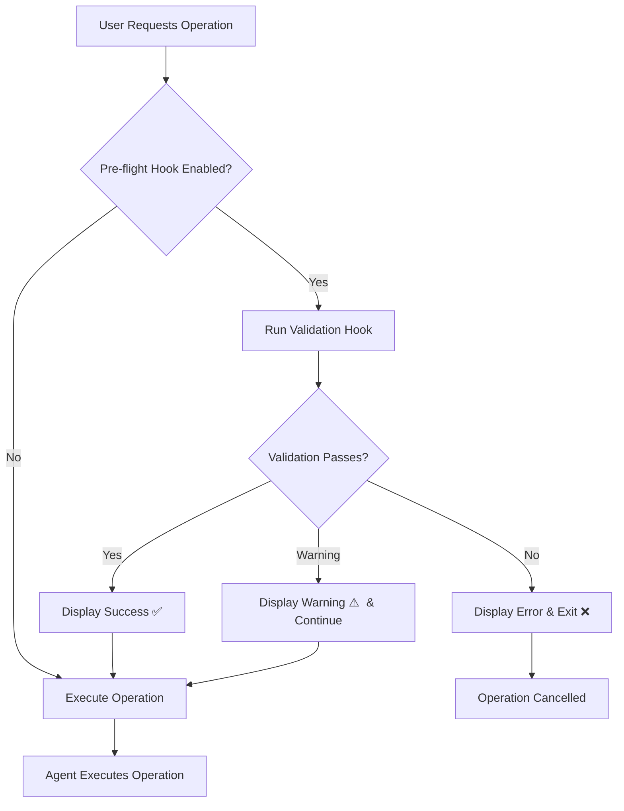

# Pre-Flight Validation System

## Overview

The Pre-Flight Validation System provides automatic validation before any agent operation to:
- Prevent common mistakes
- Warn about risky operations
- Check prerequisites
- Validate inputs
- Ensure safe operations

**Status**: Included in all 3 plugins
**Auto-triggers**: Before agent operations (when hooks are enabled)

---

## How It Works

### Automatic Validation Flow



---

## Setup Instructions

### 1. Make Hooks Executable

```bash
# Salesforce
chmod +x .claude-plugins/salesforce-essentials/hooks/pre-operation-validation.sh

# HubSpot
chmod +x .claude-plugins/hubspot-essentials/hooks/pre-operation-validation.sh

# Cross-Platform
chmod +x .claude-plugins/cross-platform-essentials/hooks/pre-operation-validation.sh
```

### 2. Enable Hooks (Optional)

Hooks run automatically when enabled in Claude Code settings.

**To enable**:
1. Check `.claude/settings.json`
2. Ensure hooks are enabled for the plugin

**To disable temporarily**:
```bash
# Disable for single operation
SKIP_VALIDATION=1 [operation command]
```

---

## Validation Types by Plugin

### Salesforce Essentials

**Validates**:
- ✅ Salesforce CLI installed
- ✅ Org connection exists
- ✅ Default org set (warns if not)
- ✅ API connection working
- ✅ Org type (production vs sandbox)
- ✅ API limits healthy
- ✅ User permissions sufficient
- ✅ SOQL syntax (common errors)
- ✅ Object/field existence
- ⚠️  Destructive operations in production

**Example Output**:
```
✅ Salesforce CLI installed
Validating connection to: production
✅ Connected to org: production
⚠️  Connected to PRODUCTION org: production
⚠️  DESTRUCTIVE OPERATION IN PRODUCTION!
Operation: delete
Context: 50 custom fields

Recommendations:
1. Test in sandbox first
2. Create backup before proceeding
3. Have rollback plan ready

Continue? (type 'yes' to proceed):
```

### HubSpot Essentials

**Validates**:
- ✅ HUBSPOT_ACCESS_TOKEN set
- ✅ API connection working
- ✅ Rate limits healthy
- ✅ Required scopes present (warns)
- ✅ Portal ID set (optional)
- ⚠️  Bulk delete operations
- ⚠️  Bulk update operations
- ⚠️  Workflow modifications

**Example Output**:
```
✅ HubSpot access token is set
Testing HubSpot API connection...
✅ API connection successful
Checking API rate limits...
API rate limits healthy: 89542 / 250000 remaining
⚠️  BULK DELETION DETECTED
This will delete multiple records!

Type 'DELETE' to confirm bulk deletion:
```

### Cross-Platform Essentials

**Validates**:
- ✅ Node.js version (v16+)
- ✅ Required dependencies installed
- ✅ Input files exist
- ✅ Output directories writable
- ✅ Mermaid syntax (basic)
- ✅ Disk space available
- ⚠️  Large files
- ⚠️  Production instance switches
- ⚠️  Path issues (spaces, special chars)

**Example Output**:
```
Checking Node.js version...
✅ Node.js version OK (v18)
Validating PDF generation...
⚠️  Puppeteer not installed - required for PDF generation

Install Puppeteer:
  npm install puppeteer

❌ Pre-flight Validation Failed
```

---

## Validation Levels

### ✅ Success (Green)
- Validation passed
- Operation can proceed
- No issues detected

### ⚠️ Warning (Yellow)
- Potential issue detected
- Operation can proceed but use caution
- Recommendation provided
- Example: Production environment, low API limits

### ❌ Error (Red)
- Validation failed
- Operation blocked
- Must fix before proceeding
- Example: Missing API token, CLI not installed

---

## Common Validations

### 1. Connection Validation

**Salesforce**:
```bash
# Checks:
- sf CLI installed
- Org authenticated
- Connection active
- API limits OK

# Example:
✅ Salesforce CLI installed
✅ Connected to org: my-sandbox
API rate limits healthy: 14850/15000 remaining
```

**HubSpot**:
```bash
# Checks:
- HUBSPOT_ACCESS_TOKEN set
- API responds (HTTP 200)
- Rate limits healthy
- Scopes sufficient

# Example:
✅ HubSpot access token is set
✅ API connection successful
API rate limits healthy: 89542/250000 remaining
```

### 2. Destructive Operation Warnings

**Salesforce**:
```bash
⚠️  DESTRUCTIVE OPERATION IN PRODUCTION!
Operation: delete
Context: Custom fields on Account

Recommendations:
1. Test in sandbox first
2. Create backup before proceeding
3. Have rollback plan ready

Continue? (type 'yes' to proceed):
```

**HubSpot**:
```bash
⚠️  BULK DELETION DETECTED
This will delete multiple records!

Type 'DELETE' to confirm bulk deletion:
```

### 3. Prerequisites Check

**Cross-Platform**:
```bash
Validating PDF generation...
❌ Puppeteer not installed - required for PDF generation

Install Puppeteer:
  npm install puppeteer
```

---

## Error Messages & Fixes

### ERR: "Salesforce CLI not installed"

**Cause**: `sf` command not found

**Fix**:
```bash
npm install -g @salesforce/cli
sf --version  # Verify installation
```

---

### ERR: "Cannot connect to org"

**Cause**: Org not authenticated or token expired

**Fix**:
```bash
# List authenticated orgs
sf org list

# Re-authenticate
sf org login web --alias my-org

# Or run setup
/getstarted
```

---

### ERR: "HUBSPOT_ACCESS_TOKEN not set"

**Cause**: Environment variable missing

**Fix**:
```bash
# Set environment variable
export HUBSPOT_ACCESS_TOKEN="pat-..."

# Or add to .env file
echo "HUBSPOT_ACCESS_TOKEN=pat-..." >> .env

# Or run setup
/getstarted
```

---

### ERR: "API authentication failed (401)"

**Cause**: Invalid or expired HubSpot access token

**Fix**:
1. Go to HubSpot Settings → Integrations → Private Apps
2. Regenerate access token
3. Update environment variable:
   ```bash
   export HUBSPOT_ACCESS_TOKEN="new-token"
   ```

---

### ERR: "Puppeteer not installed"

**Cause**: PDF generation dependency missing

**Fix**:
```bash
# Install Puppeteer
npm install puppeteer

# Or globally
npm install -g puppeteer
```

---

### WARN: "Low API calls remaining"

**Cause**: Approaching API limit

**Actions**:
- Wait for limit reset
- Reduce batch sizes
- Postpone non-critical operations
- Monitor with /healthcheck

---

### WARN: "Production environment"

**Cause**: Connected to production org/portal

**Actions**:
- Test in sandbox first
- Create backups
- Have rollback plan
- Proceed with caution

---

## Bypassing Validation (Not Recommended)

### Temporary Bypass

```bash
# Skip validation for single operation
SKIP_VALIDATION=1 [command]

# Example:
SKIP_VALIDATION=1 sf data delete ...
```

**⚠️ WARNING**: Bypassing validation removes safety checks. Only use when:
- You're absolutely certain the operation is safe
- Running in controlled environment
- Troubleshooting validation issues

---

## Customizing Validation

### Add Custom Checks

Edit the hook files to add custom validations:

**Salesforce** (`.claude-plugins/salesforce-essentials/hooks/pre-operation-validation.sh`):
```bash
# Add custom check
if [ some_condition ]; then
    warn "Custom validation message"
fi
```

**HubSpot** (`.claude-plugins/hubspot-essentials/hooks/pre-operation-validation.sh`):
```bash
# Add custom check
if [ some_condition ]; then
    error "Custom validation error"
fi
```

### Adjust Thresholds

```bash
# Change API limit warning threshold
if [ "$API_USAGE" -lt 1000 ]; then  # Changed from 100
    warn "Low API calls remaining: $API_USAGE"
fi
```

---

## Testing Validation

### Test Validation Hooks

```bash
# Test Salesforce validation
.claude-plugins/salesforce-essentials/hooks/pre-operation-validation.sh query my-org "SELECT Id FROM Account"

# Test HubSpot validation
.claude-plugins/hubspot-essentials/hooks/pre-operation-validation.sh contact read

# Test Cross-Platform validation
.claude-plugins/cross-platform-essentials/hooks/pre-operation-validation.sh pdf "file:test.md"
```

### Expected Behavior

**Successful validation**:
- Exit code: 0
- Multiple ✅ success messages
- Final confirmation

**Failed validation**:
- Exit code: 1
- ❌ error message
- Fix instructions
- Operation does not proceed

**Warnings**:
- Exit code: 0 (continues)
- ⚠️ warning messages
- Recommendations
- Operation proceeds

---

## Best Practices

### 1. Always Run in Sandbox First
```
✅ Test changes in sandbox
✅ Verify results
✅ Then deploy to production
```

### 2. Review Warnings
```
⚠️  Don't ignore warnings
⚠️  Read recommendations
⚠️  Take suggested actions
```

### 3. Have Backups
```
✅ Export data before bulk deletes
✅ Create metadata backups
✅ Document rollback procedures
```

### 4. Monitor API Limits
```
✅ Run /healthcheck regularly
✅ Watch rate limit warnings
✅ Plan operations during low-usage times
```

### 5. Validate Before Execute
```
✅ Use --dry-run flags when available
✅ Test with small batches first
✅ Verify prerequisites
```

---

## FAQ

### Q: Can I disable validation?

A: Yes, but not recommended. Use `SKIP_VALIDATION=1` for temporary bypass.

### Q: Validation is too strict, can I relax it?

A: Yes, edit the hook files to adjust thresholds or remove checks.

### Q: Validation passes but operation fails?

A: Validation checks prerequisites, not operation success. Check error messages for operation-specific issues.

### Q: Can I add custom validations?

A: Yes, edit the hook files and add custom checks using `error()`, `warn()`, or `success()` functions.

### Q: Validation is slow?

A: Validation adds 1-3 seconds. This is intentional to prevent expensive mistakes.

---

## Troubleshooting

### Validation Hook Not Running

**Symptoms**: No validation output before operations

**Causes**:
- Hook not executable
- Hooks disabled in settings
- Plugin not properly installed

**Fixes**:
```bash
# Make executable
chmod +x .claude-plugins/*/hooks/*.sh

# Verify hooks exist
ls -la .claude-plugins/*/hooks/

# Check Claude Code settings
cat .claude/settings.json | grep hooks
```

---

### False Positives

**Symptoms**: Validation fails but operation should work

**Causes**:
- Outdated validation logic
- Environment differences
- Custom setup not detected

**Fixes**:
- Update hook file
- Use `SKIP_VALIDATION=1` temporarily
- Report issue for hook improvement

---

## Version History

- **v1.0.0** (2025-11-06): Initial pre-flight validation system
  - Salesforce validation hook
  - HubSpot validation hook
  - Cross-platform validation hook
  - Complete documentation

---

## Related Documentation

- `/healthcheck` - Comprehensive system health check
- `templates/ERROR_MESSAGE_SYSTEM.md` - Error codes and fixes
- `/agents-guide` - Find the right agent for your task

---

**Remember**: Validation is your safety net. Don't bypass it unless absolutely necessary!
