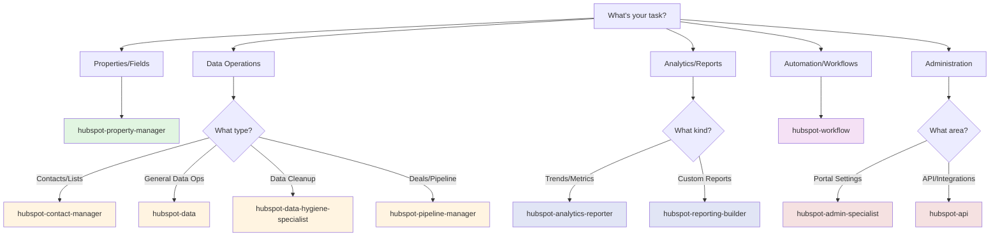

# HubSpot Agents Guide

This guide helps you find the right agent for your HubSpot task.

## Quick Agent Finder

Answer these questions to find your agent:

### 1. What do you want to do?

**A. Manage properties (fields)**
→ Use **hubspot-property-manager** for creating/analyzing properties

**B. Get analytics and reports**
→ Use **hubspot-analytics-reporter** for trends and metrics
→ Use **hubspot-reporting-builder** for custom reports

**C. Work with contact/company data**
→ Use **hubspot-contact-manager** for contacts and lists
→ Use **hubspot-data** for data operations

**D. Manage deals and pipelines**
→ Use **hubspot-pipeline-manager** for deal/pipeline analysis

**E. Create or manage workflows**
→ Use **hubspot-workflow** for automation and nurture campaigns

**F. Set up integrations or webhooks**
→ Use **hubspot-api** for API operations

**G. Configure portal settings**
→ Use **hubspot-admin-specialist** for portal administration

**H. Clean up data**
→ Use **hubspot-data-hygiene-specialist** for duplicates and data quality

---

## Decision Tree

---

## Agents by Category

### 🏷️ Properties & Schema

**hubspot-property-manager**
- **When to use**: Create, analyze, or manage HubSpot properties
- **Example**: "Create a dropdown property for customer tier"
- **Takes**: 30 seconds - 1 minute
- **Output**: Property created with confirmation

---

### 📊 Analytics & Reporting

**hubspot-analytics-reporter**
- **When to use**: Get trends, growth metrics, funnel analysis
- **Example**: "Show contact growth trends for last 6 months"
- **Takes**: 1-2 minutes
- **Output**: Trend analysis with visualizations

**hubspot-reporting-builder**
- **When to use**: Build custom reports and dashboards
- **Example**: "Create a sales performance dashboard"
- **Takes**: 3-5 minutes
- **Output**: Custom report or dashboard

---

### 👥 Contact & Data Management

**hubspot-contact-manager**
- **When to use**: Work with contacts, create lists, segment analysis
- **Example**: "Create a list of contacts from Q4 2024"
- **Takes**: 1-2 minutes
- **Output**: List created with count

**hubspot-data**
- **When to use**: Data quality checks, exports, bulk updates
- **Example**: "Export all companies to CSV"
- **Takes**: 1-3 minutes
- **Output**: CSV file or operation confirmation

**hubspot-data-hygiene-specialist**
- **When to use**: Find duplicates, clean data, standardize formats
- **Example**: "Find all duplicate contacts by email"
- **Takes**: 2-3 minutes
- **Output**: Duplicate analysis with merge recommendations

---

### 💼 Deals & Pipeline

**hubspot-pipeline-manager**
- **When to use**: Analyze pipelines, find stale deals, forecast
- **Example**: "Show all deals stuck in negotiation stage > 30 days"
- **Takes**: 1-2 minutes
- **Output**: Deal analysis with recommendations

---

### ⚙️ Automation & Workflows

**hubspot-workflow**
- **When to use**: Create workflows, nurture campaigns, automation
- **Example**: "Create a lead nurture workflow"
- **Takes**: 3-5 minutes
- **Output**: Workflow created and activated

---

### 🔧 Administration

**hubspot-admin-specialist**
- **When to use**: Portal configuration, user management, settings audit
- **Example**: "Audit portal settings and recommend improvements"
- **Takes**: 2-3 minutes
- **Output**: Configuration audit report

**hubspot-api**
- **When to use**: API operations, webhooks, integrations
- **Example**: "Set up webhook for new contact creation"
- **Takes**: 2-3 minutes
- **Output**: Webhook configured and tested

---

## Common Use Cases

### "I'm new to this portal - where do I start?"
1. Start with **hubspot-admin-specialist** for portal overview
2. Use **hubspot-property-manager** to understand custom properties
3. Use **hubspot-analytics-reporter** for current performance metrics

### "I need to clean up duplicate contacts"
1. Use **hubspot-data-hygiene-specialist** to find duplicates
2. Review merge recommendations
3. Execute merges in batches

### "I need to build a lead nurture campaign"
1. Use **hubspot-contact-manager** to create target list
2. Use **hubspot-workflow** to create nurture workflow
3. Monitor with **hubspot-analytics-reporter**

### "I need to analyze sales performance"
1. Use **hubspot-pipeline-manager** for deal analysis
2. Use **hubspot-reporting-builder** for custom dashboard
3. Use **hubspot-analytics-reporter** for trend analysis

### "I need to import customer data"
1. Use **hubspot-data** with validation first
2. Map fields correctly
3. Run import and verify

### "I need to create custom properties"
1. Use **hubspot-property-manager** to create properties
2. Set field types and options
3. Update forms/workflows as needed

---

## Quick Reference Table

| Task | Agent | Time | Skill Level |
|------|-------|------|-------------|
| Create property | hubspot-property-manager | 1 min | Beginner |
| Contact growth trends | hubspot-analytics-reporter | 1-2 min | Beginner |
| Export contacts | hubspot-data | 1-2 min | Beginner |
| Create contact list | hubspot-contact-manager | 1-2 min | Beginner |
| Find duplicates | hubspot-data-hygiene-specialist | 2-3 min | Intermediate |
| Analyze pipeline | hubspot-pipeline-manager | 1-2 min | Intermediate |
| Create workflow | hubspot-workflow | 3-5 min | Advanced |
| Custom dashboard | hubspot-reporting-builder | 3-5 min | Intermediate |
| Portal audit | hubspot-admin-specialist | 2-3 min | Advanced |
| Set up webhook | hubspot-api | 2-3 min | Advanced |

---

## Tips for Success

### 1. Understand Your Properties
Use **hubspot-property-manager** to analyze existing properties before creating new ones to avoid duplication.

### 2. Start with Lists
Before building workflows, create target lists with **hubspot-contact-manager** to define your audience.

### 3. Monitor Data Quality
Run **hubspot-data-hygiene-specialist** monthly to catch duplicates and data issues early.

### 4. Test Workflows
Always test workflows with small test lists before activating for your entire database.

### 5. Use Analytics
Regularly check **hubspot-analytics-reporter** to track trends and identify issues early.

---

## Agent Combinations

### Lead Gen Analysis Workflow
1. **hubspot-analytics-reporter** → Identify top lead sources
2. **hubspot-contact-manager** → Create segmented lists by source
3. **hubspot-workflow** → Set up source-specific nurture campaigns

### Data Cleanup Workflow
1. **hubspot-data-hygiene-specialist** → Find duplicates and data issues
2. **hubspot-contact-manager** → Create cleanup lists
3. **hubspot-data** → Execute bulk updates/merges

### Sales Performance Workflow
1. **hubspot-pipeline-manager** → Analyze deal stages
2. **hubspot-reporting-builder** → Create performance dashboard
3. **hubspot-workflow** → Automate follow-up tasks

---

## Still Not Sure?

Ask: "Which HubSpot agent should I use for [describe your task]?"

The system will analyze your request and recommend the best agent based on:
- Task type (properties, data, analytics, automation)
- Complexity level
- Required permissions
- Expected outcome

---

## Need More Help?

- View agent examples: Each agent has 3-4 copy-paste examples
- Run /getstarted: Set up your HubSpot connection
- Check error codes: See templates/ERROR_MESSAGE_SYSTEM.md

**Pro Tip**: Most HubSpot tasks involve multiple agents:
- **Analyze** (analytics-reporter, pipeline-manager)
- **Segment** (contact-manager)
- **Automate** (workflow)
- **Monitor** (analytics-reporter)
