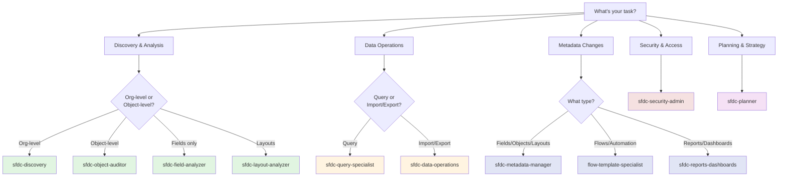

# Salesforce Agents Guide

This guide helps you find the right agent for your Salesforce task.

## Quick Agent Finder

Answer these questions to find your agent:

### 1. What do you want to do?

**A. Learn about my org**
→ Use **sfdc-discovery** for complete org analysis
→ Use **sfdc-object-auditor** for specific object analysis
→ Use **sfdc-field-analyzer** for field analysis

**B. Query or analyze data**
→ Use **sfdc-query-specialist** for building SOQL queries
→ Use **sfdc-data-operations** for data exports and analysis

**C. Create or modify metadata**
→ Use **sfdc-metadata-manager** for fields, objects, layouts
→ Use **flow-template-specialist** for flows and automation
→ Use **sfdc-reports-dashboards** for reports and dashboards

**D. Import or update data**
→ Use **sfdc-data-operations** for CSV imports and bulk updates

**E. Analyze or configure security**
→ Use **sfdc-security-admin** for permissions and profiles

**F. Plan a project**
→ Use **sfdc-planner** for implementation planning

**G. Run SF CLI commands**
→ Use **sfdc-cli-executor** for command-line operations

**H. Analyze page layouts**
→ Use **sfdc-layout-analyzer** for layout optimization

---

## Decision Tree

---

## Agents by Category

### 🔍 Discovery & Analysis (Read-Only)

**sfdc-discovery**
- **When to use**: Complete org health check, understand overall state
- **Example**: "Analyze my org and identify top 3 improvement areas"
- **Takes**: 2-3 minutes
- **Output**: Comprehensive org analysis report

**sfdc-object-auditor**
- **When to use**: Deep dive into specific object
- **Example**: "Analyze the Account object and show all relationships"
- **Takes**: 1-2 minutes
- **Output**: Object analysis with relationships and dependencies

**sfdc-field-analyzer**
- **When to use**: Field-level analysis, find unused fields
- **Example**: "Find all unused fields on Opportunity"
- **Takes**: 1-2 minutes
- **Output**: Field usage report with recommendations

**sfdc-layout-analyzer**
- **When to use**: Analyze page layouts for optimization
- **Example**: "Analyze Account page layouts for performance issues"
- **Takes**: 1-2 minutes
- **Output**: Layout analysis with UX recommendations

---

### 📊 Data Operations

**sfdc-query-specialist**
- **When to use**: Build SOQL queries, analyze data
- **Example**: "Show all Opportunities closed this month over $50K"
- **Takes**: 10-30 seconds
- **Output**: Query results with data

**sfdc-data-operations**
- **When to use**: Import/export data, bulk updates
- **Example**: "Export all Accounts to CSV"
- **Takes**: 30 seconds - 2 minutes
- **Output**: CSV file or import confirmation

---

### ⚙️ Metadata Management

**sfdc-metadata-manager**
- **When to use**: Create/modify fields, objects, layouts
- **Example**: "Create a custom field 'Customer_Tier__c' on Account"
- **Takes**: 30 seconds - 1 minute
- **Output**: Field created with confirmation

**flow-template-specialist**
- **When to use**: Create/modify flows and automation
- **Example**: "Create a lead assignment flow based on territory"
- **Takes**: 2-4 minutes
- **Output**: Flow created with template

**sfdc-reports-dashboards**
- **When to use**: Create/analyze reports and dashboards
- **Example**: "Create a sales pipeline dashboard"
- **Takes**: 3-5 minutes
- **Output**: Report or dashboard created

---

### 🔒 Security & Access

**sfdc-security-admin**
- **When to use**: Permissions, profiles, access control
- **Example**: "Create a permission set for sales managers"
- **Takes**: 1-2 minutes
- **Output**: Permission set created with permissions

---

### 📋 Planning & Strategy

**sfdc-planner**
- **When to use**: Plan complex implementations
- **Example**: "Create a plan to clean up 50 unused fields"
- **Takes**: 3-5 minutes
- **Output**: Detailed implementation plan with timeline

---

### 💻 CLI Operations

**sfdc-cli-executor**
- **When to use**: Run SF CLI commands, batch operations
- **Example**: "Run SOQL query via CLI and export results"
- **Takes**: Varies
- **Output**: Command execution results

---

## Common Use Cases

### "I'm new to this org - where do I start?"
1. Start with **sfdc-discovery** for complete org analysis
2. Then use **sfdc-object-auditor** for key objects (Account, Contact, Opportunity)
3. Finally use **sfdc-field-analyzer** to understand custom fields

### "I need to clean up unused fields"
1. Use **sfdc-field-analyzer** to identify unused fields
2. Use **sfdc-planner** to create deprecation plan
3. Use **sfdc-metadata-manager** to execute changes

### "I need to import customer data from CSV"
1. Use **sfdc-data-operations** with dry-run first
2. Fix any validation errors
3. Run actual import with **sfdc-data-operations**

### "I need to create a new automation"
1. Use **flow-template-specialist** to apply template
2. Customize for your requirements
3. Test in sandbox before production

### "I need to build a report"
1. Use **sfdc-reports-dashboards** to create report
2. Customize groupings and filters
3. Add to dashboard if needed

### "Who has access to what?"
1. Use **sfdc-security-admin** to audit permissions
2. Review profile and permission set access
3. Create new permission sets if needed

---

## Quick Reference Table

| Task | Agent | Time | Skill Level |
|------|-------|------|-------------|
| Org health check | sfdc-discovery | 2-3 min | Beginner |
| Build SOQL query | sfdc-query-specialist | 30 sec | Beginner |
| Export data to CSV | sfdc-data-operations | 1-2 min | Beginner |
| Analyze object | sfdc-object-auditor | 1-2 min | Intermediate |
| Find unused fields | sfdc-field-analyzer | 1-2 min | Intermediate |
| Create custom field | sfdc-metadata-manager | 1 min | Intermediate |
| Create flow | flow-template-specialist | 3-5 min | Advanced |
| Create report | sfdc-reports-dashboards | 3-5 min | Intermediate |
| Audit permissions | sfdc-security-admin | 2-3 min | Advanced |
| Plan implementation | sfdc-planner | 3-5 min | Advanced |
| Analyze layouts | sfdc-layout-analyzer | 1-2 min | Intermediate |

---

## Tips for Success

### 1. Start with Discovery
Always run **sfdc-discovery** first if you're unfamiliar with the org. It gives you the big picture.

### 2. Use Read-Only First
Before making changes, use analysis agents (discovery, auditor, analyzer) to understand current state.

### 3. Plan Complex Changes
For anything beyond simple field creation, use **sfdc-planner** first to create an implementation plan.

### 4. Test in Sandbox
Always test metadata changes and automations in sandbox before production.

### 5. Refer to Examples
Every agent has copy-paste examples in their documentation. Use them!

---

## Still Not Sure?

Ask: "Which Salesforce agent should I use for [describe your task]?"

The system will analyze your request and recommend the best agent based on:
- Task type (discovery, data, metadata, security)
- Complexity level
- Required permissions
- Expected outcome

---

## Need More Help?

- View agent examples: Each agent has 3-4 copy-paste examples
- Run /getstarted: Set up your Salesforce connection
- Check error codes: See templates/ERROR_MESSAGE_SYSTEM.md

**Pro Tip**: You can chain agents together. For example:
1. **sfdc-discovery** → Find all unused fields
2. **sfdc-planner** → Create cleanup plan
3. **sfdc-metadata-manager** → Execute the cleanup
