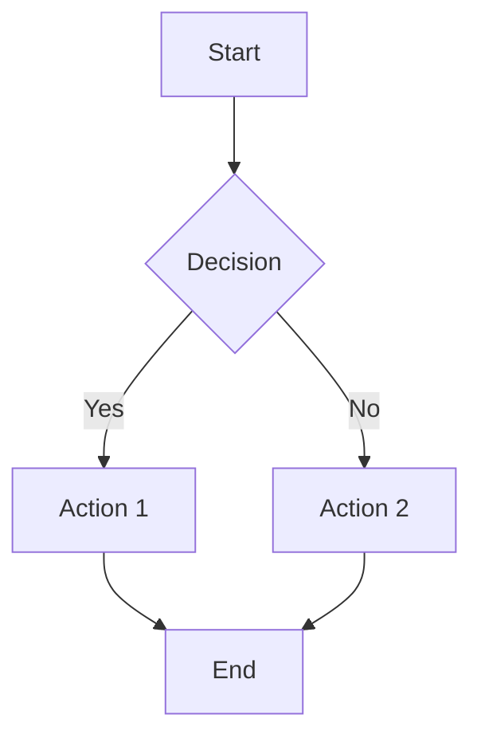
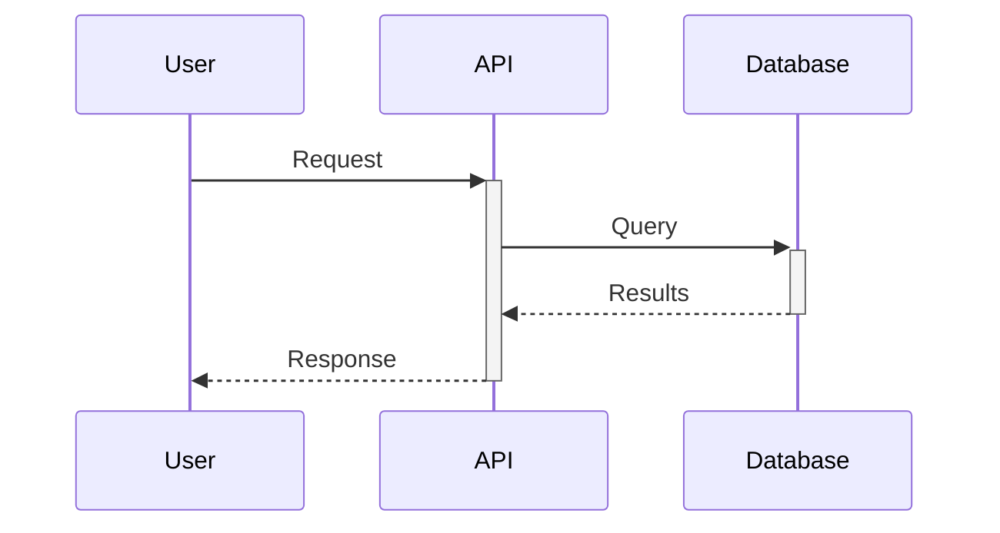
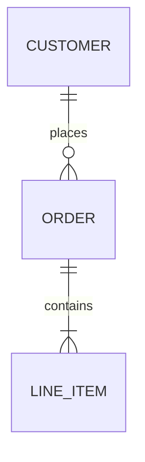

# OpsPal Core - User Guide

This file provides guidance when using the OpsPal Core with Claude Code.

## Plugin Overview

The **OpsPal Core** provides utilities and orchestration across Salesforce, HubSpot, and more. Includes 46 agents for diagrams, PDFs, Asana integration, task scheduling, sub-agent routing, ACE self-learning, project intake, RevOps data quality governance, NotebookLM client knowledge bases, and LLM-ready field dictionaries.

**Repository**: https://github.com/RevPalSFDC/opspal-commercial

## Quick Start

```bash
# Installation
/plugin marketplace add RevPalSFDC/opspal-commercial
/plugin install opspal-core@opspal-commercial

# Verify
/agents  # Should show cross-platform agents
```

## Key Features

### Validation Framework (NEW)

**Comprehensive validation system preventing 611 errors annually ($30,618 ROI)**

The Validation Framework provides automatic error prevention through 5 validation stages:

1. **Schema Validation** - Validates data structure against JSON schemas
2. **Parse Error Handling** - Auto-fixes JSON/XML/CSV parsing issues
3. **Data Quality** - Detects synthetic data and quality issues (4-layer scoring)
4. **Tool Contract** - Validates tool invocations before execution
5. **Permission Validation** - Checks bulk operations and field-level security

**Automatic Hooks** (already enabled):
- `pre-reflection-submit.sh` - Validates reflections before submission
- `pre-tool-execution.sh` - Validates sf CLI and MCP tool calls
- `pre-commit-config-validation.sh` - Validates JSON/YAML/XML before commit

**Additional Validation Components**:
- **Validation Correlator** - Identifies cross-stage root causes when multiple validators flag related issues
- **Tool Contract Coverage** - Reports on which tools have contracts vs gaps
- **Orphan Detection** - Detects missing lookup relationships in data operations

**Quick Commands**:
```bash
# Generate validation dashboard
node scripts/lib/validation-dashboard-generator.js generate --days 30

# Test validators
node scripts/lib/schema-registry.js list
node scripts/lib/tool-contract-validator.js validate sf_data_query \
  --params '{"query":"SELECT Id FROM Account"}'

# Tool contract coverage report
node scripts/lib/tool-contract-coverage.js report
node scripts/lib/tool-contract-coverage.js generate-template <tool-name>

# Cross-stage correlation
echo '{"stage1":{"errors":[...]}}' | node scripts/lib/validation-correlator.js --stdin

# Run config validation manually
bash hooks/pre-commit-config-validation.sh --all --verbose

# Temporarily disable validation
export SKIP_VALIDATION=1              # All validation
export SKIP_TOOL_VALIDATION=1         # Tool validation only
```

**Pre-Commit Hook Setup** (automatically symlinked):
```bash
# If not already set up, create symlink:
ln -sf ../../.claude-plugins/opspal-core/hooks/pre-commit-config-validation.sh .git/hooks/pre-commit
```

**Documentation**: See `docs/VALIDATION_FRAMEWORK_GUIDE.md` for complete guide

**Performance**:
- <500ms total validation time
- <10ms schema validation
- <100ms data quality check
- 95%+ pass rate for legitimate operations

### Diagram Generation
- **Mermaid** - Flowcharts, sequence diagrams, ERDs
- **Lucid** - Architecture diagrams with multi-tenant isolation
- **Exports** - PNG, SVG, PDF

**Trigger keywords**: "diagram", "flowchart", "ERD", "sequence diagram", "visualize"

### PDF Generation
- Multi-document PDFs with cover templates
- Markdown to PDF conversion
- Cover templates (`templates/pdf-covers/README.md`): salesforce-audit, security-audit, executive-report, hubspot-assessment, data-quality, gtm-planning, cross-platform-integration, default
- Themes (`templates/pdf-styles/README.md`): revpal, revpal-brand, default

### Web Visualization (Interactive Dashboards)

Generate interactive web dashboards with charts, tables, maps, and KPI cards. Supports conversational updates.

```bash
# Create new dashboard
/viz new "Sales Dashboard"

# Create with initial chart
/viz new "Pipeline" --chart bar --data salesforce --query "SELECT StageName, SUM(Amount) FROM Opportunity GROUP BY StageName"

# Data table from CSV
/viz new "Report" --table --data file --path ./data/sales.csv

# Start dev server for live updates
/viz serve --port 3847

# Export to static HTML
/viz export ./reports/dashboard.html
```

**Components:**
- **Charts**: bar, line, pie, doughnut, scatter, radar (via Chart.js)
- **Tables**: Sortable, filterable, paginated data tables
- **Maps**: Markers, heatmaps, territory/choropleth (via Leaflet.js)
- **KPI Cards**: Single metrics with trend indicators

**Output Modes:**
- **Static HTML**: Self-contained, shareable, works offline
- **Dev Server**: WebSocket hot-reload for real-time updates

**Trigger keywords**: "web dashboard", "interactive chart", "data visualization", "visualize data", "territory map", "heat map", "kpi dashboard"

**Optional dependencies** (for dev server):
```bash
cd .claude-plugins/opspal-core && npm install express ws --save
```

**Files**: `scripts/lib/web-viz/`, `config/web-viz-defaults.json`

### BLUF+4 Executive Summaries
**Auto-generates** after audits: Bottom Line (25-40 words), Situation (30-50), Next Steps (35-55), Risks (25-40), Support Needed (20-35).

```bash
export ENABLE_AUTO_BLUF=1           # Enable (default)
export BLUF_OUTPUT_FORMAT=terminal  # terminal, markdown, json
```

### NotebookLM Client Knowledge Bases (NEW)

**Create 360-degree client context** using Google NotebookLM for AI-queryable knowledge bases.

**Trigger keywords**: "notebook", "knowledge base", "client context", "briefing", "360 view"

**Agents:**
- `notebooklm-knowledge-manager` - Core notebook operations (CRUD, sources, queries)
- `client-notebook-orchestrator` - High-level workflows (onboarding, briefings, research)

**Quick Commands:**
```bash
# Initialize client notebook
/notebook-init <org-alias>

# Sync assessment report
/notebook-sync <org-alias> <report-path>

# Query client context
/notebook-query <org-alias> "What were the CPQ findings?"

# Generate executive briefing
/generate-client-briefing <org-alias>

# Research Drive for new documents
/notebook-research <org-alias>
```

**Notebook Structure:**
```
instances/{org}/notebooklm/
├── notebook-registry.json    # Notebook IDs and config
├── source-manifest.json      # Source tracking
├── query-cache.json          # Cached queries (saves budget)
├── drafts/                   # Auto-generated content
├── approved/                 # Human-reviewed
└── delivered/                # Sent to client
```

**Source Hierarchy:**
1. **Primary** - Executive summaries, overviews (queried first)
2. **Detail** - Full reports, raw findings (queried for depth)
3. **External** - Drive docs, URLs (supplementary)
4. **Discovered** - Auto-found via Drive research

**Budget:** ~50 queries/day (free tier). Queries are cached to optimize budget.

**Setup:**
```bash
# Install NotebookLM MCP
bash scripts/setup-notebooklm-auth.sh

# Verify
claude mcp list | grep notebooklm
```

**Environment Variables:**
| Variable | Default | Description |
|----------|---------|-------------|
| NOTEBOOKLM_AUTO_SYNC | true | Auto-sync after assessments |
| NOTEBOOKLM_QUERY_TIMEOUT | 120 | Query timeout seconds |
| NOTEBOOKLM_DAILY_QUERY_BUDGET | 50 | Daily query limit |
| NOTEBOOKLM_DRIVE_RESEARCH | true | Enable Drive auto-discovery |

### Field Dictionary System (NEW)

**Bridge technical Salesforce/HubSpot metadata with LLM-consumable business context** for accurate reporting and field selection.

**Trigger keywords**: "field dictionary", "data dictionary", "field context", "field lookup", "metadata dictionary"

**Agent:**
- `field-dictionary-manager` - Generate, enrich, query, and maintain field dictionaries

**Quick Commands:**
```bash
# Generate dictionary from metadata caches
/generate-field-dictionary acme-corp --sf-alias acme-prod --hs-portal acme

# Query fields by name, tag, or audience
/query-field-dictionary acme-corp Amount
/query-field-dictionary acme-corp --tags Revenue,Pipeline --format context
/query-field-dictionary acme-corp --audience Executive

# Interactive enrichment with business context
/enrich-field-dictionary acme-corp --object Opportunity
/enrich-field-dictionary acme-corp --tags Revenue
```

**Dictionary Structure:**
```
orgs/{org_slug}/configs/field-dictionary.yaml
```

**Field Attributes (14 per field):**
- `api_name`, `field_name`, `field_type` - Technical metadata
- `description`, `example_values` - Business context
- `use_cases`, `audience_relevance` - Reporting guidance
- `reporting_guidance` - Caveats, aggregations, related fields
- `tags` - Auto-inferred categories (Revenue, Pipeline, CPQ, etc.)

**Auto-Injection for Reporting Agents:**
The `pre-task-field-dictionary-injector.sh` hook automatically injects field context into:
- `sfdc-reports-dashboards`, `sfdc-report-designer`
- `pipeline-intelligence-agent`, `unified-exec-dashboard-agent`
- `gtm-strategic-reports-orchestrator`, `gtm-retention-analyst`
- `sfdc-revops-auditor`, `sfdc-cpq-assessor`

**Tag Categories:**
| Tag | Field Patterns |
|-----|----------------|
| Revenue | amount, revenue, price, arr, mrr, tcv, acv |
| Pipeline | stage, probability, forecast, close date |
| CPQ | sbqq, quote, subscription, contract |
| Marketing | campaign, source, utm, lead source |
| Renewal | renewal, contract_end, expiration |
| Service | case, ticket, support |

**CLI Tools:**
```bash
# Load and query (from scripts/lib/)
node field-dictionary-loader.js stats acme-corp
node field-dictionary-loader.js search acme-corp "annual revenue"
node field-dictionary-loader.js tags acme-corp Revenue
node field-dictionary-loader.js context acme-corp --audience Executive

# Generate dictionary (from scripts/lib/)
node field-dictionary-generator.js generate acme-corp --sf-alias acme-prod
node field-dictionary-generator.js validate acme-corp
```

**Environment Variables:**
| Variable | Default | Description |
|----------|---------|-------------|
| FIELD_DICT_INJECTION_ENABLED | 1 | Auto-inject for reporting agents |
| FIELD_DICT_CACHE_TTL | 300 | Cache TTL in seconds |
| FIELD_DICT_LIVE_FIRST | true | Reload from disk in live-first mode |
| ORG_SLUG | - | Current org for lookups |

### Live-First Caching System (v2.5.0+)

**Comprehensive live-first caching** across all OpsPal Core cache systems. By default, all cache systems now query live data sources first, using cached data only as fallback on failures. This prevents stale context data and ensures agents always work with current information.

**Architecture:**
- Query live data source first (default behavior)
- Cache results for fallback use
- Use cached data only when source fails (with warning)
- Per-component environment variable control

**Global Control:**
```bash
# Disable live-first for all components (not recommended)
export GLOBAL_LIVE_FIRST=false
```

**Core Plugin Environment Variables:**

| Variable | Default | Component | Risk if Disabled |
|----------|---------|-----------|------------------|
| `GLOBAL_LIVE_FIRST` | `true` | All caches | Stale data across all systems |
| `API_CACHE_LIVE_FIRST` | `true` | API Cache Manager | External API data not refreshed |
| `ENRICHMENT_LIVE_FIRST` | `true` | Enrichment Cache | NPI/EIN/DUNS data stale |
| `FIELD_DICT_LIVE_FIRST` | `true` | Field Dictionary | Field definitions not validated |
| `CONTEXT_LIVE_FIRST` | `true` | Base Context Loader | Platform context stale |
| `WORK_CONTEXT_LIVE_FIRST` | `true` | Work Context Hook | Work history staleness warnings |

**Fallback Behavior:**
When data source fails in live-first mode:
1. Cache is used as fallback (if available)
2. Warning is logged: `API failed, using cache fallback: <error>`
3. Cache staleness is tracked in metrics

**API Cache Manager Methods:**
```javascript
const { APICacheManager } = require('./api-cache-manager');
const cache = new APICacheManager();

// Live-first (default): returns null, forcing live query
cache.get(key);

// Force cache lookup (for fallback scenarios)
cache.getFallback(key);

// getOrFetch automatically handles live-first with fallback
const result = await cache.getOrFetch(key, fetchFn, options);
```

**Enrichment Cache Methods:**
```javascript
const { EnrichmentCache } = require('./enrichment/enrichment-cache');
const cache = new EnrichmentCache();

// Live-first (default): returns null, forcing live query
cache.get('NPI', '1234567890');

// Force cache lookup (for fallback scenarios)
cache.getFallback('NPI', '1234567890');
```

**Verification:**
```bash
# Check if live-first is active
echo $GLOBAL_LIVE_FIRST  # should be empty or "true"

# Force cache-first for testing (single run)
GLOBAL_LIVE_FIRST=false node scripts/lib/api-cache-manager.js stats
```

### Work Index System (Project Memory)

**Track all work requests per client** with classification, deliverables, status, and session history - providing project memory across sessions.

**Trigger keywords**: "work index", "project log", "work history", "client work", "project memory"

**Quick Commands:**
```bash
# List work for a client
/work-index list acme-corp
/work-index list acme-corp --status completed --since 2026-01

# Search across clients
/work-index search "cpq"
/work-index search "automation" --type audit

# Add new work request
/work-index add acme-corp --title "CPQ Assessment" --classification audit

# Get context for session start
/work-index context acme-corp

# Generate summary report
/work-index summary acme-corp --format markdown
```

**Storage Structure:**
```
orgs/{org_slug}/WORK_INDEX.yaml
```

**Classification Taxonomy:**
| Classification | Sub-Types |
|----------------|-----------|
| audit | cpq-assessment, revops-audit, automation-audit, security-audit |
| report | executive-report, pipeline-report, custom-dashboard |
| build | flow-development, trigger-development, validation-rule, permission-set |
| migration | data-import, data-export, schema-migration |
| configuration | field-config, object-setup, automation-config |
| consultation | architecture-review, process-design |
| support | bug-fix, troubleshooting, training |

**Auto-Population:**
- Session IDs captured automatically by hooks (never manual)
- Assessment agents auto-create entries on completion
- Context loaded at session start when `ORG_SLUG` is set

**Environment Variables:**
| Variable | Default | Description |
|----------|---------|-------------|
| ORG_SLUG | - | Organization identifier for context loading |
| WORK_CONTEXT_ENABLED | 1 | Enable/disable context loading |
| WORK_INDEX_AUTO_CAPTURE | 1 | Enable/disable auto-capture |

### Unified Authentication Manager
Centralized auth for Salesforce, HubSpot, Marketo:

```bash
node scripts/lib/unified-auth-manager.js status    # Check all
node scripts/lib/unified-auth-manager.js test salesforce
node scripts/lib/unified-auth-manager.js refresh hubspot
```

### Centralized Dependency Management (NEW)

Check and install npm dependencies across ALL plugins from a single location:

```bash
# Check all plugins
/checkdependencies

# Auto-install missing packages
/checkdependencies --fix

# Check specific plugin
/checkdependencies --plugin opspal-core

# Verbose output (includes devDependencies)
/checkdependencies --verbose
```

**What it checks:**
- Parses `package.json` in each plugin directory
- Verifies packages exist in `node_modules`
- Handles special packages (md-to-pdf, better-sqlite3, sharp) with extra notes

**Integration with /pluginupdate:**
The `/pluginupdate` command now includes npm package checking. Running `/pluginupdate --fix` will also install missing npm packages.

**Common fixes:**
```bash
# Missing md-to-pdf (requires Puppeteer/Chromium)
# Linux may need: sudo apt-get install -y libgbm-dev libnss3 libatk-bridge2.0-0

# Missing native modules (better-sqlite3, sharp)
# May need: npm install -g node-gyp
```

### Task Scheduler
Schedule Claude prompts and scripts:

```bash
/schedule-add --name="Daily Check" --type=claude-prompt --schedule="0 6 * * *" --prompt="Check API limits"
/schedule-list          # View tasks
/schedule-run <id>      # Test immediately
/schedule-logs <id>     # View logs
```

**Cron examples**: `0 6 * * *` (daily 6am), `0 8 * * 0` (Sunday 8am), `*/15 * * * *` (every 15 min)

### Asana Integration

```bash
/asana-link            # Link project to directory
/asana-update          # Post work summary
```

**Update templates** in `templates/asana-updates/`: progress-update.md, blocker-update.md, completion-update.md, milestone-update.md

### UAT Testing Framework

```bash
/uat-build --platform salesforce --output ./tests/cpq-tests.csv
/uat-run ./tests/cpq-tests.csv --org my-sandbox --epic "CPQ Workflow"
```

### Intelligent Intake System

When a user's request involves 3+ work streams, production deployments, cross-team coordination, unknown scope, or project-level planning language, proactively suggest `/intake` before proceeding. Intake is especially valuable for L3+ complexity requests.

Classify natural language requests, generate implementation plans, and create Asana tasks — all from a plain English description.

```bash
/intake "Redesign lead routing in Salesforce with territory-based assignment"
/intake --json "Add a checkbox field to Account"
/intake --plan-only "Migrate 50k contacts from HubSpot to Salesforce"
/intake --project-gid 123 --platform salesforce "Build CPQ quoting workflow"
/intake --mode quick "Overhaul opportunity stages"
/intake --no-questions "Set up lead scoring in HubSpot"
```

**Trigger keywords**: "intake", "project intake", "new project", "requirements gathering", "kickoff", "smart intake", "classify request"

**Features:**
- NL-driven classification (L1 Simple Config through L5 Platform Engineering)
- Risk assessment (Low / Medium / High) with rollback/UAT requirements
- Anti-pedantic question limits capped by sophistication level
- Quick vs Thorough mode for question depth
- Phased implementation plans with effort estimates and dependencies
- Asana task creation with sections (Discovery, Design, Build, QA, Deployment, Handoff)
- JSON output mode for programmatic use
- Plan-only mode for review before execution
- Active intake gate for vague project requests (recommend/require modes in router)

**Options**: `--json`, `--plan-only`, `--project-gid`, `--workspace-gid`, `--platform`, `--mode quick|thorough`, `--no-questions`

**Files:**
- `agents/intelligent-intake-orchestrator.md` - Core NL intake agent
- `config/intelligent-intake-rubric.json` - Classification rubric and effort sizes
- `commands/intake.md` - Command entry point
- `scripts/lib/intake/intake-form-generator.js` - Legacy form generation (fallback)
- `scripts/lib/intake/intake-validator.js` - Validation engine (reused)
- `commands/intake-generate-form.md` - Legacy form command (still available)

## Sub-Agent Routing System

**Automatic** - Routes tasks to appropriate agents based on complexity analysis. Shows visible routing banner, logs to `~/.claude/logs/routing.jsonl`.

**Complexity tiers**:
- < 0.5: Agent available if needed
- 0.5-0.7: Agent recommended
- >= 0.7: **BLOCKING** - Must use Task tool

**Configuration**:
```bash
export ENABLE_SUBAGENT_BOOST=1       # Enable (default)
export ENABLE_AGENT_BLOCKING=1       # Block high-complexity (default)
export ROUTING_VERBOSE=1             # Debug logging
export ACTIVE_INTAKE_MODE=recommend  # suggest|recommend|require (default recommend)
export ACTIVE_INTAKE_PROJECT_SIGNAL_MIN=3
export ACTIVE_INTAKE_COMPLETENESS_MAX=0.5
```

**Requirements**: `jq` (`brew install jq` / `sudo apt-get install jq`)

**Routing commands**:
```bash
/route "task description"    # Manual routing analysis
/routing-health              # System health check
```

**Override controls**:
- `[DIRECT] task` - Skip routing
- `[USE: agent-name] task` - Force specific agent

**Documentation**: `AUTO_ROUTING_SETUP.md`, `docs/ROUTING_TROUBLESHOOTING.md`

## Task Graph Orchestration

**NEW** - Decompose complex requests into directed acyclic graphs (DAGs) with explicit dependencies, parallel execution, and verification gates.

### When to Use

Use Task Graph when complexity score >= 4:
- **Multi-domain** (2 pts): Apex + Flow, SF + HubSpot
- **Multi-artifact** (2 pts): 5+ files affected
- **High-risk** (2 pts): Production, permissions, deletes
- **High-ambiguity** (1 pt): Needs discovery
- **Long-horizon** (1 pt): Multi-step execution

### Commands

```bash
/task-graph "Update lead routing and modify associated trigger"
/complexity "Check complexity score for a task"
```

### User Flags

| Flag | Effect |
|------|--------|
| `[SEQUENTIAL]` | Force Task Graph mode |
| `[PLAN_CAREFULLY]` | Force Task Graph + extra validation |
| `[DIRECT]` | Skip Task Graph |
| `[COMPLEX]` | Hint higher complexity |

### Configuration

```bash
export TASK_GRAPH_ENABLED=1       # Enable (default)
export TASK_GRAPH_THRESHOLD=4     # Complexity threshold
export TASK_GRAPH_BLOCKING=0      # Block if threshold met
export TASK_GRAPH_VERBOSE=1       # Detailed output
```

### Playbooks

Pre-built decomposition patterns:
- `playbooks/salesforce/` - flow-work, apex-work, metadata-deployment, production-change
- `playbooks/hubspot/` - workflow-work, data-operations, integration-setup
- `playbooks/data/` - transform-work, migration, validation

### Files

- **Agent**: `agents/task-graph-orchestrator.md`
- **Schemas**: `schemas/task-spec.schema.json`, `schemas/result-bundle.schema.json`
- **Config**: `config/complexity-rubric.json`, `config/tool-policies.json`, `config/verification-matrix.json`
- **Engine**: `scripts/lib/task-graph/`
- **Hook**: `hooks/pre-task-graph-trigger.sh`

## Capability Gap Infrastructure

Scripts for distributed tracing, audit logging, taxonomy classification, API caching, and rate limiting.

| Script | Purpose |
|--------|---------|
| `platform-helpers.sh` | Cross-platform shell detection (WSL, Git Bash, macOS, Linux) |
| `platform-utils.js` | Cross-platform JS detection (mirrors platform-helpers.sh) |
| `node-wrapper.sh` | Node.js binary discovery for Desktop/GUI contexts |
| `env-normalize.sh` | Shared environment normalizer — source at top of hooks |
| `trace-context.js` | Correlation IDs across tool calls |
| `audit-log.js` | Track mutations with before/after state |
| `taxonomy-classifier.js` | 12-category reflection classification |
| `api-cache-manager.js` | Per-endpoint TTL caching |
| `api-limit-tracker.js` | Rate limit tracking, 429 learning |

**CLI examples**:
```bash
node scripts/lib/trace-context.js generate
node scripts/lib/audit-log.js summary
node scripts/lib/taxonomy-classifier.js categories
node scripts/lib/api-cache-manager.js stats
node scripts/lib/api-limit-tracker.js check salesforce /query
```

## Available Agents

**Orchestration**: `asana-task-manager`, `diagram-generator`, `intelligent-intake-orchestrator`

**Quality**: `agent-deliverable-validator`, `quality-gate-enforcer`, `user-expectation-validator`

**Documentation**: `documentation-organizer`

**Revenue Operations (NEW)**:
- `pipeline-intelligence-agent` - Pipeline health scoring, bottleneck detection, deal risk
- `sales-playbook-orchestrator` - Segment-specific playbooks, next-best-action
- `account-expansion-orchestrator` - Cross-sell/upsell opportunities, whitespace analysis

**Customer Success (NEW)**:
- `cs-operations-orchestrator` - QBR generation, health interventions, renewal forecasting
- `sales-enablement-coordinator` - Training paths, skill gap analysis, onboarding

**Cross-Platform (NEW)**:
- `multi-platform-campaign-orchestrator` - Campaign orchestration across SF/HubSpot/Marketo
- `unified-exec-dashboard-agent` - Executive dashboards combining all platform data
- `multi-platform-workflow-orchestrator` - Complex multi-platform workflow orchestration
- `data-migration-orchestrator` - Data migrations with field mapping and validation

**Gong Conversation Intelligence (NEW)**:
- `gong-integration-agent` - General-purpose Gong API integration and data management
- `gong-deal-intelligence-agent` - Read-only deal risk analysis from conversation data
- `gong-sync-orchestrator` - Execute Gong-to-CRM sync workflows
- `gong-competitive-intelligence-agent` - Competitive tracker analysis and battlecard insights

## Gong Integration

### Overview

Analyze client Gong conversation data to enrich CRM assessments, surface deal risk signals, track competitive intelligence, and provide conversation health insights during RevOps/pipeline audits.

**Trigger keywords**: "gong", "deal risk", "conversation health", "going dark", "competitive intelligence", "gong trackers", "sync gong"

### Quick Commands

```bash
# Validate Gong credentials
/gong-auth

# Quick env var check (no API call)
/gong-auth check

# Check API budget status
/gong-auth status

# Sync call data to CRM
/gong-sync --mode calls --since 7d --target salesforce --org my-org

# Dry-run sync (preview without writing)
/gong-sync --mode calls --since 24h --dry-run

# Analyze deal risk signals
/gong-risk-report --pipeline Enterprise --min-amount 50000

# Competitive intelligence report
/gong-competitive-intel --period 90d --competitors "Salesforce,HubSpot"
```

### Environment Variables

| Variable | Required | Description |
|----------|----------|-------------|
| `GONG_ACCESS_KEY_ID` | Yes | Gong API access key ID |
| `GONG_ACCESS_KEY_SECRET` | Yes | Gong API access key secret |
| `GONG_WORKSPACE_ID` | No | Workspace ID (multi-workspace) |
| `GONG_VALIDATION_ENABLED` | No | Set to `0` to disable pre-call validation |
| `GONG_POST_SYNC_ENABLED` | No | Set to `0` to disable post-sync logging |
| `GONG_MCP_DISABLED` | No | Set to `true` to disable MCP server |

### Rate Limits

- **Per-second**: 3 requests/second (token bucket)
- **Daily budget**: 10,000 calls/day
- **Warning**: At 80% daily usage
- **Hard block**: At 95% daily usage
- **Budget file**: `~/.claude/api-limits/gong-daily.json`

### MCP Tools

| Tool | Description |
|------|-------------|
| `mcp__gong__calls_list` | List calls within date range |
| `mcp__gong__calls_extensive` | Get calls with parties, trackers, interaction stats |
| `mcp__gong__calls_transcript` | Get call transcripts with speaker attribution |
| `mcp__gong__users_list` | List Gong users |
| `mcp__gong__trackers_list` | List configured trackers |
| `mcp__gong__sync_calls_to_crm` | Sync calls to SF/HS (idempotent via Gong_Call_ID__c) |
| `mcp__gong__run_risk_analysis` | Score open deals for conversation risk |
| `mcp__gong__competitor_report` | Generate competitive intelligence report |

### Risk Signals

| Signal | Threshold | Score Impact |
|--------|-----------|-------------|
| Going Dark | No calls in 21+ days | +25 (HIGH) |
| Engagement Gap | No calls in 14+ days | +15 (MEDIUM) |
| Competitor Mentioned | Any tracker match | +20 (MEDIUM) |
| Budget Concerns | Pricing/budget tracker | +15 (MEDIUM) |
| Single-threaded | <2 stakeholders on high-value deal | +15 (MEDIUM) |
| Talk Ratio Anomaly | >60% or <30% rep talk time | +10 (LOW) |

### Files

- **API Client**: `scripts/lib/gong-api-client.js`
- **Rate Limiter**: `scripts/lib/gong-throttle.js`
- **Token Manager**: `scripts/lib/gong-token-manager.js`
- **Risk Analyzer**: `scripts/lib/gong-risk-analyzer.js`
- **Sync Engine**: `scripts/lib/gong-sync.js`
- **Webhook Handler**: `scripts/lib/gong-webhook-handler.js`
- **Competitor Tracker**: `scripts/lib/gong-competitor-tracker.js`
- **MCP Server**: `scripts/mcp/gong/`

## Common Commands

```bash
# Project Intake
/intake                     # Start intake workflow
/intake-generate-form       # Generate HTML form only

# Asana
/asana-link                 # Link project
/asana-update               # Post summary

# Scheduling
/schedule-add               # Add task
/schedule-list              # View tasks
/schedule-run <id>          # Test task
/schedule-logs <id>         # View logs

# Testing
/uat-build                  # Build test cases
/uat-run                    # Execute tests

# Data Quality
/data-quality-audit         # Full data quality audit
/deduplicate                # Find and merge duplicates
/enrich-data                # Fill missing data
/data-health                # Quick health scorecard
/review-queue               # Process pending actions

# Plugin Health (Centralized)
/checkdependencies          # Check npm deps across all plugins
/checkdependencies --fix    # Auto-install missing packages
/pluginupdate               # Full plugin health check
/pluginupdate --fix         # Auto-fix issues including npm

# Work Index (Project Memory)
/work-index list <org>      # List work for a client
/work-index search <query>  # Search across clients
/work-index add <org>       # Add new work request
/work-index context <org>   # Recent work + follow-ups
/work-index summary <org>   # Generate client summary
```

## Mermaid Examples

**Flowchart**:


**Sequence**:


**ERD**:


## PDF Generation

```javascript
const PDFGenerationHelper = require('./scripts/lib/pdf-generation-helper');

await PDFGenerationHelper.generateMultiReportPDF({
  orgAlias: 'production',
  outputDir: './reports',
  documents: [
    { path: 'summary.md', title: 'Summary', order: 0 },
    { path: 'analysis.md', title: 'Analysis', order: 1 }
  ],
  coverTemplate: 'salesforce-audit',
  metadata: { title: 'Audit Report', version: '1.0.0' }
});
```

## User Expectation Tracking

```javascript
const tracker = new UserExpectationTracker();
await tracker.initialize();

// Record correction
await tracker.recordCorrection('cpq-assessment', 'date-format', 'MM/DD/YYYY', 'YYYY-MM-DD');

// Set preference
await tracker.setPreference('cpq-assessment', 'date-format', 'YYYY-MM-DD');

// Validate output
const result = await tracker.validate(output, 'cpq-assessment');
```

## Quality Gate Validation

```javascript
const { QualityGateValidator } = require('./scripts/lib/quality-gate-validator');
const validator = new QualityGateValidator();

validator.fileExists('/path/to/report.json');
validator.hasRequiredFields(data, ['summary', 'findings']);
validator.isInRange(score, 0, 100);
```

## Dashboard Design System (STANDARD)

All web-viz dashboards MUST use the RevPal Dashboard theme pattern.

### Required Structure

```html
<div class="dashboard-container">
  <header class="dashboard-header">
    <h1 class="dashboard-title">Title</h1>
    <p class="dashboard-description">Description</p>
    <div class="dashboard-meta">
      <span class="meta-item">Item 1</span>
      <span class="meta-item">Item 2</span>
    </div>
  </header>
  <main class="dashboard-content">
    <div class="dashboard-grid">
      <div class="viz-component">...</div>
    </div>
  </main>
</div>
```

### Canonical Source Files

| File | Purpose |
|------|---------|
| `templates/web-viz/themes/revpal-dashboard.css` | **Single source of truth** for all dashboard styles |
| `scripts/lib/web-viz/output/StaticHtmlGenerator.js` | Enforces structure (uses `theme: 'revpal'` by default) |
| `config/web-viz-defaults.json` | Default configuration |

### Key CSS Classes

| Class | Usage |
|-------|-------|
| `.dashboard-container` | Outer wrapper (max-width 1440px, centered) |
| `.dashboard-header` | Header with title + apricot underline accent |
| `.dashboard-grid` | 12-column CSS Grid layout |
| `.viz-component` | Base card with hover transitions |
| `.viz-kpi` | KPI card (36px value, uppercase label) |
| `.viz-chart` | Chart container (min-height 280px) |
| `.viz-table` | Table with grape headers |

### Brand Colors (CSS Variables)

```css
--brand-grape: #5F3B8C;     /* Primary */
--brand-indigo: #3E4A61;    /* Secondary/text */
--brand-apricot: #E99560;   /* Accent */
--brand-sand: #EAE4DC;      /* Background */
--brand-green: #6FBF73;     /* Success */
```

### Typography

- **Headings**: Montserrat (500-800 weight)
- **Body**: Figtree (400-600 weight)

### DO NOT

- Create custom dashboard structures
- Inline brand colors (use CSS variables)
- Skip the `dashboard-container` wrapper
- Override theme CSS in individual components

## Best Practices

**Asana**: Keep updates < 100 words, use templates, include metrics.

**Diagrams**: Use Mermaid for simple, Lucid for complex. One concept per diagram.

**PDFs**: Use cover templates, include metadata (version, date).

**Dashboards**: Always use `revpal-dashboard.css` theme. Never create custom styling.

## Troubleshooting

**Asana**: Verify `ASANA_ACCESS_TOKEN` in .env.

**Mermaid errors**: Validate at https://mermaid.live

**PDF timeout**: Reduce document size or split.

## Pre-Compact Session Context (NEW)

**Automatic preservation of session details before context compaction**

When Claude Code compacts a long session, detailed error messages, stack traces, and friction points can be lost. The Pre-Compact Session Context system automatically extracts and saves this information.

**How It Works**:
1. **PreCompact Hook** - Triggers automatically before context compaction
2. **Transcript Extraction** - Parses session transcript for:
   - Errors and tool failures
   - User corrections (patterns indicating clarifications)
   - Friction points (retry patterns, confusion)
3. **Session Context File** - Saved to `~/.claude/session-context/`
4. **`/reflect` Integration** - Automatically loads captured context

**Automatic Behavior** (no action needed):
- The PreCompact hook runs silently before compaction
- Session context is preserved for `/reflect` to use
- Works across all plugins (Salesforce, HubSpot, etc.)

**Manual Extraction** (optional):
```bash
# Analyze current session transcript
node .claude/scripts/lib/transcript-reflection-extractor.js current

# Extract and save session context
node .claude/scripts/lib/transcript-reflection-extractor.js pre-compact
```

**Environment Variables**:
```bash
export PRE_COMPACT_VERBOSE=1        # Enable verbose logging
export DISABLE_SESSION_CAPTURE=1   # Disable auto-capture entirely
```

**What Gets Captured**:
| Pattern Type | Examples |
|--------------|----------|
| Errors | `error`, `failed`, `Exit code [1-9]`, `timeout`, `429`, `500` |
| User Corrections | "no, that's not", "actually, I meant", "wrong file" |
| Friction Points | "try again", "still not working", "why did it" |

**Benefits for `/reflect`**:
- Detailed error messages preserved even after compaction
- User feedback patterns captured automatically
- More accurate reflection analysis with full context
- ROI calculation based on actual issues, not summaries

## Client-Centric Folder Migration

**Migrate from system-centric to client-centric folder structure**

When asked to "migrate work locally" or reorganize project folders, use the client-centric migration system.

### Architecture Comparison

| System-Centric (Old) | Client-Centric (New) |
|---------------------|----------------------|
| `instances/salesforce/acme/` | `orgs/acme/platforms/salesforce/production/` |
| Platform is primary boundary | **Org is primary boundary** |
| Scattered cross-platform data | Unified org-level analysis/planning |

### Migration Command

```bash
/migrate-schema [--dry-run] [--only-org <slug>]
```

### Quick Reference

```bash
# Preview what would be migrated
node scripts/migrate-to-client-centric.js --dry-run --verbose

# Migrate single org (test first)
node scripts/migrate-to-client-centric.js --only-org acme --write-report

# Full migration with symlinks for backward compatibility
node scripts/migrate-to-client-centric.js --create-symlinks --write-report
```

### Path Resolution Tools

```bash
# Resolve instance path (works with both structures)
node scripts/lib/path-resolver.js resolve salesforce production acme

# List orgs in new structure
node scripts/lib/path-resolver.js list-orgs

# Load org metadata
node scripts/lib/metadata-loader.js load-org acme
```

### Environment Variables

| Variable | Purpose |
|----------|---------|
| `ORG_SLUG` | Primary org identifier |
| `INSTANCE_PATH` | Direct path override |
| `PREFER_ORG_CENTRIC` | Prefer new structure (default: 1) |

### Benefits

- **Org as primary boundary** - All client work in one place
- **Cross-platform visibility** - See SF, HubSpot, Marketo under each org
- **Machine-readable metadata** - `org.yaml`, `instance.yaml` for automation
- **Backward compatible** - Dual-path resolution supports both structures

**Full documentation**: `skills/client-centric-migration/SKILL.md`

## Hook Health Check

```bash
/hooks-health
```

Runs the comprehensive hook health checker across all plugins.

**Fix permissions**: `chmod +x ~/.claude/plugins/cache/opspal-commercial/opspal-core/<version>/hooks/*.sh`

## Documentation

- **docs/ASANA_AGENT_PLAYBOOK.md** - Asana guide
- **templates/asana-updates/** - Update templates
- **AUTO_ROUTING_SETUP.md** - Routing setup
- **CHANGELOG.md** - Version history

## Support

- GitHub Issues: https://github.com/RevPalSFDC/opspal-plugin-internal-marketplace/issues
- `/reflect` - Submit feedback

---
**Version**: 1.33.0 | **Updated**: 2025-12-21
