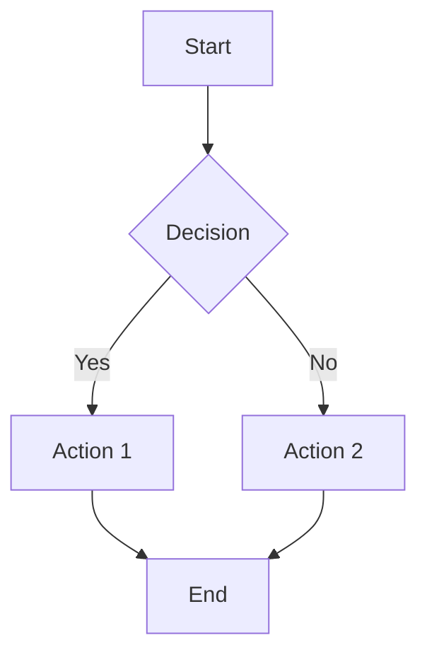
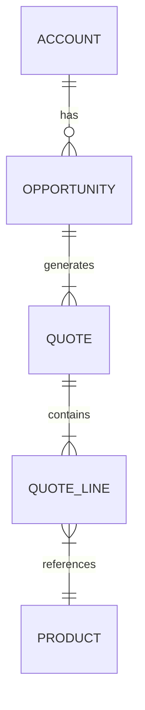

# OpsPal Core - Usage Guide

**Version**: 1.12.0
**Last Updated**: 2025-11-24

## Quick Start

```bash
# Install
/plugin marketplace add RevPalSFDC/opspal-plugin-internal-marketplace
/plugin install opspal-core@opspal-commercial

# Verify
/agents | grep -E "diagram|asana|funnel"
```

## Core Capabilities

| Feature | Agent/Tool | Use When |
|---------|------------|----------|
| **Diagrams** | `diagram-generator` | Visualizations, flowcharts, ERDs |
| **Asana** | `/asana-link`, `/asana-update` | Task management integration |
| **Sales Funnel** | `sales-funnel-diagnostic` | Pipeline performance analysis |
| **PDF Generation** | `pdf-generation-helper` | Report deliverables |
| **Quality Gates** | `quality-gate-enforcer` | Deliverable validation |

## Diagram Generation

### Create Diagrams

```
User: "Create ERD for the CPQ data model"
→ Routes to diagram-generator
→ Produces Mermaid diagram with export options
```

### Supported Diagram Types

| Type | Syntax | Use Case |
|------|--------|----------|
| Flowchart | `graph TD` | Process flows |
| Sequence | `sequenceDiagram` | API interactions |
| ERD | `erDiagram` | Data models |
| State | `stateDiagram-v2` | State machines |
| Class | `classDiagram` | Object models |
| Gantt | `gantt` | Project timelines |

### Example: Flowchart



### Example: ERD



## Asana Integration

### Link Project

```bash
# In project directory
/asana-link

# Select from available projects
# Creates .asana-links.json
```

### Post Updates

```bash
# After completing work
/asana-update

# Uses templates for consistent formatting
```

### Update Templates

| Template | Length | Use Case |
|----------|--------|----------|
| `progress-update.md` | 50-75 words | Intermediate checkpoints |
| `blocker-update.md` | 40-60 words | Report blockers |
| `completion-update.md` | 60-100 words | Task completion |
| `milestone-update.md` | 100-150 words | Phase completion |

### Update Format

```markdown
**Progress Update** - [Task Name] - [Date]

**Completed:**
- [Accomplishment with metric]

**In Progress:**
- [Current work]

**Next:**
- [Next steps]

**Status:** On Track
```

## Sales Funnel Diagnostic

### Run Analysis

```
User: "Analyze sales funnel performance"
→ Routes to sales-funnel-diagnostic
→ Produces:
   - Conversion rates by stage
   - Bottleneck identification
   - Benchmark comparisons
   - Recommendations
```

### Metrics Analyzed

- Lead → MQL conversion
- MQL → SQL conversion
- SQL → Opportunity conversion
- Opportunity → Closed Won
- Average cycle time per stage
- Stage-specific drop-off rates

## PDF Generation

### Generate Report PDF

```javascript
const PDFGenerationHelper = require('./scripts/lib/pdf-generation-helper');

await PDFGenerationHelper.generateMultiReportPDF({
  orgAlias: 'production',
  outputDir: './reports',
  documents: [
    { path: 'summary.md', title: 'Summary', order: 0 },
    { path: 'findings.md', title: 'Findings', order: 1 }
  ],
  profile: 'cover-toc',
  coverTemplate: 'salesforce-audit',
  metadata: {
    title: 'Assessment Report',
    version: '1.0.0'
  }
});
```

### Preset Profiles

- `simple` - Branded PDF with no cover and no TOC
- `cover-toc` - Branded PDF with cover page and TOC

### Cover Templates

1. `salesforce-audit` - Salesforce automation audits
2. `hubspot-assessment` - HubSpot portal assessments
3. `executive-report` - Executive summaries
4. `gtm-planning` - Go-to-market planning
5. `data-quality` - Data quality assessments
6. `cross-platform-integration` - Multi-platform integration
7. `security-audit` - Security/compliance audits
8. `default` - Generic professional cover

## Auto-Routing System

### How It Works

1. Analyzes user prompt
2. Matches keywords to agents (199 keywords, 137 agents)
3. Calculates complexity score
4. Routes to optimal agent

### Configuration

```bash
# Enable/disable
export ENABLE_AUTO_ROUTING=1

# Confidence threshold
export ROUTING_CONFIDENCE_THRESHOLD=0.7

# Complexity threshold
export COMPLEXITY_THRESHOLD=0.7
```

### Override Controls

```bash
# Skip routing
[DIRECT] Add a checkbox field

# Force specific agent
[USE: sfdc-cpq-assessor] Analyze configuration
```

## Quality Gate Validation

### Validate Deliverables

```javascript
const { QualityGateValidator } = require('./scripts/lib/quality-gate-validator');

const validator = new QualityGateValidator();

validator.fileExists('/path/to/report.json');
validator.hasRequiredFields(data, ['summary', 'findings']);
validator.isInRange(score, 0, 100);

if (!validator.isValid()) {
  console.error(validator.getErrors());
}
```

## User Expectation Tracking

### Record Corrections

```javascript
const tracker = new UserExpectationTracker();
await tracker.recordCorrection(
  'cpq-assessment',
  'date-format',
  'Used MM/DD/YYYY',
  'Expected YYYY-MM-DD',
  { severity: 'high' }
);
```

### Set Preferences

```javascript
await tracker.setPreference(
  'cpq-assessment',
  'date-format',
  'YYYY-MM-DD',
  'ISO 8601'
);
```

## Hook Standards

### Error Handler Library

**Location**: `hooks/lib/error-handler.sh`

**Exit Codes**:
| Code | Meaning |
|------|---------|
| 0 | Success |
| 1 | General error |
| 2 | Invalid args |
| 3 | Not found |
| 4 | Permission denied |
| 5 | Timeout |
| 6 | Dependency missing |
| 7 | Validation failed |

**Documentation**: See `hooks/STANDARDS.md`

## Troubleshooting

### Diagram Not Rendering

**Check**: Mermaid syntax at https://mermaid.live

### Asana Link Failed

**Check**:
1. `ASANA_ACCESS_TOKEN` set
2. Project permissions
3. Valid project ID

### PDF Generation Timeout

**Fix**: Split into multiple smaller PDFs

### Auto-Routing Wrong Agent

**Fix**: Use override: `[USE: correct-agent] prompt`

## Environment Variables

```bash
# Asana
export ASANA_ACCESS_TOKEN="2/xxx"
export ASANA_WORKSPACE_ID="123"
export ASANA_PROJECT_GID="456"

# Routing
export ENABLE_AUTO_ROUTING=1
export ROUTING_CONFIDENCE_THRESHOLD=0.7

# Sub-agent boost
export ENABLE_SUBAGENT_BOOST=1
```

## Dependencies

**Required**:
- `jq` - JSON processor (hooks)
- `node` - JavaScript runtime

**Install**:
```bash
# macOS
brew install jq node

# Linux
sudo apt-get install jq nodejs
```

---

## Brand & Template Customization

Customize brand assets and templates that **persist safely across plugin updates**. Customer overrides are stored outside the plugin directory in `~/.claude/opspal/customizations/` (global) or `orgs/<org>/customizations/` (per-org).

### Quick Start

```bash
# List all available resources (defaults + custom)
/customize list

# Clone a packaged default for customization
/customize clone brand:color-palette:default title="Acme Brand Colors"

# Edit the cloned resource
/customize edit brand:color-palette:default

# Publish to make it active
/customize publish brand:color-palette:default

# Check if upstream defaults changed since you cloned
/customize drifted

# Revert to packaged default
/customize revert brand:color-palette:default
```

### Resource ID Reference

| Type | Pattern | Examples |
|------|---------|----------|
| Colors | `brand:color-palette:default` | Brand color palette |
| Fonts | `brand:font-set:default` | Heading and body fonts |
| Logos | `brand:logo:<variant>` | `brand:logo:primary`, `brand:logo:icon`, `brand:logo:favicon` |
| CSS Themes | `brand:css-theme:<name>` | `brand:css-theme:revpal-brand`, `brand:css-theme:default` |
| PDF Covers | `template:pdf-cover:<id>` | `template:pdf-cover:salesforce-audit`, `template:pdf-cover:default` |
| Web Viz | `template:web-viz:<id>` | `template:web-viz:sales-pipeline` |
| PPTX | `template:pptx:<id>` | `template:pptx:solutions-proposal` |

### Lifecycle

1. **Clone** a packaged default — creates a draft copy in persistent storage
2. **Edit** the custom resource (colors, CSS, template content)
3. **Publish** — activates the override for all generation
4. **Archive** — deactivates without deleting (reversible)
5. **Revert** — deletes the override, falls back to packaged default

### Resolution Order

When generating output, the system resolves resources in this priority:

1. **Tenant override** (`orgs/<org>/customizations/`) — org-specific
2. **Site override** (`~/.claude/opspal/customizations/`) — user-global
3. **Packaged default** — shipped with the plugin

Only `published` resources are active. Draft and archived resources are skipped.

### Upgrade Safety

- Plugin updates **never touch** `~/.claude/opspal/` or `orgs/` directories
- Packaged defaults can be updated by new releases without affecting your overrides
- `/customize drifted` shows when an upstream default changed since you cloned it
- `/customize compare <id>` shows the exact differences

### Backup & Export

```bash
# Backup all customizations
/customize backup label="pre-release"

# Export as portable bundle
/customize export

# Import from bundle
/customize import ./customizations-bundle.json

# Run pending migrations (automatic on session start)
/customize migrate
```

### Programmatic API

```javascript
const { createCustomizationLayer } = require(
  process.env.CLAUDE_PLUGIN_ROOT + '/scripts/lib/customization'
);
const layer = await createCustomizationLayer();

// Resolve active color palette
const palette = await layer.resolver.resolveColorPalette();

// Clone + edit + publish
await layer.admin.clone('brand:color-palette:default');
await layer.admin.edit('brand:color-palette:default', {
  content: { grape: '#AA0000', indigo: '#00AA00' }
});
await layer.admin.publish('brand:color-palette:default');
```

---

## License Activation — Environment Variables

| Variable | Default | Purpose |
|----------|---------|---------|
| `OPSPAL_LICENSE_DIR` | `~/.opspal/` | Override the license cache directory. **Windows cross-shell users** running both Claude Desktop (Git Bash) and Claude CLI (WSL) should set this to a shared Windows path (e.g. `/c/Users/<u>/.opspal-shared`) in both shell profiles so one activation works in both environments. |
| `OPSPAL_OFFLINE_GRACE_DAYS` | `7` | Days the cached key bundle remains valid without server contact. |
| `OPSPAL_GRACE_WARNING_HOURS` | `48` | Surface an actionable warning when `grace_until` is within this threshold. |
| `OPSPAL_LICENSE_SERVER` | `https://license.gorevpal.com` | License server base URL (typically unset). |

### Diagnostics

- Activation/deactivation, cache wipes, backup restores, and termination confirmations are recorded in the append-only audit log at `${OPSPAL_LICENSE_DIR:-$HOME/.opspal}/license-events.jsonl` (last 500 entries). Use this trail when triaging unexpected re-activation prompts — each entry includes `{ts, action, caller, reason}`.
- `/license-status` reports current state including any grace-expiry warning.

---

**Full Documentation**: See CLAUDE.md for comprehensive feature documentation.
