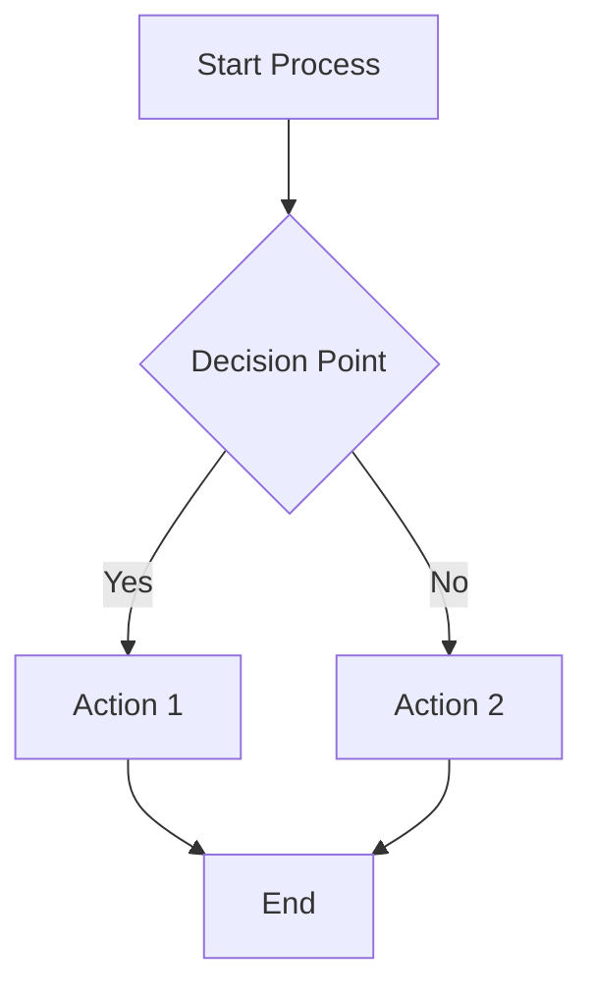
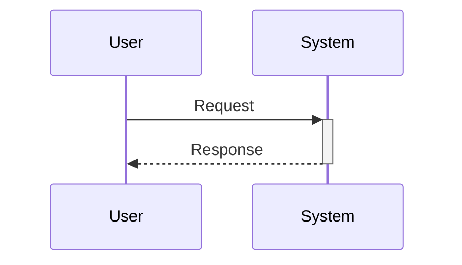
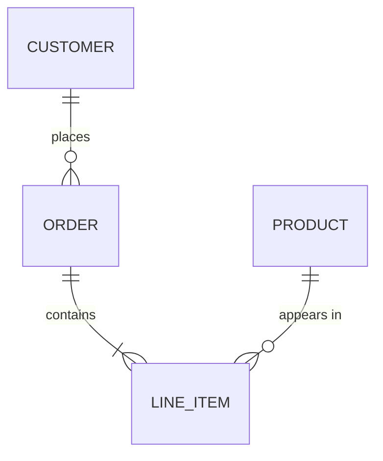

# PDF Generation System

Comprehensive PDF generation with professional styling, auto-TOC, headers/footers, adaptive diagrams, and full branding support.

## Overview

The PDF generation system converts markdown documents to professionally styled PDFs with support for:

- **Structured Templates**: EJS-powered cover pages with conditional rendering
- **Auto-TOC**: Automatic table of contents based on heading count/length
- **Headers/Footers**: Page numbers, branding, and document metadata
- **External CSS**: Layered stylesheets (base + components + themes)
- **Adaptive Diagrams**: Smart sizing for Mermaid diagrams
- **PDF Bookmarks**: Navigation outline via Pandoc/pdftk integration
- **Full Branding**: Logo, custom fonts, color palette support

## Quick Start

```javascript
const PDFGenerator = require('./scripts/lib/pdf-generator');

const generator = new PDFGenerator({
  verbose: true,
  theme: 'revpal-brand'  // or 'revpal', 'default'
});

// Convert single document
await generator.convertMarkdown('report.md', 'report.pdf', {
  features: {
    coverPage: true,
    tableOfContents: 'auto',
    headerFooter: true
  },
  metadata: {
    title: 'Quarterly Report',
    org: 'Acme Corp',
    version: '1.0'
  }
});
```

## Preset Profiles

Use profiles to standardize branded output across environments:

- `simple` - Branded PDF with no cover and no TOC
- `cover-toc` - Branded PDF with cover page and TOC

```javascript
await generator.convertMarkdown('report.md', 'report.pdf', {
  profile: 'simple',
  metadata: {
    title: 'Quarterly Report',
    org: 'Acme Corp'
  }
});
```

## Configuration Options

### Feature Flags

```javascript
{
  features: {
    coverPage: true,                // Add cover page
    tableOfContents: 'auto',        // 'auto' | 'always' | 'never'
    headerFooter: true,             // Enable headers/footers
    pageNumbers: true,              // Show page numbers
    renderMermaid: true,            // Render Mermaid diagrams
    bookmarks: false                // PDF outline (best-effort; requires pdftk/qpdf)
  }
}
```

### Auto-TOC Thresholds

```javascript
{
  autoTOC: {
    minHeadings: 5,     // Min headings to trigger TOC
    minLength: 3000,    // Min characters to trigger TOC
    maxDepth: 3         // Max heading depth in TOC
  }
}
```

### Branding Configuration

```javascript
{
  branding: {
    logo: {
      path: '/path/to/logo.png',
      width: '150px',
      position: 'cover'  // 'cover' | 'header' | 'footer' | 'both'
    },
    fonts: {
      primary: 'Inter',
      secondary: 'Roboto Mono',
      loadFrom: 'google'  // 'google' | 'local' | 'system'
    },
    colors: {
      primary: '#0176d3',
      secondary: '#6e7781',
      accent: '#04844b',
      danger: '#ea001e',
      warning: '#ffb75d'
    },
    text: {
      footer: 'OpsPal by RevPal',
      disclaimer: 'Results may include inaccuracies...'
    }
  }
}
```

### Diagram Configuration

```javascript
{
  diagrams: {
    format: 'png',              // 'png' | 'svg'
    sizingStrategy: 'adaptive', // 'adaptive' | 'fixed'
    devicePixelRatio: 2,        // 1 = standard, 2 = retina
    maxWidth: 1200,
    minWidth: 400
  }
}
```

## Cover Page Templates

Available templates in `templates/pdf-covers/`:

| Template | Use Case |
|----------|----------|
| `default` | General purpose documents |
| `salesforce-audit` | Salesforce automation audits |
| `hubspot-assessment` | HubSpot portal assessments |
| `executive-report` | Executive summaries |
| `gtm-planning` | GTM strategy documents |
| `data-quality` | Data quality assessments |
| `cross-platform-integration` | Integration reports |
| `security-audit` | Security & compliance audits |

### Cover Page Metadata

```javascript
{
  metadata: {
    title: 'Document Title',
    subtitle: 'Optional subtitle',
    org: 'Organization Name',
    author: 'Author Name',
    date: '2025-01-15',
    version: '1.0',
    classification: 'Internal',
    // Template-specific fields
    sandboxName: 'dev-sandbox',    // salesforce-audit
    portalId: '12345678',          // hubspot-assessment
    complianceFrameworks: ['SOC2'], // security-audit
    riskLevel: 'Low'               // security-audit
  },
  coverPage: {
    template: 'salesforce-audit'   // Template name
  }
}
```

## CSS Theming

### Theme Structure

```
templates/pdf-styles/
├── base.css              # Core layout & typography
├── components/
│   ├── tables.css        # Table styling
│   ├── toc.css           # TOC styling
│   └── cover.css         # Cover page styling
└── themes/
    ├── default.css       # Neutral theme
    ├── revpal.css        # RevPal branding
    └── revpal-brand.css  # Tuned RevPal branded theme
```

**Brand assets source of truth**: `templates/branding-gallery/assets/` (logos + gallery artifacts). Use these paths when supplying `branding.logo.path`.

### Creating Custom Themes

```javascript
const StyleManager = require('./scripts/lib/style-manager');

const manager = new StyleManager();
await manager.createTheme('client-brand', {
  colors: {
    primary: '#FF5733',
    secondary: '#333333'
  },
  fonts: {
    primary: 'Helvetica',
    loadFrom: 'system'
  }
});
```

### CSS Variables

Available CSS variables for theming:

```css
:root {
  /* Colors */
  --color-primary: #0969da;
  --color-secondary: #6e7781;
  --color-accent: #1f883d;
  --color-danger: #cf222e;
  --color-warning: #bf8700;
  --color-success: #1f883d;
  --color-info: #0969da;

  /* Text */
  --color-text: #24292e;
  --color-text-secondary: #6a737d;
  --color-text-muted: #959da5;

  /* Backgrounds */
  --color-background: #ffffff;
  --color-surface: #f6f8fa;
  --color-surface-dark: #eaecef;

  /* Borders */
  --color-border: #e1e4e8;
  --color-border-light: #eaecef;

  /* Typography */
  --font-primary: -apple-system, BlinkMacSystemFont, 'Segoe UI'...;
  --font-secondary: Georgia, 'Times New Roman', serif;
  --font-mono: 'SFMono-Regular', Consolas...;

  /* Layout */
  --content-max-width: 650px;
}
```

## Template Engine (EJS)

### Syntax Reference

```ejs
<!-- Variable output (escaped) -->
<%= title %>

<!-- Raw HTML output -->
<%- htmlContent %>

<!-- Conditional -->
<% if (logoPath) { %>
  " />
<% } %>

<!-- Loop -->
<% items.forEach(item => { %>
  <li><%= item.name %></li>
<% }) %>
```

### Built-in Helpers

| Helper | Description | Example |
|--------|-------------|---------|
| `formatDate(date, format)` | Format dates | `<%= formatDate(date, 'long') %>` |
| `uppercase(str)` | Uppercase | `<%= uppercase(status) %>` |
| `lowercase(str)` | Lowercase | `<%= lowercase(text) %>` |
| `capitalize(str)` | Capitalize first | `<%= capitalize(name) %>` |
| `titleCase(str)` | Title Case | `<%= titleCase(heading) %>` |
| `number(num, decimals)` | Format number | `<%= number(12345.6, 2) %>` |
| `percent(num, decimals)` | Format percent | `<%= percent(85.5) %>` |
| `currency(num, currency)` | Format currency | `<%= currency(1234, 'USD') %>` |
| `pluralize(count, singular, plural)` | Pluralize | `<%= count %> <%= pluralize(count, 'item') %>` |
| `truncate(str, length)` | Truncate | `<%= truncate(text, 100) %>` |
| `join(arr, sep)` | Join array | `<%= join(tags, ', ') %>` |
| `today()` | Current date | `<%= today() %>` |
| `year()` | Current year | `<%= year() %>` |

### Date Formats

| Format | Output Example |
|--------|----------------|
| `'short'` | 1/15/2025 |
| `'long'` | January 15, 2025 |
| `'full'` | Wednesday, January 15, 2025 |
| `'iso'` | 2025-01-15 |

## Mermaid Diagram Support

### Adaptive Sizing

Diagrams are automatically sized based on complexity:

| Diagram Type | Base Width | Grows With |
|--------------|------------|------------|
| Flowchart | 400px | Nodes, edges |
| Sequence | 200px | Participants |
| Class/ER | 300px | Entities |
| Gantt/Timeline | 1200px | Items |
| Pie/Quadrant | 500px | (fixed) |
| State | 400px | States |

### Landscape Mode

Wide diagrams automatically wrap in landscape sections:

```markdown
<div class="landscape-section">
  <!-- Diagram rendered here -->
</div>
```

### High-DPI Rendering

```javascript
{
  diagrams: {
    devicePixelRatio: 2  // 2x resolution for retina displays
  }
}
```

## Mermaid v11+ Syntax Requirements

Starting with mermaid-cli v11, several syntax changes were introduced that can cause rendering failures if not followed.

### Breaking Changes in v11+

| Change | v10 Syntax | v11+ Syntax |
|--------|------------|-------------|
| CLI flags | `-i input.mmd` | `-i input.mmd -o output.png` (explicit -o required) |
| Direction | `graph LR` alone | `graph LR` (same, but stricter validation) |
| Subgraph | `subgraph name` | `subgraph name["Display Label"]` (quotes recommended) |
| Node IDs | `A[Label with spaces]` | Use IDs without spaces: `A["Label with spaces"]` |
| Special chars | `A-->|condition|B` | Escape special characters in labels |

### Required Syntax Patterns

**Flowcharts:**


**Sequence Diagrams:**


**Entity Relationship:**


### PNG Pre-Rendering Workflow

For complex diagrams or when mmdc is unreliable, use PNG pre-rendering:

```javascript
const { MermaidPreRenderer } = require('./scripts/lib/mermaid-pre-renderer');

const renderer = new MermaidPreRenderer({
  verbose: true,
  outputFormat: 'png',
  devicePixelRatio: 2,  // Retina quality
  sizingStrategy: 'adaptive'
});

// Pre-render all Mermaid blocks to PNG
const processedMarkdown = await renderer.render(markdown, './output');
```

**Manual Pre-Rendering (CLI):**
```bash
# Create a temp .mmd file
echo 'graph TD
    A --> B' > diagram.mmd

# Render with explicit flags
mmdc -i diagram.mmd -o diagram.png -b white -t default

# Verify output
ls -la diagram.png
```

### Common Mermaid Errors & Solutions

| Error | Cause | Solution |
|-------|-------|----------|
| `Syntax error` | v11+ stricter parsing | Quote all labels with special chars |
| `Cannot read property` | Missing node definition | Ensure all referenced nodes exist |
| `Unknown diagram type` | Unsupported or typo | Use: graph, sequenceDiagram, classDiagram, erDiagram, gantt, pie, flowchart |
| `Parse error at line X` | Invalid character | Remove emojis, use ASCII-only in IDs |
| Blank/empty output | mmdc timeout | Reduce diagram complexity or increase timeout |
| `Puppeteer launch failed` | Missing Chrome | Install: `npx puppeteer browsers install chrome` |

### Version Detection

Check your mermaid-cli version:
```bash
mmdc --version
# Expected: @mermaid-js/mermaid-cli v11.x.x
```

### Validate Before Rendering

Always validate Mermaid syntax before rendering:

1. **Online Validator**: https://mermaid.live
2. **CLI Validation**:
```bash
# Check syntax without rendering
node -e "const mermaid = require('mermaid'); mermaid.parse('graph TD; A-->B');"
```

3. **Pre-Render Check**:
```bash
node scripts/lib/mermaid-pre-renderer.js check
```

### Fallback Strategy

The system uses a three-tier fallback:
1. **mmdc** - Best quality, requires `@mermaid-js/mermaid-cli`
2. **Puppeteer** - Direct rendering, requires `puppeteer`
3. **Placeholder** - Styled code block with ASCII border (always available)

## PDF Bookmarks

### Requirements

Install pdftk for bookmark support:

```bash
# macOS
brew install pdftk-java

# Ubuntu/Debian
sudo apt-get install pdftk

# Check availability
node scripts/lib/pandoc-bookmarks.js check
```

### Usage

```javascript
await generator.convertMarkdown('doc.md', 'doc.pdf', {
  features: {
    bookmarks: true // Best-effort; requires pdftk/qpdf
  },
  headings: [  // Provide for accurate bookmarks
    { level: 1, text: 'Introduction', pageNumber: 1 },
    { level: 2, text: 'Overview', pageNumber: 2 }
  ]
});
```

## Multi-Document Collation

```javascript
await generator.collate([
  { path: 'summary.md', title: 'Executive Summary', order: 0 },
  { path: 'analysis.md', title: 'Detailed Analysis', order: 1 },
  { path: 'appendix.md', title: 'Appendix', order: 2 }
], 'full-report.pdf', {
  toc: true,
  coverPage: {
    template: 'executive-report'
  },
  metadata: {
    title: 'Annual Report 2025',
    org: 'Acme Corp'
  }
});
```

## CLI Usage

```bash
# Single document
node scripts/lib/pdf-generator.js input.md output.pdf --verbose

# With Mermaid rendering
node scripts/lib/pdf-generator.js input.md output.pdf --render-mermaid --verbose

# Collate multiple files
node scripts/lib/pdf-generator.js --collate "docs/*.md" output.pdf --toc --cover

# Options
--render-mermaid    Render Mermaid diagrams
--toc               Add table of contents
--bookmarks         Add PDF bookmarks (best-effort; requires pdftk/qpdf)
--profile PROFILE   PDF profile (cover-toc or simple)
--report-type TYPE  Report type metadata
--verbose           Verbose output
```

## Troubleshooting

### Common Issues

**PDF is too wide for printing**
- The default max-width is 650px, optimized for A4
- Check if custom CSS overrides `--content-max-width`

**Mermaid diagrams not rendering**
- Install mmdc: `npm install -g @mermaid-js/mermaid-cli`
- Or ensure Puppeteer is available
- Check: `node scripts/lib/mermaid-pre-renderer.js check`

**Tables overflow page**
- Tables use `table-layout: fixed` and `word-wrap: break-word`
- Very wide tables may need landscape sections

**Page breaks in wrong places**
- Add `.page-break-before` or `.page-break-after` classes
- Use `.no-page-break` to keep elements together

**Fonts not loading**
- Google Fonts require internet connection
- Use `loadFrom: 'system'` for offline use

### Debug Mode

```javascript
const generator = new PDFGenerator({ verbose: true });
```

Verbose mode shows:
- Template conversion steps
- CSS layer composition
- Diagram rendering progress
- Cache statistics

## File Structure

```
scripts/lib/
├── pdf-generator.js       # Main PDF generation
├── style-manager.js       # CSS composition & branding
├── template-engine.js     # EJS templating
├── pandoc-bookmarks.js    # PDF bookmark injection
├── mermaid-pre-renderer.js # Diagram rendering
└── document-collator.js   # Multi-doc handling

templates/
├── pdf-covers/            # Cover page templates
│   ├── default.md
│   ├── salesforce-audit.md
│   └── ...
├── pdf-styles/            # CSS stylesheets
│   ├── base.css
│   ├── components/
│   └── themes/
└── pdf-partials/          # Reusable EJS partials
```

## API Reference

### PDFGenerator

```javascript
constructor(options: {
  verbose?: boolean,
  tempDir?: string,
  theme?: string,
  branding?: BrandingConfig
})

convertMarkdown(inputPath, outputPath, options): Promise<string>
collate(documents, outputPath, options): Promise<string>
fromGlob(pattern, outputPath, options): Promise<string>
```

### StyleManager

```javascript
constructor(options: {
  verbose?: boolean,
  baseDir?: string,
  theme?: string,
  branding?: BrandingConfig,
  cache?: boolean
})

getStylesheet(options): Promise<string>
getHeaderFooterTemplates(options): { headerTemplate, footerTemplate }
createTheme(name, config): Promise<string>
listThemes(): Promise<string[]>
clearCache(): void
```

### TemplateEngine

```javascript
constructor(options: {
  verbose?: boolean,
  partialsDir?: string,
  cache?: boolean,
  helpers?: Object
})

render(template, data, options): Promise<string>
renderFile(templatePath, data, options): Promise<string>
renderPartial(partialName, data): Promise<string>
registerHelper(name, fn): void
compile(template, options): Function
clearCache(): void
```

### MermaidPreRenderer

```javascript
constructor(options: {
  verbose?: boolean,
  cacheDir?: string,
  outputFormat?: 'png' | 'svg',
  theme?: string,
  sizingStrategy?: 'adaptive' | 'fixed',
  devicePixelRatio?: number,
  maxWidth?: number,
  minWidth?: number
})

render(markdown, basePath): Promise<string>
detectCapabilities(): Promise<Object>
getBestStrategy(): Promise<string>
clearCache(): Promise<void>
getCacheStats(): Promise<Object>
```

---

**Version**: 2.0.0
**Last Updated**: 2025-12-25
